<link rel="stylesheet" href="../scripts/style.css">
<meta charset="utf-8">
<link rel="icon" type="image/png" href="vr/salas/imagens/icone.png">
<h2>Visualization of Polyhedra tessellation with Virtual Reality (VR) in A-frame</h2>
 <b>author:</b> Paulo Henrique Siqueira - Universidade Federal do Paraná
  <b>contact:</b> <a href="#">paulohscwb@gmail.com</a>
  <a href="https://paulohscwb.github.io/tessellation/escher/pt-br/">versão em português</a>
 <form style="margin: 0 auto; float:right; text-align:right; width:100%; margin-bottom:15px;">
	<select id="url" onchange="urlHandler(this.value)" style="color:royalblue;">
		<option disabled selected value>More solids:</option>
		<option disabled value="../escher/">Escher's Works</option>
		<!--<option value="../tessellation1/">Tessellation 1</option>
		<option value="../tessellation2/">Tessellation 2</option>
		<option value="../tessellation3/">Tessellation 3</option>
		<option value="../tessellation4/">Tessellation 4</option>
		<option value="../tessellation5/">Tessellation 5</option>
		<option value="../tessellation6/">Tessellation 6</option>
		<option value="../tessellation7/">Tessellation 7</option>
		<option value="../tessellation8/">Tessellation 8</option>
		<option value="../tessellation9/">Tessellation 9</option>
		<option value="../tessellation10/">Tessellation 10</option>-->
	</select>
</form>

  <h2 align="center"> Escher's works</h2>
The figures or works that are chosen as tesserae cover or pave the plane or a surface. The result is called tessellation, tiling, paving or mosaic. 
Tessellations have been used since ancient times in floors, walls, carpets and other objects.
 This work shows the tessellations made on all or some faces of polyhedrons, taking advantage of triangular, square, pentagonal or hexagonal symmetries of the faces of these solids.
 On this page, we have some tessellation works by Maurits Cornelis Escher (1898-1972) inserted into the faces of common polyhedrons, such as the Platonic tetrahedron, cube or icosahedron, as well as rarer polyhedrons, such as the Johnson solids.

<a href="#m3d">3D Models</a>&nbsp;&nbsp;|&nbsp;&nbsp;<a href="../">Home</a>

  

 

 

<h3 id="m3d" align="center">3D models</h3>
<!--<iframe width="560" height="315" style="max-width:100%" src="https://www.youtube.com/embed/videoseries?list=PLy0I_lGW8HxXgcL9RxOVEfCA1KDLByHZt" title="YouTube video player" frameborder="0" allow="accelerometer; autoplay; clipboard-write; encrypted-media; gyroscope; picture-in-picture; web-share" allowfullscreen></iframe>-->
<h4>1. Alhambra tessellation</h4>

    
  <b>description</b>: Escher painting 1922 of islamic mosaic tile at the Alhambra
  <b>tessellation type</b>: quadrilateral
  <b>polyhedra</b>: deltoidal hexecontahedron, rhombic triacontahedron, cube, rhombic dodecahedron, rhombic hexecontahedron, deltoidal icositetrahedron
     

<h4>2. Alhambra tessellation</h4>
<a href="vr/Alhambra1.htm" target="_blank" title="3D model" class="fotoA">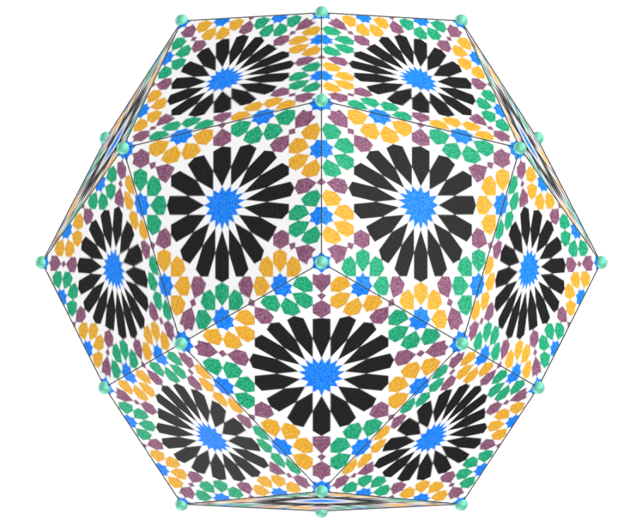</a>
    
  <b>description</b>: vector image based on Escher's work of Alhambra
  <b>tessellation type</b>: quadrilateral
  <b>polyhedra</b>: deltoidal hexecontahedron, rhombic triacontahedron, cube, rhombic dodecahedron, rhombic hexecontahedron, deltoidal icositetrahedron
     

<h4>3. Alhambra tessellation</h4>

    
  <b>description</b>: vector image based on Escher's work of Alhambra
  <b>tessellation type</b>: quadrilateral
  <b>polyhedra</b>: medial rhombic triacontahedron, small dodecacronic hexecontahedron, great ditrigonal dodecacronic hexecontahedron, medial deltoidal hexecontahedron, small icosacronic hexecontahedron, great rhombic triacontahedron 
     

<h4>4. Alhambra tessellation</h4>
<a href="vr/Alhambra3.htm" target="_blank" title="3D model" class="fotoA">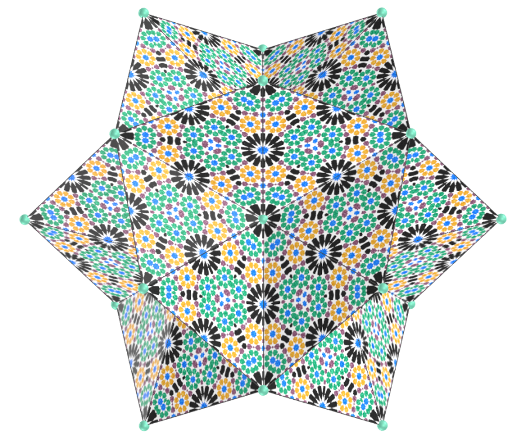</a>
    
  <b>description</b>: vector image based on Escher's work of Alhambra
  <b>tessellation type</b>: triangular
  <b>polyhedra</b>: Möbius hexakis octahedron, stella octangula, Escher solid, hexakis tetrahedron, octahedron, Möbius octakis hexahedron, pentagonal dipyramid
     

<h4>5. Alhambra tessellation</h4>
<a href="vr/Alhambra4.htm" target="_blank" title="3D model" class="fotoA">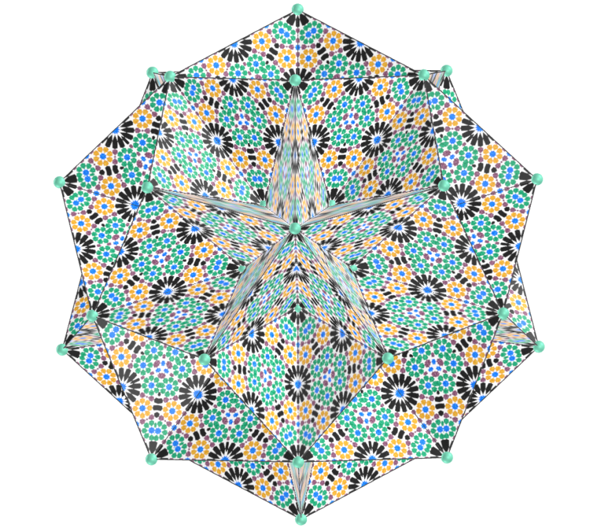</a>
    
  <b>description</b>: vector image based on Escher's work of Alhambra
  <b>tessellation type</b>: triangular
  <b>polyhedra</b>: tetrahedron, Möbius 10-akis dodecahedron, rhombic hexecontahedron, Möbius hexakis icosahedron, Möbius deltahedron, tetrakis hexahedron, snub disphenoid
     

<h4>6. Tessellation with 4 transformations</h4>

    
  <b>description</b>: features butterflies, birds, and moths; work from 1950
  <b>tessellation type</b>: quadrilateral and triangular
  <b>polyhedra</b>: icosahedron, pentagonal dipyramid, Escher solid, hexakis tetrahedron, Möbius hexakis icosahedron, cube, deltoidal hexecontahedron, deltoidal icositetrahedron, rhombic dodecahedron, rhombic hexecontahedron, pentakis dodecahedron
     

<h4>7. Tessellation with 4 transformations</h4>
<a href="vr/AnimalesMariposas2.htm" target="_blank" title="3D model" class="fotoA">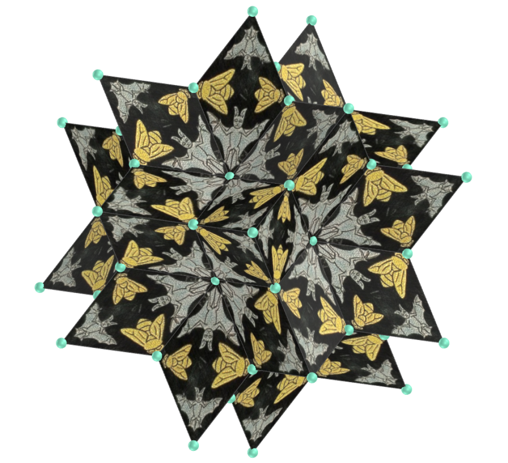</a>
    
  <b>description</b>: features butterflies, birds, and moths; work from 1950
  <b>tessellation type</b>: quadrilateral
  <b>polyhedra</b>: cube, deltoidal hexecontahedron, deltoidal icositetrahedron, rhombic dodecahedron, rhombic triacontahedron, rhombic hexecontahedron
     

<h4>8. Tessellation with 4 transformations</h4>

    
  <b>description</b>: features butterflies, birds, and moths; work from 1950 
  <b>tessellation type</b>: quadrilateral and triangular
  <b>polyhedra</b>: Möbius octakis hexahedron, deltoidal hexecontahedron, deltoidal icositetrahedron, rhombic dodecahedron, rhombic triacontahedron, Möbius hexakis octahedron, Möbius 10-akis dodecahedron, octahedron, tetrakis hexahedron
     

<h4>9. Tessellation with 4 transformations</h4>

    
  <b>description</b>: features butterflies, birds, and moths; work from 1950 
  <b>tessellation type</b>: quadrilateral and triangular
  <b>polyhedra</b>: Möbius deltahedron, stella octangula, tetrahedron, rhombic dodecahedron, rhombic triacontahedron, cube, rhombic hexecontahedron
     

<h4>10. Circle limit I</h4>

    
  <b>description</b>: based on the Poincaré disc model of hyperbolic geometry; work from 1958 
  <b>tessellation type</b>: triangular
  <b>polyhedra</b>: icosahedron, great icosahedron, Escher solid, hexakis tetrahedron, snub disphenoid, Möbius deltahedron, octahedron, Möbius hexakis octahedron, pentakis dodecahedron
     

<a href="#p1" class="topo">back to top</a>

<h4>11. Circle limit I</h4>

    
  <b>description</b>: based on the Poincaré disc model of hyperbolic geometry; work from 1958 
  <b>tessellation type</b>: triangular
  <b>polyhedra</b>: Möbius hexakis icosahedron, pentagonal dipyramid, Möbius octakis hexahedron, Möbius 10-akis dodecahedron, stella octangula, tetrahedron, tetrakis hexahedron
     

<h4>12. Development III</h4>

    
  <b>description</b>: abstract art with a spiral design; work from 1939 
  <b>tessellation type</b>: quadrilateral
  <b>polyhedra</b>: deltoidal hexecontahedron, rhombic triacontahedron, cube, rhombic dodecahedron, rhombic hexecontahedron, deltoidal icositetrahedron
     

<h4>13. Earth</h4>

    
  <b>description</b>: new year's greeting card (ants); work from 1952
  <b>tessellation type</b>: quadrilateral and triangular
  <b>polyhedra</b>: deltoidal hexecontahedron, rhombic triacontahedron, cube, rhombic dodecahedron, rhombic hexecontahedron, deltoidal icositetrahedron, tetrakis hexahedron
     

<h4>14. Symmetry watercolor: fish</h4>

    
  <b>description</b>: work from 1942
  <b>tessellation type</b>: quadrilateral and triangular
  <b>polyhedra</b>: stella octangula, tetrahedron
     

<h4>15. Fish, duck, turtle</h4>

    
  <b>description</b>: work from 1948
  <b>tessellation type</b>: quadrilateral and triangular
  <b>polyhedra</b>: Möbius hexakis octahedron, deltoidal hexecontahedron, Escher solid, hexakis tetrahedron, octahedron, Möbius octakis hexahedron
     

<h4>16. Fish, duck, turtle</h4>
<a href="vr/FishDuckTurtle2.htm" target="_blank" title="3D model" class="fotoA">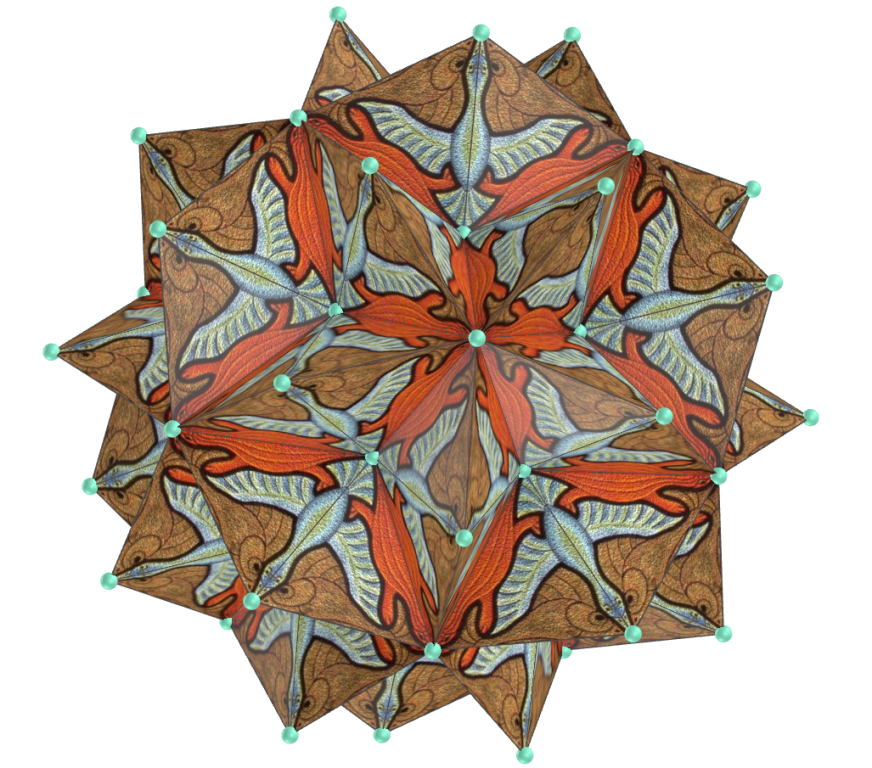</a>
    
  <b>description</b>: work from 1948
  <b>tessellation type</b>: quadrilateral and triangular
  <b>polyhedra</b>: rhombic dodecahedron, Möbius 10-akis dodecahedron, rhombic hexecontahedron, Möbius hexakis icosahedron, Möbius deltahedron, tetrakis hexahedron
     

<h4>17. Fish, duck, turtle</h4>

    
  <b>description</b>: Pol de Miguel's adaptation of Escher's work; work from 2019
  <b>tessellation type</b>: quadrilateral and triangular
  <b>polyhedra</b>: Möbius hexakis octahedron, Möbius 10-akis dodecahedron, Escher solid, hexakis tetrahedron, Möbius hexakis icosahedron, octahedron, Möbius deltahedron, Möbius octakis hexahedron, tetrakis hexahedron
     

<h4>18. Heaven and hell</h4>
<a href="vr/HeavenAndHell.htm" target="_blank" title="3D model" class="fotoA">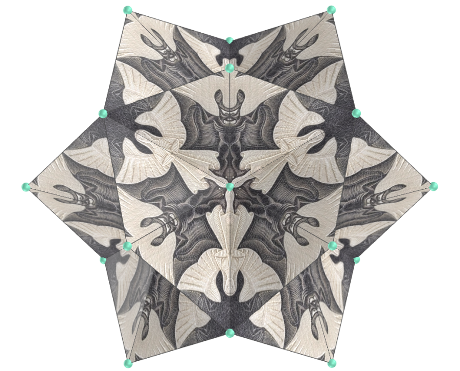</a>
    
  <b>description</b>: work from 1962
  <b>tessellation type</b>: triangular
  <b>polyhedra</b>: Möbius hexakis octahedron, Möbius 10-akis dodecahedron, Escher solid, hexakis tetrahedron, Möbius hexakis icosahedron, octahedron, Möbius deltahedron, Möbius octakis hexahedron, tetrakis hexahedron
     

<h4>19. Lizard, fish, bat</h4>

    
  <b>description</b>: work from 1952
  <b>tessellation type</b>: quadrilateral and triangular
  <b>polyhedra</b>: Möbius hexakis octahedron, deltoidal hexecontahedron, Escher solid, hexakis tetrahedron, octahedron, Möbius octakis hexahedron
     

<h4>20. Lizard, fish, bat</h4>

    
  <b>description</b>: work from 1952
  <b>tessellation type</b>: quadrilateral and triangular
  <b>polyhedra</b>: rhombic dodecahedron, Möbius 10-akis dodecahedron, rhombic hexecontahedron, Möbius hexakis icosahedron, Möbius deltahedron, tetrakis hexahedron
     

<a href="#p1" class="topo">back to top</a>

<h4>21. Path of life II</h4>

    
  <b>description</b>: work from 1958
  <b>tessellation type</b>: quadrilateral
  <b>polyhedra</b>: deltoidal hexecontahedron, rhombic triacontahedron, cube, rhombic dodecahedron, rhombic hexecontahedron, deltoidal icositetrahedron
     

<h4>22. Shells and starfish</h4>
<a href="vr/Shell1.htm" target="_blank" title="3D model" class="fotoA">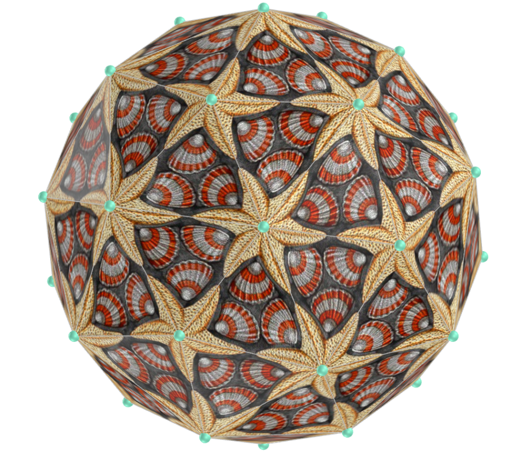</a>
    
  <b>description</b>: work from 1963
  <b>tessellation type</b>: triangular and quadrilateral
  <b>polyhedra</b>: Möbius hexakis octahedron, stella octangula, Escher solid, hexakis tetrahedron, octahedron, Möbius octakis hexahedron, pentagonal dipyramid, pentakis dodecahedron
     

<h4>23. Shells and starfish</h4>
<a href="vr/Shell2.htm" target="_blank" title="3D model" class="fotoA">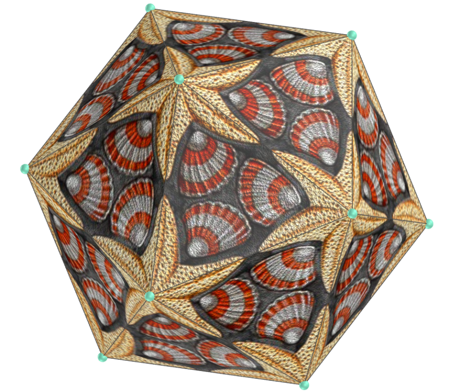</a>
    
  <b>description</b>: work from 1963
  <b>tessellation type</b>: triangular and quadrilateral
  <b>polyhedra</b>: tetrahedron, Möbius 10-akis dodecahedron, rhombic hexecontahedron, Möbius hexakis icosahedron, Möbius deltahedron, tetrakis hexahedron, snub disphenoid
     

<h4>24. Shells and starfish</h4>

    
  <b>description</b>: work from 1963
  <b>tessellation type</b>: triangular and pentagonal
  <b>polyhedra</b>: pentagonal icositetrahedron, tetartoid, pentagonal hexecontahedron, dodecahedron, augmented dodecahedron, metabiaugmented dodecahedron, parabiaugmented dodecahedron, triaugmented dodecahedron
     

<h4>25. Symmetry (lizards)</h4>

    
  <b>description</b>: work from 1965
  <b>tessellation type</b>: triangular and quadrilateral
  <b>polyhedra</b>: rhombic hexecontahedron, Escher solid, deltoidal hexecontahedron, hexakis tetrahedron, rhombic dodecahedron, Möbius deltahedron
     

<h4>26. Symmetry (lizards)</h4>
<a href="vr/SmilingLizards1.htm" target="_blank" title="3D model" class="fotoA">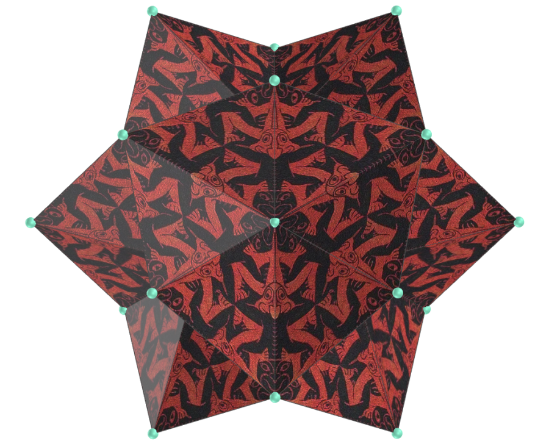</a>
    
  <b>description</b>: work from 1965
  <b>tessellation type</b>: triangular and quadrilateral
  <b>polyhedra</b>: Möbius hexakis octahedron, Möbius 10-akis dodecahedron, Möbius hexakis icosahedron, octahedron, Möbius octakis hexahedron, tetrakis hexahedron
     

<h4>27. Snakes</h4>
<a href="vr/Snakes1.htm" target="_blank" title="3D model" class="fotoA">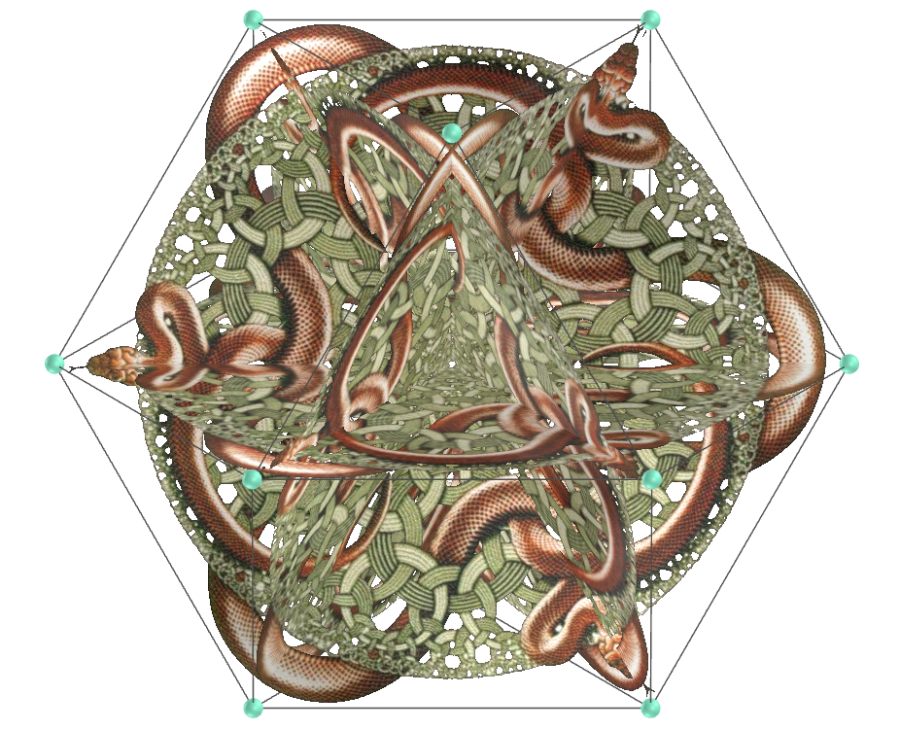</a>
    
  <b>description</b>: Escher's last impression; work from 1969
  <b>tessellation type</b>: hexagonal
  <b>polyhedra</b>: cubitruncated cuboctahedron, great dodecahemicosahedron, great dodecicosahedron, great truncated cuboctahedron, great truncated icosidodecahedron, icositruncated dodecadodecahedron, octahemioctahedron
     

<h4>28. Snakes</h4>

    
  <b>description</b>: Escher's last impression; work from 1969
  <b>tessellation type</b>: hexagonal
  <b>polyhedra</b>: rhombicosahedron, small dodecicosahedron, small hexagonal hexecontahedron, small icosicosidodecahedron, small triambic icosahedron, great truncated icosahedron, truncated icosahedron
     

<h4>29. Square Limit</h4>

    
  <b>description</b>: work from 1964
  <b>tessellation type</b>: quadrilateral
  <b>polyhedra</b>: deltoidal hexecontahedron, rhombic triacontahedron, cube, rhombic dodecahedron, rhombic hexecontahedron, deltoidal icositetrahedron
     

<h4>30. Sun and moon</h4>

    
  <b>description</b>: work from 1948
  <b>tessellation type</b>: quadrilateral
  <b>polyhedra</b>: deltoidal hexecontahedron, rhombic triacontahedron, cube, rhombic dodecahedron, rhombic hexecontahedron, deltoidal icositetrahedron
     

<a href="#p1" class="topo">back to top</a>

<h4>31. Symmetry and tessellation: fish</h4>

    
  <b>description</b>: work from 1955
  <b>tessellation type</b>: triangular and quadrilateral
  <b>polyhedra</b>: Möbius hexakis octahedron, Möbius 10-akis dodecahedron, deltoidal hexecontahedron, hexakis tetrahedron, rhombic dodecahedron, Möbius deltahedron, Möbius octakis hexahedron
     

<h4>32. Symmetry and tessellation: fish</h4>

    
  <b>description</b>: work from 1955
  <b>tessellation type</b>: triangular and quadrilateral
  <b>polyhedra</b>: rhombic hexecontahedron, rhombic triacontahedron, Escher solid, Möbius hexakis icosahedron, octahedron, deltoidal icositetrahedron, tetrakis hexahedron
     

<h4>33. Tessellation</h4>

    
  <b>description</b>: work from 1959
  <b>tessellation type</b>: triangular
  <b>polyhedra</b>: Möbius hexakis octahedron, Möbius 10-akis dodecahedron, Escher solid, hexakis tetrahedron, Möbius hexakis icosahedron, octahedron, Möbius deltahedron, Möbius octakis hexahedron, tetrakis hexahedron
     

<h4>34. Symmetry Drawing</h4>
<a href="vr/SymmetryDrawing.htm" target="_blank" title="3D model" class="fotoA">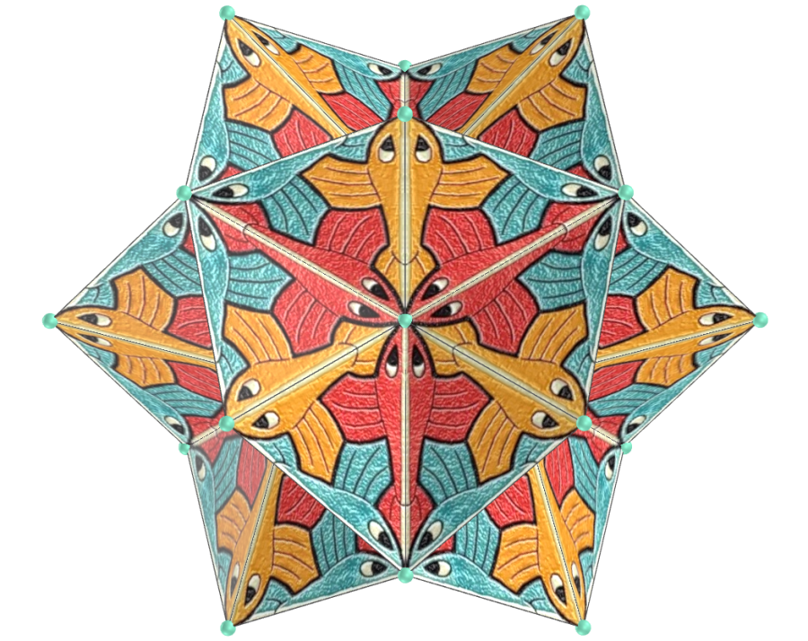</a>
    
  <b>description</b>: work from 1955
  <b>tessellation type</b>: triangular
  <b>polyhedra</b>: Möbius hexakis octahedron, Möbius 10-akis dodecahedron, Escher solid, hexakis tetrahedron, Möbius hexakis icosahedron, octahedron, Möbius deltahedron, Möbius octakis hexahedron, tetrakis hexahedron
     

<h4>35. Flower tessellation</h4>

    
  <b>description</b>: coloring book published in 2021, based on Escher tessellations
  <b>tessellation type</b>: triangular
  <b>polyhedra</b>: Möbius hexakis octahedron, Möbius 10-akis dodecahedron, Escher solid, hexakis tetrahedron, Möbius hexakis icosahedron, octahedron, Möbius deltahedron, Möbius octakis hexahedron, tetrakis hexahedron
     

<h4>36. Leaves tessellation</h4>

    
  <b>description</b>: Regolo Bizzi work, based on Escher tessellations
  <b>tessellation type</b>: triangular
  <b>polyhedra</b>: Möbius hexakis octahedron, Möbius 10-akis dodecahedron, Escher solid, hexakis tetrahedron, Möbius hexakis icosahedron, octahedron, Möbius deltahedron, Möbius octakis hexahedron, tetrakis hexahedron
     

<h4>36. Leaves tessellation</h4>

    
  <b>description</b>: Regolo Bizzi work, based on Escher tessellations
  <b>tessellation type</b>: triangular
  <b>polyhedra</b>: Möbius hexakis octahedron, Möbius 10-akis dodecahedron, Escher solid, hexakis tetrahedron, Möbius hexakis icosahedron, octahedron, Möbius deltahedron, Möbius octakis hexahedron, tetrakis hexahedron
     

<a href="#p1" class="topo">back to top</a>

  Escher's works: polyhedra tessellation and visualization with Virtual Reality by <a xmlns:cc="http://creativecommons.org/ns#" href="https://paulohscwb.github.io/tessellation/escher/" property="cc:attributionName" rel="cc:attributionURL">Paulo Henrique Siqueira</a> is licensed with a license <a rel="license" href="http://creativecommons.org/licenses/by-nc-nd/4.0/">Creative Commons Attribution-NonCommercial-NoDerivatives 4.0 International</a>.

<h4>How to cite this work:</h4> 

Siqueira, P.H., "Escher's works: polyhedra tessellation and visualization with Virtual Reality". Available in: <https://paulohscwb.github.io/tessellation/escher/>, February 2025.

<!---->
  <b>References:</b>
 Weisstein, Eric W. "Tessellation." From MathWorld--A Wolfram Web Resource. <a href="https://mathworld.wolfram.com/Tessellation.html" target="_blank"> https://mathworld.wolfram.com/Tessellation.html</a>
 Mohr, R. "Tiled Art" <a href="https://tiled.art/en/home" target="_blank">https://tiled.art/en/home</a> 
 McCooey, D. I. "Visual Polyhedra". <a href="http://dmccooey.com/polyhedra/" target="_blank">http://dmccooey.com/polyhedra/</a>
