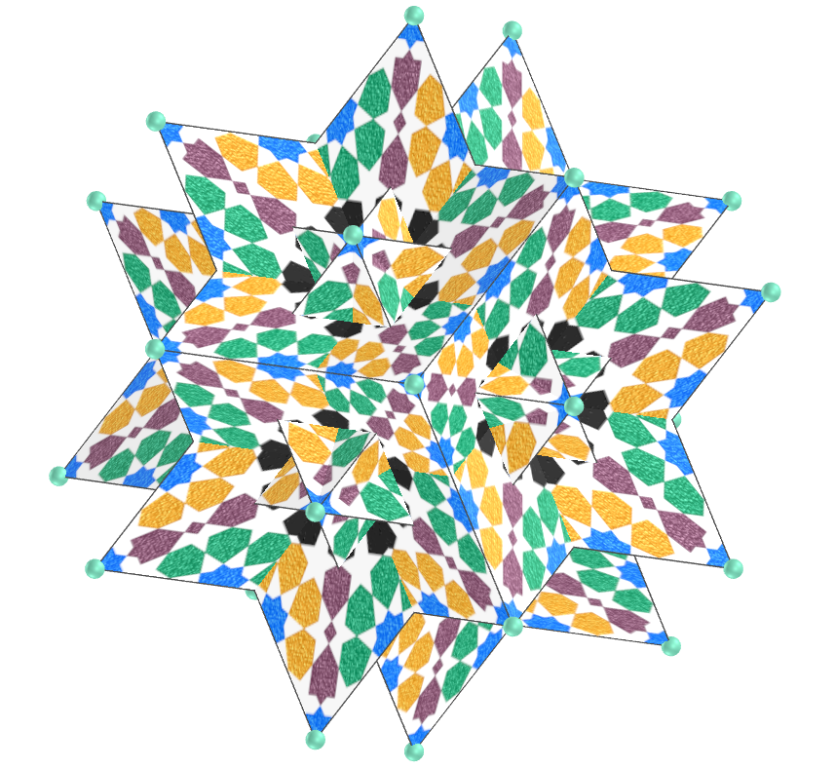
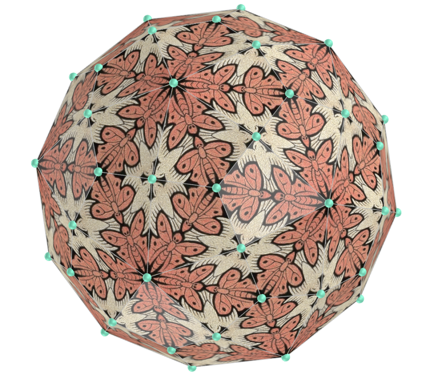
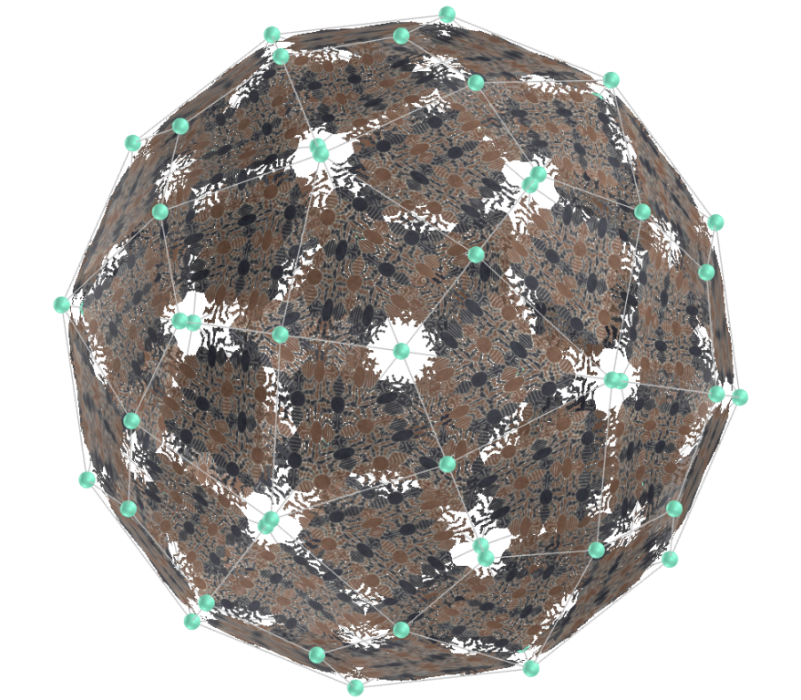
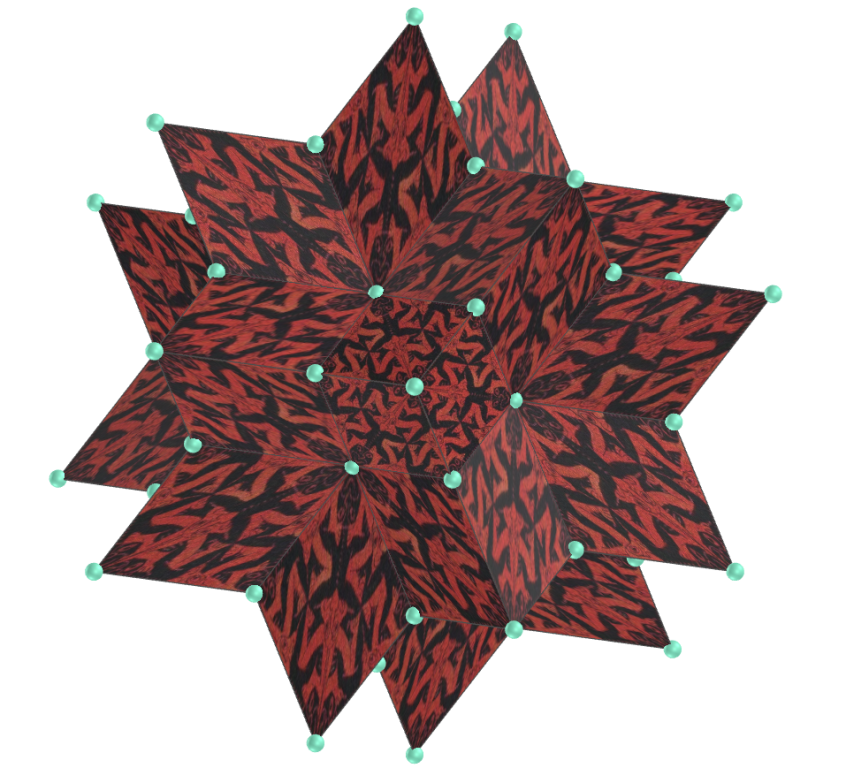
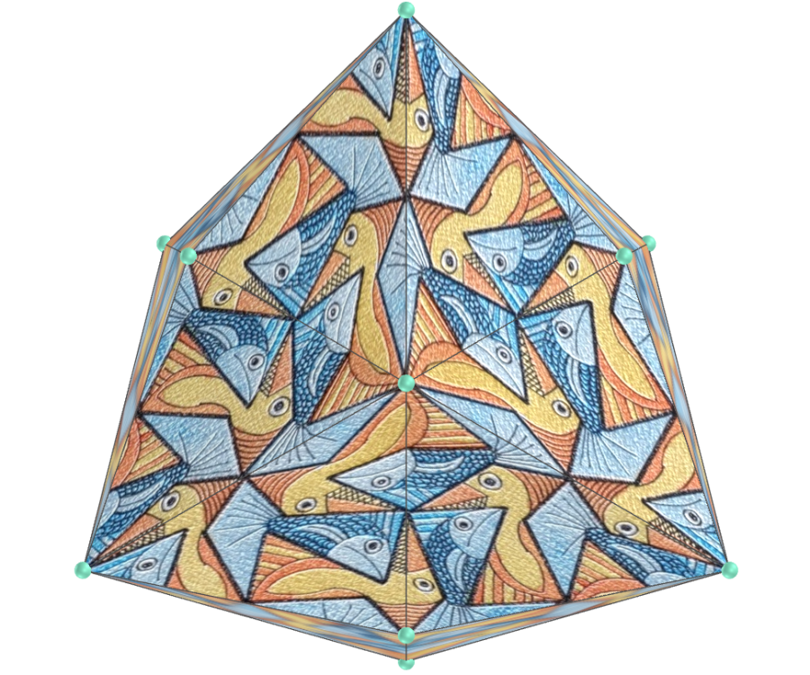
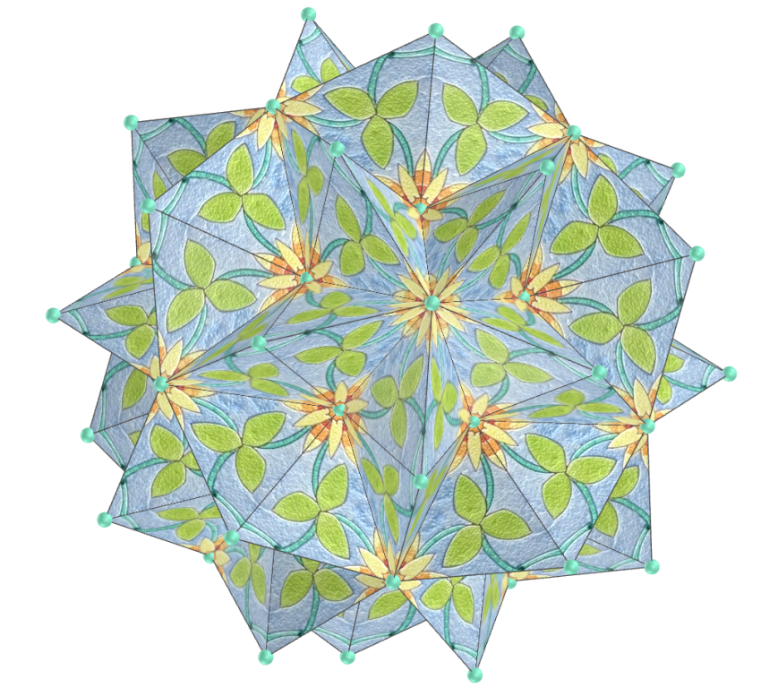

<link rel="stylesheet" href="../../scripts/style.css">
<meta charset="utf-8">
<link rel="icon" type="image/png" href="../vr/salas/imagens/icone.png">
<h2>Visualização de Tesselações em Poliedros com Realidade Virtual (RV) em A-frame</h2>
<b>autor:</b> Paulo Henrique Siqueira - Universidade Federal do Paraná
 <b>contato:</b> <a href="#"> paulohscwb@gmail.com </a>
 <a href="https://paulohscwb.github.io/tessellation/escher/">english version</a>
<form style="margin: 0 auto; float:right; text-align:right; width:100%; margin-bottom:15px;">
	<select id="url" onchange="urlHandler(this.value)" style="color:royalblue;">
		<option disabled selected>Mais sólidos:</option>
		<option disabled value="../../escher/pt-br/">Obras de Escher</option>
		<!--<option value="../../tessellation1/pt-br/">Tesselação 1</option>
		<option value="../../tessellation2/pt-br/">Tesselação 2</option>
		<option value="../../tessellation3/pt-br/">Tesselação 3</option>
		<option value="../../tessellation4/pt-br/">Tesselação 4</option>
		<option value="../../tessellation5/pt-br/">Tesselação 5</option>
		<option value="../../tessellation6/pt-br/">Tesselação 6</option>
		<option value="../../tessellation7/pt-br/">Tesselação 7</option>
		<option value="../../tessellation8/pt-br/">Tesselação 8</option>
		<option value="../../tessellation9/pt-br/">Tesselação 9</option>
		<option value="../../tessellation10/pt-br/">Tesselação 10</option>-->
	</select>
</form>

  <h2 align="center"> Obras de Escher</h2>
  As figuras ou obras que são escolhidas como tesselas cobrem ou pavimentam o plano ou uma superfície. O resultado é chamado de tesselação, ladrilho, pavimentação ou mosaico. As tesselações são usadas desde a antiguidade em pisos, paredes tapetes e outros objetos. 
 Este trabalho mostra as tesselações feitas em todas ou algumas faces de poliedros, aproveitando simetrias triangulares, quadradas, pentagonais ou hexagonais das faces destes sólidos. 
 Nesta página, temos algumas obras de tesselações de Maurits Cornelis Escher (1898-1972) inseridas nas faces de poliedros comuns, como os platônicos tetraedro, cubo ou icosaedro, além de poliedros mais raros, como os sólidos de Johnson.
 
<a href="#m3d">Modelos 3D</a>&nbsp;&nbsp;|&nbsp;&nbsp;<a href="../../pt-br/">Página Inicial</a>

  

 

<h3 id="m3d" align="center">Modelos 3D</h3>
<!--<iframe width="560" height="315" style="max-width:100%" src="https://www.youtube.com/embed/videoseries?list=PLy0I_lGW8HxXgcL9RxOVEfCA1KDLByHZt" title="YouTube video player" frameborder="0" allow="accelerometer; autoplay; clipboard-write; encrypted-media; gyroscope; picture-in-picture; web-share" allowfullscreen></iframe>-->
<h4>1. Tesselação de Alhambra</h4>

    
  <b>descrição</b>: pintura de Escher de 1922, de azulejos de mosaico islâmico em Alhambra
  <b>tipo de tesselação</b>: quadrilateral
  <b>poliedros</b>: hexecontaedro deltoidal, triacontaedro rômbico, cubo, dodecaedro rômbico, hexecontaedro rômbico, icositetraedro deltoidal
     

<h4>2. Tesselação de Alhambra</h4>

    
  <b>descrição</b>: imagem vetorial baseada na obra de Escher de Alhambra
  <b>tipo de tesselação</b>: quadrilateral
  <b>poliedros</b>: hexecontaedro deltoidal, triacontaedro rômbico, cubo, dodecaedro rômbico, hexecontaedro rômbico, icositetraedro deltoidal
     

<h4>3. Tesselação de Alhambra</h4>

    
  <b>descrição</b>: imagem vetorial baseada na obra de Escher de Alhambra
  <b>tipo de tesselação</b>: quadrilateral
  <b>poliedros</b>: triacontaedro rômbico medial, pequeno hexecontaedro dodecacrônico, grande hexecontaedro dodecacrônico ditrigonal, hexecontaedro deltoidal medial, pequeno hexecontaedro icosacrônico, grande triacontaedro rômbico
     

<h4>4. Tesselação de Alhambra</h4>

    
  <b>descrição</b>: imagem vetorial baseada na obra de Escher de Alhambra
  <b>tipo de tesselação</b>: triangular
  <b>poliedros</b>: octaedro hexakis de Möbius, octaedro estrelado, sólido de Escher, tetraedro hexakis, octaedro, hexaedro octakis de Möbius, dipirâmide pentagonal
     

<h4>5. Tesselação de Alhambra</h4>

    
  <b>descrição</b>: imagem vetorial baseada na obra de Escher de Alhambra
  <b>tipo de tesselação</b>: triangular
  <b>poliedros</b>: tetraedro, dodecaedro 10-akis de Möbius, icosaedro, icosaedro hexakis de Möbius, deltaedro de Möbius, hexaedro tetrakis, disfenóide snub
     

<h4>6. Tesselação com 4 transformações</h4>

    
  <b>descrição</b>: apresenta borboletas, pássaros e mariposas; obra de 1950
  <b>tipo de tesselação</b>: quadrilateral e triangular
  <b>poliedros</b>: icosaedro, dipirâmide pentagonal, sólido de Escher, tetraedro hexakis, icosaedro hexakis de Möbius, cubo, hexecontaedro deltoidal, icositetraedro deltoidal, dodecaedro rômbico, hexecontaedro rômbico, dodecaedro pentakis
     

<h4>7. Tesselação com 4 transformações</h4>

    
  <b>descrição</b>: apresenta borboletas, pássaros e mariposas; obra de 1950
  <b>tipo de tesselação</b>: quadrilateral
  <b>poliedros</b>: cubo, hexecontaedro deltoidal, icositetraedro deltoidal, dodecaedro rômbico, triacontaedro rômbico, hexecontaedro rômbico
     

<h4>8. Tesselação com 4 transformações</h4>

    
  <b>descrição</b>: apresenta borboletas, pássaros e mariposas; obra de 1950
  <b>tipo de tesselação</b>: quadrilateral e triangular
  <b>poliedros</b>: hexaedro octakis de Möbius, hexecontaedro deltoidal, icositetraedro deltoidal, dodecaedro rômbico, triacontaedro rômbico, octaedro hexakis de Möbius, dodecaedro 10-akis de Möbius, octaedro, hexaedro tetrakis
     

<h4>9. Tesselação com 4 transformações</h4>

    
  <b>descrição</b>: apresenta borboletas, pássaros e mariposas; obra de 1950
  <b>tipo de tesselação</b>: quadrilateral e triangular
  <b>poliedros</b>: deltaedro de Möbius, octaedro estrelado, tetraedro, dodecaedro rômbico, triacontaedro rômbico, cubo, hexecontaedro rômbico
     

<h4>10. Limite do círculo I</h4>

    
  <b>descrição</b>: baseada no modelo de disco de Poincaré da geometria hiperbólica; obra de 1958
  <b>tipo de tesselação</b>: triangular
  <b>poliedros</b>: icosaedro, grande icosaedro, sólido de Escher, tetraedro hexakis, disfenóide snub, deltaedro de Möbius, octaedro, octaedro hexakis de Möbius, dodecaedro pentakis
     

<a href="#p1" class="topo">voltar ao topo</a>

<h4>11. Limite do círculo I</h4>

    
  <b>descrição</b>: baseada no modelo de disco de Poincaré da geometria hiperbólica; obra de 1958
  <b>tipo de tesselação</b>: triangular
  <b>poliedros</b>: icosaedro hexakis de Möbius, dipirâmide pentagonal, hexaedro octakis de Möbius, dodecaedro 10-akis de Möbius, octaedro estrelado, tetraedro, hexaedro tetrakis
     

<h4>12. Desenvolvimento III</h4>

    
  <b>descrição</b>: arte abstrata com design em espiral; obra de 1939
  <b>tipo de tesselação</b>: quadrilateral
  <b>poliedros</b>: hexecontaedro deltoidal, triacontaedro rômbico, cubo, dodecaedro rômbico, hexecontaedro rômbico, icositetraedro deltoidal
     

<h4>13. Terra</h4>

    
  <b>descrição</b>: cartão de felicitações de ano novo (formigas); obra de 1952
  <b>tipo de tesselação</b>: quadrilateral e triangular
  <b>poliedros</b>: hexecontaedro deltoidal, triacontaedro rômbico, cubo, dodecaedro rômbico, hexecontaedro rômbico, icositetraedro deltoidal, hexaedro tetrakis
     

<h4>14. Aquarela simétrica: peixes</h4>

    
  <b>descrição</b>: obra de 1942
  <b>tipo de tesselação</b>: triangular
  <b>poliedros</b>: octaedro estrelado, tetraedro
     

<h4>15. Peixe, pato, tartaruga</h4>

    
  <b>descrição</b>: obra de 1948
  <b>tipo de tesselação</b>: quadrilateral e triangular
  <b>poliedros</b>: octaedro hexakis de Möbius, hexecontaedro deltoidal, sólido de Escher, tetraedro hexakis, octaedro, hexaedro octakis de Möbius
     

<h4>16. Peixe, pato, tartaruga</h4>

    
  <b>descrição</b>: obra de 1948
  <b>tipo de tesselação</b>: quadrilateral e triangular
  <b>poliedros</b>: dodecaedro rômbico, dodecaedro 10-akis de Möbius, hexecontaedro rômbico, icosaedro hexakis de Möbius, deltaedro de Möbius, hexaedro tetrakis
     

<h4>17. Peixe, pato, tartaruga</h4>

    
  <b>descrição</b>: adaptação de Pol de Miguel da obra de Escher; obra de 2019
  <b>tipo de tesselação</b>: quadrilateral e triangular
  <b>poliedros</b>: octaedro hexakis de Möbius, dodecaedro 10-akis de Möbius, sólido de Escher, tetraedro hexakis, icosaedro hexakis de Möbius, octaedro, deltaedro de Möbius, hexaedro octakis de Möbius, hexaedro tetrakis
     

<h4>18. Céu e inferno</h4>

    
  <b>descrição</b>: obra de 1962
  <b>tipo de tesselação</b>: triangular
  <b>poliedros</b>: octaedro hexakis de Möbius, dodecaedro 10-akis de Möbius, sólido de Escher, tetraedro hexakis, icosaedro hexakis de Möbius, octaedro, deltaedro de Möbius, hexaedro octakis de Möbius, hexaedro tetrakis
     

<h4>19. Lagarto, peixe, morcego</h4>

    
  <b>descrição</b>: obra de 1952
  <b>tipo de tesselação</b>: quadrilateral and triangular
  <b>poliedros</b>: octaedro hexakis de Möbius, hexecontaedro deltoidal, sólido de Escher, tetraedro hexakis, octaedro, hexaedro octakis de Möbius
     

<h4>20. Lagarto, peixe, morcego</h4>

    
  <b>descrição</b>: obra de 1952
  <b>tipo de tesselação</b>: quadrilateral and triangular
  <b>poliedros</b>: dodecaedro rômbico, dodecaedro 10-akis de Möbius, hexecontaedro rômbico, icosaedro hexakis de Möbius, deltaedro de Möbius, hexaedro tetrakis
     

<a href="#p1" class="topo">voltar ao topo</a>

<h4>21. Caminho da vida II</h4>

    
  <b>descrição</b>: obra de 1958
  <b>tipo de tesselação</b>: quadrilateral
  <b>poliedros</b>: hexecontaedro deltoidal, triacontaedro rômbico, cubo, dodecaedro rômbico, hexecontaedro rômbico, icositetraedro deltoidal
     

<h4>22. Conchas e estrelas do mar</h4>

    
  <b>descrição</b>: obra de 1963
  <b>tipo de tesselação</b>: triangular
  <b>poliedros</b>: octaedro hexakis de Möbius, octaedro estrelado, sólido de Escher, tetraedro hexakis, octaedro, hexaedro octakis de Möbius, dipirâmide pentagonal, dodecaedro pentakis
     

<h4>23. Conchas e estrelas do mar</h4>

    
  <b>descrição</b>: obra de 1963
  <b>tipo de tesselação</b>: triangular e quadrilateral
  <b>poliedros</b>: tetraedro, dodecaedro 10-akis de Möbius, icosaedro, icosaedro hexakis de Möbius, deltaedro de Möbius, hexaedro tetrakis, disfenóide snub
     

<h4>24. Conchas e estrelas do mar</h4>

    
  <b>descrição</b>: obra de 1963
  <b>tipo de tesselação</b>: triangular e pentagonal
  <b>poliedros</b>: icositetraedro pentagonal, tetartoide, hexecontaedro pentagonal, dodecaedro, dodecaedro aumentado, dodecaedro metabiaumentado, dodecaedro parabiaumentado, dodecaedro triaumentado
     

<h4>25. Simetria (lagartos)</h4>

    
  <b>descrição</b>: obra de 1965
  <b>tipo de tesselação</b>: triangular e quadrilateral
  <b>poliedros</b>: hexecontaedro rômbico, sólido de Escher, hexecontaedro deltoidal, tetraedro hexakis, dodecaedro rômbico, deltaedro de Möbius
     

<h4>26. Simetria (lagartos)</h4>

    
  <b>descrição</b>: obra de 1965
  <b>tipo de tesselação</b>: triangular e quadrilateral
  <b>poliedros</b>: Octaedro hexakis de Möbius, dodecaedro 10-akis de Möbius, icosaedro hexakis de Möbius, octaedro, hexaedro octakis de Möbius, hexaedro tetrakis
     

<h4>27. Serpentes</h4>

    
  <b>descrição</b>: última impressão de Escher; obra de 1969
  <b>tipo de tesselação</b>: hexagonal
  <b>poliedros</b>: cuboctaedro cubitruncado, grande dodecahemicoaedro, grande dodecicosaedro, grande cuboctaedro truncado, grande icosidodecaedro truncado, dodecadodecaedro icositruncado, octahemioctaedro
     

<h4>28. Serpentes</h4>

    
  <b>descrição</b>: última impressão de Escher; obra de 1969
  <b>tipo de tesselação</b>: hexagonal
  <b>poliedros</b>: rombicosaedro, pequeno dodecicosaedro, pequeno hexecontaedro hexagonal, pequeno icosicosidodecaedro, pequeno icosaedro triâmbico, grande icosaedro truncado, icosaedro truncado
     

<h4>29. Limite do quadrado</h4>

    
  <b>descrição</b>: obra de 1964
  <b>tipo de tesselação</b>: quadrilateral
  <b>poliedros</b>: hexecontaedro deltoidal, triacontaedro rômbico, cubo, dodecaedro rômbico, hexecontaedro rômbico, icositetraedro deltoidal
     

<h4>30. Sol e lua</h4>

    
  <b>descrição</b>: obra de 1948
  <b>tipo de tesselação</b>: quadrilateral
  <b>poliedros</b>: hexecontaedro deltoidal, triacontaedro rômbico, cubo, dodecaedro rômbico, hexecontaedro rômbico, icositetraedro deltoidal
     

<a href="#p1" class="topo">voltar ao topo</a>

<h4>31. Simetria e Tesselação: peixes</h4>

    
  <b>descrição</b>: obra de 1955
  <b>tipo de tesselação</b>: triangular e quadrilateral
  <b>poliedros</b>: octaedro hexakis de Möbius, dodecaedro 10-akis de Möbius, hexecontaedro deltoidal, tetraedro hexakis, dodecaedro rômbico, deltaedro de Möbius, hexaedro octakis de Möbius
     

<h4>32. Simetria e Tesselação: peixes</h4>

    
  <b>descrição</b>: obra de 1955
  <b>tipo de tesselação</b>: triangular e quadrilateral
  <b>poliedros</b>: hexecontaedro rômbico, triacontaedro rômbico, sólido de Escher, icosaedro hexakis de Möbius, octaedro, icositetraedro deltoidal, hexaedro tetrakis
     

<h4>33. Tesselação</h4>

    
  <b>descrição</b>: obra de 1959
  <b>tipo de tesselação</b>: triangular
  <b>poliedros</b>: octaedro hexakis de Möbius, dodecaedro 10-akis de Möbius, sólido de Escher, tetraedro hexakis, icosaedro hexakis de Möbius, octaedro, deltaedro de Möbius, hexaedro octakis de Möbius, hexaedro tetrakis
     

<h4>34. Desenhos de simetria</h4>

    
  <b>descrição</b>: obra de 1955
  <b>tipo de tesselação</b>: triangular
  <b>poliedros</b>: octaedro hexakis de Möbius, dodecaedro 10-akis de Möbius, sólido de Escher, tetraedro hexakis, icosaedro hexakis de Möbius, octaedro, deltaedro de Möbius, hexaedro octakis de Möbius, hexaedro tetrakis
     

<h4>35. Borboleta</h4>

    
  <b>descrição</b>: obra de 1932
  <b>tipo de tesselação</b>: triangular e quadrilateral
  <b>poliedros</b>: octaedro hexakis de Möbius, dodecaedro 10-akis de Möbius, sólido de Escher, tetraedro hexakis, icosaedro hexakis de Möbius, octaedro, deltaedro de Möbius, hexaedro octakis de Möbius, hexaedro tetrakis, tetraedro
     

<h4>36. Limite do círculo II</h4>

    
  <b>descrição</b>: obra de 1959, adaptada para o quadrado por Chamberlain (2016)
  <b>tipo de tesselação</b>: triangular e quadrilateral
  <b>poliedros</b>: octaedro hexakis de Möbius, sólido de Escher, tetraedro hexakis, deltaedro de Möbius, hexaedro octakis de Möbius, hexecontaedro deltoidal, icositetraedro deltoidal, cubo, grande hexecontaedro dodecacrônico ditrigonal, dodecadodecaedro truncado, grande icosidodecaedro truncado
     

<h4>37. Limite do círculo II</h4>

    
  <b>descrição</b>: obra de 1959, adaptada para o quadrado por Chamberlain (2016)
  <b>tipo de tesselação</b>: triangular e quadrilateral
  <b>poliedros</b>: dodecaedro rômbico, dodecaedro 10-akis de Möbius, hexecontaedro rômbico, icosaedro hexakis de Möbius, octaedro, hexaedro tetrakis, triacontaedro rômbico, dipirâmide pentagonal, hexecontaedro deltoidal medial
     

<h4>38. Limite do círculo II</h4>

    
  <b>descrição</b>: obra de 1959, adaptada para o quadrado por Chamberlain (2016)
  <b>tipo de tesselação</b>: triangular e quadrilateral
  <b>poliedros</b>: grande dirombicosidodecaedro, triacontaedro rômbico medial, pequeno hexecontaedro dodecacrônico, grande icositetraedro hexacrônico, hexecontaedro icosacrônico medial, rombidodecadodecaedro, octaedro estrelado, pequeno hexecontaedro icosacrônico, grande triacontaedro rômbico, grande rombihexaedro, grande rombidodecaedro
     

<h4>39. Tesselação de flores</h4>

    
  <b>descrição</b>: livro de colorir publicado em 2021, baseado em tesselações de Escher
  <b>tipo de tesselação</b>: triangular
  <b>poliedros</b>: octaedro hexakis de Möbius, dodecaedro 10-akis de Möbius, sólido de Escher, tetraedro hexakis, icosaedro hexakis de Möbius, octaedro, deltaedro de Möbius, hexaedro octakis de Möbius, hexaedro tetrakis
     

<h4>40. Tesselação de folhas</h4>

    
  <b>descrição</b>: obra de Regolo Bizzi, baseada em tesselações de Escher
  <b>tipo de tesselação</b>: triangular
  <b>poliedros</b>: octaedro hexakis de Möbius, dodecaedro 10-akis de Möbius, sólido de Escher, tetraedro hexakis, icosaedro hexakis de Möbius, octaedro, deltaedro de Möbius, hexaedro octakis de Möbius, hexaedro tetrakis
     

<h4>41. Tesselação de folhas</h4>

    
  <b>descrição</b>: obra de Regolo Bizzi, baseada em tesselações de Escher
  <b>tipo de tesselação</b>: triangular
  <b>poliedros</b>: octaedro hexakis de Möbius, dodecaedro 10-akis de Möbius, sólido de Escher, tetraedro hexakis, icosaedro hexakis de Möbius, octaedro, deltaedro de Möbius, hexaedro octakis de Möbius, hexaedro tetrakis
     

<a href="#p1" class="topo">voltar ao topo</a>

  Escher's works: polyhedra tessellation and visualization with Virtual Reality de <a xmlns:cc="http://creativecommons.org/ns#" href="https://paulohscwb.github.io/tessellation/escher/pt-br/" property="cc:attributionName" rel="cc:attributionURL">Paulo Henrique Siqueira</a> está licenciado com uma Licença <a rel="license" href="http://creativecommons.org/licenses/by-nc-nd/4.0/">Creative Commons Atribuição-NãoComercial-SemDerivações 4.0 Internacional</a>.

<h4>Como citar este trabalho:</h4> 

Siqueira, P.H., "Escher's works: polyhedra tessellation and visualization with Virtual Reality". Disponível em: <https://paulohscwb.github.io/tessellation/escher/pt-br/>, Fevereiro de 2025.

<!---->
  <b>Referências:</b>
 Weisstein, Eric W. "Tessellation." From MathWorld--A Wolfram Web Resource. <a href="https://mathworld.wolfram.com/Tessellation.html" target="_blank"> https://mathworld.wolfram.com/Tessellation.html</a>
 Mohr, R. "Tiled Art" <a href="https://tiled.art/en/home" target="_blank">https://tiled.art/en/home</a> 
 McCooey, D. I. "Visual Polyhedra". <a href="http://dmccooey.com/polyhedra/" target="_blank">http://dmccooey.com/polyhedra/</a>
