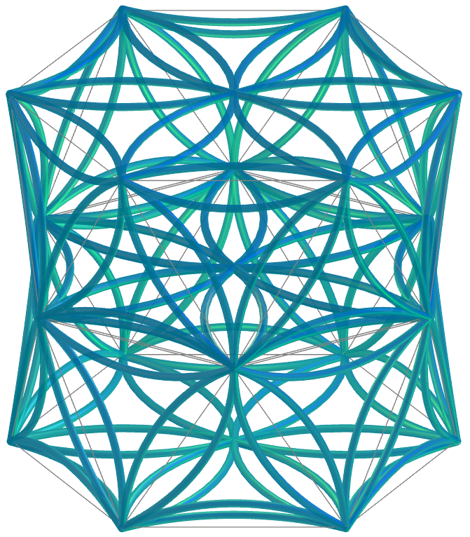
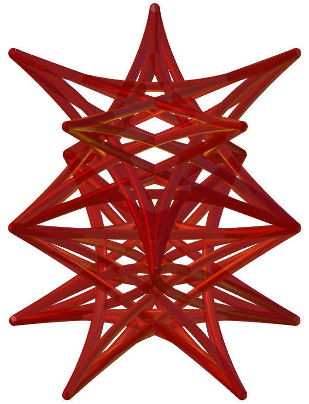
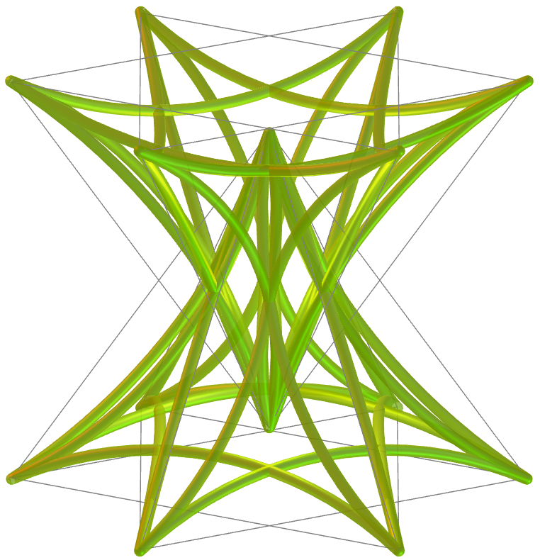

<link rel="stylesheet" href="../../scripts/style.css">
<meta charset="utf-8">
<link rel="icon" type="image/png" href="../vr/salas/imagens/icone.png">
<h2>Visualização de Tesselações em Poliedros com Realidade Virtual (RV) em A-frame</h2>
<b>autor:</b> Paulo Henrique Siqueira - Universidade Federal do Paraná
 <b>contato:</b> <a href="#"> paulohscwb@gmail.com </a>
 <a href="https://paulohscwb.github.io/tessellation/flower1/">english version</a>
<form style="margin: 0 auto; float:right; text-align:right; width:100%; margin-bottom:15px;">
	<select id="url" onchange="urlHandler(this.value)" style="color:royalblue;">
		<option disabled selected>Mais sólidos:</option>
		<option value="../../escher/pt-br/">Obras de Escher</option>
		<option value="../../part2/pt-br/">Tesselações 2</option>
		<option value="../../part3/pt-br/">Tesselações 3</option>
		<option value="../../part4/pt-br/">Tesselações 4</option>
		<option value="../../spiderweb/pt-br/">Teia de aranha</option>
		<option disabled value="../../flower1/pt-br/">Flor da vida 1</option>
		<option value="../../part5/pt-br/">Tesselações 5</option>
		<option value="../../part6/pt-br/">Tesselações 6</option>
		<option value="../../strips/pt-br/">Tesselações em tiras</option>
		<!--<option value="../../part7/pt-br/">Tesselações 7</option>
		<option value="../../part8/pt-br/">Tesselações 8</option>
		<option value="../../part9/pt-br/">Tesselações 9</option>
		<option value="../../part10/pt-br/">Tesselações 10</option>
		<option value="../../part11/pt-br/">Tesselações 11</option>-->
	</select>
</form>

  <h2 align="center"> Tesselações - Flor da vida 1</h2>
  As figuras ou obras que são escolhidas como tesselas cobrem ou pavimentam o plano ou uma superfície. O resultado é chamado de tesselação, ladrilho, pavimentação ou mosaico. As tesselações são usadas desde a antiguidade em pisos, paredes tapetes e outros objetos. 
 Este trabalho mostra as tesselações feitas em todas ou algumas faces de poliedros, aproveitando simetrias triangulares, quadradas, pentagonais ou hexagonais das faces destes sólidos. 
 Nesta página, temos tesselações feitas com construções do símbolo da Flor da vida, inseridas nas faces de poliedros comuns, como o icosaedro de Platão, e outros mais raros, como o não convexo icosidodecadodecaedro. Nesta parte do trabalho, cada pétala do símbolo tem o tamanho da aresta do poliedro coberto pela tesselação.
 
<a href="#m3d">Modelos 3D</a>&nbsp;&nbsp;|&nbsp;&nbsp;<a href="../../pt-br/">Página Inicial</a>

  

 

<h3 id="m3d" align="center">Modelos 3D</h3>
<iframe width="560" height="315" style="max-width:100%" src="https://www.youtube.com/embed/videoseries?list=PLy0I_lGW8HxVxtLWl3MpfYqe7ZRgoR6gX" title="YouTube video player" frameborder="0" allow="accelerometer; autoplay; clipboard-write; encrypted-media; gyroscope; picture-in-picture; web-share" allowfullscreen></iframe>
<h4>1. Antiprisma</h4>

  <b>tipo de tesselação</b>: hexagonal e triangular
  

<h4>2. Cuboctaedro Cubitruncado</h4>

  <b>tipo de tesselação</b>: hexagonal
  

<h4>3. Dodecadodecaedro Ditrigonal</h4>

  <b>tipo de tesselação</b>: pentagonal
  

<h4>4. Dodecadodecaedro</h4>

  <b>tipo de tesselação</b>: pentagonal
  

<h4>5. Dodecaedro com pirâmides</h4>

  <b>tipo de tesselação</b>: pentagonal
  

<h4>6. Dodecaedro</h4>

  <b>tipo de tesselação</b>: pentagonal
  

<h4>7. Grande Cubicuboctaedro</h4>

  <b>tipo de tesselação</b>: triangular
  

<h4>8. Grande Dodecicosidodecaedro Ditrigonal</h4>

  <b>tipo de tesselação</b>: pentagonal
  

<h4>9. Grande Dodecaedro</h4>

  <b>tipo de tesselação</b>: pentagonal
  

<h4>10. Grande Dodecicosaedro</h4>

  <b>tipo de tesselação</b>: hexagonal
  

<a href="#p1" class="topo">voltar ao topo</a>

<h4>11. Grande Dodecicosidodecaedro</h4>

  <b>tipo de tesselação</b>: triangular
  

<h4>12. Grande Icosaedro</h4>

  <b>tipo de tesselação</b>: triangular
  

<h4>13. Grande Icosidodecaedro</h4>

  <b>tipo de tesselação</b>: triangular
  

<h4>14. Grande Cuboctaedro Truncado</h4>

  <b>tipo de tesselação</b>: hexagonal
  

<h4>15. Grande Icosidodecaedro Truncado</h4>

  <b>tipo de tesselação</b>: hexagonal
  

<h4>16. Dipirâmide Quadrada Giroalongada</h4>

  <b>tipo de tesselação</b>: triangular
  

<h4>17. Antiprisma Hexagrâmico</h4>

  <b>tipo de tesselação</b>: triangular
  

<h4>18. Icosaedro</h4>

  <b>tipo de tesselação</b>: triangular
  

<h4>19. Icosidodecadodecaedro</h4>

  <b>tipo de tesselação</b>: hexagonal
  

<h4>20. Icosidodecaedro com pirâmides</h4>

  <b>tipo de tesselação</b>: pentagonal e triangular
  
 

 
<a href="#p1" class="topo">voltar ao topo</a>

 <h4>21. Icosidodecaedro</h4>

  <b>tipo de tesselação</b>: pentagonal e triangular
  
 

 <h4>22. Octaedro</h4>

  <b>tipo de tesselação</b>: triangular
  
 

<h4>23. Octahemioctaedro</h4>

  <b>tipo de tesselação</b>: hexagonal
  

<h4>24. Dipirâmide Pentagonal</h4>

  <b>tipo de tesselação</b>: triangular
  

<h4>25. Antiprisma Pentagrâmico</h4>

  <b>tipo de tesselação</b>: triangular
  

<h4>26. Antiprisma Pentagrâmico Cruzado</h4>

  <b>tipo de tesselação</b>: triangular
  

<h4>27. Rombidodecadodecaedro</h4>

  <b>tipo de tesselação</b>: pentagonal
  

<h4>28. Pequeno Icosidodecaedro Ditrigonal</h4>

  <b>tipo de tesselação</b>: triangular
  

<h4>29. Pequeno Dodecahemicosaedro</h4>

  <b>tipo de tesselação</b>: hexagonal
  

<h4>30. Pequeno Dodecicosaedro</h4>

  <b>tipo de tesselação</b>: hexagonal
  

<a href="#p1" class="topo">voltar ao topo</a>

<h4>31. Pequeno Icosicosidodecaedro</h4>

  <b>tipo de tesselação</b>: hexagonal
  

<h4>32. Pequeno Dodecaedro Truncado Estrelado</h4>

  <b>tipo de tesselação</b>: pentagonal
  

<h4>33. Cubo Snub com pirâmides</h4>

  <b>tipo de tesselação</b>: quadrilateral e triangular
  

<h4>34. Cubo Snub</h4>

  <b>tipo de tesselação</b>: quadrilateral e triangular
  

<h4>35. Dodecaedro Snub com pirâmides</h4>

  <b>tipo de tesselação</b>: pentagonal e triangular
  

<h4>36. Dodecaedro Snub</h4>

  <b>tipo de tesselação</b>: pentagonal e triangular
  

<h4>37. Pirâmide Estrelada</h4>

  <b>tipo de tesselação</b>: triangular
  

<h4>38. Tetraedro</h4>

  <b>tipo de tesselação</b>: triangular
  
 

<h4>39. Dipirâmide Triangular</h4>

  <b>tipo de tesselação</b>: triangular
    

<h4>40. Prisma Triangular Triaumentado</h4>

  <b>tipo de tesselação</b>: triangular
  

<a href="#p1" class="topo">voltar ao topo</a>

<h4>41. Grande Icosaedro Truncado</h4>

  <b>tipo de tesselação</b>: hexagonal
  

<h4>42. Icosaedro Truncado com pirâmides</h4>

  <b>tipo de tesselação</b>: hexagonal e pentagonal
  

<h4>43. Icosaedro Truncado</h4>

  <b>tipo de tesselação</b>: hexagonal e pentagonal
  

<h4>44. Octaedro Truncado com pirâmides</h4>

  <b>tipo de tesselação</b>: quadrilateral e hexagonal
  

<h4>45. Octaedro Truncado</h4>

  <b>tipo de tesselação</b>: quadrilateral e hexagonal
  

<h4>46. Tetraedro Truncado</h4>

  <b>tipo de tesselação</b>: hexagonal
  

<h4>47. Grande Icosidodecaedro Snub Invertido</h4>

  <b>tipo de tesselação</b>: pentagonal
  

<h4>48. Grande Icosidodecaedro Retrosnub</h4>

  <b>tipo de tesselação</b>: pentagonal
  

<h4>49. Pequeno Icosicosidodecaedro RetroSnub</h4>

  <b>tipo de tesselação</b>: pentagonal
  

<h4>50. Antiprisma Duplo</h4>

  <b>tipo de tesselação</b>: hexagonal e triangular
  

<a href="#p1" class="topo">voltar ao topo</a>

<h4>51. Antiprisma Pentagrâmico Cruzado Duplo</h4>

  <b>tipo de tesselação</b>: triangular
  

<h4>52. Pirâmide Estrelada Dupla</h4>

  <b>tipo de tesselação</b>: triangular
  

<a href="#p1" class="topo">voltar ao topo</a>

  Flower of life 1: polyhedra tessellation and visualization with Virtual Reality de <a xmlns:cc="http://creativecommons.org/ns#" href="https://paulohscwb.github.io/tessellation/flower1/pt-br/" property="cc:attributionName" rel="cc:attributionURL">Paulo Henrique Siqueira</a> está licenciado com uma Licença <a rel="license" href="http://creativecommons.org/licenses/by-nc-nd/4.0/">Creative Commons Atribuição-NãoComercial-SemDerivações 4.0 Internacional</a>.

<h4>Como citar este trabalho:</h4> 

Siqueira, P.H., "Flower of life 1: polyhedra tessellation and visualization with Virtual Reality". Disponível em: <https://paulohscwb.github.io/tessellation/flower1/pt-br/>, Abril de 2026.

<!---->
  <b>Referências:</b>
 Weisstein, Eric W. "Tessellation." From MathWorld--A Wolfram Web Resource. <a href="https://mathworld.wolfram.com/Tessellation.html" target="_blank"> https://mathworld.wolfram.com/Tessellation.html</a>
 Mohr, R. "Tiled Art" <a href="https://tiled.art/en/home" target="_blank">https://tiled.art/en/home</a> 
 McCooey, D. I. "Visual Polyhedra". <a href="http://dmccooey.com/polyhedra/" target="_blank">http://dmccooey.com/polyhedra/</a>
