<link rel="stylesheet" href="../scripts/style.css">
<meta charset="utf-8">
<link rel="icon" type="image/png" href="vr/salas/imagens/icone.png">
<h2>Visualization of Polyhedra tessellation with Virtual Reality (VR) in A-frame</h2>
 <b>author:</b> Paulo Henrique Siqueira - Universidade Federal do Paraná
  <b>contact:</b> <a href="#">paulohscwb@gmail.com</a>
  <a href="https://paulohscwb.github.io/tessellation/part2/pt-br/">versão em português</a>
 <form style="margin: 0 auto; float:right; text-align:right; width:100%; margin-bottom:15px;">
	<select id="url" onchange="urlHandler(this.value)" style="color:royalblue;">
		<option disabled selected value>More solids:</option>
		<option value="../escher/">Escher's Works</option>
		<option disabled value="../part2/">Tessellation 2</option>
		<!--<option value="../part3/">Tessellation 3</option>
		<option value="../part4/">Tessellation 4</option>
		<option value="../part5/">Tessellation 5</option>
		<option value="../part6/">Tessellation 6</option>
		<option value="../part7/">Tessellation 7</option>
		<option value="../part8/">Tessellation 8</option>
		<option value="../part9/">Tessellation 9</option>
		<option value="../part10/">Tessellation 10</option>
		<option value="../part11/">Tessellation 11</option>-->
	</select>
</form>

  <h2 align="center">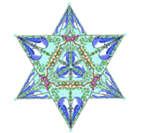 Tessellation - part 2</h2>
The figures or works that are chosen as tesserae cover or pave the plane or a surface. The result is called tessellation, tiling, paving or mosaic. 
Tessellations have been used since ancient times in floors, walls, carpets and other objects.
 This work shows the tessellations made on all or some faces of polyhedrons, taking advantage of triangular, square, pentagonal or hexagonal symmetries of the faces of these solids.
 On this page, we have some tessellation works by Francine Champagne, Massimo Rana, Alain Nicolas and Barb Widen, inserted into the faces of common polyhedrons, such as the Platonic tetrahedron, cube or icosahedron, as well as rarer polyhedrons, such as the Johnson solids.

<a href="#m3d">3D Models</a>&nbsp;&nbsp;|&nbsp;&nbsp;<a href="../">Home</a>

 

 

<h3 id="m3d" align="center">3D models</h3>
<!--<iframe width="560" height="315" style="max-width:100%" src="https://www.youtube.com/embed/videoseries?list=PLy0I_lGW8HxVEvPQGN_8Y86B_opMhsoQ2" title="YouTube video player" frameborder="0" allow="accelerometer; autoplay; clipboard-write; encrypted-media; gyroscope; picture-in-picture; web-share" allowfullscreen></iframe>-->
<h4>1. Francine Champagne tessellation</h4>
<a href="vr/Tessellation1.htm" target="_blank" title="3D model" class="fotoA">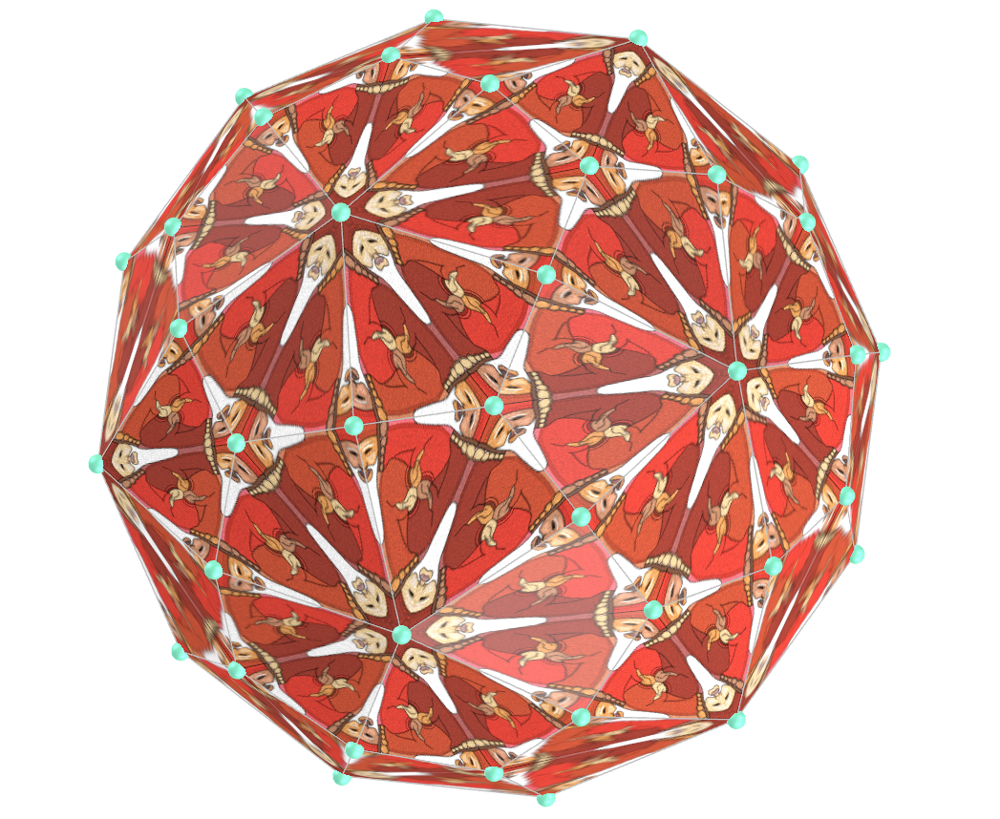</a>
  <b>description</b>: Francine Champagne tessellation 2019 - Eck Master Lai Tsi from ancient China
  <b>tessellation type</b>: triangular and quadrilateral
  <b>polyhedra</b>: Möbius hexakis octahedron, Escher solid, hexakis tetrahedron, Möbius deltahedron, Möbius octakis hexahedron, deltoidal hexecontahedron
  

<h4>2. Francine Champagne tessellation</h4>

  <b>description</b>: Francine Champagne tessellation 2019 - Eck Master Lai Tsi from ancient China
  <b>tessellation type</b>: triangular and quadrilateral
  <b>polyhedra</b>: rhombic dodecahedron, Möbius 10-akis dodecahedron, rhombic hexecontahedron, Möbius hexakis icosahedron, octahedron, tetrakis hexahedron
  

<h4>3. Alain Nicolas tessellation</h4>
<a href="vr/Tessellation3.htm" target="_blank" title="3D model" class="fotoA">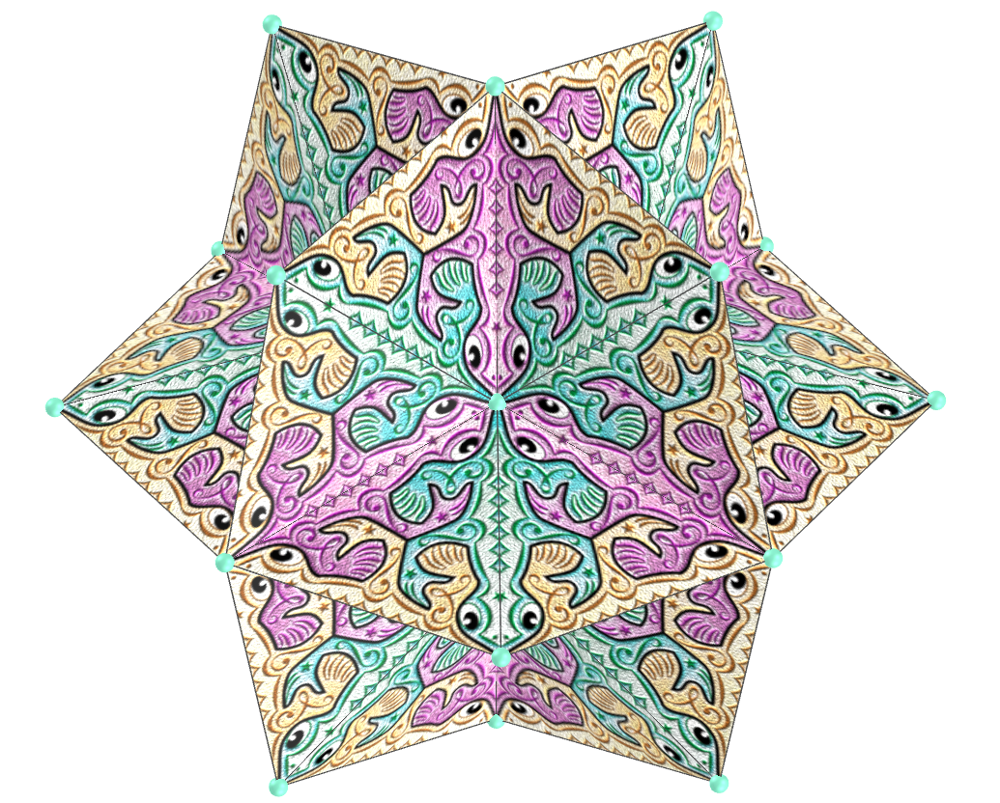</a>
  <b>description</b>: Alain Nicolas tessellation - Amphibian 
  <b>tessellation type</b>: triangular and quadrilateral
  <b>polyhedra</b>: Möbius hexakis octahedron, Escher solid, hexakis tetrahedron, Möbius deltahedron, Möbius octakis hexahedron, deltoidal hexecontahedron
  

<h4>4. Alain Nicolas tessellation</h4>

  <b>description</b>: Alain Nicolas tessellation - Amphibian
  <b>tessellation type</b>: triangular and quadrilateral
  <b>polyhedra</b>: rhombic dodecahedron, Möbius 10-akis dodecahedron, rhombic hexecontahedron, Möbius hexakis icosahedron, octahedron, tetrakis hexahedron
  

<h4>5. Alain Nicolas tessellation</h4>
<a href="vr/Tessellation5.htm" target="_blank" title="3D model" class="fotoA">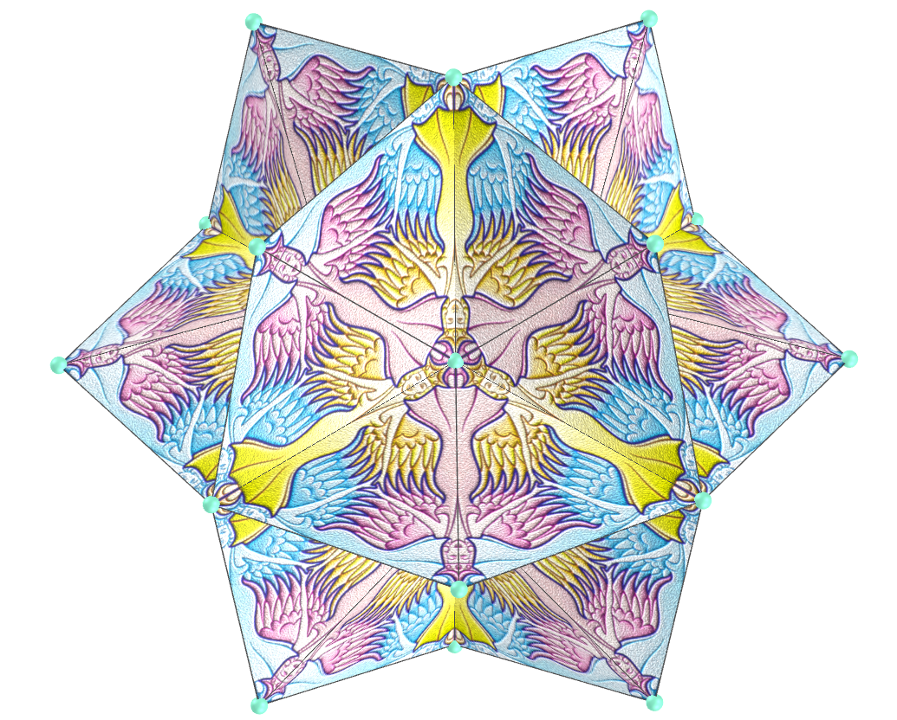</a>
  <b>description</b>: Alain Nicolas tessellation - Angel queen
  <b>tessellation type</b>: triangular and quadrilateral
  <b>polyhedra</b>: Möbius hexakis octahedron, Möbius 10-akis dodecahedron, Escher solid, hexakis tetrahedron, Möbius hexakis icosahedron, octahedron, Möbius deltahedron, Möbius octakis hexahedron, tetrakis hexahedron
  

<h4>6. Barb Widen tessellation</h4>
<a href="vr/Tessellation6.htm" target="_blank" title="3D model" class="fotoA">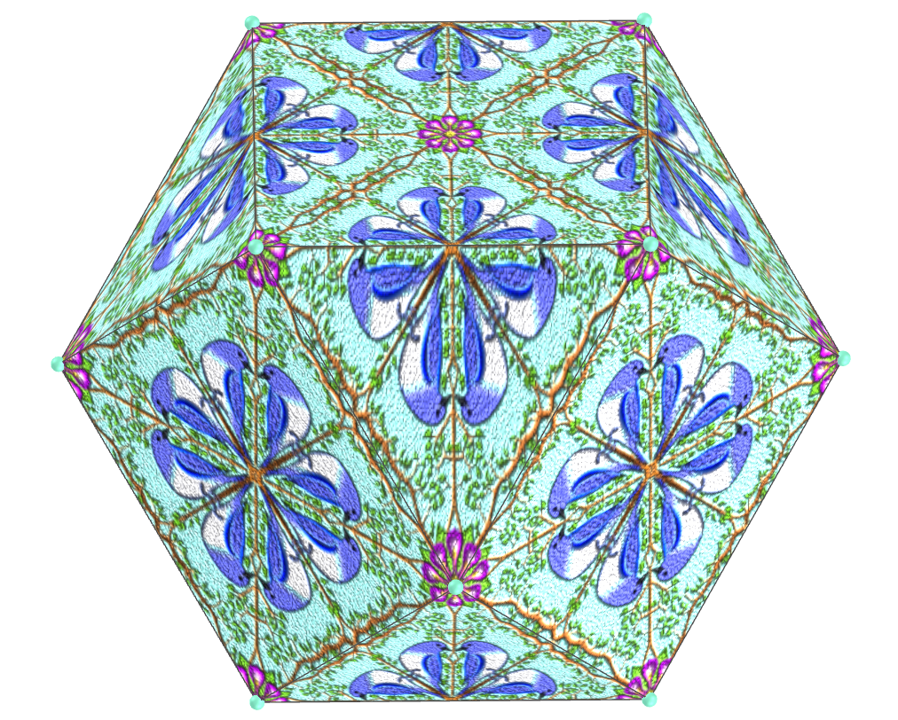</a>
  <b>description</b>: Barb Widen tessellation
  <b>tessellation type</b>: quadrilateral and triangular
  <b>polyhedra</b>: Möbius hexakis octahedron, Escher solid, hexakis tetrahedron, Möbius deltahedron, Möbius octakis hexahedron, deltoidal hexecontahedron, deltoidal icositetrahedron, cube, cuboctahedron, triakis octahedron, triakis icosahedron
  

<h4>7. Barb Widen tessellation</h4>
<a href="vr/Tessellation7.htm" target="_blank" title="3D model" class="fotoA">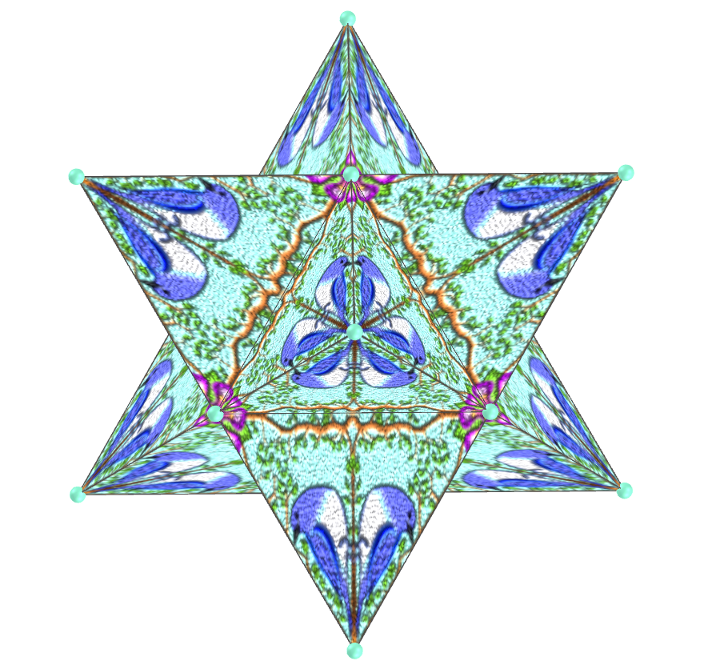</a>
  <b>description</b>: Barb Widen tessellation
  <b>tessellation type</b>: quadrilateral and triangular
  <b>polyhedra</b>: rhombic dodecahedron, Möbius 10-akis dodecahedron, rhombic hexecontahedron, Möbius hexakis icosahedron, octahedron, tetrakis hexahedron, rhombic triacontahedron, square orthobicupola, stella octangula, triakis tetrahedron
  

<h4>8. Francine Champagne tessellation</h4>
<a href="vr/Tessellation40.htm" target="_blank" title="3D model" class="fotoA">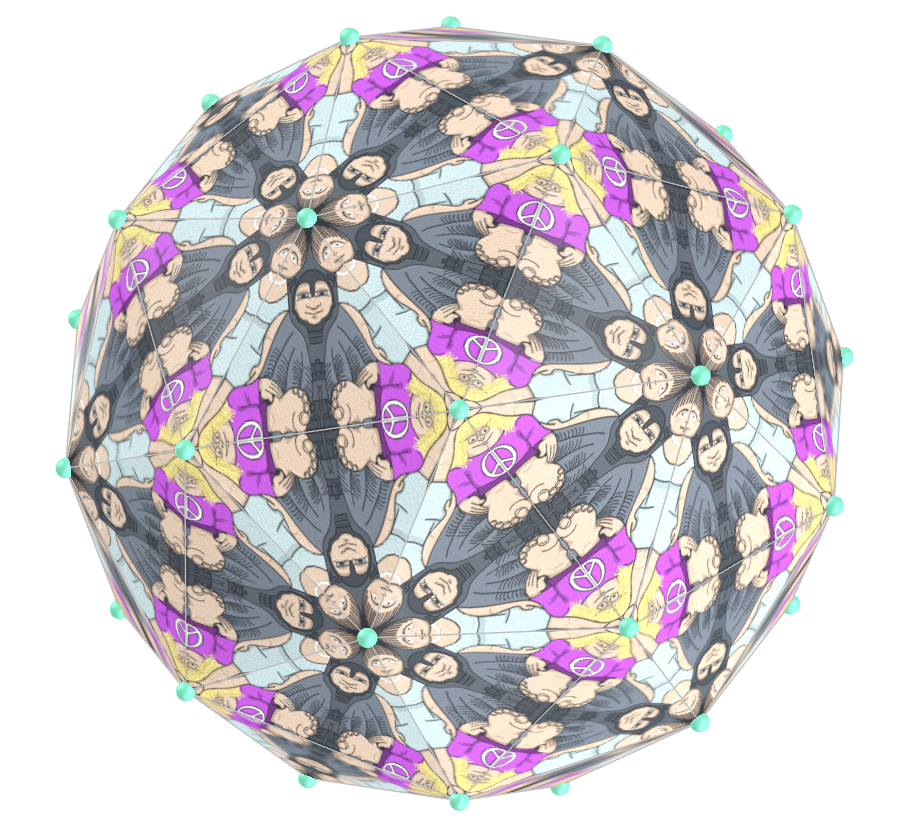</a>
  <b>description</b>: Francine Champagne tessellation - Prissy Groovy and Cool
  <b>tessellation type</b>: triangular and quadrilateral
  <b>polyhedra</b>: Möbius hexakis octahedron, Escher solid, hexakis tetrahedron, Möbius deltahedron, Möbius octakis hexahedron, deltoidal hexecontahedron, deltoidal icositetrahedron, cube, pentakis dodecahedron, triakis octahedron, triakis icosahedron
  

<h4>9. Francine Champagne tessellation</h4>
<a href="vr/Tessellation41.htm" target="_blank" title="3D model" class="fotoA">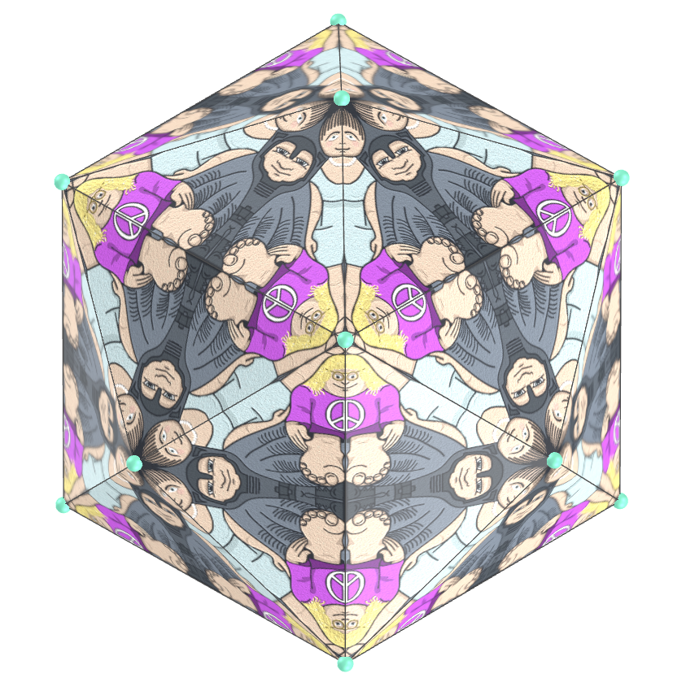</a>
  <b>description</b>: Francine Champagne tessellation - Prissy Groovy and Cool
  <b>tessellation type</b>: triangular and quadrilateral
  <b>polyhedra</b>: rhombic dodecahedron, Möbius 10-akis dodecahedron, rhombic hexecontahedron, Möbius hexakis icosahedron, octahedron, tetrakis hexahedron, rhombic triacontahedron, square orthobicupola, stella octangula, triakis tetrahedron
  

<h4>10. Alain Nicolas tessellation</h4>

  <b>description</b>: Alain Nicolas tessellation - On the beach 3
  <b>tessellation type</b>: quadrilateral and triangular
  <b>polyhedra</b>: Möbius hexakis octahedron, Escher solid, hexakis tetrahedron, Möbius deltahedron, Möbius octakis hexahedron, deltoidal hexecontahedron
  

<a href="#p1" class="topo">back to top</a>

<h4>11. Alain Nicolas tessellation</h4>

  <b>description</b>: Alain Nicolas tessellation - On the beach 3
  <b>tessellation type</b>: quadrilateral and triangular
  <b>polyhedra</b>: rhombic dodecahedron, Möbius 10-akis dodecahedron, rhombic hexecontahedron, Möbius hexakis icosahedron, octahedron, tetrakis hexahedron
  

<h4>12. Alain Nicolas tessellation</h4>
<a href="vr/Tessellation10.htm" target="_blank" title="3D model" class="fotoA">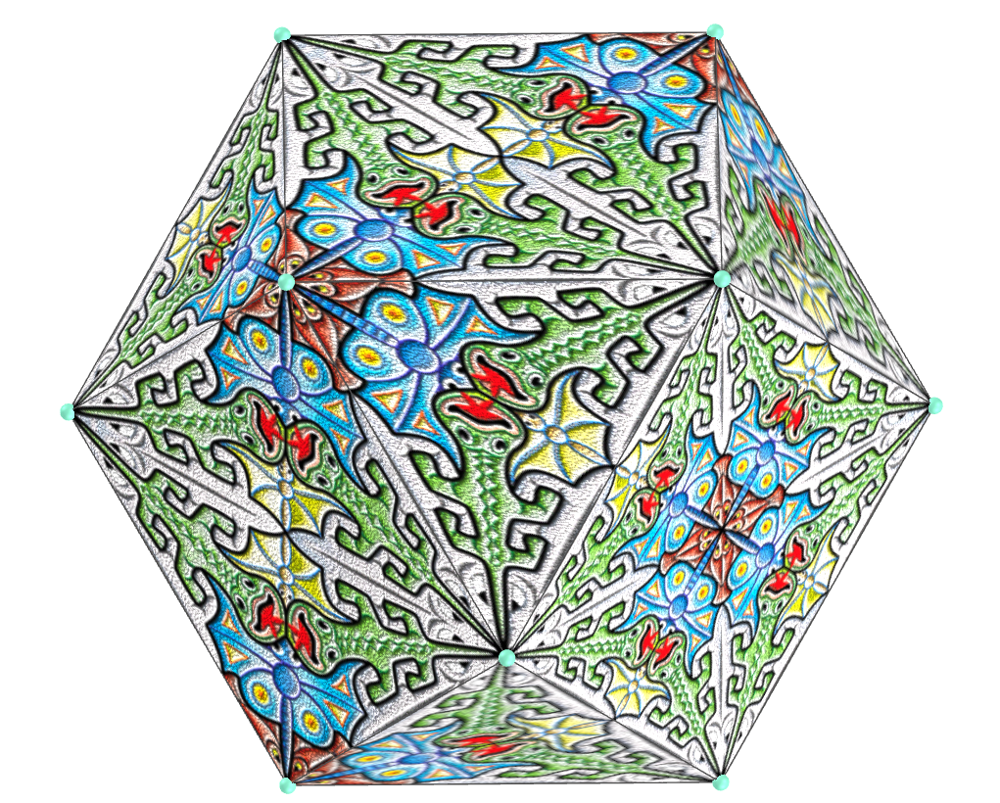</a>
  <b>description</b>: Alain Nicolas tessellation - Mosaic of earth, air and water
  <b>tessellation type</b>: quadrilateral and triangular
  <b>polyhedra</b>: Möbius hexakis octahedron, Escher solid, hexakis tetrahedron, Möbius deltahedron, Möbius octakis hexahedron, deltoidal hexecontahedron, deltoidal icositetrahedron, cube, cuboctahedron, triakis octahedron, triakis icosahedron
  

<h4>13. Alain Nicolas tessellation</h4>

  <b>description</b>: Alain Nicolas tessellation - Mosaic of earth, air and water
  <b>tessellation type</b>: quadrilateral and triangular
  <b>polyhedra</b>: rhombic dodecahedron, Möbius 10-akis dodecahedron, rhombic hexecontahedron, Möbius hexakis icosahedron, octahedron, tetrakis hexahedron, rhombic triacontahedron, square orthobicupola, triakis tetrahedron
  

<h4>14. Alain Nicolas tessellation</h4>

  <b>description</b>: Alain Nicolas tessellation - Air, earth & sea 1
  <b>tessellation type</b>: quadrilateral and triangular
  <b>polyhedra</b>: Möbius hexakis octahedron, Escher solid, hexakis tetrahedron, Möbius deltahedron, Möbius octakis hexahedron, deltoidal hexecontahedron
  

<h4>15. Alain Nicolas tessellation</h4>

  <b>description</b>: Alain Nicolas tessellation - Air, earth & sea 1
  <b>tessellation type</b>: quadrilateral and triangular
  <b>polyhedra</b>: rhombic dodecahedron, Möbius 10-akis dodecahedron, rhombic hexecontahedron, Möbius hexakis icosahedron, octahedron, tetrakis hexahedron
  

<h4>16. Francine Champagne tessellation</h4>
<a href="vr/Tessellation42.htm" target="_blank" title="3D model" class="fotoA">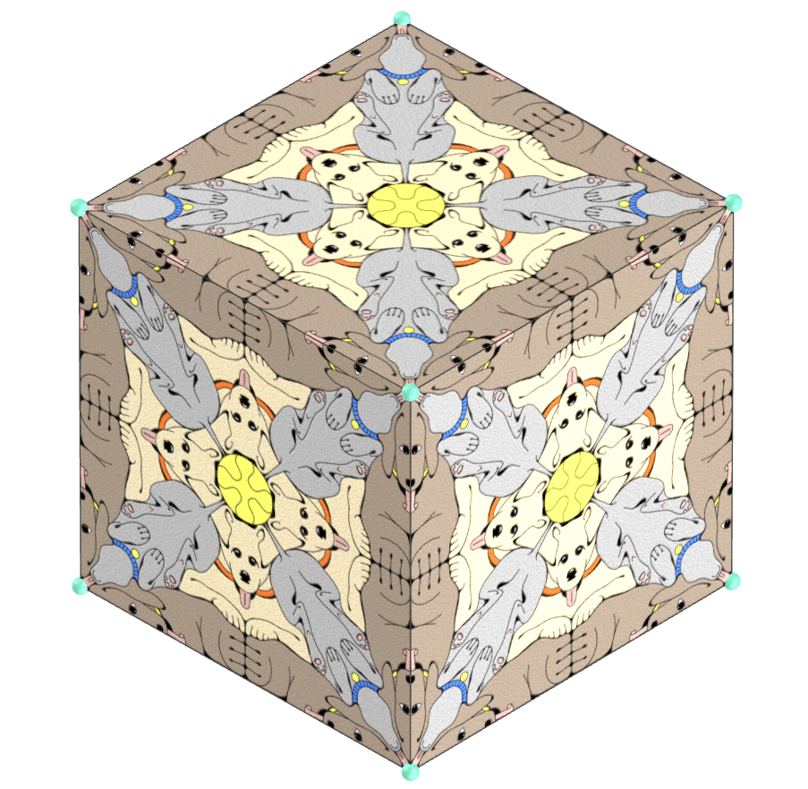</a>
  <b>description</b>: Francine Champagne tessellation - Three Dogs Searching for the Crumb
  <b>tessellation type</b>: triangular and quadrilateral
  <b>polyhedra</b>: Möbius hexakis octahedron, Escher solid, hexakis tetrahedron, Möbius deltahedron, Möbius octakis hexahedron, deltoidal hexecontahedron, deltoidal icositetrahedron, cube, pentakis dodecahedron, triakis octahedron, triakis icosahedron
  

<h4>17. Francine Champagne tessellation</h4>
<a href="vr/Tessellation43.htm" target="_blank" title="3D model" class="fotoA">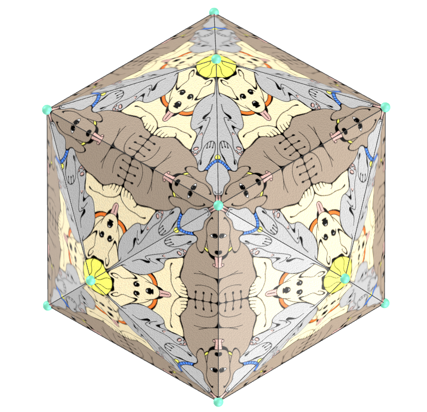</a>
  <b>description</b>: Francine Champagne tessellation - Three Dogs Searching for the Crumb
  <b>tessellation type</b>: triangular and quadrilateral
  <b>polyhedra</b>: rhombic dodecahedron, Möbius 10-akis dodecahedron, rhombic hexecontahedron, Möbius hexakis icosahedron, octahedron, tetrakis hexahedron, rhombic triacontahedron, square orthobicupola, stella octangula, triakis tetrahedron
  

<h4>18. Alain Nicolas tessellation</h4>
<a href="vr/Tessellation14.htm" target="_blank" title="3D model" class="fotoA">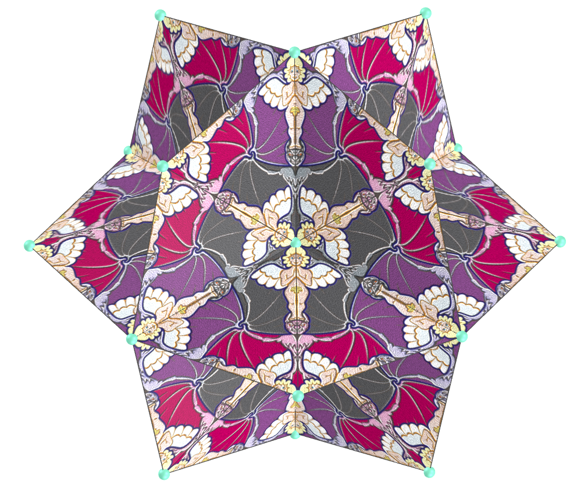</a>
  <b>description</b>: Alain Nicolas tessellation - Cherubs & demons
  <b>tessellation type</b>: quadrilateral and triangular
  <b>polyhedra</b>: Möbius hexakis octahedron, Möbius 10-akis dodecahedron, Escher solid, hexakis tetrahedron, Möbius hexakis icosahedron, octahedron, Möbius deltahedron, Möbius octakis hexahedron, tetrakis hexahedron
  

<h4>19. Alain Nicolas tessellation</h4>

  <b>description</b>: Alain Nicolas tessellation - Three chinese
  <b>tessellation type</b>: quadrilateral and triangular
  <b>polyhedra</b>: Möbius hexakis octahedron, Möbius 10-akis dodecahedron, Escher solid, hexakis tetrahedron, Möbius hexakis icosahedron, octahedron, Möbius deltahedron, Möbius octakis hexahedron, tetrakis hexahedron, rhombic dodecahedron
  

<h4>20. Alain Nicolas tessellation</h4>

  <b>description</b>: Alain Nicolas tessellation - Duck 120&ordm;
  <b>tessellation type</b>: quadrilateral and triangular
  <b>polyhedra</b>: Möbius hexakis octahedron, Escher solid, hexakis tetrahedron, Möbius deltahedron, Möbius octakis hexahedron, deltoidal hexecontahedron
  

<a href="#p1" class="topo">back to top</a>

<h4>21. Alain Nicolas tessellation</h4>
<a href="vr/Tessellation17.htm" target="_blank" title="3D model" class="fotoA">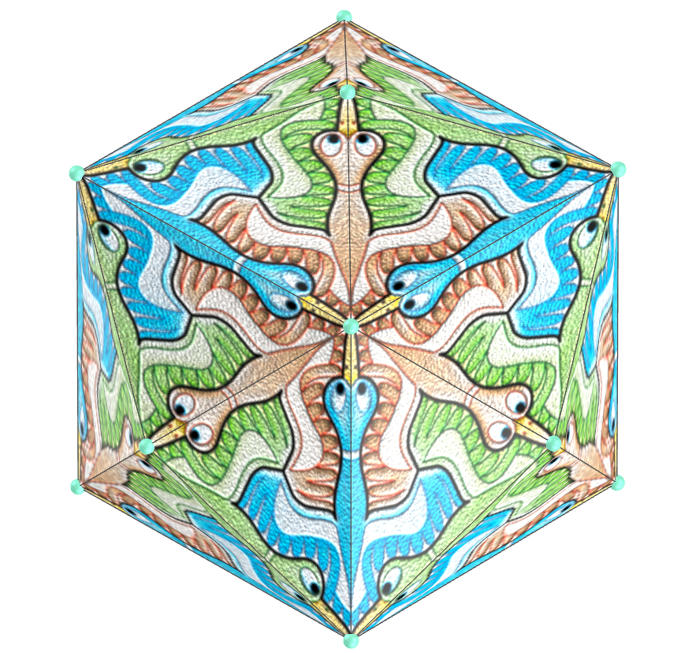</a>
  <b>description</b>: Alain Nicolas tessellation - Duck 120&ordm;
  <b>tessellation type</b>: quadrilateral and triangular
  <b>polyhedra</b>: rhombic dodecahedron, Möbius 10-akis dodecahedron, rhombic hexecontahedron, Möbius hexakis icosahedron, octahedron, tetrakis hexahedron
  

<h4>22. Alain Nicolas tessellation</h4>
<a href="vr/Tessellation18.htm" target="_blank" title="3D model" class="fotoA">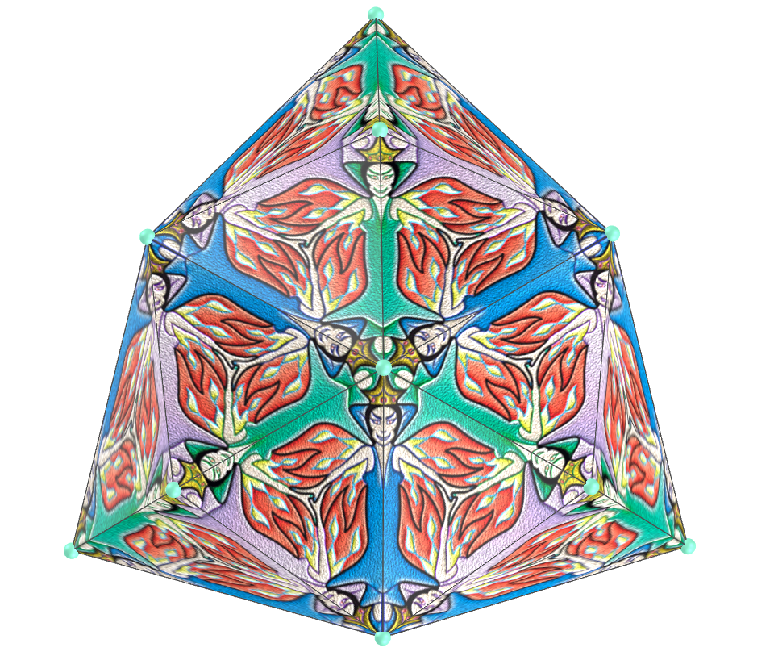</a>
  <b>description</b>: Alain Nicolas tessellation - Fire queen
  <b>tessellation type</b>: triangular and quadrilateral
  <b>polyhedra</b>: Möbius hexakis octahedron, Möbius 10-akis dodecahedron, Escher solid, hexakis tetrahedron, Möbius hexakis icosahedron, octahedron, Möbius deltahedron, Möbius octakis hexahedron, tetrakis hexahedron
  

<h4>23. Alain Nicolas tessellation</h4>

  <b>description</b>: Alain Nicolas tessellation - Royal fish
  <b>tessellation type</b>: quadrilateral and triangular
  <b>polyhedra</b>: Möbius hexakis octahedron, Möbius 10-akis dodecahedron, Escher solid, hexakis tetrahedron, Möbius hexakis icosahedron, octahedron, Möbius deltahedron, Möbius octakis hexahedron, tetrakis hexahedron
  

<h4>24. Alain Nicolas tessellation</h4>

  <b>description</b>: Alain Nicolas tessellation - Heartbug
  <b>tessellation type</b>: quadrilateral and triangular
  <b>polyhedra</b>: Möbius hexakis octahedron, Möbius 10-akis dodecahedron, Escher solid, hexakis tetrahedron, Möbius hexakis icosahedron, octahedron, Möbius deltahedron, Möbius octakis hexahedron, tetrakis hexahedron
  

<h4>25. Alain Nicolas tessellation</h4>
<a href="vr/Tessellation21.htm" target="_blank" title="3D model" class="fotoA">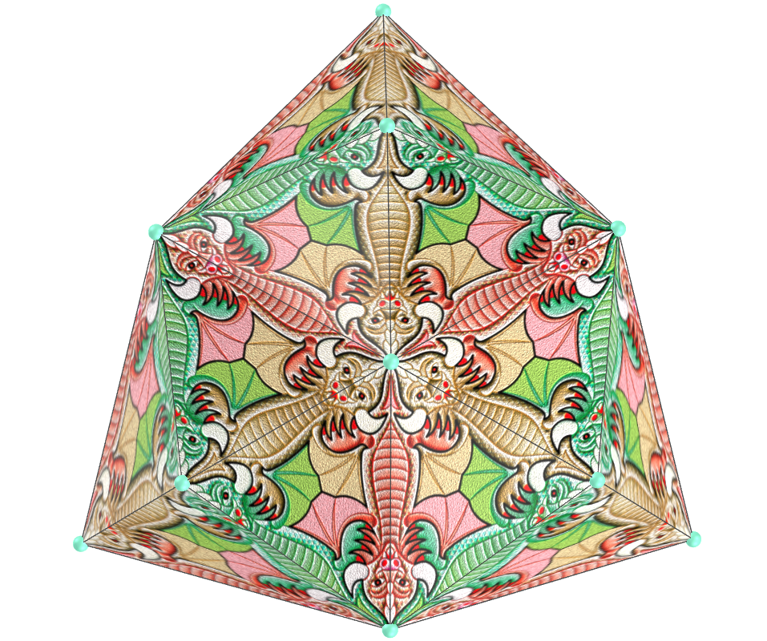</a>
  <b>description</b>: Alain Nicolas tessellation - Li'l dragon
  <b>tessellation type</b>: triangular and quadrilateral
  <b>polyhedra</b>: Möbius hexakis octahedron, Escher solid, hexakis tetrahedron, Möbius deltahedron, Möbius octakis hexahedron, deltoidal hexecontahedron
  

<h4>26. Alain Nicolas tessellation</h4>

  <b>description</b>: Alain Nicolas tessellation - Li'l dragon
  <b>tessellation type</b>: triangular and quadrilateral
  <b>polyhedra</b>: rhombic dodecahedron, Möbius 10-akis dodecahedron, rhombic hexecontahedron, Möbius hexakis icosahedron, octahedron, tetrakis hexahedron
  
 

<h4>27. Francine Champagne tessellation</h4>
<a href="vr/Tessellation44.htm" target="_blank" title="3D model" class="fotoA">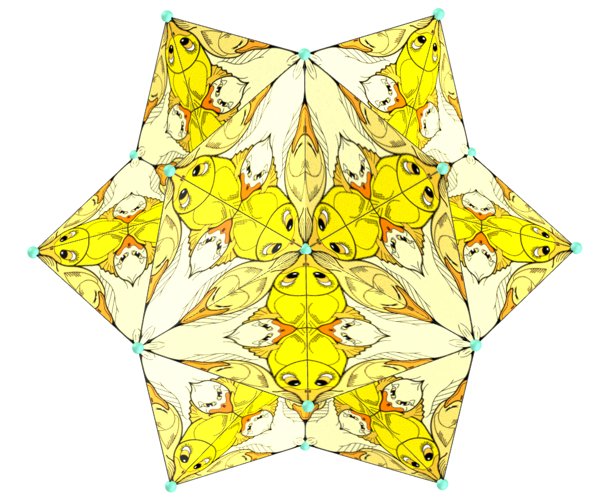</a>
  <b>description</b>: Francine Champagne tessellation - Three Rubber Duckies
  <b>tessellation type</b>: triangular and quadrilateral
  <b>polyhedra</b>: Möbius hexakis octahedron, Escher solid, hexakis tetrahedron, Möbius deltahedron, Möbius octakis hexahedron, deltoidal hexecontahedron, deltoidal icositetrahedron, cube, pentakis dodecahedron, triakis octahedron, triakis icosahedron
  

<h4>28. Francine Champagne tessellation</h4>
<a href="vr/Tessellation45.htm" target="_blank" title="3D model" class="fotoA">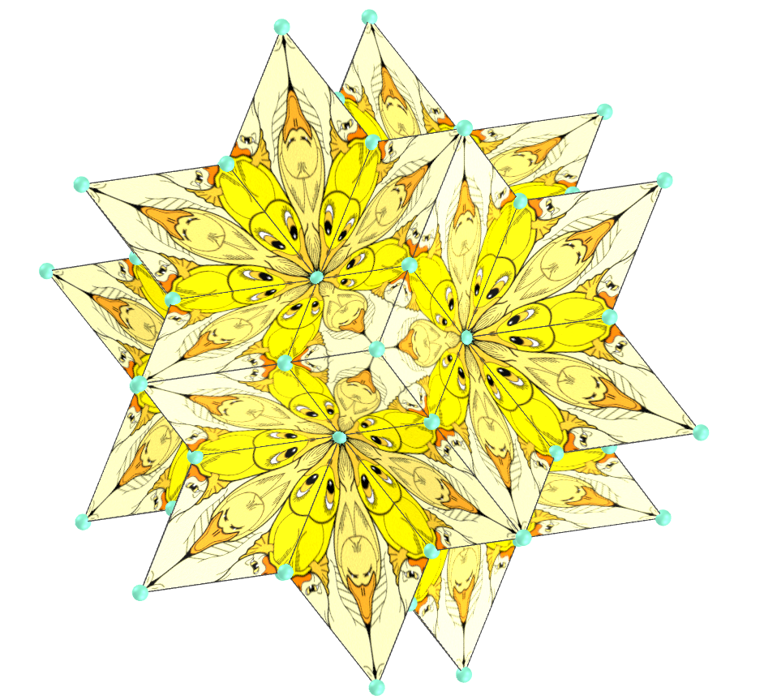</a>
  <b>description</b>: Francine Champagne tessellation - Three Rubber Duckies
  <b>tessellation type</b>: triangular and quadrilateral
  <b>polyhedra</b>: rhombic dodecahedron, Möbius 10-akis dodecahedron, rhombic hexecontahedron, Möbius hexakis icosahedron, octahedron, tetrakis hexahedron, rhombic triacontahedron, square orthobicupola, stella octangula, triakis tetrahedron
  

<h4>29. Alain Nicolas tessellation</h4>

  <b>description</b>: Alain Nicolas tessellation - Air, earth & sea 2
  <b>tessellation type</b>: triangular and quadrilateral
  <b>polyhedra</b>: Möbius hexakis octahedron, Escher solid, hexakis tetrahedron, Möbius deltahedron, Möbius octakis hexahedron, deltoidal hexecontahedron
  

<h4>30. Alain Nicolas tessellation</h4>
<a href="vr/Tessellation24.htm" target="_blank" title="3D model" class="fotoA">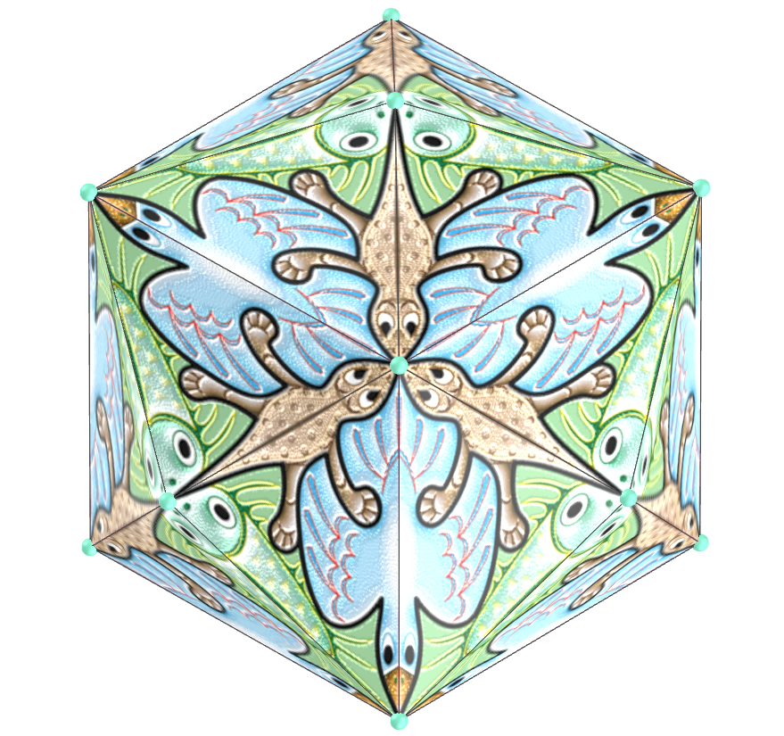</a>
  <b>description</b>: Alain Nicolas tessellation - Air, earth & sea 2
  <b>tessellation type</b>: triangular and quadrilateral
  <b>polyhedra</b>: rhombic dodecahedron, Möbius 10-akis dodecahedron, rhombic hexecontahedron, Möbius hexakis icosahedron, octahedron, tetrakis hexahedron
  

<a href="#p1" class="topo">back to top</a>

<h4>31. Alain Nicolas tessellation</h4>
<a href="vr/Tessellation25.htm" target="_blank" title="3D model" class="fotoA">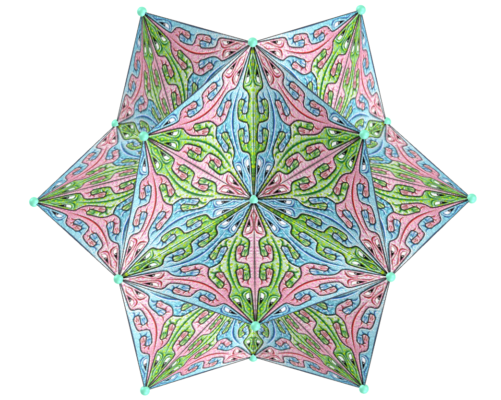</a>
  <b>description</b>: Alain Nicolas tessellation - 9 lizards noses
  <b>tessellation type</b>: triangular and quadrilateral
  <b>polyhedra</b>: Möbius hexakis octahedron, Escher solid, hexakis tetrahedron, Möbius deltahedron, Möbius octakis hexahedron, deltoidal hexecontahedron
  

<h4>32. Alain Nicolas tessellation</h4>
<a href="vr/Tessellation26.htm" target="_blank" title="3D model" class="fotoA">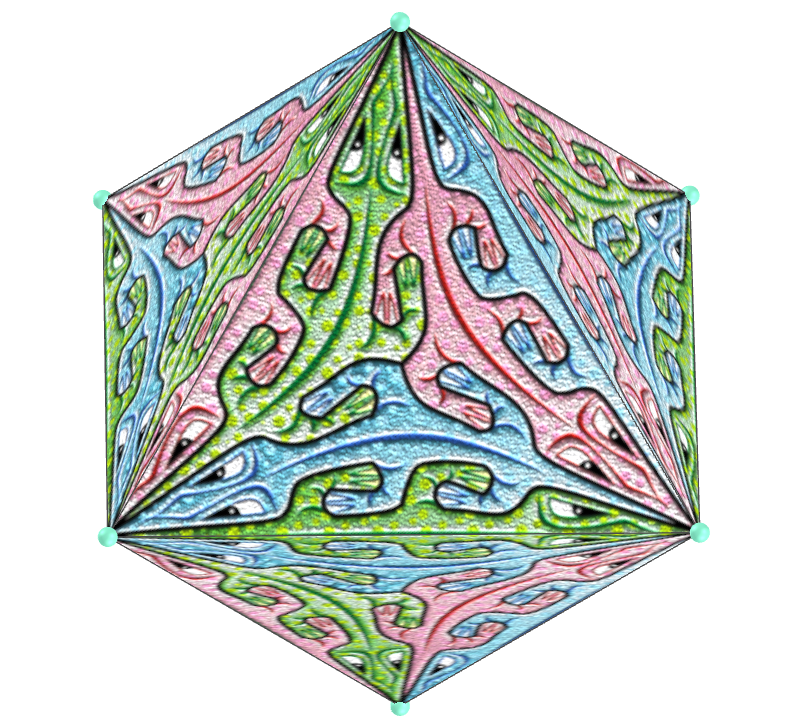</a>
  <b>description</b>: Alain Nicolas tessellation - 9 lizards noses
  <b>tessellation type</b>: triangular and quadrilateral
  <b>polyhedra</b>: rhombic dodecahedron, Möbius 10-akis dodecahedron, rhombic hexecontahedron, Möbius hexakis icosahedron, octahedron, tetrakis hexahedron
  

<h4>33. Alain Nicolas tessellation</h4>

  <b>description</b>: Alain Nicolas tessellation - Monsters
  <b>tessellation type</b>: triangular and quadrilateral
  <b>polyhedra</b>: Möbius hexakis octahedron, Escher solid, hexakis tetrahedron, Möbius deltahedron, Möbius octakis hexahedron, deltoidal hexecontahedron, cuboctahedron
  

<h4>34. Alain Nicolas tessellation</h4>
<a href="vr/Tessellation28.htm" target="_blank" title="3D model" class="fotoA">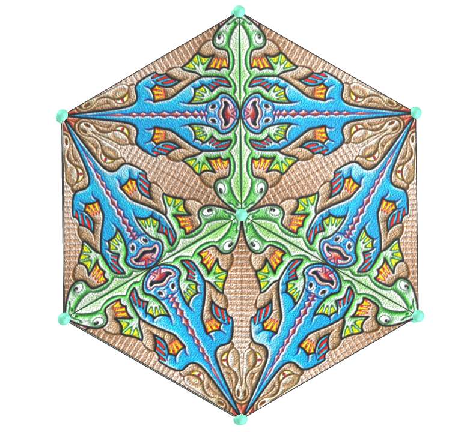</a>
  <b>description</b>: Alain Nicolas tessellation - Monsters
  <b>tessellation type</b>: triangular and quadrilateral
  <b>polyhedra</b>: rhombic dodecahedron, Möbius 10-akis dodecahedron, rhombic hexecontahedron, Möbius hexakis icosahedron, octahedron, tetrakis hexahedron
  

<h4>35. Alain Nicolas tessellation</h4>

  <b>description</b>: Alain Nicolas tessellation - Panda, bat & fish
  <b>tessellation type</b>: triangular and quadrilateral
  <b>polyhedra</b>: Möbius hexakis octahedron, Escher solid, hexakis tetrahedron, Möbius deltahedron, Möbius octakis hexahedron, deltoidal hexecontahedron
  

<h4>36. Alain Nicolas tessellation</h4>
<a href="vr/Tessellation30.htm" target="_blank" title="3D model" class="fotoA">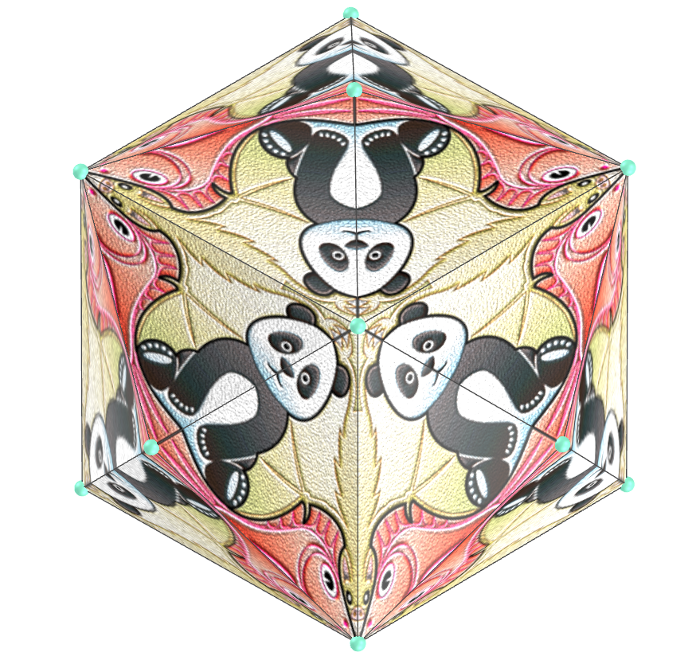</a>
  <b>description</b>: Alain Nicolas tessellation - Panda, bat & fish
  <b>tessellation type</b>: triangular and quadrilateral
  <b>polyhedra</b>: rhombic dodecahedron, Möbius 10-akis dodecahedron, rhombic hexecontahedron, Möbius hexakis icosahedron, octahedron, tetrakis hexahedron
  

<h4>37. Alain Nicolas tessellation</h4>
<a href="vr/Tessellation31.htm" target="_blank" title="3D model" class="fotoA">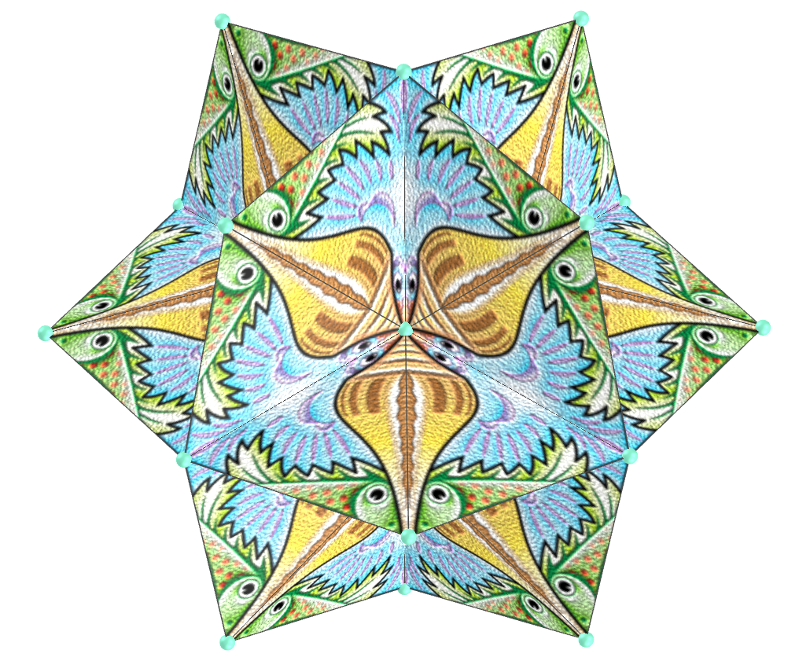</a>
  <b>description</b>: Alain Nicolas tessellation - On the beach 2
  <b>tessellation type</b>: triangular and quadrilateral
  <b>polyhedra</b>: Möbius hexakis octahedron, Escher solid, hexakis tetrahedron, Möbius deltahedron, Möbius octakis hexahedron, deltoidal hexecontahedron
  

<h4>38. Alain Nicolas tessellation</h4>

  <b>description</b>: Alain Nicolas tessellation - On the beach 2
  <b>tessellation type</b>: triangular and quadrilateral
  <b>polyhedra</b>: rhombic dodecahedron, Möbius 10-akis dodecahedron, rhombic hexecontahedron, Möbius hexakis icosahedron, octahedron, tetrakis hexahedron
  

<h4>39. Alain Nicolas tessellation</h4>

  <b>description</b>: Alain Nicolas tessellation - Squirrel, bird & fish
  <b>tessellation type</b>: triangular and quadrilateral
  <b>polyhedra</b>: Möbius hexakis octahedron, Escher solid, hexakis tetrahedron, Möbius deltahedron, Möbius octakis hexahedron, deltoidal hexecontahedron
  

<h4>40. Alain Nicolas tessellation</h4>

  <b>description</b>: Alain Nicolas tessellation - Squirrel, bird & fish
  <b>tessellation type</b>: triangular and quadrilateral
  <b>polyhedra</b>: rhombic dodecahedron, Möbius 10-akis dodecahedron, rhombic hexecontahedron, Möbius hexakis icosahedron, octahedron, tetrakis hexahedron
  

<a href="#p1" class="topo">back to top</a>

<h4>41. Alain Nicolas tessellation</h4>

  <b>description</b>: Alain Nicolas tessellation - On the beach 1
  <b>tessellation type</b>: triangular and quadrilateral
  <b>polyhedra</b>: Möbius hexakis octahedron, Möbius 10-akis dodecahedron, Escher solid, hexakis tetrahedron, Möbius hexakis icosahedron, octahedron, Möbius deltahedron, Möbius octakis hexahedron, tetrakis hexahedron, rhombic dodecahedron
  

<h4>42. Francine Champagne tessellation</h4>

  <b>description</b>: Work from 2014 - Hummingbird tessellation in symmetry group P4m
  <b>tessellation type</b>: triangular
  <b>polyhedra</b>: Möbius hexakis octahedron, Möbius 10-akis dodecahedron, Escher solid, hexakis tetrahedron, Möbius hexakis icosahedron, octahedron, Möbius deltahedron, Möbius octakis hexahedron, tetrakis hexahedron
  

<h4>43. Alain Nicolas tessellation</h4>

  <b>description</b>: Alain Nicolas tessellation - On the beach 3
  <b>tessellation type</b>: triangular
  <b>polyhedra</b>: Möbius hexakis octahedron, Möbius 10-akis dodecahedron, Escher solid, hexakis tetrahedron, Möbius hexakis icosahedron, octahedron, Möbius deltahedron, Möbius octakis hexahedron, tetrakis hexahedron
  

<h4>44. Massimo Rana tessellation</h4>
<a href="vr/Tessellation38.htm" target="_blank" title="3D model" class="fotoA">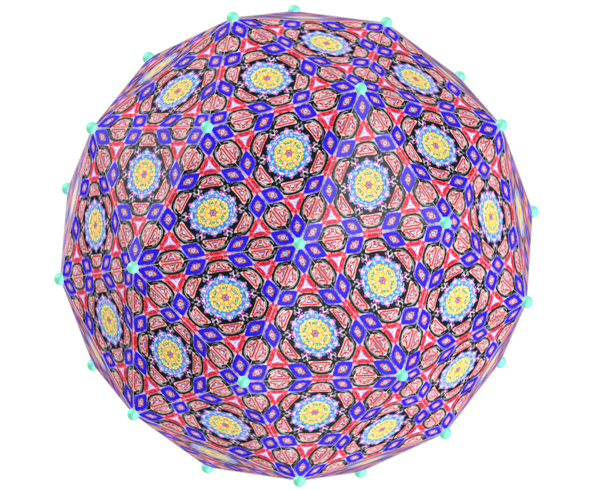</a>
  <b>description</b>: Massimo Rana tessellation
  <b>tessellation type</b>: triangular
  <b>polyhedra</b>: icosahedron, great icosahedron, Escher solid, hexakis tetrahedron, snub disphenoid, Möbius deltahedron, octahedron, Möbius hexakis octahedron, pentakis dodecahedron
  

<h4>45. Massimo Rana tessellation</h4>

  <b>description</b>: Massimo Rana tessellation
  <b>tessellation type</b>: triangular
  <b>polyhedra</b>: Möbius hexakis icosahedron, pentagonal dipyramid, Möbius octakis hexahedron, Möbius 10-akis dodecahedron, stella octangula, tetrahedron, tetrakis hexahedron
 

<a href="#p1" class="topo">back to top</a>

  Tessellation - part 2: polyhedra tessellation and visualization with Virtual Reality by <a xmlns:cc="http://creativecommons.org/ns#" href="https://paulohscwb.github.io/tessellation/part2/" property="cc:attributionName" rel="cc:attributionURL">Paulo Henrique Siqueira</a> is licensed with a license <a rel="license" href="http://creativecommons.org/licenses/by-nc-nd/4.0/">Creative Commons Attribution-NonCommercial-NoDerivatives 4.0 International</a>.

<h4>How to cite this work:</h4> 

Siqueira, P.H., "Tessellation - part 2: polyhedra tessellation and visualization with Virtual Reality". Available in: <https://paulohscwb.github.io/tessellation/part2/>, May 2025.

<!---->
  <b>References:</b>
 Nicolas, A. "Tessellations: Art most in harmony with the natural order - Method & Galleries" <a href="https://en.tessellations-nicolas.com/" target="_blank"> https://en.tessellations-nicolas.com/</a>
 Champagne, F. "Tessellations by Francine Champagne" <a href="https://tessellations.ca/" target="_blank"> https://tessellations.ca/</a>
 Weisstein, Eric W. "Tessellation." From MathWorld--A Wolfram Web Resource. <a href="https://mathworld.wolfram.com/Tessellation.html" target="_blank"> https://mathworld.wolfram.com/Tessellation.html</a>
 Mohr, R. "Tiled Art" <a href="https://tiled.art/en/home" target="_blank">https://tiled.art/en/home</a> 
 McCooey, D. I. "Visual Polyhedra". <a href="http://dmccooey.com/polyhedra/" target="_blank">http://dmccooey.com/polyhedra/</a>
