<link rel="stylesheet" href="../../scripts/style.css">
<meta charset="utf-8">
<link rel="icon" type="image/png" href="../vr/salas/imagens/icone.png">
<h2>Visualização de Tesselações em Poliedros com Realidade Virtual (RV) em A-frame</h2>
<b>autor:</b> Paulo Henrique Siqueira - Universidade Federal do Paraná
 <b>contato:</b> <a href="#"> paulohscwb@gmail.com </a>
 <a href="https://paulohscwb.github.io/tessellation/part2/">english version</a>
<form style="margin: 0 auto; float:right; text-align:right; width:100%; margin-bottom:15px;">
	<select id="url" onchange="urlHandler(this.value)" style="color:royalblue;">
		<option disabled selected>Mais sólidos:</option>
		<option value="../../escher/pt-br/">Obras de Escher</option>
		<option disabled value="../../part2/pt-br/">Tesselações 2</option>
		<!--<option value="../../part3/pt-br/">Tesselações 3</option>
		<option value="../../part4/pt-br/">Tesselações 4</option>
		<option value="../../part5/pt-br/">Tesselações 5</option>
		<option value="../../part6/pt-br/">Tesselações 6</option>
		<option value="../../part7/pt-br/">Tesselações 7</option>
		<option value="../../part8/pt-br/">Tesselações 8</option>
		<option value="../../part9/pt-br/">Tesselações 9</option>
		<option value="../../part10/pt-br/">Tesselações 10</option>
		<option value="../../part11/pt-br/">Tesselações 11</option>-->
	</select>
</form>

  <h2 align="center"> Tesselações - parte 2</h2>
  As figuras ou obras que são escolhidas como tesselas cobrem ou pavimentam o plano ou uma superfície. O resultado é chamado de tesselação, ladrilho, pavimentação ou mosaico. As tesselações são usadas desde a antiguidade em pisos, paredes tapetes e outros objetos. 
 Este trabalho mostra as tesselações feitas em todas ou algumas faces de poliedros, aproveitando simetrias triangulares, quadradas, pentagonais ou hexagonais das faces destes sólidos. 
 Nesta página, temos algumas obras de tesselações de Francine Champagne, Massimo Rana, Alain Nicolas e Barb Widen, inseridas nas faces de poliedros comuns, como os platônicos tetraedro, cubo ou icosaedro, além de poliedros mais raros, como os sólidos de Johnson.
 
<a href="#m3d">Modelos 3D</a>&nbsp;&nbsp;|&nbsp;&nbsp;<a href="../../pt-br/">Página Inicial</a>

  

 

<h3 id="m3d" align="center">Modelos 3D</h3>
<!--<iframe width="560" height="315" style="max-width:100%" src="https://www.youtube.com/embed/videoseries?list=PLy0I_lGW8HxVEvPQGN_8Y86B_opMhsoQ2" title="YouTube video player" frameborder="0" allow="accelerometer; autoplay; clipboard-write; encrypted-media; gyroscope; picture-in-picture; web-share" allowfullscreen></iframe>-->
<h4>1. Tesselação de Francine Champagne</h4>

  <b>descrição</b>: tesselação de Francine Champagne de 2019 - Mestre Eck Lai Tsi da China antiga
  <b>tipo de tesselação</b>: triangular e quadrilateral
  <b>poliedros</b>: octaedro hexakis de Möbius, sólido de Escher, tetraedro hexakis, deltaedro de Möbius, hexaedro octakis de Möbius, hexecontaedro deltoidal
  

<h4>2. Tesselação de Francine Champagne</h4>
<a href="../vr/Tessellation2.htm" target="_blank" title="modelo 3D" class="fotoA">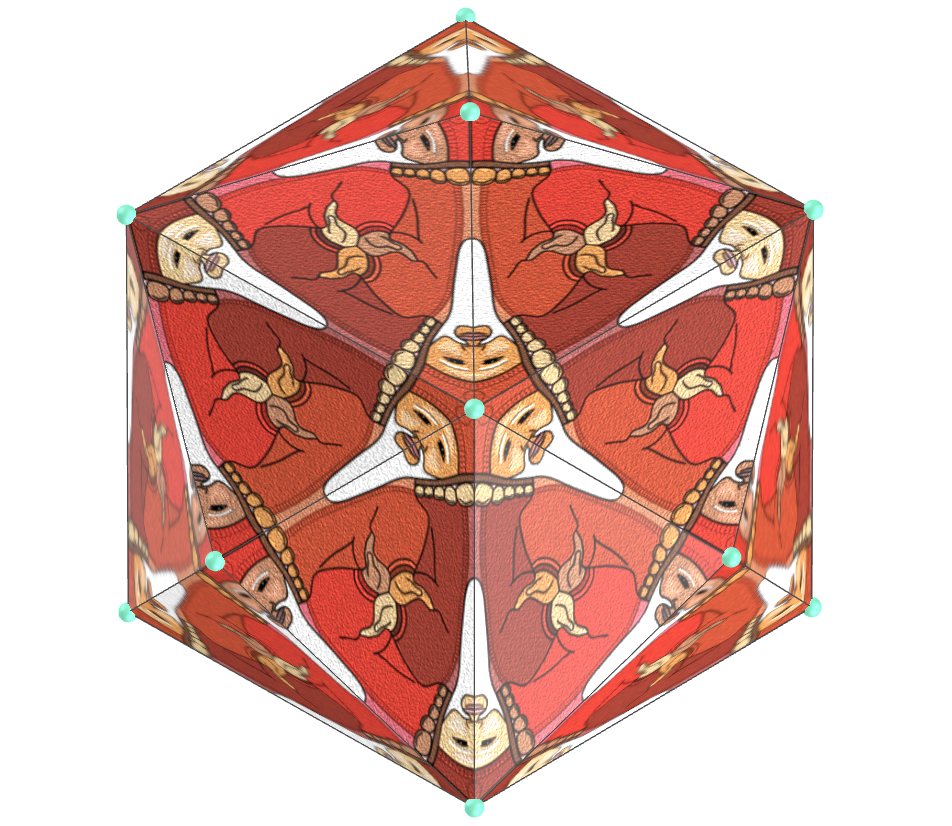</a>
  <b>descrição</b>: tesselação de Francine Champagne de 2019 - Mestre Eck Lai Tsi da China antiga
  <b>tipo de tesselação</b>: quadrilateral e triangular
  <b>poliedros</b>: dodecaedro rômbico, dodecaedro 10-akis de Möbius, hexecontaedro rômbico, icosaedro hexakis de Möbius, octaedro, hexaedro tetrakis
  

<h4>3. Tesselação de Alain Nicolas</h4>
<a href="../vr/Tessellation3.htm" target="_blank" title="modelo 3D" class="fotoA">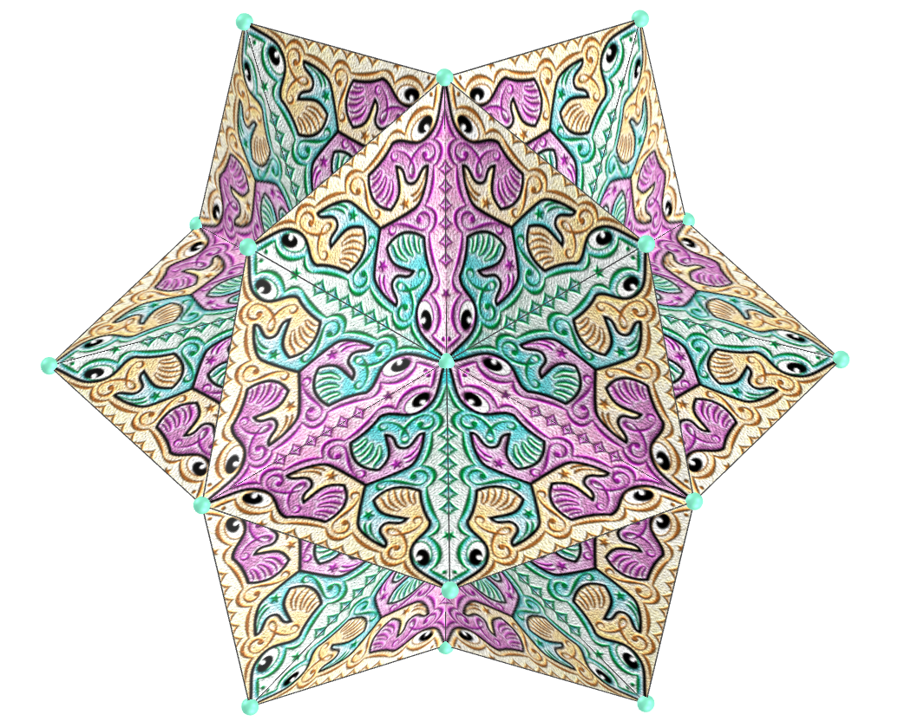</a>
  <b>descrição</b>: Tesselação de Alain Nicolas - Anfíbio
  <b>tipo de tesselação</b>: quadrilateral e triangular
  <b>poliedros</b>: octaedro hexakis de Möbius, sólido de Escher, tetraedro hexakis, deltaedro de Möbius, hexaedro octakis de Möbius, hexecontaedro deltoidal
  

<h4>4. Tesselação de Alain Nicolas</h4>
<a href="../vr/Tessellation4.htm" target="_blank" title="modelo 3D" class="fotoA">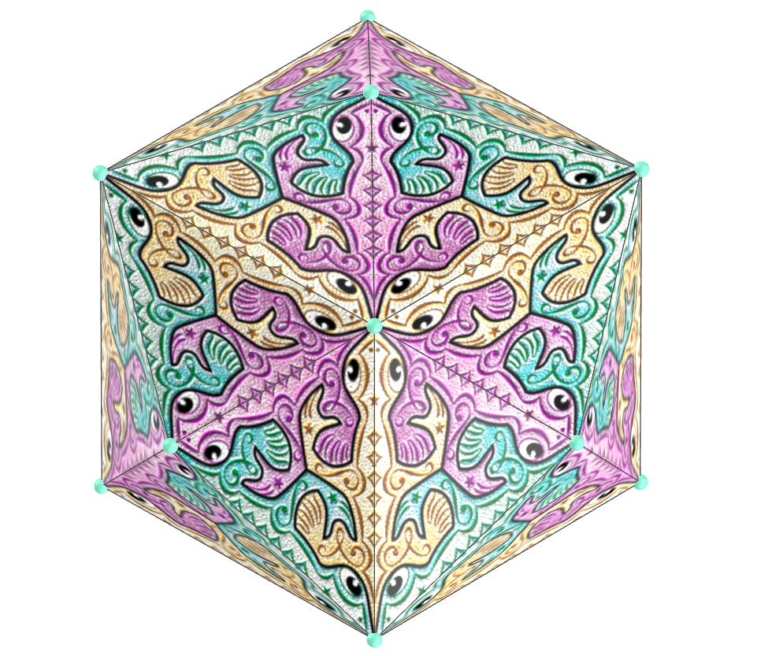</a>
  <b>descrição</b>: Tesselação de Alain Nicolas - Anfíbio
  <b>tipo de tesselação</b>: quadrilateral e triangular
  <b>poliedros</b>: dodecaedro rômbico, dodecaedro 10-akis de Möbius, hexecontaedro rômbico, icosaedro hexakis de Möbius, octaedro, hexaedro tetrakis
  

<h4>5. Tesselação de Alain Nicolas</h4>
<a href="../vr/Tessellation5.htm" target="_blank" title="modelo 3D" class="fotoA">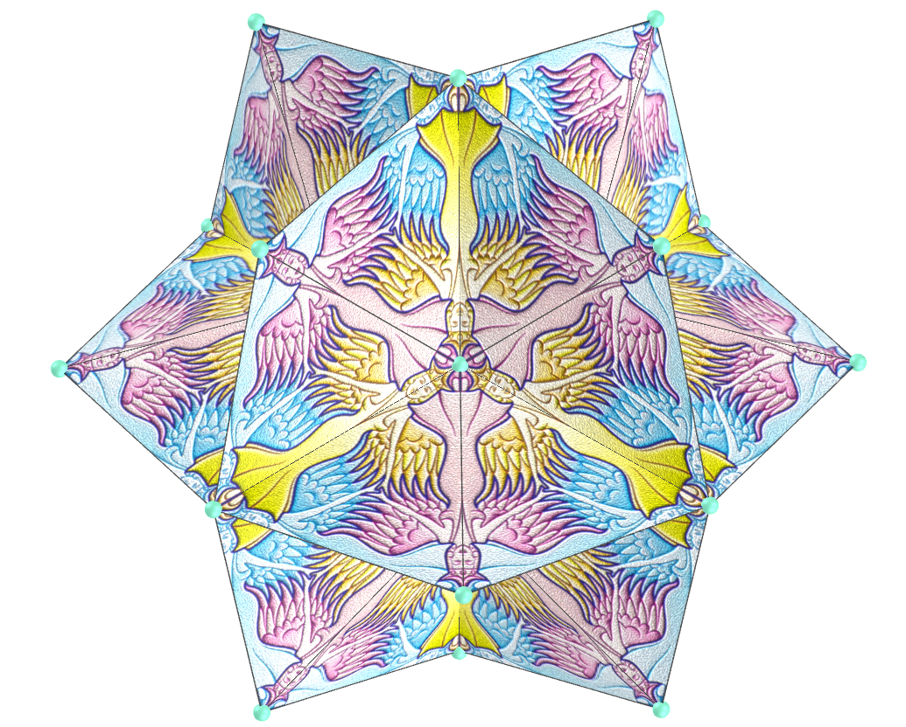</a>
  <b>descrição</b>: Tesselação de Alain Nicolas - Rainha anjo
  <b>tipo de tesselação</b>: quadrilateral e triangular
  <b>poliedros</b>: octaedro hexakis de Möbius, dodecaedro 10-akis de Möbius, sólido de Escher, tetraedro hexakis, icosaedro hexakis de Möbius, octaedro, deltaedro de Möbius, hexaedro octakis de Möbius, hexaedro tetrakis
  

<h4>6. Tesselação de Barb Widen</h4>
<a href="../vr/Tessellation6.htm" target="_blank" title="modelo 3D" class="fotoA">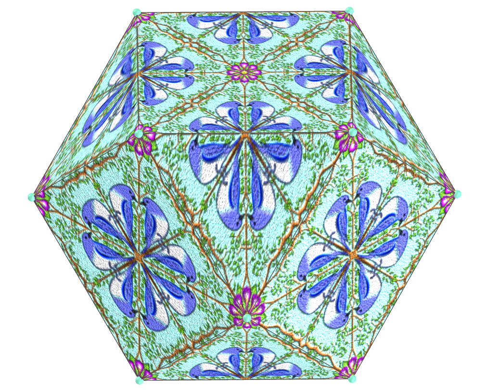</a>
  <b>descrição</b>: Tesselação de Barb Widen
  <b>tipo de tesselação</b>: quadrilateral e triangular
  <b>poliedros</b>: octaedro hexakis de Möbius, sólido de Escher, tetraedro hexakis de Möbius, deltaedro de Möbius, hexaedro octakis de Möbius, hexecontaedro deltoidal, icositetraedro deltoidal, cubo, cuboctaedro, octaedro triakis, icosaedro triakis
  

<h4>7. Tesselação de Barb Widen</h4>
<a href="../vr/Tessellation7.htm" target="_blank" title="modelo 3D" class="fotoA">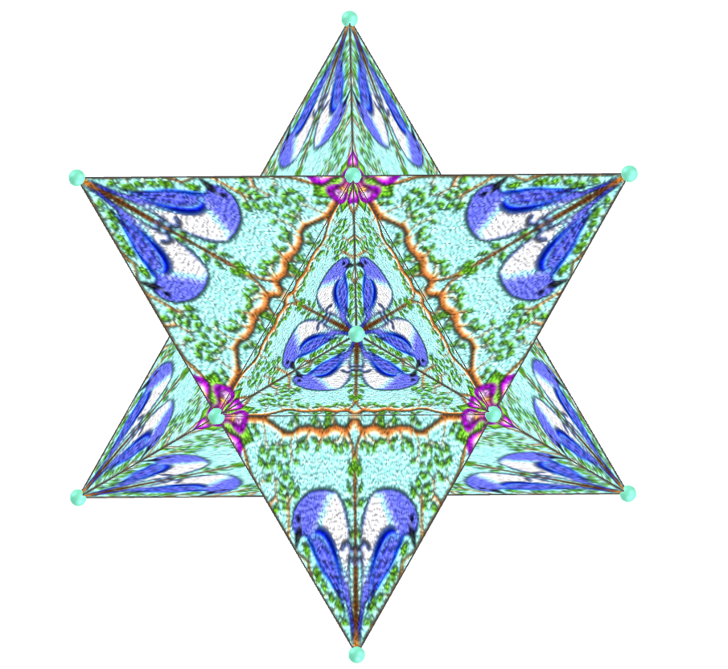</a>
  <b>descrição</b>: Tesselação de Barb Widen
  <b>tipo de tesselação</b>: quadrilateral e triangular
  <b>poliedros</b>: dodecaedro rômbico, dodecaedro 10-akis de Möbius, hexecontaedro rômbico, icosaedro hexakis de Möbius, octaedro, hexaedro tetrakis, triacontaedro rômbico, ortobicúpula quadrada, octaedro estrelado, tetraedro triakis
  

<h4>8. Tesselação de Alain Nicolas</h4>
<a href="../vr/Tessellation8.htm" target="_blank" title="modelo 3D" class="fotoA">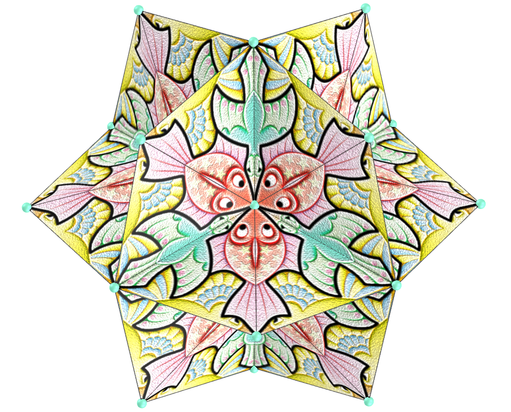</a>
  <b>descrição</b>: Tesselação de Alain Nicolas - Na praia 3
  <b>tipo de tesselação</b>: quadrilateral e triangular
  <b>poliedros</b>: octaedro hexakis de Möbius, sólido de Escher, tetraedro hexakis, deltaedro de Möbius, hexaedro octakis de Möbius, hexecontaedro deltoidal
  

<h4>9. Tesselação de Alain Nicolas</h4>
<a href="../vr/Tessellation9.htm" target="_blank" title="modelo 3D" class="fotoA">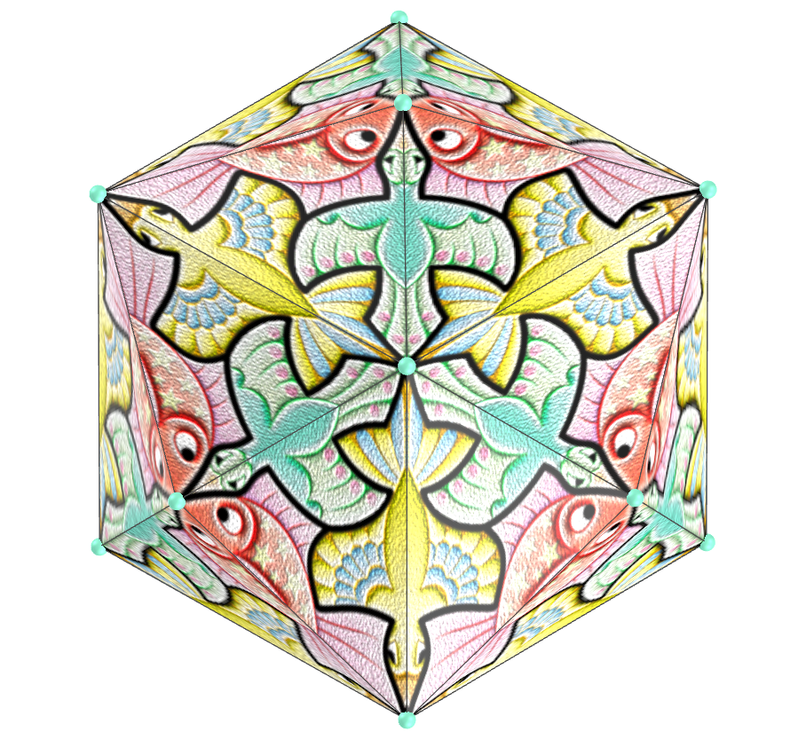</a>
  <b>descrição</b>: Tesselação de Alain Nicolas - Na praia 3
  <b>tipo de tesselação</b>: quadrilateral e triangular
  <b>poliedros</b>: dodecaedro rômbico, dodecaedro 10-akis de Möbius, hexecontaedro rômbico, icosaedro hexakis de Möbius, octaedro, hexaedro tetrakis
  

<h4>10. Tesselação de Alain Nicolas</h4>

  <b>descrição</b>: Alain Nicolas tessellation - Mosaico de terra, ar e água
  <b>tipo de tesselação</b>: quadrilateral e triangular
  <b>poliedros</b>: octaedro hexakis de Möbius, sólido de Escher, tetraedro hexakis de Möbius, deltaedro de Möbius, hexaedro octakis de Möbius, hexecontaedro deltoidal, icositetraedro deltoidal, cubo, cuboctaedro, octaedro triakis, icosaedro triakis
  

<a href="#p1" class="topo">voltar ao topo</a>

<h4>11. Tesselação de Alain Nicolas</h4>
<a href="../vr/Tessellation11.htm" target="_blank" title="modelo 3D" class="fotoA">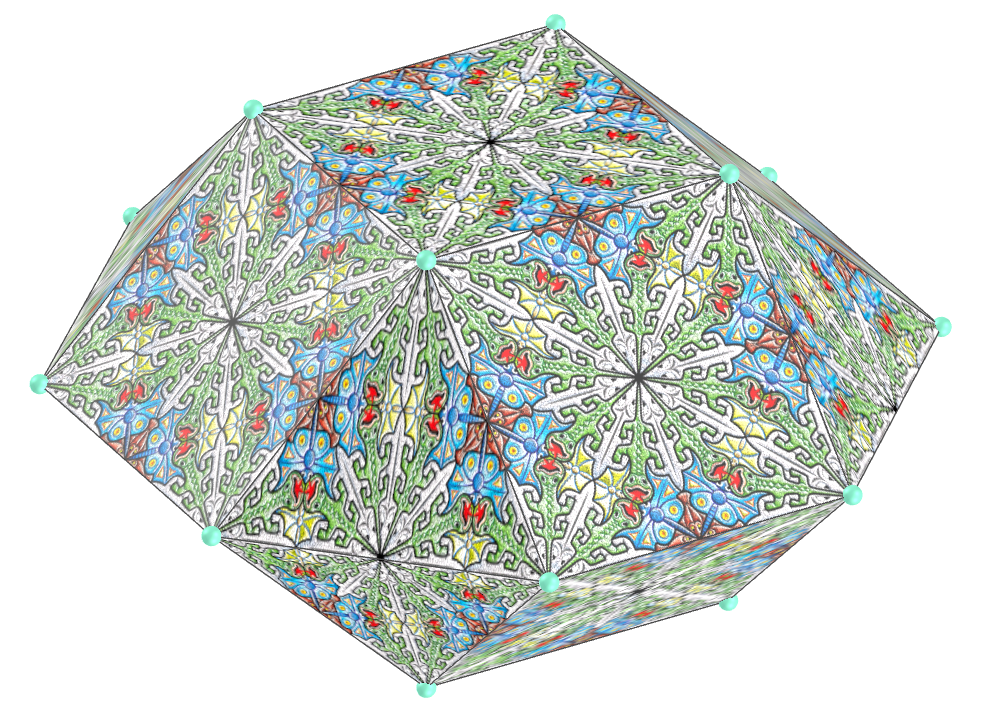</a>
  <b>descrição</b>: Alain Nicolas tessellation - Mosaico de terra, ar e água
  <b>tipo de tesselação</b>: quadrilateral e triangular
  <b>poliedros</b>: dodecaedro rômbico, dodecaedro 10-akis de Möbius, hexecontaedro rômbico, icosaedro hexakis de Möbius, octaedro, hexaedro tetrakis, triacontaedro rômbico, ortobicúpula quadrada, tetraedro triakis
  

<h4>12. Tesselação de Alain Nicolas</h4>
<a href="../vr/Tessellation12.htm" target="_blank" title="modelo 3D" class="fotoA">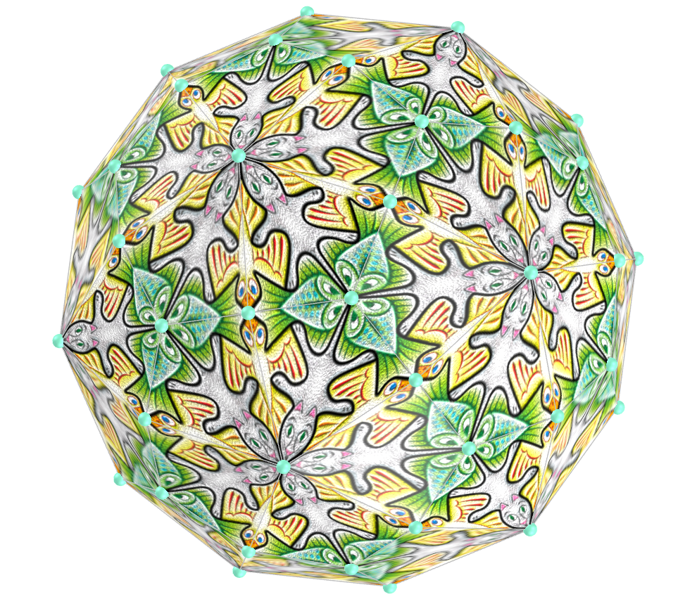</a>
  <b>descrição</b>: Tesselação de Alain Nicolas - Ar, terra e mar 1
  <b>tipo de tesselação</b>: quadrilateral e triangular
  <b>poliedros</b>: octaedro hexakis de Möbius, sólido de Escher, tetraedro hexakis, deltaedro de Möbius, hexaedro octakis de Möbius, hexecontaedro deltoidal
  

<h4>13. Tesselação de Alain Nicolas</h4>
<a href="../vr/Tessellation13.htm" target="_blank" title="modelo 3D" class="fotoA">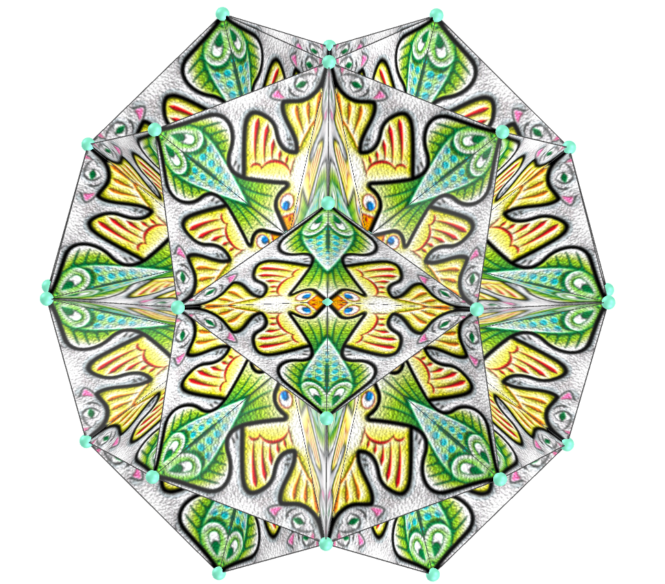</a>
  <b>descrição</b>: Tesselação de Alain Nicolas - Ar, terra e mar 1
  <b>tipo de tesselação</b>: quadrilateral e triangular
  <b>poliedros</b>: dodecaedro rômbico, dodecaedro 10-akis de Möbius, hexecontaedro rômbico, icosaedro hexakis de Möbius, octaedro, hexaedro tetrakis
  

<h4>14. Tesselação de Alain Nicolas</h4>
<a href="../vr/Tessellation14.htm" target="_blank" title="modelo 3D" class="fotoA">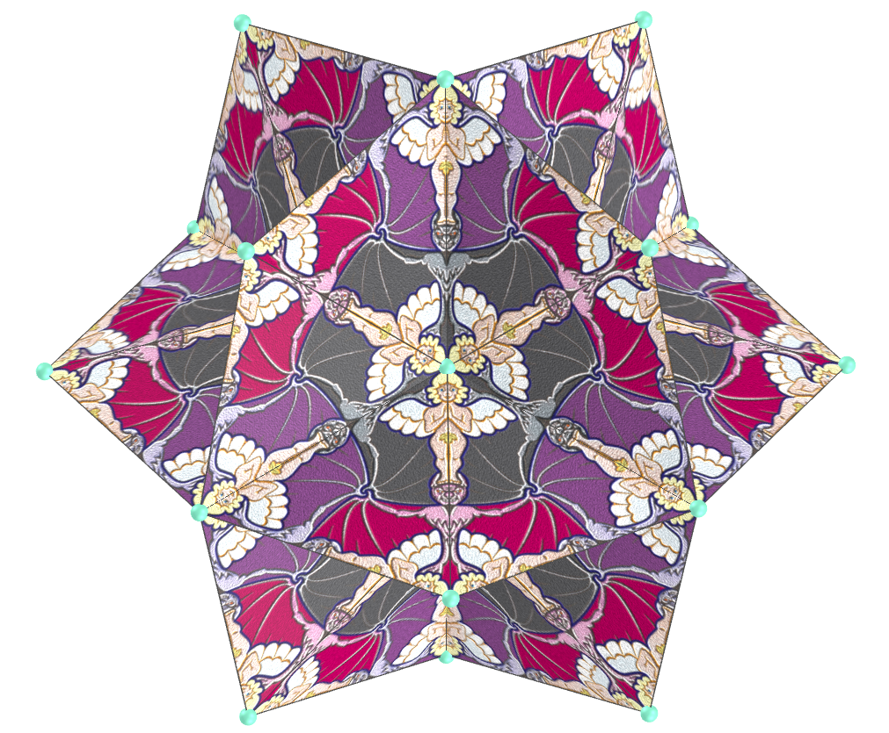</a>
  <b>descrição</b>: Tesselação de Alain Nicolas - Querubins e demônios
  <b>tipo de tesselação</b>: quadrilateral e triangular
  <b>poliedros</b>: octaedro hexaédrico de Möbius, dodecaedro 10-akis de Möbius, sólido de Escher, tetraedro hexakis, icosaedro hexakis de Möbius, octaedro, deltaedro de Möbius, hexaedro octakis de Möbius, hexaedro tetrakis
    

<h4>15. Tesselação de Alain Nicolas</h4>
<a href="../vr/Tessellation15.htm" target="_blank" title="modelo 3D" class="fotoA">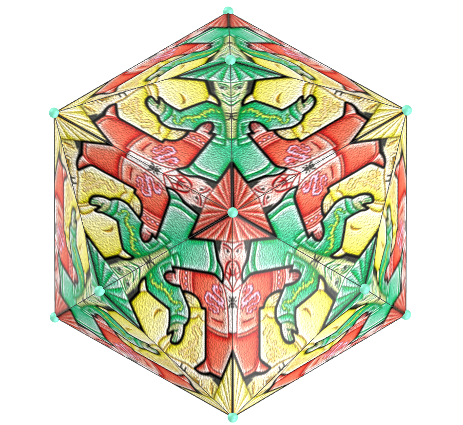</a>
  <b>descrição</b>: Tesselação de Alain Nicolas - Três chineses
  <b>tipo de tesselação</b>: quadrilateral e triangular
  <b>poliedros</b>: octaedro hexakis de Möbius, dodecaedro 10-akis de Möbius, sólido de Escher, tetraedro hexakia, icosaedro hexakis de Möbius, octaedro, deltaedro de Möbius, hexaedro octakis de Möbius, hexaedro tetrakis, dodecaedro rômbico
  

<h4>16. Tesselação de Alain Nicolas</h4>
<a href="../vr/Tessellation16.htm" target="_blank" title="modelo 3D" class="fotoA">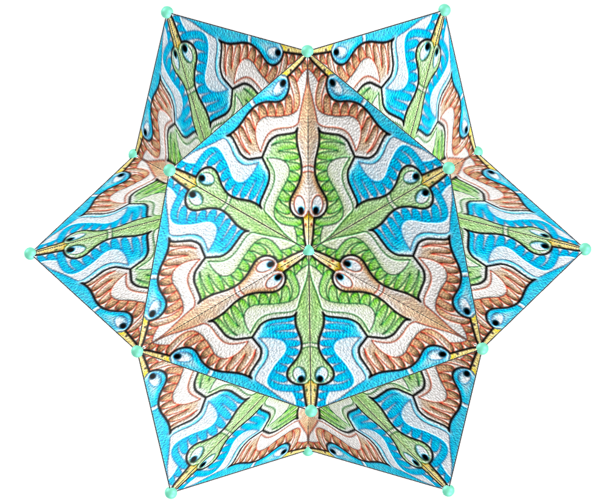</a>
  <b>descrição</b>: Tesselação de Alain Nicolas - Pato 120&ordm;
  <b>tipo de tesselação</b>: quadrilateral e triangular
  <b>poliedros</b>: octaedro hexakis de Möbius, sólido de Escher, tetraedro hexakis, deltaedro de Möbius, hexaedro octakis de Möbius, hexecontaedro deltoidal
  

<h4>17. Tesselação de Alain Nicolas</h4>
<a href="../vr/Tessellation17.htm" target="_blank" title="modelo 3D" class="fotoA">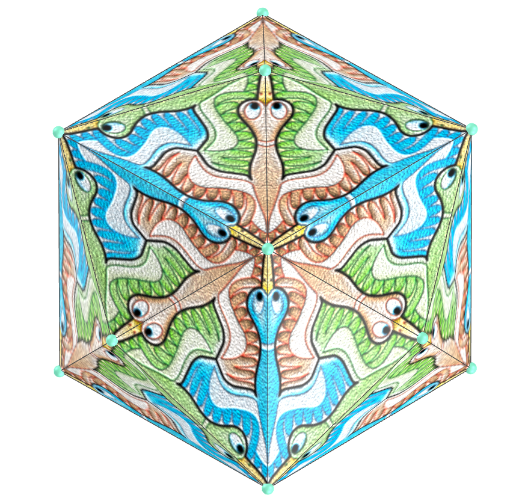</a>
  <b>descrição</b>: Tesselação de Alain Nicolas - Pato 120&ordm;
  <b>tipo de tesselação</b>: quadrilateral e triangular
  <b>poliedros</b>: dodecaedro rômbico, dodecaedro 10-akis de Möbius, hexecontaedro rômbico, icosaedro hexakis de Möbius, octaedro, hexaedro tetrakis
  

<h4>18. Tesselação de Alain Nicolas</h4>
<a href="../vr/Tessellation18.htm" target="_blank" title="modelo 3D" class="fotoA">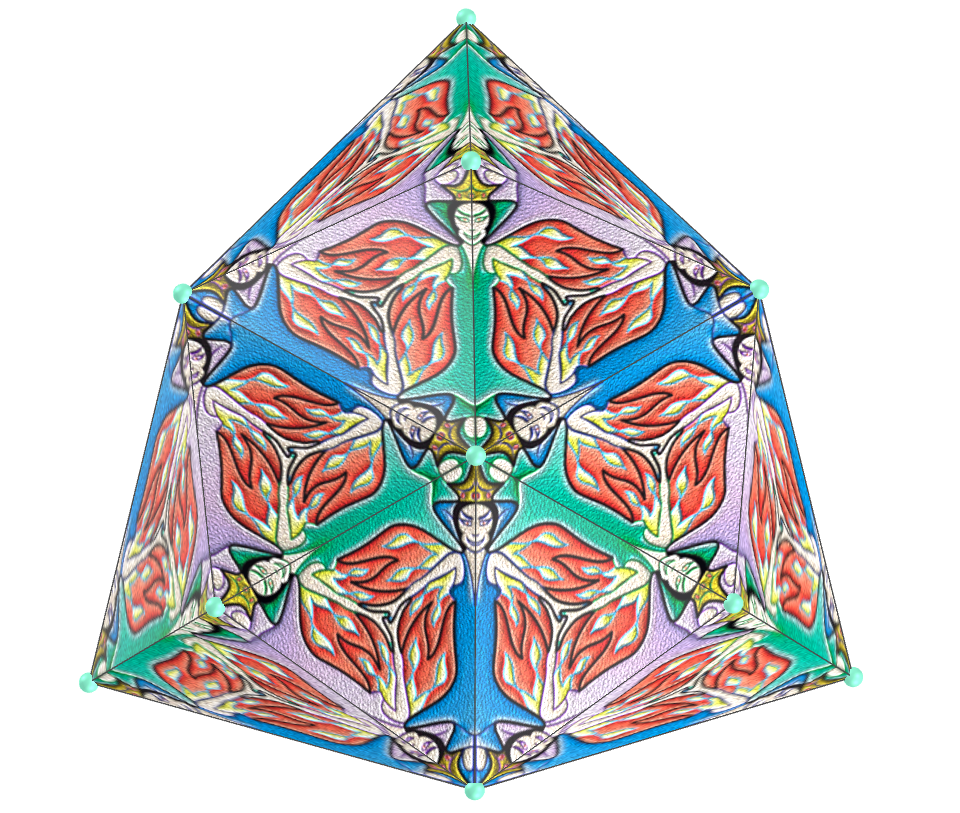</a>
  <b>descrição</b>: Tesselação de Alain Nicolas - Rainha do fogo
  <b>tipo de tesselação</b>: triangular e quadrilateral
  <b>poliedros</b>: octaedro hexakis de Möbius, dodecaedro 10-akis de Möbius, sólido de Escher, tetraedro hexakis, icosaedro hexakis de Möbius, octaedro, deltaedro de Möbius, hexaedro octakis de Möbius, hexaedro tetrakis
  

<h4>19. Tesselação de Alain Nicolas</h4>
<a href="../vr/Tessellation19.htm" target="_blank" title="modelo 3D" class="fotoA">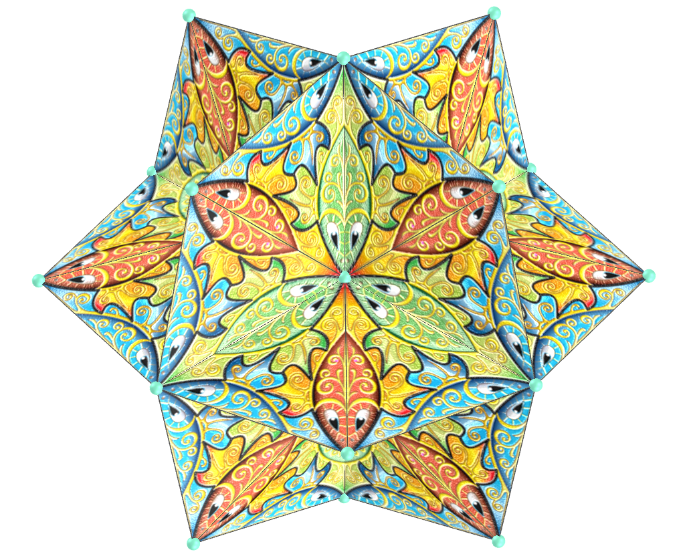</a>
  <b>descrição</b>: Tesselação de Alain Nicolas - Peixe real
  <b>tipo de tesselação</b>: quadrilateral and triangular
  <b>poliedros</b>: octaedro hexakis de Möbius, dodecaedro 10-akis de Möbius, sólido de Escher, tetraedro hexakis, icosaedro hexakis de Möbius, octaedro, deltaedro de Möbius, hexaedro octakis de Möbius, hexaedro tetrakis
  

<h4>20. Tesselação de Alain Nicolas</h4>
<a href="../vr/Tessellation20.htm" target="_blank" title="modelo 3D" class="fotoA">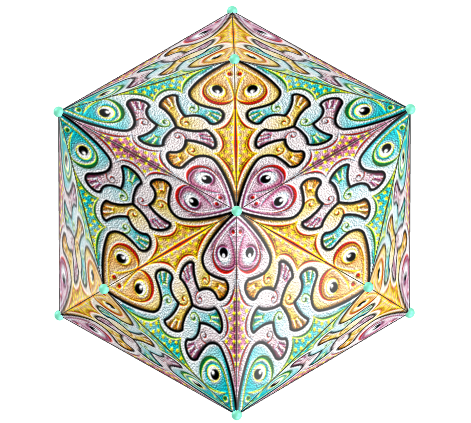</a>
  <b>descrição</b>: Tesselação de Alain Nicolas - Percevejo
  <b>tipo de tesselação</b>: quadrilateral and triangular
  <b>poliedros</b>: dodecaedro rômbico, dodecaedro 10-akis de Möbius, hexecontaedro rômbico, icosaedro hexakis de Möbius, deltaedro de Möbius, hexaedro tetrakis
  

<a href="#p1" class="topo">voltar ao topo</a>

<h4>21. Tesselação de Alain Nicolas</h4>
<a href="../vr/Tessellation21.htm" target="_blank" title="modelo 3D" class="fotoA">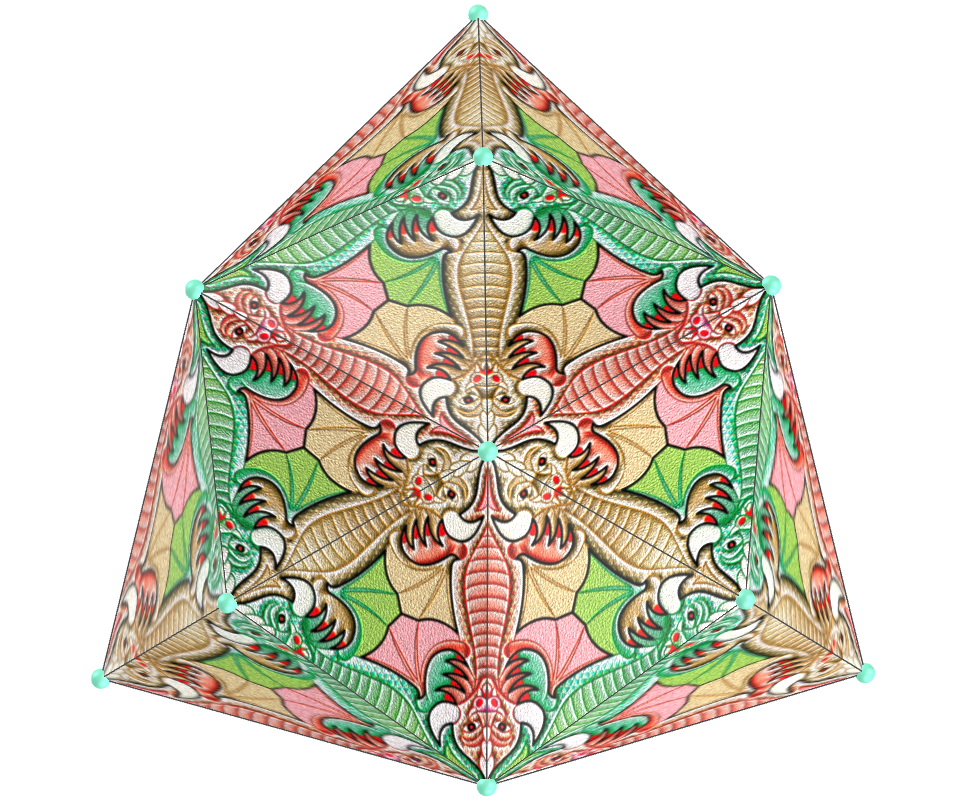</a>
  <b>descrição</b>: Tesselação de Alain Nicolas - Pequeno dragão
  <b>tipo de tesselação</b>: triangular e quadrilateral
  <b>poliedros</b>: octaedro hexakis de Möbius, sólido de Escher, tetraedro hexakis, deltaedro de Möbius, hexaedro octakis de Möbius, hexecontaedro deltoidal
  

<h4>22. Tesselação de Alain Nicolas</h4>
<a href="../vr/Tessellation22.htm" target="_blank" title="modelo 3D" class="fotoA">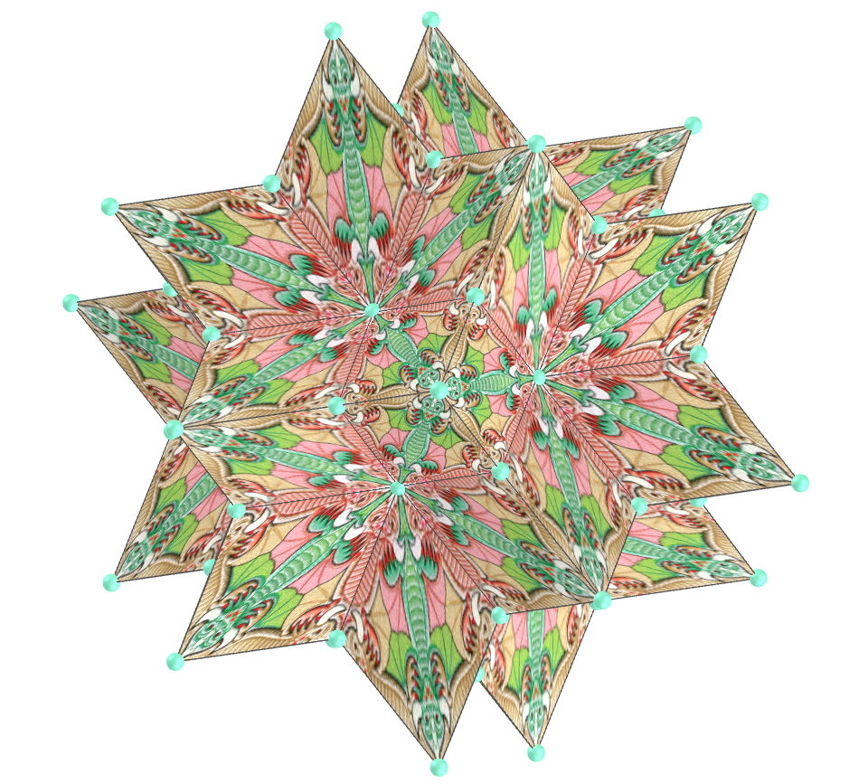</a>
  <b>descrição</b>: Tesselação de Alain Nicolas - Pequeno dragão
  <b>tipo de tesselação</b>: triangular e quadrilateral
  <b>poliedros</b>: dodecaedro rômbico, dodecaedro 10-akis de Möbius, hexecontaedro rômbico, icosaedro hexakis de Möbius, octaedro, hexaedro tetrakis
  

<h4>23. Tesselação de Alain Nicolas</h4>
<a href="../vr/Tessellation23.htm" target="_blank" title="modelo 3D" class="fotoA">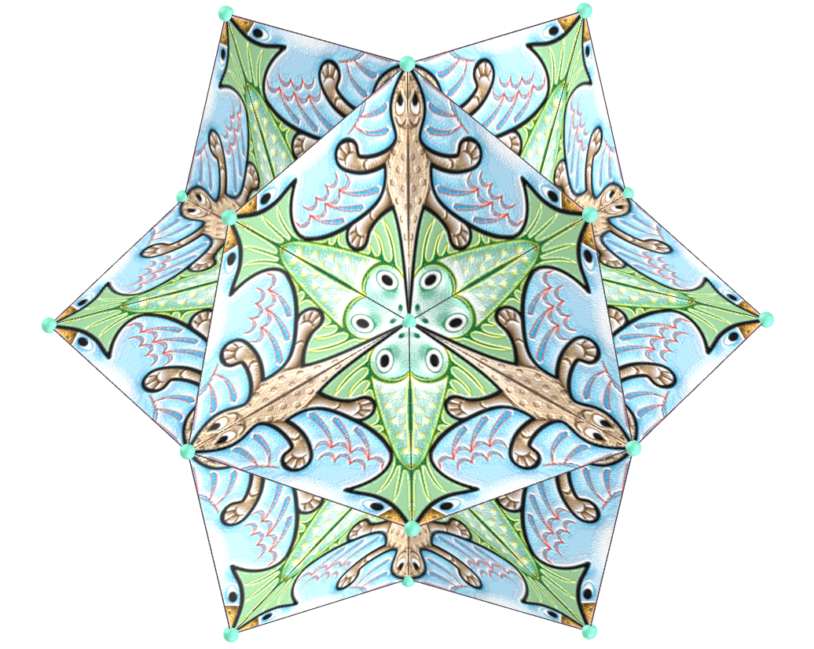</a>
  <b>descrição</b>: Tesselação de Alain Nicolas - Ar, terra e mar 2
  <b>tipo de tesselação</b>: triangular e quadrilateral
  <b>poliedros</b>: octaedro hexakis de Möbius, sólido de Escher, tetraedro hexakis, deltaedro de Möbius, hexaedro octakis de Möbius, hexecontaedro deltoidal
  

<h4>24. Tesselação de Alain Nicolas</h4>
<a href="../vr/Tessellation24.htm" target="_blank" title="modelo 3D" class="fotoA">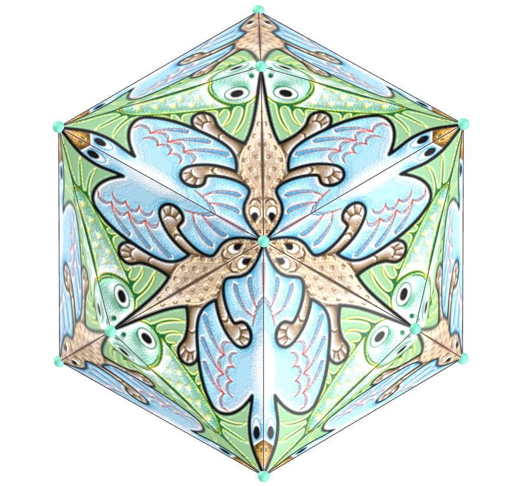</a>
  <b>descrição</b>: Tesselação de Alain Nicolas - Ar, terra e mar 2
  <b>tipo de tesselação</b>: triangular e quadrilateral
  <b>poliedros</b>: dodecaedro rômbico, dodecaedro 10-akis de Möbius, hexecontaedro rômbico, icosaedro hexakis de Möbius, octaedro, hexaedro tetrakis
  

<h4>25. Tesselação de Alain Nicolas</h4>

  <b>descrição</b>: Tesselação de Alain Nicolas - 9 narizes de lagartos
  <b>tipo de tesselação</b>: triangular e quadrilateral
  <b>poliedros</b>: octaedro hexakis de Möbius, sólido de Escher, tetraedro hexakis, deltaedro de Möbius, hexaedro octakis de Möbius, hexecontaedro deltoidal
  

<h4>26. Tesselação de Alain Nicolas</h4>
<a href="../vr/Tessellation26.htm" target="_blank" title="modelo 3D" class="fotoA">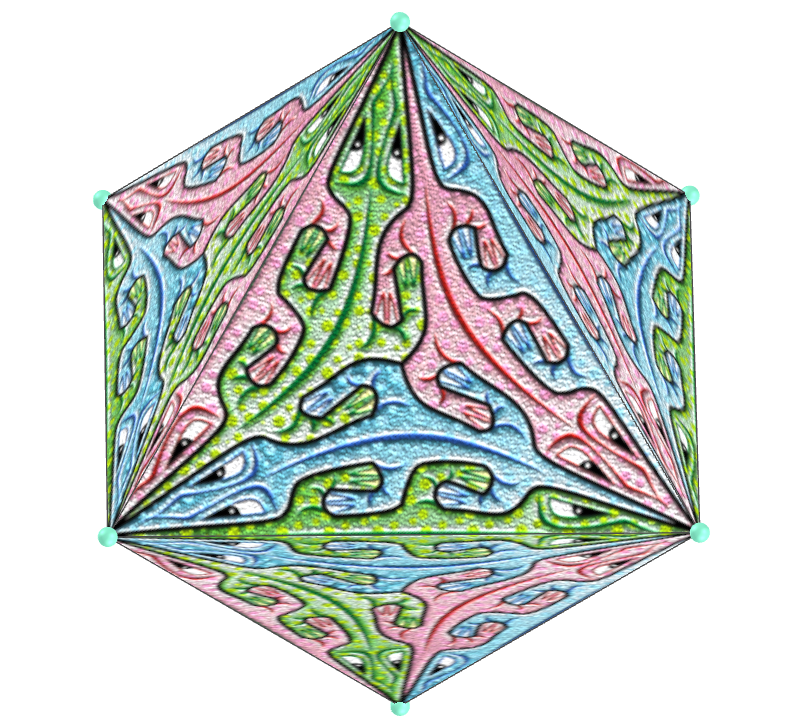</a>
  <b>descrição</b>: Tesselação de Alain Nicolas - 9 narizes de lagartos
  <b>tipo de tesselação</b>: triangular e quadrilateral
  <b>poliedros</b>: dodecaedro rômbico, dodecaedro 10-akis de Möbius, hexecontaedro rômbico, icosaedro hexakis de Möbius, octaedro, hexaedro tetrakis
  

<h4>27. Tesselação de Alain Nicolas</h4>
<a href="../vr/Tessellation27.htm" target="_blank" title="modelo 3D" class="fotoA">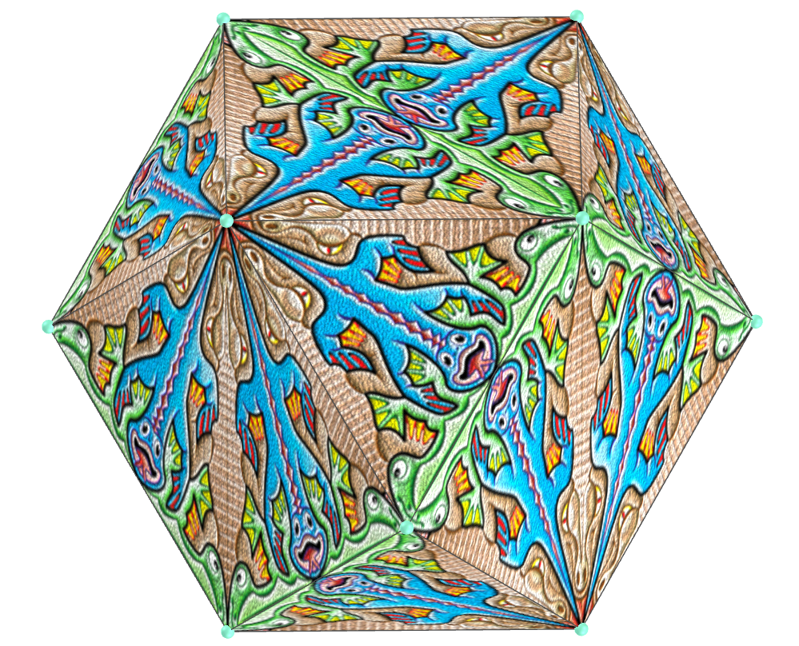</a>
  <b>descrição</b>: Tesselação de Alain Nicolas - Monstros
  <b>tipo de tesselação</b>: triangular e quadrilateral
  <b>poliedros</b>: octaedro hexakis de Möbius, sólido de Escher, tetraedro hexakis, deltaedro de Möbius, hexaedro octakis de Möbius, hexecontaedro deltoidal, cuboctaedro
  

<h4>28. Tesselação de Alain Nicolas</h4>

  <b>descrição</b>: Tesselação de Alain Nicolas - Monstros
  <b>tipo de tesselação</b>: triangular e quadrilateral
  <b>poliedros</b>: dodecaedro rômbico, dodecaedro 10-akis de Möbius, hexecontaedro rômbico, icosaedro hexakis de Möbius, octaedro, hexaedro tetrakis
  

<h4>29. Tesselação de Alain Nicolas</h4>
<a href="../vr/Tessellation29.htm" target="_blank" title="modelo 3D" class="fotoA">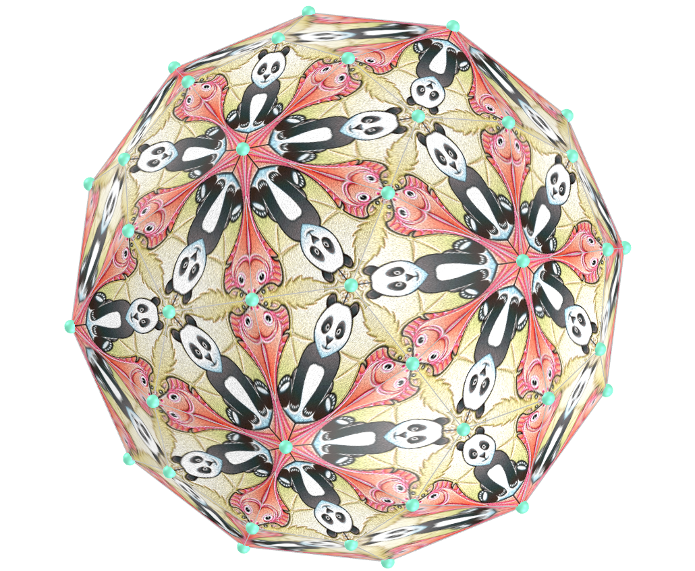</a>
  <b>descrição</b>: Tesselação de Alain Nicolas - Panda, morcego e peixe
  <b>tipo de tesselação</b>: triangular e quadrilateral
  <b>poliedros</b>: octaedro hexakis de Möbius, sólido de Escher, tetraedro hexakis, deltaedro de Möbius, hexaedro octakis de Möbius, hexecontaedro deltoidal
  

<h4>30. Tesselação de Alain Nicolas</h4>
<a href="../vr/Tessellation30.htm" target="_blank" title="modelo 3D" class="fotoA">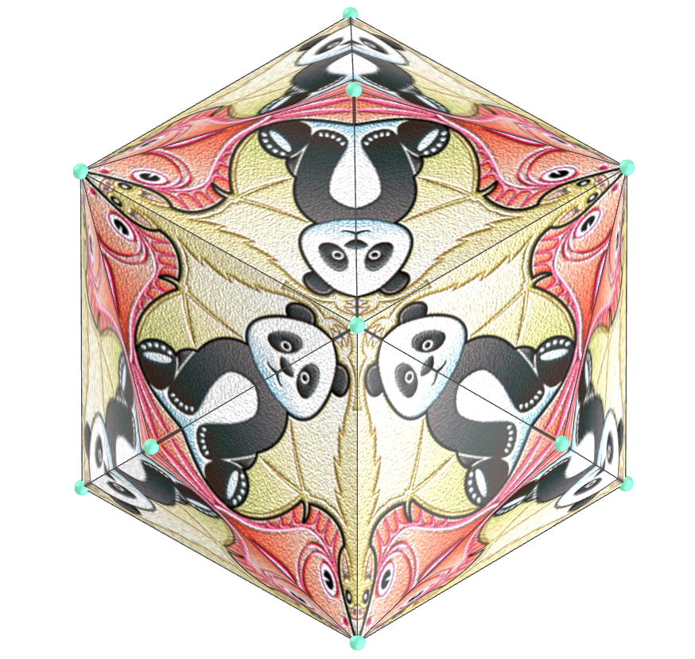</a>
  <b>descrição</b>: Tesselação de Alain Nicolas - Panda, morcego e peixe
  <b>tipo de tesselação</b>: triangular e quadrilateral
  <b>poliedros</b>: dodecaedro rômbico, dodecaedro 10-akis de Möbius, hexecontaedro rômbico, icosaedro hexakis de Möbius, octaedro, hexaedro tetrakis
  

<a href="#p1" class="topo">voltar ao topo</a>

<h4>31. Tesselação de Alain Nicolas</h4>

  <b>descrição</b>: Tesselação de Alain Nicolas - Na praia 2
  <b>tipo de tesselação</b>: triangular e quadrilateral
  <b>poliedros</b>: octaedro hexakis de Möbius, sólido de Escher, tetraedro hexakis, deltaedro de Möbius, hexaedro octakis de Möbius, hexecontaedro deltoidal
  

<h4>32. Tesselação de Alain Nicolas</h4>
<a href="../vr/Tessellation32.htm" target="_blank" title="modelo 3D" class="fotoA">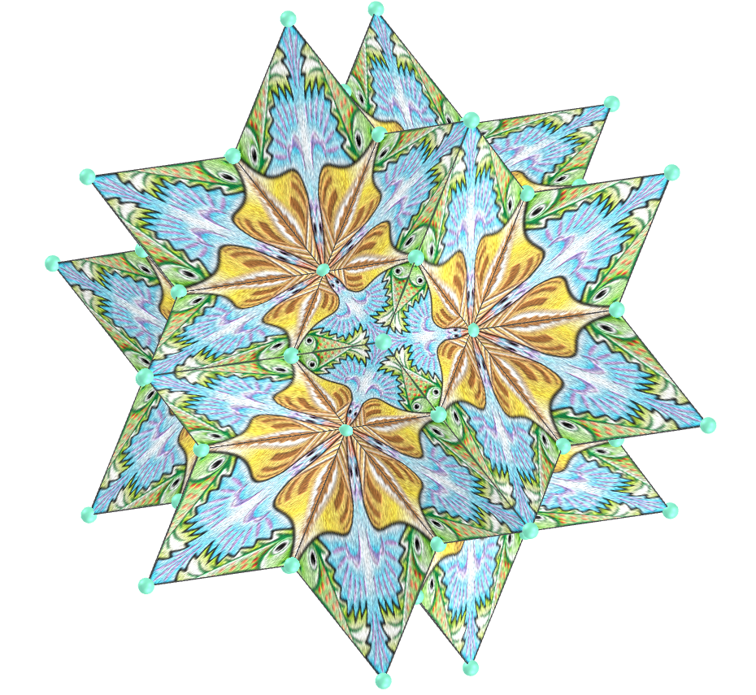</a>
  <b>descrição</b>: Tesselação de Alain Nicolas - Na praia 2
  <b>tipo de tesselação</b>: triangular e quadrilateral
  <b>poliedros</b>: dodecaedro rômbico, dodecaedro 10-akis de Möbius, hexecontaedro rômbico, icosaedro hexakis de Möbius, octaedro, hexaedro tetrakis
  

<h4>33. Tesselação de Alain Nicolas</h4>
<a href="../vr/Tessellation33.htm" target="_blank" title="modelo 3D" class="fotoA">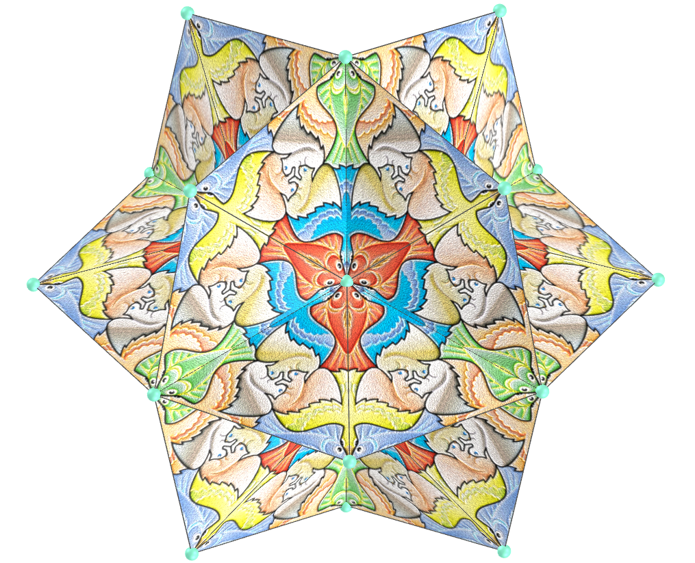</a>
  <b>descrição</b>: Tesselação de Alain Nicolas - Esquilo, pássaro e peixe
  <b>tipo de tesselação</b>: triangular e quadrilateral
  <b>poliedros</b>: octaedro hexakis de Möbius, sólido de Escher, tetraedro hexakis, deltaedro de Möbius, hexaedro octakis de Möbius, hexecontaedro deltoidal
  

<h4>34. Tesselação de Alain Nicolas</h4>
<a href="../vr/Tessellation34.htm" target="_blank" title="modelo 3D" class="fotoA">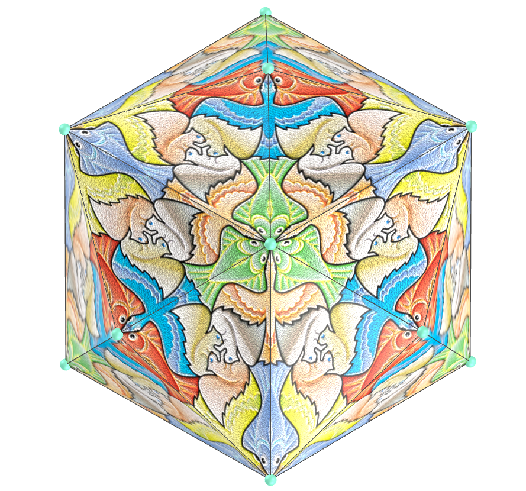</a>
  <b>descrição</b>: Tesselação de Alain Nicolas - Esquilo, pássaro e peixe
  <b>tipo de tesselação</b>: triangular e quadrilateral
  <b>poliedros</b>: dodecaedro rômbico, dodecaedro 10-akis de Möbius, hexecontaedro rômbico, icosaedro hexakis de Möbius, octaedro, hexaedro tetrakis
  

<h4>35. Tesselação de Alain Nicolas</h4>
<a href="../vr/Tessellation35.htm" target="_blank" title="modelo 3D" class="fotoA">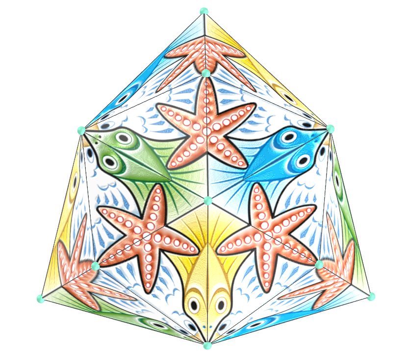</a>
  <b>descrição</b>: Tesselação de Alain Nicolas - Na praia 1
  <b>tipo de tesselação</b>: triangular e quadrilateral
  <b>poliedros</b>: octaedro hexakis de Möbius, dodecaedro 10-akis de Möbius, sólido de Escher, tetraedro hexakis, icosaedro hexakis de Möbius, octaedro, deltaedro de Möbius, hexaedro octakis de Möbius, hexaedro tetrakis, dodecaedro rômbico
  

<h4>36. Tesselação de Francine Champagne</h4>
<a href="../vr/Tessellation36.htm" target="_blank" title="modelo 3D" class="fotoA">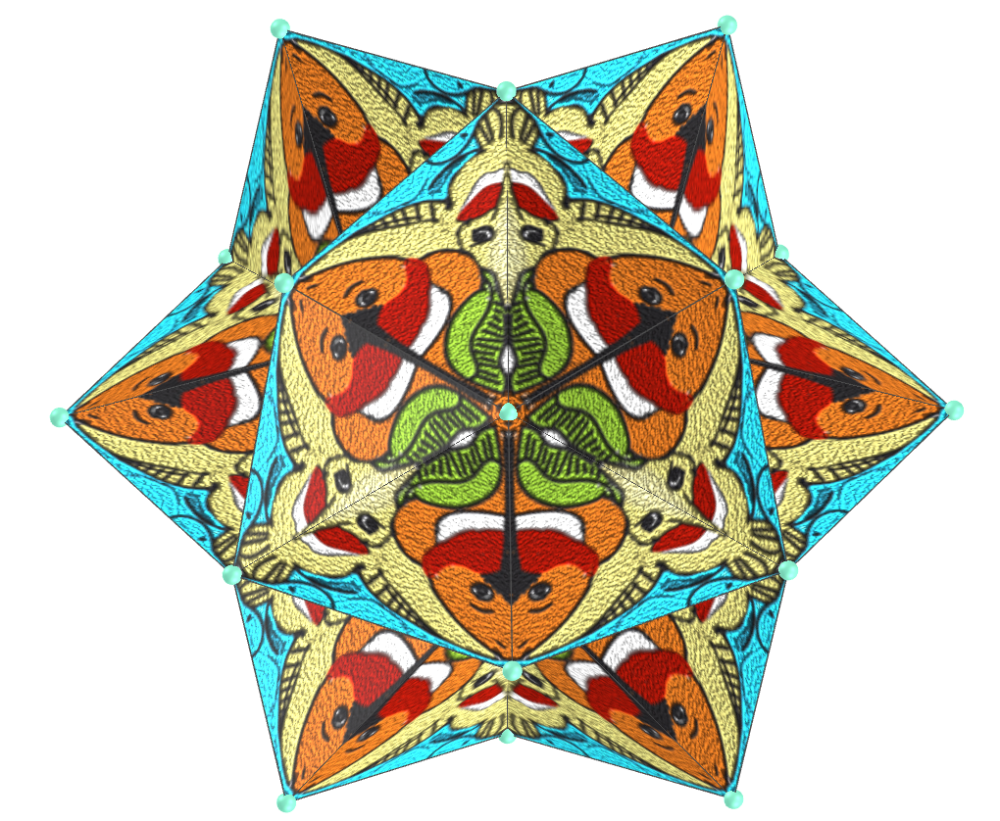</a>
  <b>descrição</b>: Obra de 2014 - Tesselação de beija-flor no grupo de simetria P4m
  <b>tipo de tesselação</b>: triangular
  <b>poliedros</b>: octaedro hexakis de Möbius, dodecaedro 10-akis de Möbius, sólido de Escher, tetraedro hexakis, icosaedro hexakis de Möbius, octaedro, deltaedro de Möbius, hexaedro octakis de Möbius, hexaedro tetrakis
  

<h4>37. Tesselação de Alain Nicolas</h4>
<a href="../vr/Tessellation37.htm" target="_blank" title="modelo 3D" class="fotoA">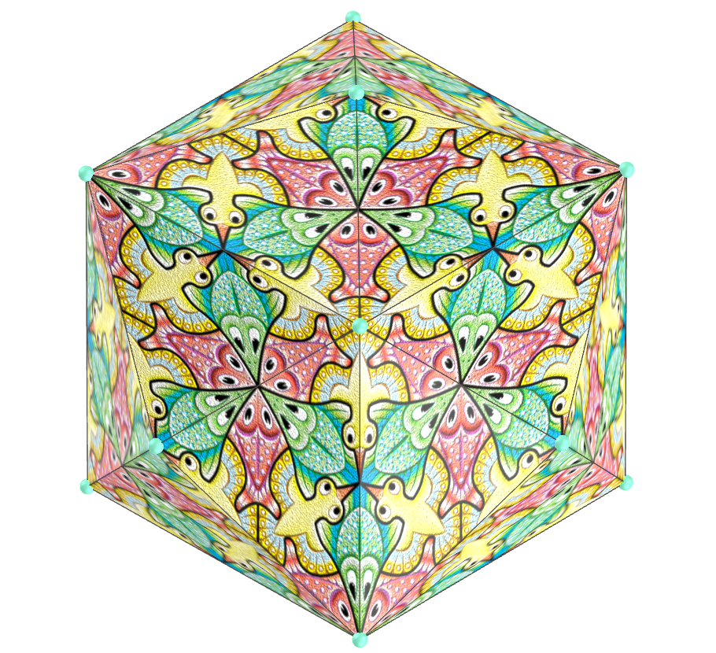</a>
  <b>descrição</b>: Tesselação de Alain Nicolas - Na praia 3
  <b>tipo de tesselação</b>: triangular
  <b>poliedros</b>: octaedro hexakis de Möbius, dodecaedro 10-akis de Möbius, sólido de Escher, tetraedro hexakis, icosaedro hexakis de Möbius, octaedro, deltaedro de Möbius, hexaedro octakis de Möbius, hexaedro tetrakis
  

<h4>38. Tesselação de Massimo Rana</h4>
<a href="../vr/Tessellation38.htm" target="_blank" title="modelo 3D" class="fotoA">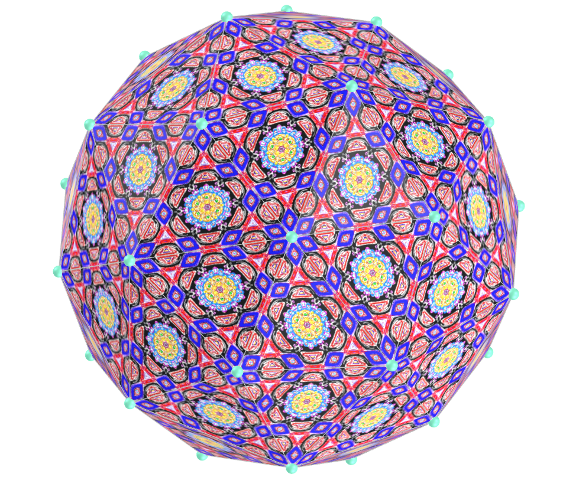</a>
  <b>descrição</b>: Tesselação de Massimo Rana
  <b>tipo de tesselação</b>: triangular
  <b>poliedros</b>: icosaedro, grande icosaedro, sólido de Escher, tetraedro hexakis, disfenóide snub, deltaedro de Möbius, octaedro, octaedro hexakis de Möbius, dodecaedro pentakis
  

<h4>39. Tesselação de  Massimo Rana</h4>
<a href="../vr/Tessellation39.htm" target="_blank" title="modelo 3D" class="fotoA">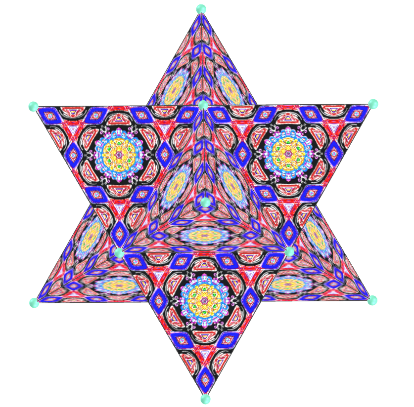</a>
  <b>descrição</b>: Tesselação de Massimo Rana
  <b>tipo de tesselação</b>: triangular
  <b>poliedros</b>: icosaedro hexakis de Möbius, dipirâmide pentagonal, hexaedro octakis de Möbius, dodecaedro 10-akis de Möbius, octaedro estrelado, tetraedro, hexaedro tetrakis
  

<a href="#p1" class="topo">voltar ao topo</a>

  Tessellation - part 2: polyhedra tessellation and visualization with Virtual Reality de <a xmlns:cc="http://creativecommons.org/ns#" href="https://paulohscwb.github.io/tessellation/part2/pt-br/" property="cc:attributionName" rel="cc:attributionURL">Paulo Henrique Siqueira</a> está licenciado com uma Licença <a rel="license" href="http://creativecommons.org/licenses/by-nc-nd/4.0/">Creative Commons Atribuição-NãoComercial-SemDerivações 4.0 Internacional</a>.

<h4>Como citar este trabalho:</h4> 

Siqueira, P.H., "Tessellation - part 2: polyhedra tessellation and visualization with Virtual Reality". Disponível em: <https://paulohscwb.github.io/tessellation/part2/pt-br/>, Maio de 2025.

<!---->
  <b>Referências:</b>
 Weisstein, Eric W. "Tessellation." From MathWorld--A Wolfram Web Resource. <a href="https://mathworld.wolfram.com/Tessellation.html" target="_blank"> https://mathworld.wolfram.com/Tessellation.html</a>
 Mohr, R. "Tiled Art" <a href="https://tiled.art/en/home" target="_blank">https://tiled.art/en/home</a> 
 McCooey, D. I. "Visual Polyhedra". <a href="http://dmccooey.com/polyhedra/" target="_blank">http://dmccooey.com/polyhedra/</a>
