<link rel="stylesheet" href="../scripts/style.css">
<meta charset="utf-8">
<link rel="icon" type="image/png" href="vr/salas/imagens/icone.png">
<h2>Visualization of Polyhedra tessellation with Virtual Reality (VR) in A-frame</h2>
 <b>author:</b> Paulo Henrique Siqueira - Universidade Federal do Paraná
  <b>contact:</b> <a href="#">paulohscwb@gmail.com</a>
  <a href="https://paulohscwb.github.io/tessellation/part4/pt-br/">versão em português</a>
 <form style="margin: 0 auto; float:right; text-align:right; width:100%; margin-bottom:15px;">
	<select id="url" onchange="urlHandler(this.value)" style="color:royalblue;">
		<option disabled selected value>More solids:</option>
		<option value="../escher/">Escher's Works</option>
		<option value="../part2/">Tessellation 2</option>
		<option value="../part3/">Tessellation 3</option>
		<option disabled value="../part4/">Tessellation 4</option>
		<!--<option value="../part5/">Tessellation 5</option>
		<option value="../part6/">Tessellation 6</option>
		<option value="../part7/">Tessellation 7</option>
		<option value="../part8/">Tessellation 8</option>
		<option value="../part9/">Tessellation 9</option>
		<option value="../part10/">Tessellation 10</option>
		<option value="../part11/">Tessellation 11</option>-->
	</select>
</form>

  <h2 align="center"> Tessellation - part 4</h2>
The figures or works that are chosen as tesserae cover or pave the plane or a surface. The result is called tessellation, tiling, paving or mosaic. 
Tessellations have been used since ancient times in floors, walls, carpets and other objects.
 This work shows the tessellations made on all or some faces of polyhedrons, taking advantage of triangular, square, pentagonal or hexagonal symmetries of the faces of these solids.
 On this page, we have some tessellation works by Francine Champagne, Velirina, Vibali, Eye-Psy, Igor Golieniev, GDJ, Misbah Rani and Gordon Dylan Johnson, inserted into the faces of common polyhedrons, such as the Platonic tetrahedron, cube or icosahedron, as well as rarer polyhedrons, such as the Johnson solids.

<a href="#m3d">3D Models</a>&nbsp;&nbsp;|&nbsp;&nbsp;<a href="../">Home</a>

 

 

<h3 id="m3d" align="center">3D models</h3>
<!--<iframe width="560" height="315" style="max-width:100%" src="https://www.youtube.com/embed/videoseries?list=PLy0I_lGW8HxWaYGTOc9cCw0xOPHUW1yFS" title="YouTube video player" frameborder="0" allow="accelerometer; autoplay; clipboard-write; encrypted-media; gyroscope; picture-in-picture; web-share" allowfullscreen></iframe>-->
<h4>1. Velirina tessellation</h4>
<a href="vr/Tessellation1a.htm" target="_blank" title="3D model" class="fotoA">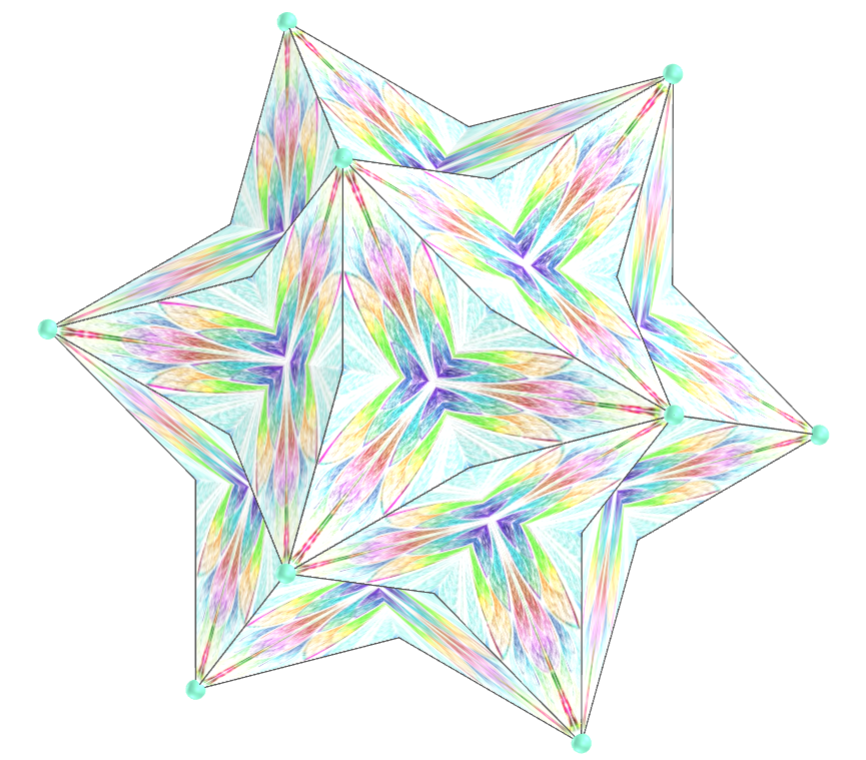</a>
  <b>description</b>: Velirina tessellation
  <b>tessellation type</b>: triangular and quadrilateral
  <b>polyhedra</b>: Möbius hexakis octahedron, Escher solid, hexakis tetrahedron, Möbius deltahedron, Möbius octakis hexahedron, Deltoidal hexecontahedron, Deltoidal icositetrahedron, Cube, Medial Rhombic Triacontahedron, Small Dodecacronic Hexecontahedron, Great Ditrigonal Dodecacronic Hexecontahedron, Triakis Icosahedron
  

<h4>2. Velirina tessellation</h4>

  <b>description</b>: Velirina tessellation
  <b>tessellation type</b>: triangular and quadrilateral
  <b>polyhedra</b>: Rhombic dodecahedron, Möbius 10-akis dodecahedron, Rhombic hexecontahedron, Möbius hexakis icosahedron, Octahedron, Tetrakis hexahedron, Rhombic triacontahedron, Pentagonal dipyramid, Medial Deltoidal Hexecontahedron, Small Icosacronic Hexecontahedron, Great Rhombic Triacontahedron, Triakis Octahedron
  

<h4>3. GDJ tessellation</h4>

  <b>description</b>: GDJ tessellation
  <b>tessellation type</b>: pentagonal
  <b>polyhedra</b>: Pentagonal icositetrahedron, Tetartoid, Pentagonal hexecontahedron, Dodecahedron, Great Dodecahedron, Small Stellated Dodecahedron, Great Stellated Dodecahedron, Small Ditrigonal Icosidodecahedron, Ditrigonal Dodecadodecahedron, Snub Icosidodecadodecahedron, Great Ditrigonal Dodecicosidodecahedron
  

<h4>4. GDJ tessellation</h4>
<a href="vr/Tessellation2b.htm" target="_blank" title="3D model" class="fotoA">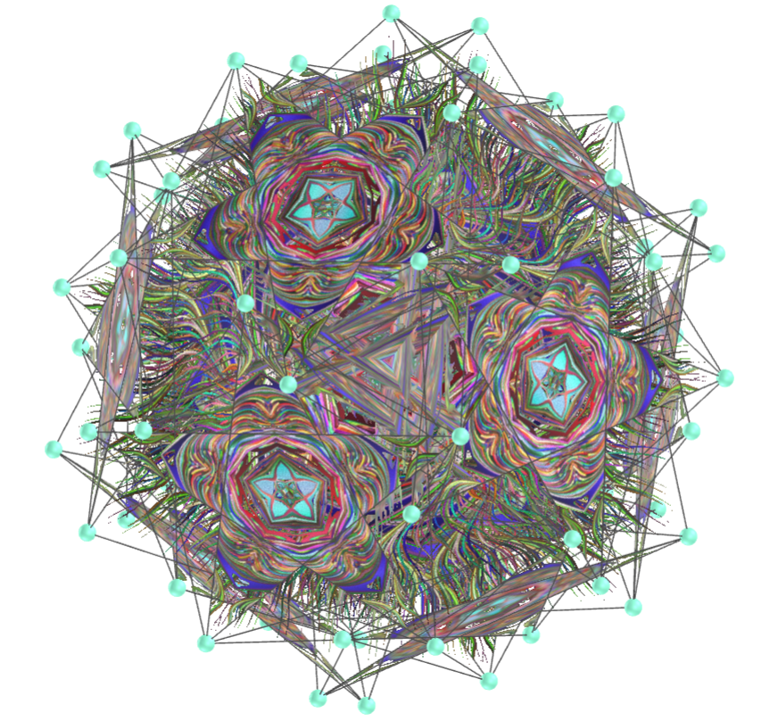</a>
  <b>description</b>: GDJ tessellation
  <b>tessellation type</b>: pentagonal
  <b>polyhedra</b>: Snub Dodecadodecahedron, Medial Pentagonal Hexecontahedron, Dodecadodecahedron, Great Ditrigonal Icosidodecahedron, Great Icosidodecahedron, Icosidodecadodecahedron, Inverted Snub Dodecadodecahedron, Great Pentagonal Hexecontahedron, Great Inverted Pentagonal Hexecontahedron
  

<h4>5. Square and triangle tessellationn</h4>

  <b>description</b>: Square and triangle tessellation
  <b>tessellation type</b>: triangular and quadrilateral
  <b>polyhedra</b>: Inverted Snub Dodecadodecahedron, Snub Icosidodecadodecahedron, Small Ditrigonal Icosidodecahedron, Uniform Great Rhombicuboctahedron, Great Ditrigonal Dodecacronic Hexecontahedron, Medial Deltoidal Hexecontahedron, Great Hexacronic Icositetrahedron
  

<h4>6. Square and triangle tessellation</h4>

  <b>description</b>: Square and triangle tessellation
  <b>tessellation type</b>: triangular and quadrilateral
  <b>polyhedra</b>: Great Dirhombicosidodecahedron, Rhombicuboctahedron, Great Snub Dodecicosidodecahedron, Tetrahemihexahedron, Great Dodecacronic Hexecontahedron, Medial Rhombic Triacontahedron, Small Dodecacronic Hexecontahedron
  

<h4>7. Square and triangle tessellation</h4>
<a href="vr/Tessellation3c.htm" target="_blank" title="3D model" class="fotoA">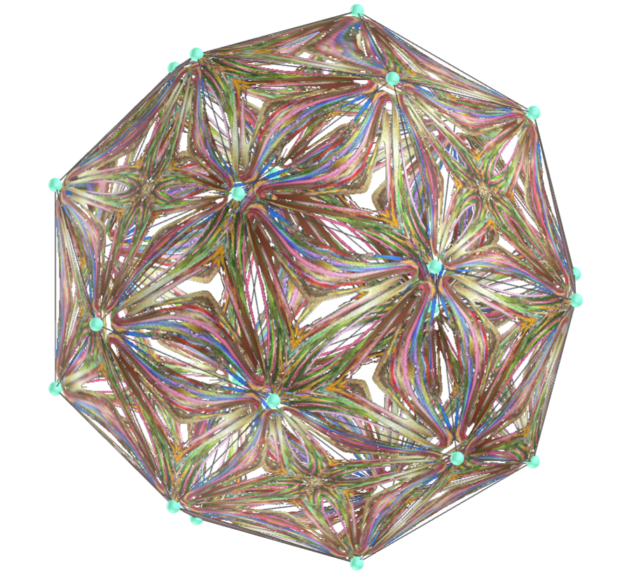</a>
  <b>description</b>: Square and triangle tessellation
  <b>tessellation type</b>: triangular and quadrilateral
  <b>polyhedra</b>: Great Icosacronic Hexecontahedron, Snub Cube, Small Icosacronic Hexecontahedron, Rhombidodecadodecahedron, Medial Icosacronic Hexecontahedron, Great Rhombic Triacontahedron
  

<h4>8. Square and triangle tessellation</h4>
<a href="vr/Tessellation4a.htm" target="_blank" title="3D model" class="fotoA">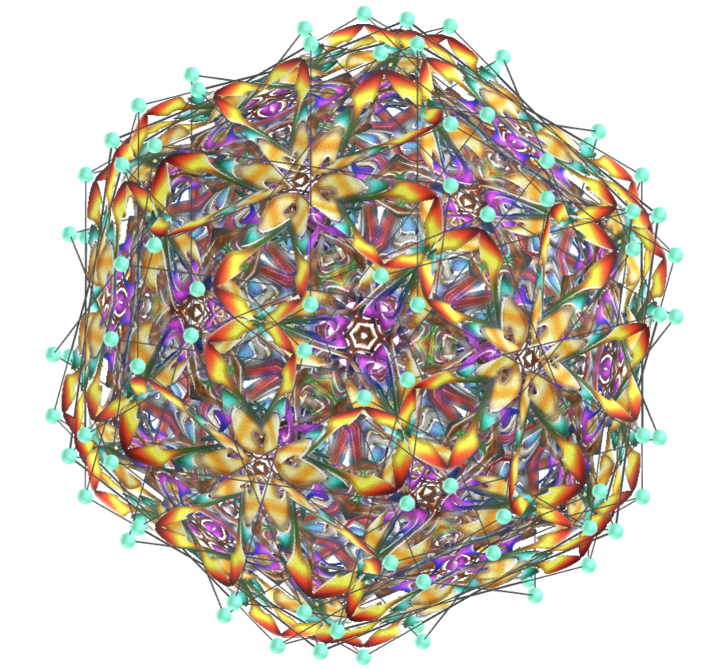</a>
  <b>description</b>: Square and triangle tessellation
  <b>tessellation type</b>: triangular and quadrilateral
  <b>polyhedra</b>: Inverted Snub Dodecadodecahedron, Snub Icosidodecadodecahedron, Uniform Great Rhombicuboctahedron, Great Ditrigonal Dodecacronic Hexecontahedron, Medial Deltoidal Hexecontahedron, Great Hexacronic Icositetrahedron, Great Truncated Icosidodecahedron
  

<h4>9. Square and triangle tessellation</h4>

  <b>description</b>: Square and triangle tessellation
  <b>tessellation type</b>: triangular and quadrilateral
  <b>polyhedra</b>: Great Dirhombicosidodecahedron, Rhombicuboctahedron, Tetrahemihexahedron, Great Dodecacronic Hexecontahedron, Medial Rhombic Triacontahedron, Small Dodecacronic Hexecontahedron, Great Rhombihexahedron, Truncated Dodecadodecahedron
  

<h4>10. Square and triangle tessellation</h4>
<a href="vr/Tessellation4c.htm" target="_blank" title="3D model" class="fotoA">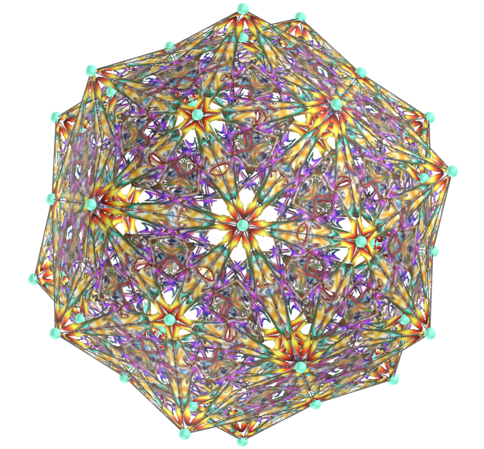</a>
  <b>description</b>: Square and triangle tessellation
  <b>tessellation type</b>: quadrilateral and triangular
  <b>polyhedra</b>: Great Icosacronic Hexecontahedron, Snub Cube, Small Icosacronic Hexecontahedron, Rhombidodecadodecahedron, Medial Icosacronic Hexecontahedron, Great Rhombic Triacontahedron, Great Rhombidodecahedron, Triakis tetrahedron, Triakis Octahedron, Triakis Icosahedron
  

<a href="#p1" class="topo">back to top</a>

<h4>11. Igor Golieniev tessellation</h4>

  <b>description</b>: Igor Golieniev tessellation
  <b>tessellation type</b>: pentagonal
  <b>polyhedra</b>: Pentagonal icositetrahedron, Tetartoid, Pentagonal hexecontahedron, Dodecahedron, Great Dodecahedron, Small Stellated Dodecahedron, Great Stellated Dodecahedron, Small Ditrigonal Icosidodecahedron, Ditrigonal Dodecadodecahedron, Snub Icosidodecadodecahedron, Great Ditrigonal Dodecicosidodecahedron
  

<h4>12. Igor Golieniev tessellation</h4>

  <b>description</b>: Igor Golieniev tessellation
  <b>tessellation type</b>: pentagonal
  <b>polyhedra</b>: Snub Dodecadodecahedron, Medial Pentagonal Hexecontahedron, Dodecadodecahedron, Great Ditrigonal Icosidodecahedron, Great Icosidodecahedron, Icosidodecadodecahedron, Inverted Snub Dodecadodecahedron, Great Pentagonal Hexecontahedron, Great Inverted Pentagonal Hexecontahedron
  

<h4>13. Francine Champagne tessellation</h4>
<a href="vr/Tessellation6.htm" target="_blank" title="3D model" class="fotoA">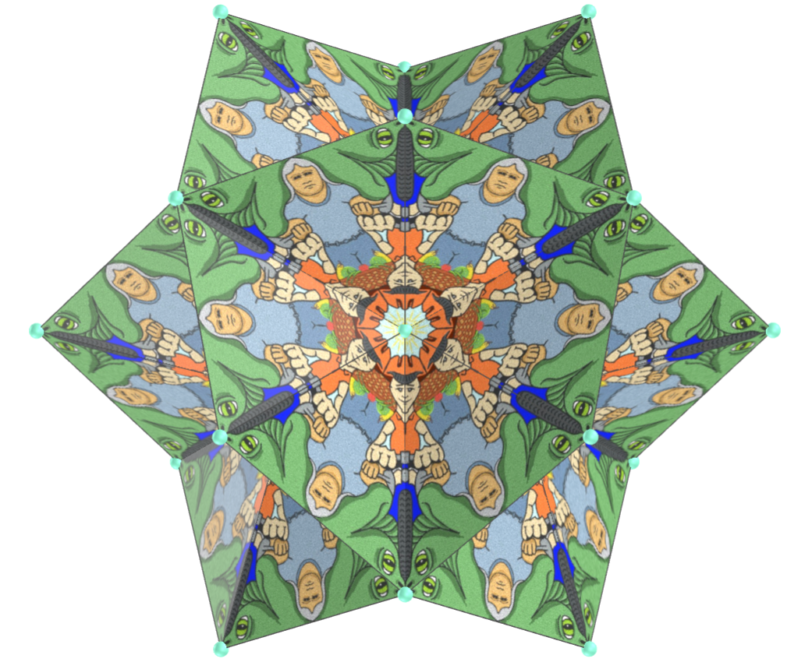</a>
  <b>description</b>: Francine Champagne tessellation - Keep Mother Earth Clean 
  <b>tessellation type</b>: triangular
  <b>polyhedra</b>: Möbius hexakis octahedron, Möbius 10-akis dodecahedron, Escher solid, Hexakis tetrahedron, Möbius hexakis icosahedron, Octahedron, Möbius deltahedron, Möbius octakis hexahedron, Tetrakis hexahedron, pentagonal dipyramid
  

<h4>14. Pentagonal tessellation</h4>

  <b>description</b>: Pentagonal tessellation
  <b>tessellation type</b>: pentagonal
  <b>polyhedra</b>: Pentagonal icositetrahedron, Tetartoid, Pentagonal hexecontahedron, Dodecahedron, Great Dodecahedron, Small Stellated Dodecahedron, Great Stellated Dodecahedron, Small Ditrigonal Icosidodecahedron, Ditrigonal Dodecadodecahedron, Snub Icosidodecadodecahedron, Great Ditrigonal Dodecicosidodecahedron
  

<h4>15. Pentagonal tessellation</h4>
<a href="vr/Tessellation7b.htm" target="_blank" title="3D model" class="fotoA">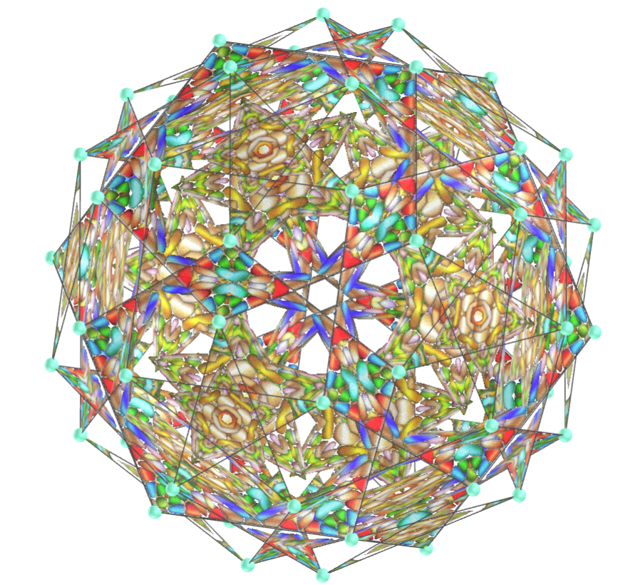</a>
  <b>description</b>: Pentagonal tessellation
  <b>tessellation type</b>: pentagonal
  <b>polyhedra</b>: Snub Dodecadodecahedron, Medial Pentagonal Hexecontahedron, Dodecadodecahedron, Great Ditrigonal Icosidodecahedron, Great Icosidodecahedron, Icosidodecadodecahedron, Inverted Snub Dodecadodecahedron, Great Pentagonal Hexecontahedron, Great Inverted Pentagonal Hexecontahedron
  

<h4>16. Eye-Psy tessellation</h4>
<a href="vr/Tessellation8.htm" target="_blank" title="3D model" class="fotoA">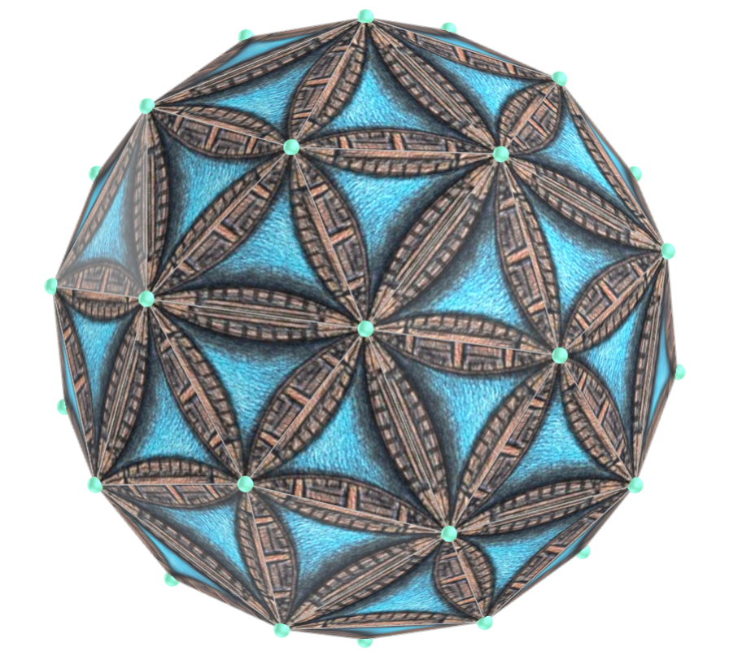</a>
  <b>description</b>: Eye-Psy tessellation
  <b>tessellation type</b>: triangular
  <b>polyhedra</b>: Möbius hexakis octahedron, Möbius 10-akis dodecahedron, Escher solid, Hexakis tetrahedron, Möbius hexakis icosahedron, Octahedron, Möbius deltahedron, Möbius octakis hexahedron, Tetrakis hexahedron, pentagonal dipyramid, Icosahedron, Pentakis dodecahedron
  

<h4>17. Igor Golieniev tessellation</h4>

  <b>description</b>: Igor Golieniev tessellation
  <b>tessellation type</b>: pentagonal
  <b>polyhedra</b>: Pentagonal icositetrahedron, Tetartoid, Pentagonal hexecontahedron, Dodecahedron, Great Dodecahedron, Small Stellated Dodecahedron, Great Stellated Dodecahedron, Small Ditrigonal Icosidodecahedron, Ditrigonal Dodecadodecahedron, Snub Icosidodecadodecahedron, Great Ditrigonal Dodecicosidodecahedron
  

<h4>18. Igor Golieniev tessellation</h4>
<a href="vr/Tessellation9b.htm" target="_blank" title="3D model" class="fotoA">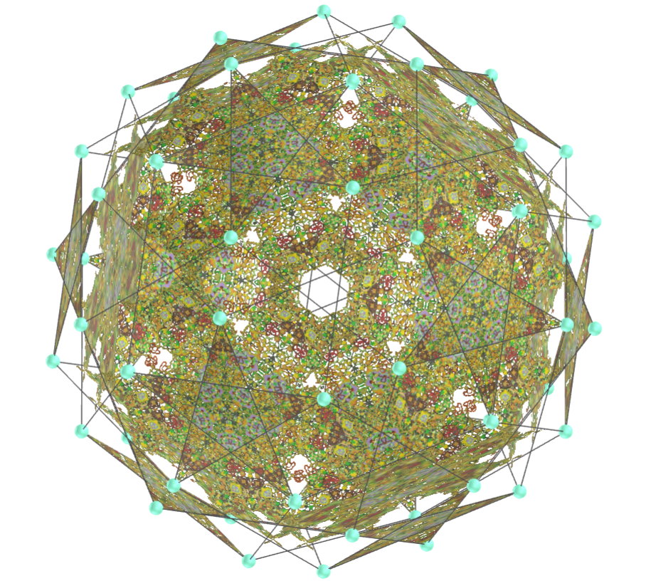</a>
  <b>description</b>: Igor Golieniev tessellation
  <b>tessellation type</b>: pentagonal
  <b>polyhedra</b>: Snub Dodecadodecahedron, Medial Pentagonal Hexecontahedron, Dodecadodecahedron, Great Ditrigonal Icosidodecahedron, Great Icosidodecahedron, Icosidodecadodecahedron, Inverted Snub Dodecadodecahedron, Great Pentagonal Hexecontahedron, Great Inverted Pentagonal Hexecontahedron
  

<h4>19. Vibali tessellation</h4>

  <b>description</b>: Vibali tessellation
  <b>tessellation type</b>: quadrilateral and triangular
  <b>polyhedra</b>: Möbius hexakis octahedron, Escher solid, Hexakis tetrahedron, Möbius deltahedron, Möbius octakis hexahedron, pentagonal dipyramid, Tetrahedron, Pentakis dodecahedron
  

<h4>20. Vibali tessellation</h4>
<a href="vr/Tessellation10b.htm" target="_blank" title="3D model" class="fotoA">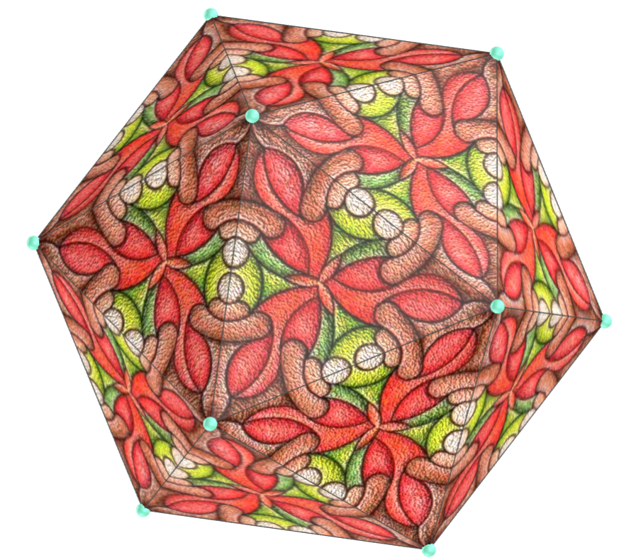</a>
  <b>description</b>: Vibali tessellation
  <b>tessellation type</b>: quadrilateral and triangular
  <b>polyhedra</b>: Möbius 10-akis dodecahedron, Möbius hexakis icosahedron, Octahedron, Tetrakis hexahedron, Stella octangula, Icosahedron
  

<a href="#p1" class="topo">back to top</a>

<h4>21. Pentagonal spiral tessellation</h4>
<a href="vr/Tessellation11a.htm" target="_blank" title="3D model" class="fotoA">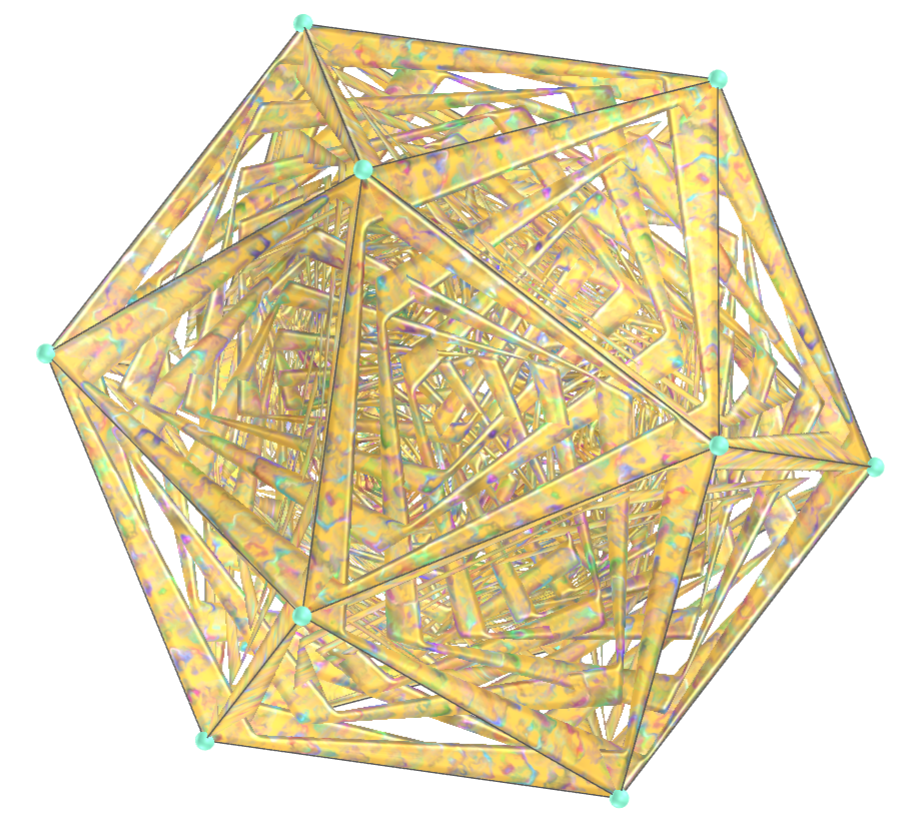</a>
  <b>description</b>: Pentagonal spiral tessellation
  <b>tessellation type</b>: pentagonal
  <b>polyhedra</b>: Pentagonal icositetrahedron, Tetartoid, Pentagonal hexecontahedron, Dodecahedron, Great Dodecahedron, Small Stellated Dodecahedron, Great Stellated Dodecahedron, Small Ditrigonal Icosidodecahedron, Ditrigonal Dodecadodecahedron, Snub Icosidodecadodecahedron, Great Ditrigonal Dodecicosidodecahedron
  

<h4>22. Pentagonal spiral tessellation</h4>

  <b>description</b>: Pentagonal spiral tessellation
  <b>tessellation type</b>: pentagonal
  <b>polyhedra</b>: Snub Dodecadodecahedron, Medial Pentagonal Hexecontahedron, Dodecadodecahedron, Great Ditrigonal Icosidodecahedron, Great Icosidodecahedron, Icosidodecadodecahedron, Inverted Snub Dodecadodecahedron, Great Pentagonal Hexecontahedron, Great Inverted Pentagonal Hexecontahedron
  

<h4>23. Igor Golieniev tessellation</h4>

  <b>description</b>: Igor Golieniev tessellation
  <b>tessellation type</b>: pentagonal
  <b>polyhedra</b>: Pentagonal icositetrahedron, Tetartoid, Pentagonal hexecontahedron, Dodecahedron, Great Dodecahedron, Small Stellated Dodecahedron, Great Stellated Dodecahedron, Small Ditrigonal Icosidodecahedron, Ditrigonal Dodecadodecahedron, Snub Icosidodecadodecahedron, Great Ditrigonal Dodecicosidodecahedron
  

<h4>24. Igor Golieniev tessellation</h4>

  <b>description</b>: Igor Golieniev tessellation
  <b>tessellation type</b>: pentagonal
  <b>polyhedra</b>: Snub Dodecadodecahedron, Medial Pentagonal Hexecontahedron, Dodecadodecahedron, Great Ditrigonal Icosidodecahedron, Great Icosidodecahedron, Icosidodecadodecahedron, Inverted Snub Dodecadodecahedron, Great Pentagonal Hexecontahedron, Great Inverted Pentagonal Hexecontahedrononal Dodecadodecahedron, Snub Icosidodecadodecahedron, Great Ditrigonal Dodecicosidodecahedron
  

<h4>25. Gordon Dylan Johnson tessellation</h4>

  <b>description</b>: Gordon Dylan Johnson tessellation
  <b>tessellation type</b>: triangular and quadrilateral
  <b>polyhedra</b>: Möbius hexakis octahedron, Möbius 10-akis dodecahedron, Escher solid, hexakis tetrahedron, Möbius hexakis icosahedron, Octahedron, Möbius deltahedron, Möbius octakis hexahedron, Tetrakis hexahedron, Pentagonal dipyramid, Great Icosahedron
  

<h4>26. Gordon Dylan Johnson tessellation</h4>

  <b>description</b>: Gordon Dylan Johnson tessellation
  <b>tessellation type</b>: triangular and quadrilateral
  <b>polyhedra</b>: Deltoidal hexecontahedron, Rhombic triacontahedron, Cube, Rhombic dodecahedron, Rhombic hexecontahedron, Deltoidal icositetrahedron, Great Dodecacronic Hexecontahedron, Great Rhombic Triacontahedron, Medial Deltoidal Hexecontahedron, Medial Icosacronic Hexecontahedron, Medial Rhombic Triacontahedron
  
 

<h4>27. Gordon Dylan Johnson tessellation</h4>

  <b>description</b>: Gordon Dylan Johnson tessellation
  <b>tessellation type</b>: triangular and quadrilateral
  <b>polyhedra</b>: Rhombidodecadodecahedron, Small Dodecacronic Hexecontahedron, Great Icosacronic Hexecontahedron, Stella octangula, Truncated Dodecadodecahedron, Great Rhombihexahedron, Small Icosacronic Hexecontahedron, Great Rhombidodecahedron, Great Truncated Icosidodecahedron
  

<h4>28. Igor Golieniev tessellation</h4>

  <b>description</b>: Igor Golieniev tessellation
  <b>tessellation type</b>: pentagonal
  <b>polyhedra</b>: Pentagonal icositetrahedron, Tetartoid, Pentagonal hexecontahedron, Dodecahedron, Great Dodecahedron, Small Stellated Dodecahedron, Great Stellated Dodecahedron, Small Ditrigonal Icosidodecahedron, Ditrigonal Dodecadodecahedron, Snub Icosidodecadodecahedron, Great Ditrigonal Dodecicosidodecahedron
  

<h4>29. Igor Golieniev tessellation</h4>

  <b>description</b>: Igor Golieniev tessellation
  <b>tessellation type</b>: pentagonal
  <b>polyhedra</b>: Snub Dodecadodecahedron, Medial Pentagonal Hexecontahedron, Dodecadodecahedron, Great Ditrigonal Icosidodecahedron, Great Icosidodecahedron, Icosidodecadodecahedron, Inverted Snub Dodecadodecahedron, Great Pentagonal Hexecontahedron, Great Inverted Pentagonal Hexecontahedron
  

<h4>30. Square tessellation</h4>
<a href="vr/Tessellation15a.htm" target="_blank" title="3D model" class="fotoA">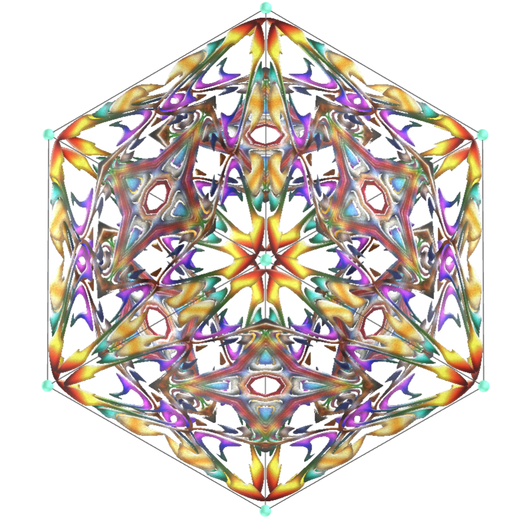</a>
  <b>description</b>: Square tessellation
  <b>tessellation type</b>: triangular and quadrilateral
  <b>polyhedra</b>: Möbius hexakis octahedron, Escher solid, hexakis tetrahedron, Möbius deltahedron, Möbius octakis hexahedron, Deltoidal hexecontahedron, Deltoidal icositetrahedron, Cube, Pentagonal dipyramid
  

<a href="#p1" class="topo">back to top</a>

<h4>31. Square tessellation</h4>

  <b>description</b>: Square tessellation
  <b>tessellation type</b>: triangular and quadrilateral
  <b>polyhedra</b>: Rhombic dodecahedron, Möbius 10-akis dodecahedron, Rhombic hexecontahedron, Möbius hexakis icosahedron, Octahedron, Tetrakis hexahedron, Rhombic triacontahedron, Stella octangula
  

<h4>32. Decagonal tessellation</h4>

  <b>description</b>: Decagonal tessellation
  <b>tessellation type</b>: pentagonal
  <b>polyhedra</b>: Pentagonal icositetrahedron, Tetartoid, Pentagonal hexecontahedron, Dodecahedron, Great Dodecahedron, Small Stellated Dodecahedron, Great Stellated Dodecahedron, Small Ditrigonal Icosidodecahedron, Ditrigonal Dodecadodecahedron, Snub Icosidodecadodecahedron, Great Ditrigonal Dodecicosidodecahedron
  

<h4>33. Decagonal tessellation</h4>

  <b>description</b>: Decagonal tessellation
  <b>tessellation type</b>: pentagonal
  <b>polyhedra</b>: Snub Dodecadodecahedron, Medial Pentagonal Hexecontahedron, Dodecadodecahedron, Great Ditrigonal Icosidodecahedron, Great Icosidodecahedron, Icosidodecadodecahedron, Inverted Snub Dodecadodecahedron, Great Pentagonal Hexecontahedron, Great Inverted Pentagonal Hexecontahedron
  

<h4>34. Pentagonal tessellation</h4>

  <b>description</b>: Pentagonal tessellation
  <b>tessellation type</b>: pentagonal
  <b>polyhedra</b>: Pentagonal icositetrahedron, Tetartoid, Pentagonal hexecontahedron, Dodecahedron, Great Dodecahedron, Small Stellated Dodecahedron, Great Stellated Dodecahedron, Small Ditrigonal Icosidodecahedron, Ditrigonal Dodecadodecahedron, Snub Icosidodecadodecahedron, Great Ditrigonal Dodecicosidodecahedron
  

<h4>35. Pentagonal tessellation</h4>
<a href="vr/Tessellation17b.htm" target="_blank" title="3D model" class="fotoA">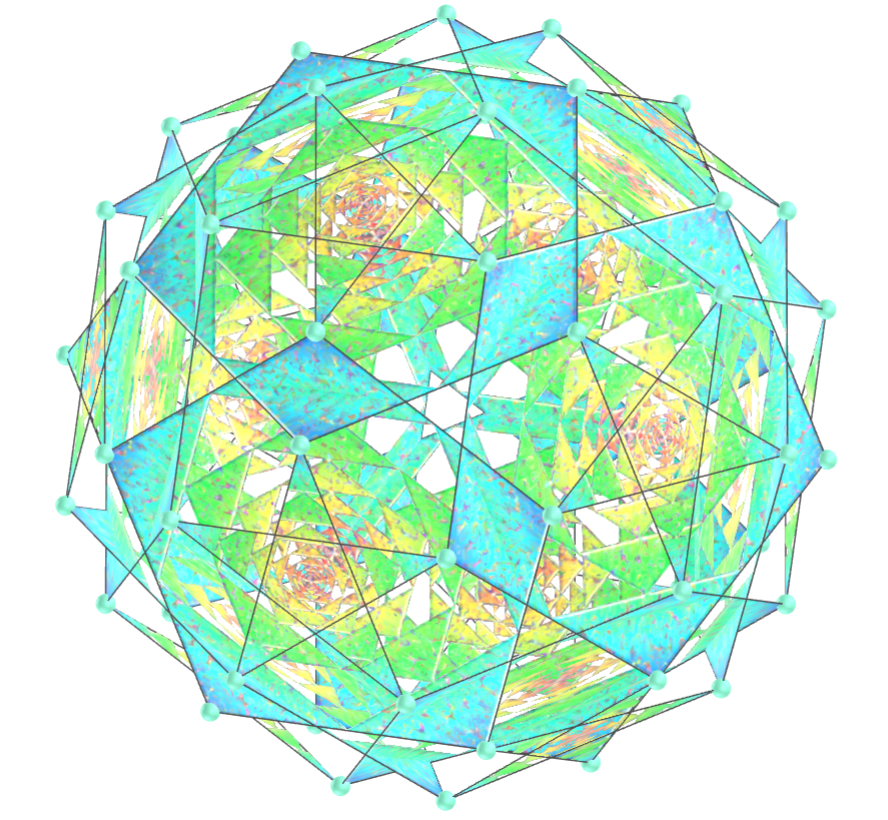</a>
  <b>description</b>: Pentagonal tessellation
  <b>tessellation type</b>: pentagonal
  <b>polyhedra</b>: Snub Dodecadodecahedron, Medial Pentagonal Hexecontahedron, Dodecadodecahedron, Great Ditrigonal Icosidodecahedron, Great Icosidodecahedron, Icosidodecadodecahedron, Inverted Snub Dodecadodecahedron, Great Pentagonal Hexecontahedron, Great Inverted Pentagonal Hexecontahedron
  

<a href="#p1" class="topo">back to top</a>

  Tessellation - part 4: polyhedra tessellation and visualization with Virtual Reality by <a xmlns:cc="http://creativecommons.org/ns#" href="https://paulohscwb.github.io/tessellation/part4/" property="cc:attributionName" rel="cc:attributionURL">Paulo Henrique Siqueira</a> is licensed with a license <a rel="license" href="http://creativecommons.org/licenses/by-nc-nd/4.0/">Creative Commons Attribution-NonCommercial-NoDerivatives 4.0 International</a>.

<h4>How to cite this work:</h4> 

Siqueira, P.H., "Tessellation - part 4: polyhedra tessellation and visualization with Virtual Reality". Available in: <https://paulohscwb.github.io/tessellation/part4/>, September 2025.

<!---->
  <b>References:</b>
 Champagne, F. "Tessellations by Francine Champagne" <a href="https://tessellations.ca/" target="_blank"> https://tessellations.ca/</a>
 Weisstein, Eric W. "Tessellation." From MathWorld--A Wolfram Web Resource. <a href="https://mathworld.wolfram.com/Tessellation.html" target="_blank"> https://mathworld.wolfram.com/Tessellation.html</a>
 Mohr, R. "Tiled Art" <a href="https://tiled.art/en/home" target="_blank">https://tiled.art/en/home</a> 
 McCooey, D. I. "Visual Polyhedra". <a href="http://dmccooey.com/polyhedra/" target="_blank">http://dmccooey.com/polyhedra/</a>
