<link rel="stylesheet" href="../../scripts/style.css">
<meta charset="utf-8">
<link rel="icon" type="image/png" href="../vr/salas/imagens/icone.png">
<h2>Visualização de Tesselações em Poliedros com Realidade Virtual (RV) em A-frame</h2>
<b>autor:</b> Paulo Henrique Siqueira - Universidade Federal do Paraná
 <b>contato:</b> <a href="#"> paulohscwb@gmail.com </a>
 <a href="https://paulohscwb.github.io/tessellation/part4/">english version</a>
<form style="margin: 0 auto; float:right; text-align:right; width:100%; margin-bottom:15px;">
	<select id="url" onchange="urlHandler(this.value)" style="color:royalblue;">
		<option disabled selected>Mais sólidos:</option>
		<option value="../../escher/pt-br/">Obras de Escher</option>
		<option value="../../part2/pt-br/">Tesselações 2</option>
		<option value="../../part3/pt-br/">Tesselações 3</option>
		<option disabled value="../../part4/pt-br/">Tesselações 4</option>
		<!--<option value="../../part5/pt-br/">Tesselações 5</option>
		<option value="../../part6/pt-br/">Tesselações 6</option>
		<option value="../../part7/pt-br/">Tesselações 7</option>
		<option value="../../part8/pt-br/">Tesselações 8</option>
		<option value="../../part9/pt-br/">Tesselações 9</option>
		<option value="../../part10/pt-br/">Tesselações 10</option>
		<option value="../../part11/pt-br/">Tesselações 11</option>-->
	</select>
</form>

  <h2 align="center">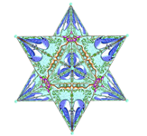 Tesselações - parte 4</h2>
  As figuras ou obras que são escolhidas como tesselas cobrem ou pavimentam o plano ou uma superfície. O resultado é chamado de tesselação, ladrilho, pavimentação ou mosaico. As tesselações são usadas desde a antiguidade em pisos, paredes tapetes e outros objetos. 
 Este trabalho mostra as tesselações feitas em todas ou algumas faces de poliedros, aproveitando simetrias triangulares, quadradas, pentagonais ou hexagonais das faces destes sólidos. 
 Nesta página, temos algumas obras de tesselações de Francine Champagne, Velirina, Vibali, Eye-Psy, Igor Golieniev, Goshashka e Gordon Dylan Johnson, inseridas nas faces de poliedros comuns, como os platônicos tetraedro, cubo ou icosaedro, além de poliedros mais raros, como os sólidos de Johnson.
 
<a href="#m3d">Modelos 3D</a>&nbsp;&nbsp;|&nbsp;&nbsp;<a href="../../pt-br/">Página Inicial</a>

  

 

<h3 id="m3d" align="center">Modelos 3D</h3>
<!--<iframe width="560" height="315" style="max-width:100%" src="https://www.youtube.com/embed/videoseries?list=PLy0I_lGW8HxWaYGTOc9cCw0xOPHUW1yFS" title="YouTube video player" frameborder="0" allow="accelerometer; autoplay; clipboard-write; encrypted-media; gyroscope; picture-in-picture; web-share" allowfullscreen></iframe>-->
<h4>1. Tesselação de Velirina</h4>
<a href="../vr/Tessellation1a.htm" target="_blank" title="modelo 3D" class="fotoA">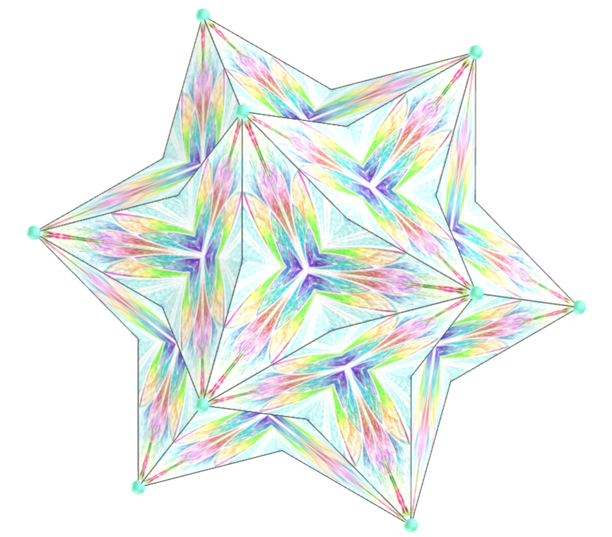</a>
  <b>descrição</b>: tesselação de Vladimir Bulatov - Limite do círculo
  <b>tipo de tesselação</b>: triangular e quadrilateral
  <b>poliedros</b>: octaedro hexaédrico de Möbius, sólido de Escher, tetraedro hexakis, deltaedro de Möbius, hexaedro octakis de Möbius, hexecontaedro deltoidal, icositetraedro deltoidal, cubo, triacontaedro rômbico medial, pequeno hexecontaedro dodecacrônico, grande hexecontaedro dodecacrônico ditrigonal, icosaedro triakis
  

<h4>2. Tesselação de Velirina</h4>
<a href="../vr/Tessellation1b.htm" target="_blank" title="modelo 3D" class="fotoA">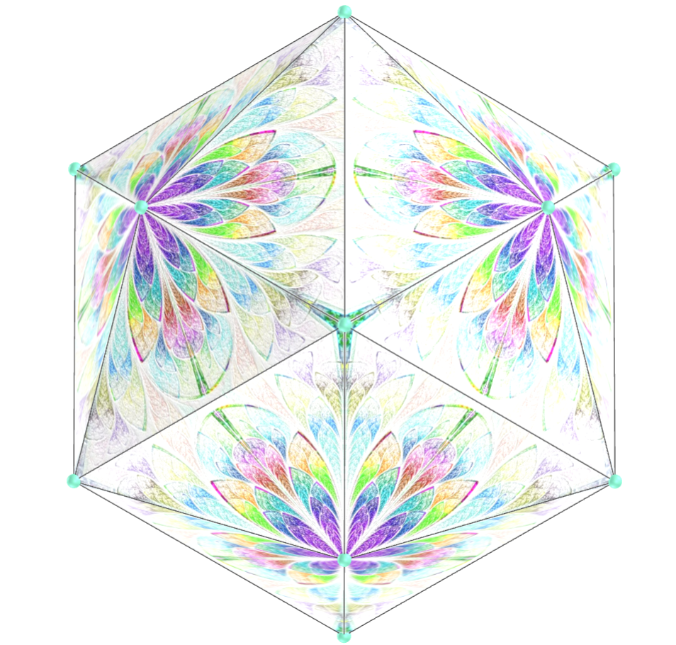</a>
  <b>descrição</b>: tesselação de Velirina
  <b>tipo de tesselação</b>: quadrilateral e triangular
  <b>poliedros</b>: dodecaedro rômbico, dodecaedro 10-akis de Möbius, hexecontaedro rômbico, icosaedro hexakis de Möbius, octaedro, hexaedro tetrakis, triacontaedro rômbico, dipirâmide pentagonal, hexecontaedro deltoidal medial, pequeno hexecontaedro icosacrônico, grande triacontaedro rômbico, octaedro triakis
  

<h4>3. Tesselação de Gordon Dylan Johnson</h4>
<a href="../vr/Tessellation2a.htm" target="_blank" title="modelo 3D" class="fotoA">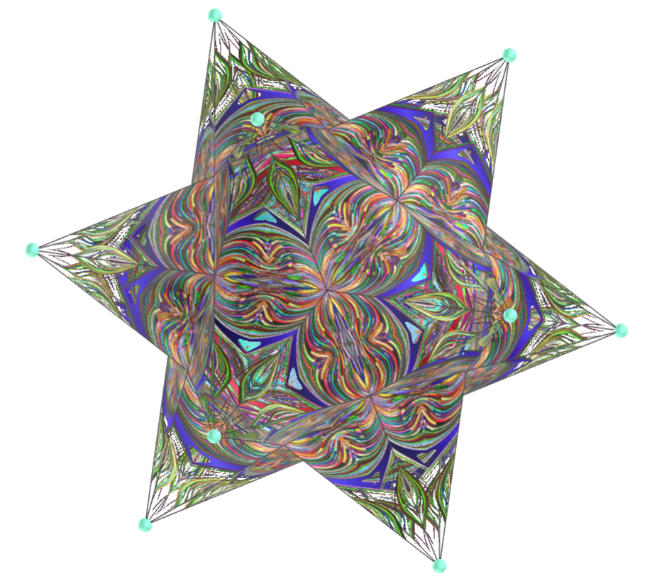</a>
  <b>descrição</b>: Tesselação de Gordon Dylan Johnson
  <b>tipo de tesselação</b>: pentagonal
  <b>poliedros</b>: Icositetraedro Pentagonal, Tetartoide, Hexecontaedro Pentagonal, Dodecaedro, Grande Dodecaedro, Pequeno Dodecaedro Estrelado, Grande Dodecaedro Estrelado, Pequeno Icosidodecaedro Ditrigonal, Dodecadodecaedro Ditrigonal, Icosidodecadodecaedro Snub, Grande Dodecicosidodecaedro Ditrigonal 
  

<h4>4. Tesselação de Gordon Dylan Johnson</h4>
<a href="../vr/Tessellation2b.htm" target="_blank" title="modelo 3D" class="fotoA">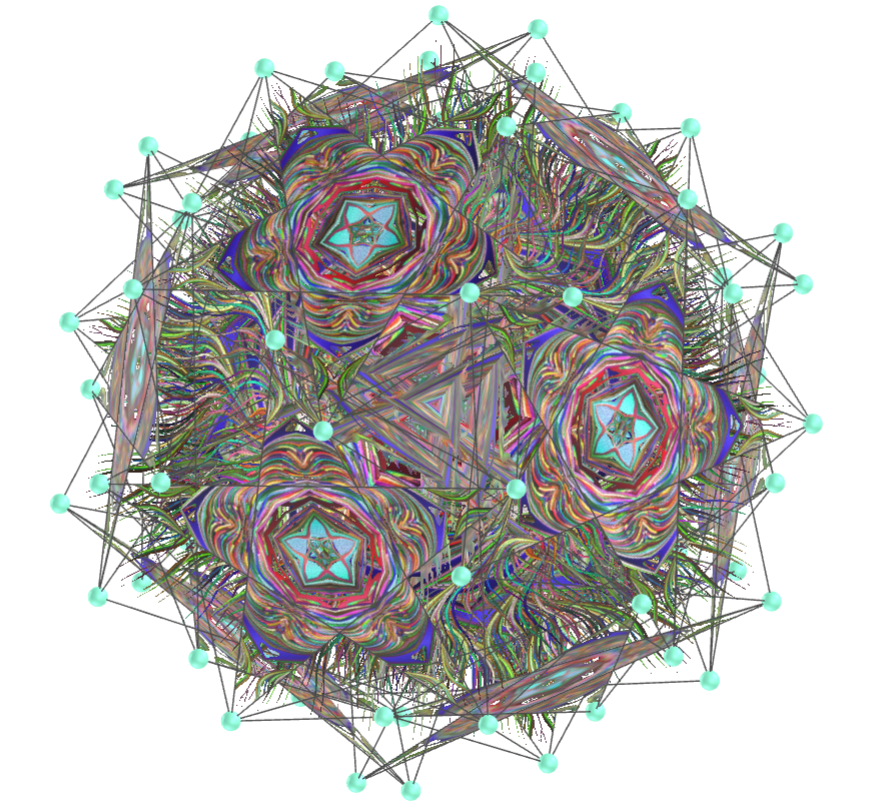</a>
  <b>descrição</b>: Tesselação de Gordon Dylan Johnson
  <b>tipo de tesselação</b>: pentagonal
  <b>poliedros</b>: Dodecadodecaedro Snub, Hexecontaedro Medial Pentagonal, Dodecadodecaedro, Grande Icosidodecaedro Ditrigonal, Grande Icosidodecaedro, Icosidodecadodecaedro, Dodecadodecaedro Snub Invertido, Grande Hexecontaedro Pentagonal, Grande Hexecontaedro Pentagonal Invertido 
  

<h4>5. Tesselação de quadrado e triângulo</h4>
<a href="../vr/Tessellation3a.htm" target="_blank" title="modelo 3D" class="fotoA">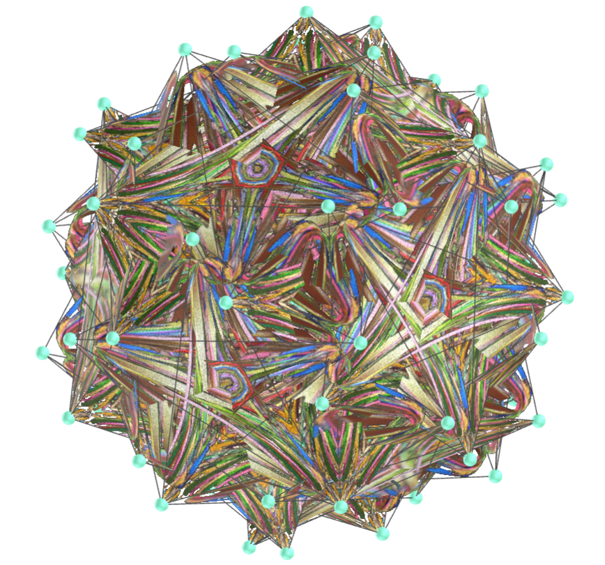</a>
  <b>descrição</b>: Tesselação de quadrado e triângulo
  <b>tipo de tesselação</b>: quadrilateral e triangular
  <b>poliedros</b>: Dodecadodecaedro Snub Invertido, Icosidodecadodecaedro Snub, Pequeno Icosidodecaedro Ditrigonal, Grande Rombicuboctaedro Uniforme, Grande Hexecontaedro Dodecacrônico Ditrigonal, Hexecontaedro Deltoidal Medial, Grande Icositetraedro Hexacrônico
  

<h4>6. Tesselação de quadrado e triângulo</h4>
<a href="../vr/Tessellation3b.htm" target="_blank" title="modelo 3D" class="fotoA">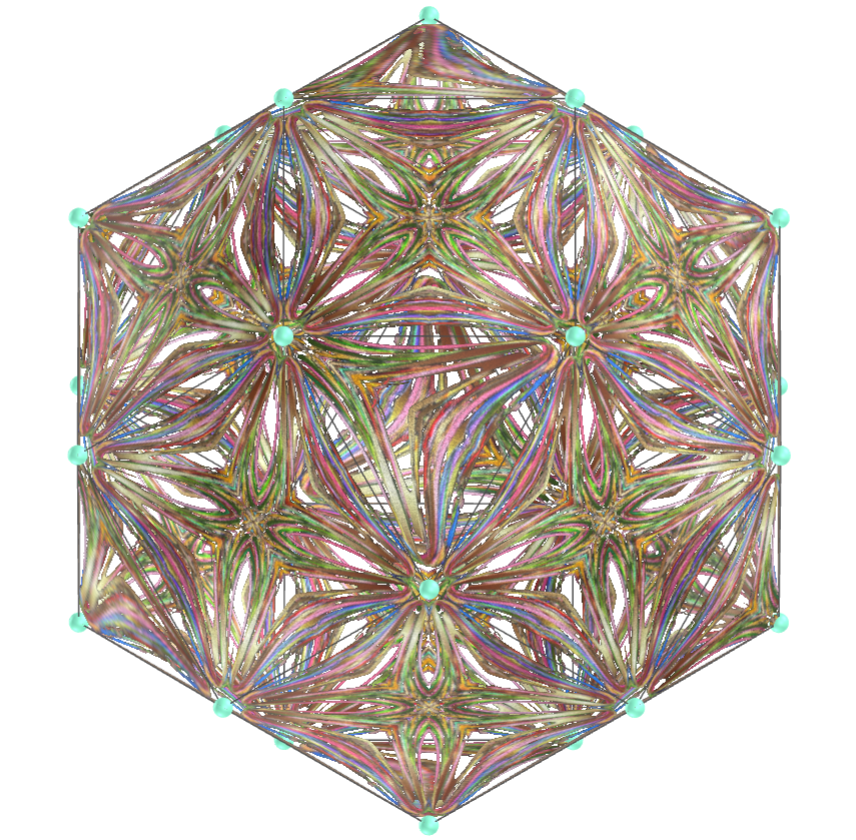</a>
  <b>descrição</b>: Tesselação de quadrado e triângulo
  <b>tipo de tesselação</b>: quadrilateral e triangular
  <b>poliedros</b>: Grande Dirombicosidodecaedro, Rombicuboctaedro, Grande Dodecicosidodecaedro Snub, Tetrahemihexaedro, Grande Hexecontaedro Dodecacrônico, Triacontaedro Rômbico Medial, Pequeno Hexecontaedro Dodecacrônico
  

<h4>7. Tesselação de quadrado e triângulo</h4>
<a href="../vr/Tessellation3c.htm" target="_blank" title="modelo 3D" class="fotoA">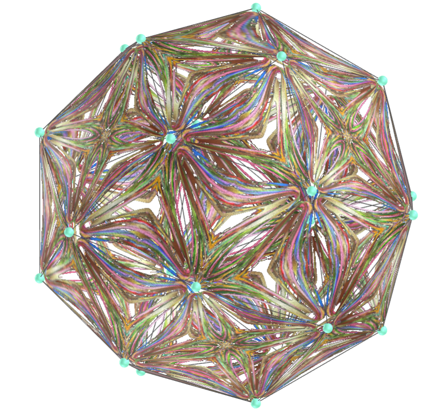</a>
  <b>descrição</b>: Tesselação de quadrado e triângulo
  <b>tipo de tesselação</b>: quadrilateral e triangular
  <b>poliedros</b>: Grande Hexecontaedro Icosacrônico, Cubo Snub, Pequeno Hexecontaedro Icosacrônico, Rombidodecadodecaedro, Hexecontaedro Icosacrônico Medial, Grande Triacontaedro Rômbico
  

<h4>8. Tesselação de quadrado e triângulo</h4>
<a href="../vr/Tessellation4a.htm" target="_blank" title="modelo 3D" class="fotoA">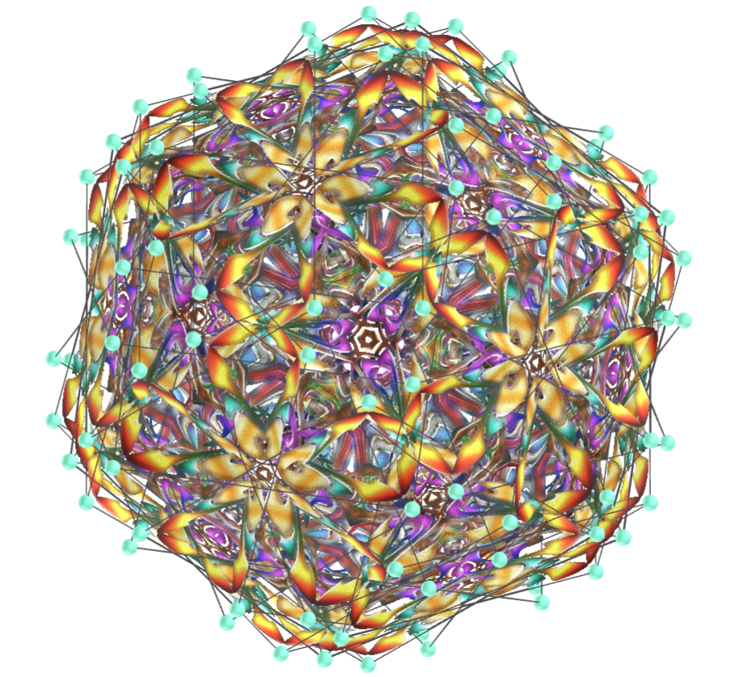</a>
  <b>descrição</b>: Tesselação de quadrado e triângulo
  <b>tipo de tesselação</b>: triangular e quadrilateral
  <b>poliedros</b>: Dodecadodecaedro Snub Invertido, Icosidodecadodecaedro Snub, Grande Rombicuboctaedro Uniforme, Grande Hexecontaedro Dodecacrônico Ditrigonal, Hexecontaedro Deltoidal Medial, Grande Icositetraedro Hexacrônico, Grande Icosidodecaedro Truncado
  

<h4>9. Tesselação de quadrado e triângulo</h4>
<a href="../vr/Tessellation4b.htm" target="_blank" title="modelo 3D" class="fotoA">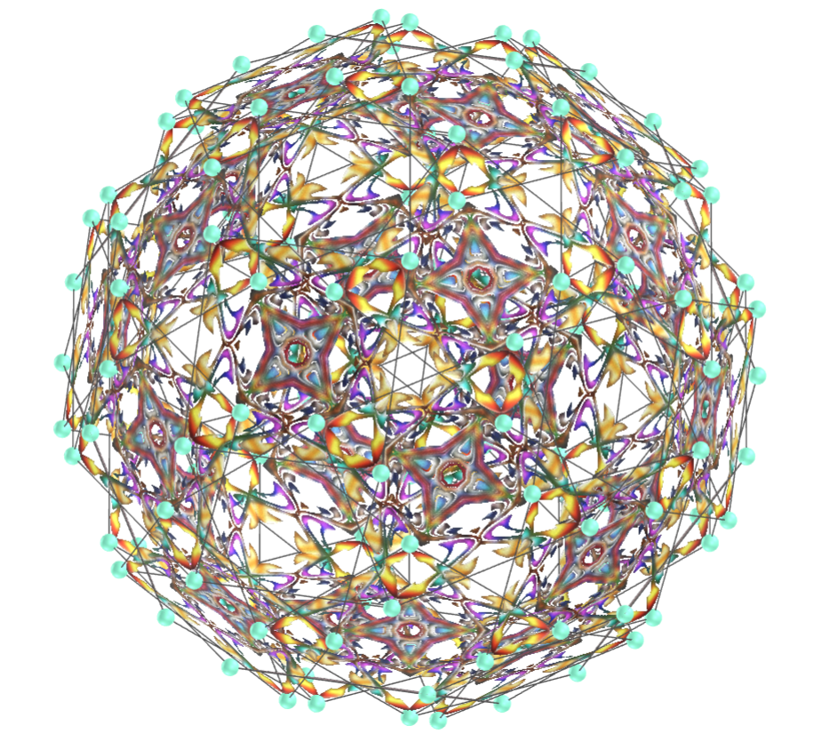</a>
  <b>descrição</b>: Tesselação de quadrado e triângulo
  <b>tipo de tesselação</b>: quadrilateral e triangular
  <b>poliedros</b>: Grande Dirombicosidodecaedro, Rombicuboctaedro, Tetrahemihexaedro, Grande Hexecontaedro Dodecacrônico, Triacontaedro Rômbico Medial, Pequeno Hexecontaedro Dodecacrônico, Grande Rombihexaedro, Dodecadodecaedro Truncado 
  
 

<h4>10. Tesselação de quadrado e triângulo</h4>
<a href="../vr/Tessellation4c.htm" target="_blank" title="modelo 3D" class="fotoA">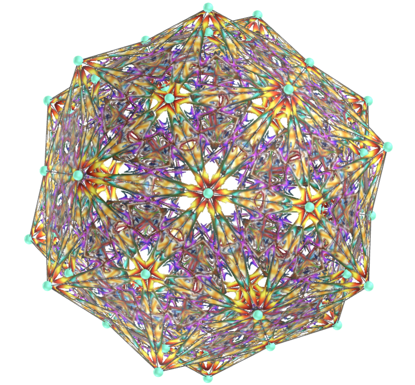</a>
  <b>descrição</b>: Tesselação de quadrado e triângulo
  <b>tipo de tesselação</b>: quadrilateral e triangular
  <b>poliedros</b>: Grande Hexecontaedro Icosacrônico, Cubo Snub, Pequeno Hexecontaedro Icosacrônico, Rombidodecadodecaedro, Hexecontaedro Icosacrônico Medial, Grande Triacontaedro Rômbico, Grande Rombidodecaedro, Tetraedro Triakis, Octaedro Triakis, Icosaedro Triakis 
  

<a href="#p1" class="topo">voltar ao topo</a>

<h4>11. Tesselação de Igor Golieniev</h4>
<a href="../vr/Tessellation5a.htm" target="_blank" title="modelo 3D" class="fotoA">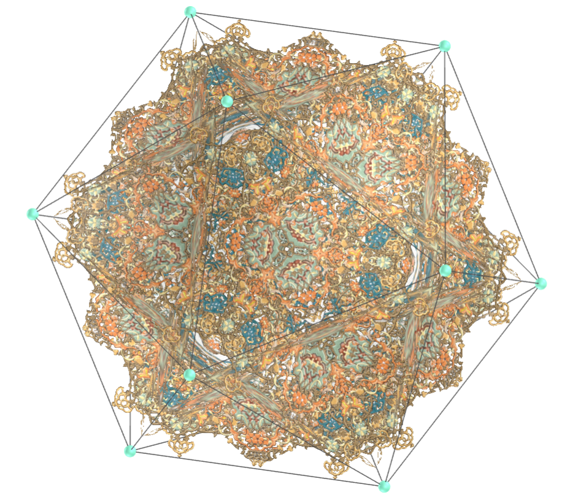</a>
  <b>descrição</b>: Tesselação de Igor Golieniev
  <b>tipo de tesselação</b>: pentagonal
  <b>poliedros</b>: Icositetraedro Pentagonal, Tetartoide, Hexecontaedro Pentagonal, Dodecaedro, Grande Dodecaedro, Pequeno Dodecaedro Estrelado, Grande Dodecaedro Estrelado, Pequeno Icosidodecaedro Ditrigonal, Dodecadodecaedro Ditrigonal, Icosidodecadodecaedro Snub, Grande Dodecicosidodecaedro Ditrigonal 
  

<h4>12. Tesselação de Igor Golieniev</h4>
<a href="../vr/Tessellation5b.htm" target="_blank" title="modelo 3D" class="fotoA">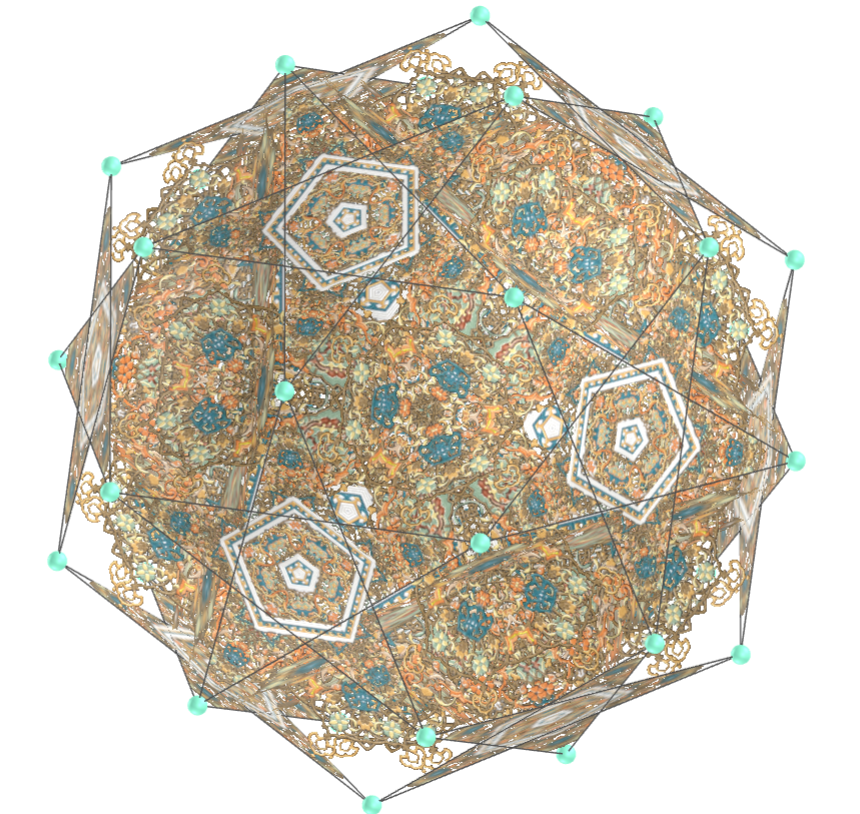</a>
  <b>descrição</b>: Tesselação de Igor Golieniev
  <b>tipo de tesselação</b>: pentagonal
  <b>poliedros</b>: Dodecadodecaedro Snub, Hexecontaedro Medial Pentagonal, Dodecadodecaedro, Grande Icosidodecaedro Ditrigonal, Grande Icosidodecaedro, Icosidodecadodecaedro, Dodecadodecaedro Snub Invertido, Grande Hexecontaedro Pentagonal, Grande Hexecontaedro Pentagonal Invertido 
  

<h4>13. Tesselação de Francine Champagne</h4>
<a href="../vr/Tessellation6.htm" target="_blank" title="modelo 3D" class="fotoA">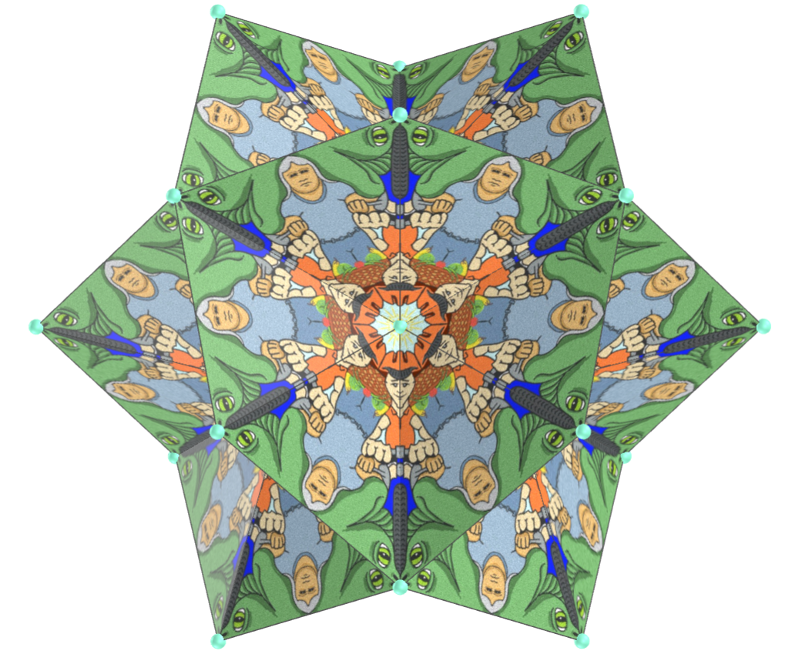</a>
  <b>descrição</b>: Tesselação de Francine Champagne - Mantenha a Mãe Terra Limpa
  <b>tipo de tesselação</b>: quadrilateral e triangular
  <b>poliedros</b>: octaedro hexakis de Möbius, dodecaedro 10-akis de Möbius, sólido de Escher, tetraedro hexakis, icosaedro hexakis de Möbius, octaedro, deltaedro de Möbius, hexaedro octakis de Möbius, hexaedro tetrakis, Dipirâmide pentagonal
  

<h4>14. Tesselação pentagonal</h4>
<a href="../vr/Tessellation7a.htm" target="_blank" title="modelo 3D" class="fotoA">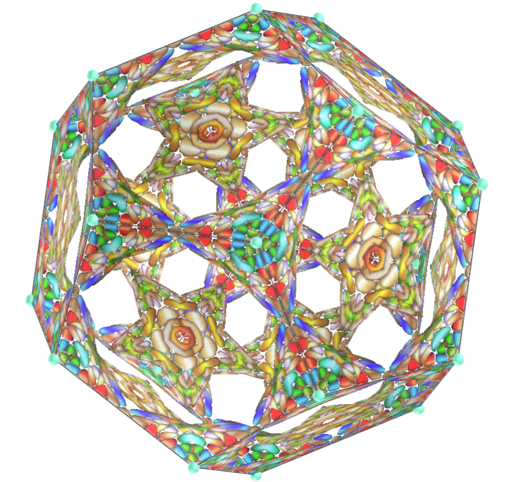</a>
  <b>descrição</b>: Tesselação pentagonal
  <b>tipo de tesselação</b>: pentagonal
  <b>poliedros</b>: Icositetraedro Pentagonal, Tetartoide, Hexecontaedro Pentagonal, Dodecaedro, Grande Dodecaedro, Pequeno Dodecaedro Estrelado, Grande Dodecaedro Estrelado, Pequeno Icosidodecaedro Ditrigonal, Dodecadodecaedro Ditrigonal, Icosidodecadodecaedro Snub, Grande Dodecicosidodecaedro Ditrigonal 
  

<h4>15. Tesselação pentagonal</h4>
<a href="../vr/Tessellation7b.htm" target="_blank" title="modelo 3D" class="fotoA">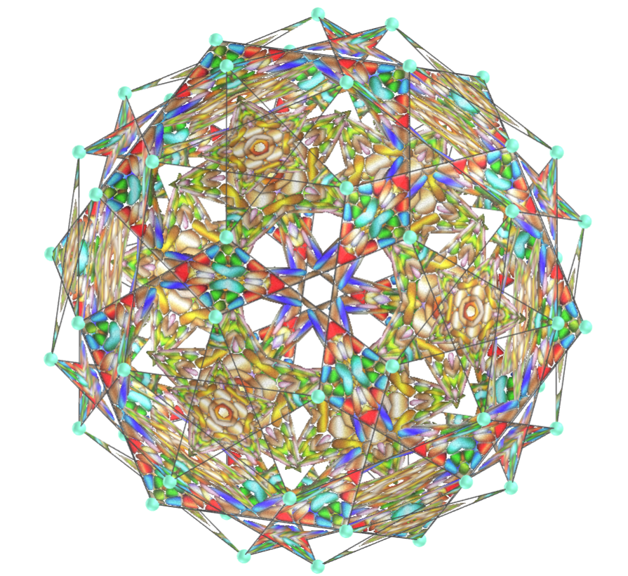</a>
  <b>descrição</b>: Tesselação pentagonal
  <b>tipo de tesselação</b>: pentagonal
  <b>poliedros</b>: Dodecadodecaedro Snub, Hexecontaedro Medial Pentagonal, Dodecadodecaedro, Grande Icosidodecaedro Ditrigonal, Grande Icosidodecaedro, Icosidodecadodecaedro, Dodecadodecaedro Snub Invertido, Grande Hexecontaedro Pentagonal, Grande Hexecontaedro Pentagonal Invertido 
  

<h4>16. Tesselação de Eye-Psy</h4>
<a href="../vr/Tessellation8.htm" target="_blank" title="modelo 3D" class="fotoA">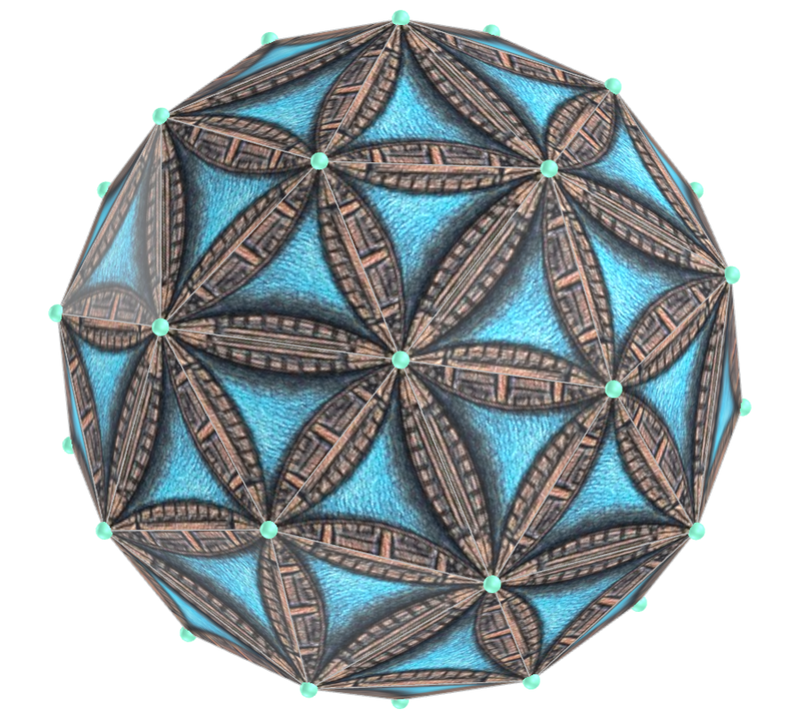</a>
  <b>descrição</b>: tesselação de Eye-Psy
  <b>tipo de tesselação</b>: triangular
  <b>poliedros</b>: octaedro hexakis de Möbius, dodecaedro 10-akis de Möbius, sólido de Escher, tetraedro hexakis, icosaedro hexakis de Möbius, octaedro, deltaedro de Möbius, hexaedro octakis de Möbius, hexaedro tetrakis, Dipirâmide pentagonal, Icosaedro, Dodecaedro Pentakis
  

<h4>17. Tesselação de Igor Golieniev</h4>
<a href="../vr/Tessellation9a.htm" target="_blank" title="modelo 3D" class="fotoA">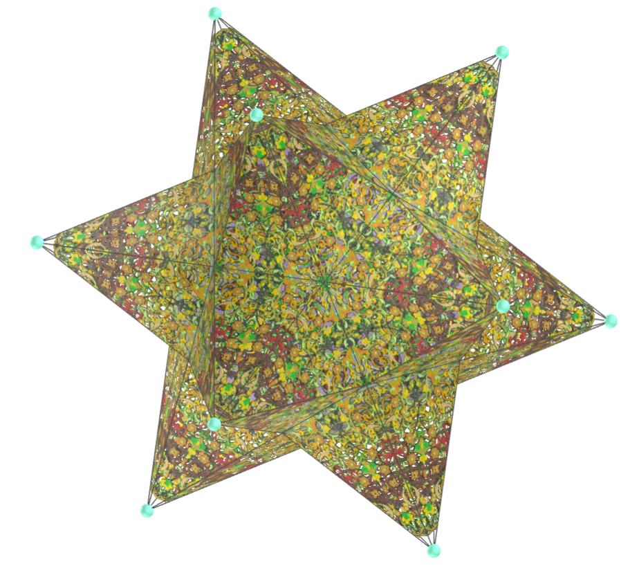</a>
  <b>descrição</b>: tesselação de Igor Golieniev
  <b>tipo de tesselação</b>: pentagonal
  <b>poliedros</b>: Icositetraedro Pentagonal, Tetartoide, Hexecontaedro Pentagonal, Dodecaedro, Grande Dodecaedro, Pequeno Dodecaedro Estrelado, Grande Dodecaedro Estrelado, Pequeno Icosidodecaedro Ditrigonal, Dodecadodecaedro Ditrigonal, Icosidodecadodecaedro Snub, Grande Dodecicosidodecaedro Ditrigonal 
  
 

<h4>18. Tesselação de Igor Golieniev</h4>
<a href="../vr/Tessellation9b.htm" target="_blank" title="modelo 3D" class="fotoA">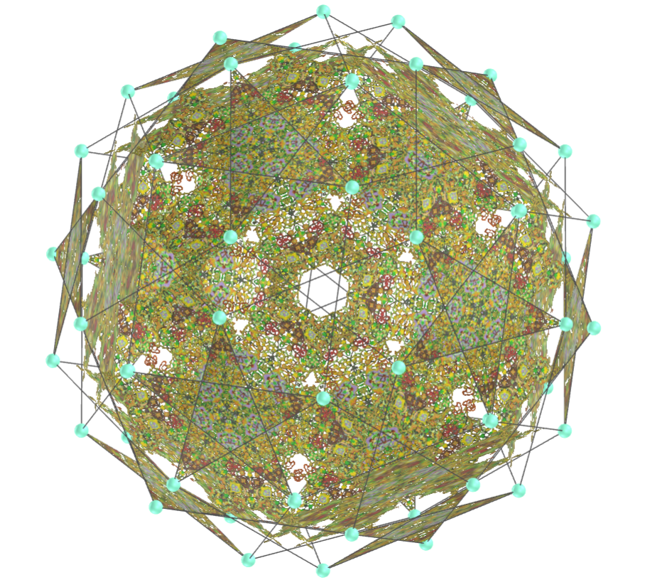</a>
  <b>descrição</b>: Tesselação de Igor Golieniev
  <b>tipo de tesselação</b>: pentagonal
  <b>poliedros</b>: Dodecadodecaedro Snub, Hexecontaedro Medial Pentagonal, Dodecadodecaedro, Grande Icosidodecaedro Ditrigonal, Grande Icosidodecaedro, Icosidodecadodecaedro, Dodecadodecaedro Snub Invertido, Grande Hexecontaedro Pentagonal, Grande Hexecontaedro Pentagonal Invertido 
    

<h4>19. Tesselação de Vibali</h4>
<a href="../vr/Tessellation10a.htm" target="_blank" title="modelo 3D" class="fotoA">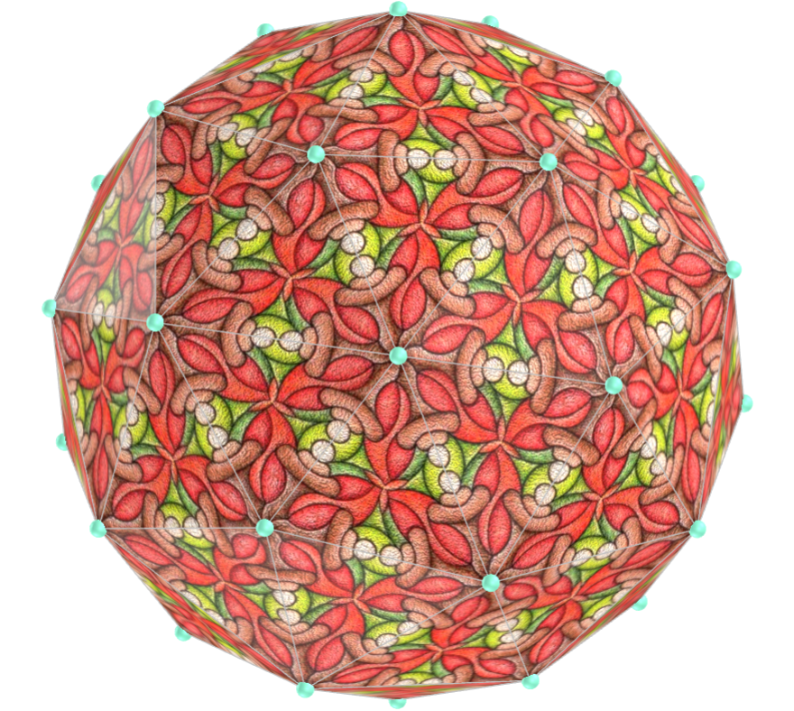</a>
  <b>descrição</b>: Tesselação de Vibali
  <b>tipo de tesselação</b>: quadrilateral e triangular
  <b>poliedros</b>: octaedro hexakis de Möbius, sólido de Escher, tetraedro hexakis, deltaedro de Möbius, hexaedro octakis de Möbius, Dipirâmide pentagonal, Tetraedro, Dodecaedro Pentakis
  

<h4>20. Tesselação de Vibali</h4>
<a href="../vr/Tessellation10b.htm" target="_blank" title="modelo 3D" class="fotoA">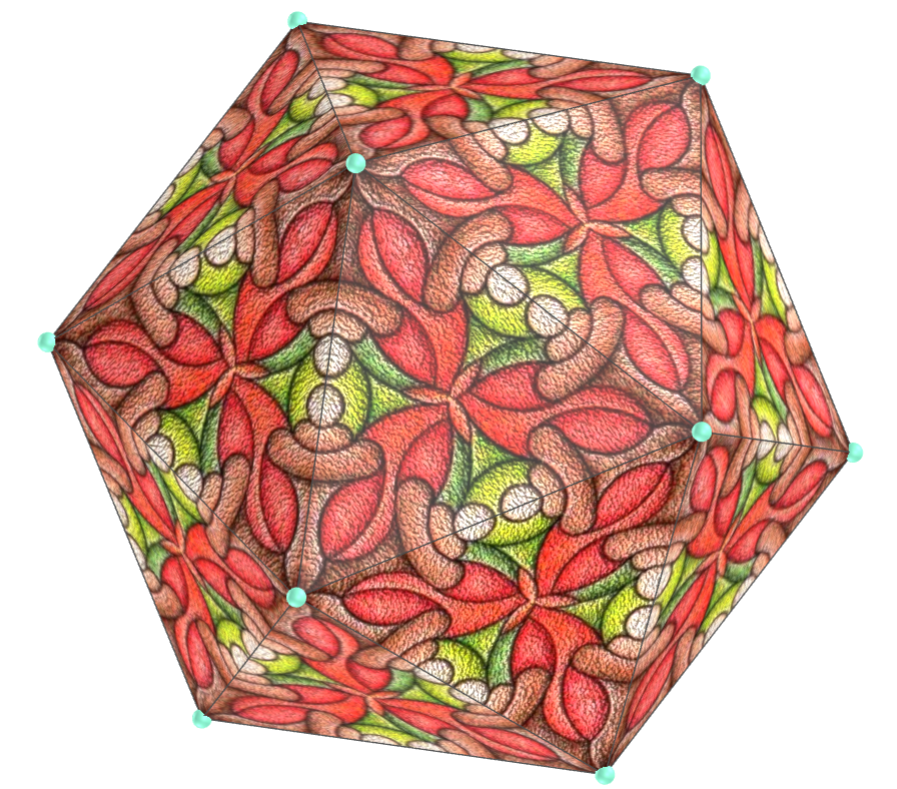</a>
  <b>descrição</b>: Tesselação de Vibali
  <b>tipo de tesselação</b>: quadrilateral e triangular
  <b>poliedros</b>: dodecaedro 10-akis de Möbius, icosaedro hexakis de Möbius, octaedro, hexaedro tetrakis, Octaedro estrelado, Icosaedro
  

<a href="#p1" class="topo">voltar ao topo</a>

<h4>21. Tesselação pentagonal espiral</h4>
<a href="../vr/Tessellation11a.htm" target="_blank" title="modelo 3D" class="fotoA">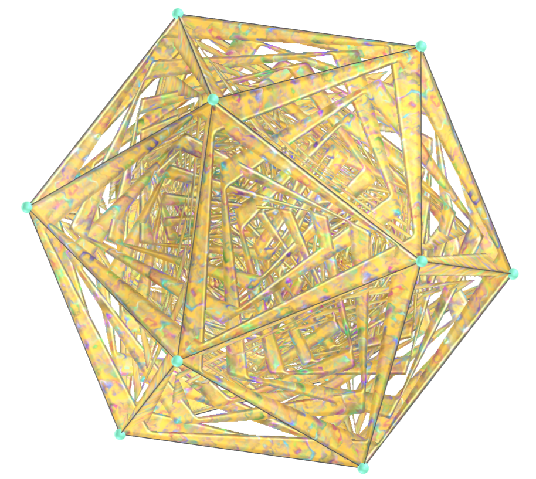</a>
  <b>descrição</b>: Tesselação pentagonal espiral
  <b>tipo de tesselação</b>: pentagonal
  <b>poliedros</b>: Icositetraedro Pentagonal, Tetartoide, Hexecontaedro Pentagonal, Dodecaedro, Grande Dodecaedro, Pequeno Dodecaedro Estrelado, Grande Dodecaedro Estrelado, Pequeno Icosidodecaedro Ditrigonal, Dodecadodecaedro Ditrigonal, Icosidodecadodecaedro Snub, Grande Dodecicosidodecaedro Ditrigonal 
  

<h4>22. Tesselação pentagonal espiral</h4>
<a href="../vr/Tessellation11b.htm" target="_blank" title="modelo 3D" class="fotoA">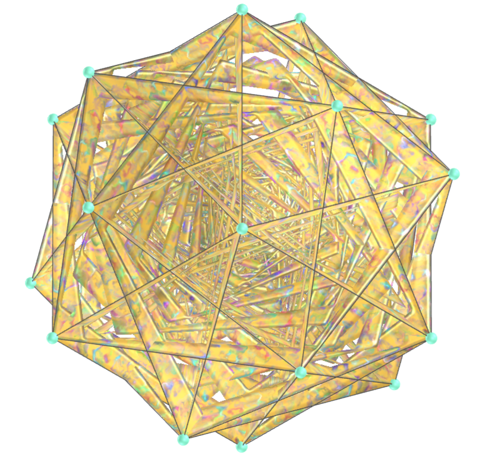</a>
  <b>descrição</b>: Tesselação pentagonal espiral
  <b>tipo de tesselação</b>: pentagonal
  <b>poliedros</b>: Dodecadodecaedro Snub, Hexecontaedro Medial Pentagonal, Dodecadodecaedro, Grande Icosidodecaedro Ditrigonal, Grande Icosidodecaedro, Icosidodecadodecaedro, Dodecadodecaedro Snub Invertido, Grande Hexecontaedro Pentagonal, Grande Hexecontaedro Pentagonal Invertido 
  

<h4>23. Tesselação de Igor Golieniev</h4>
<a href="../vr/Tessellation12a.htm" target="_blank" title="modelo 3D" class="fotoA">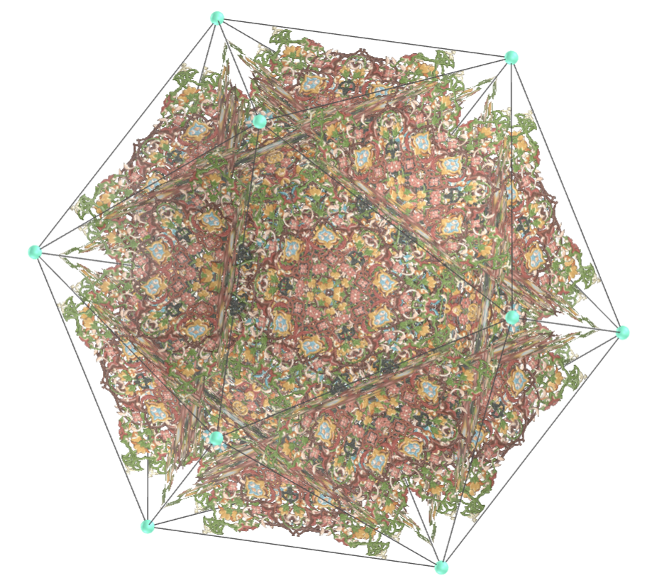</a>
  <b>descrição</b>: Tesselação de Igor Golieniev
  <b>tipo de tesselação</b>: pentagonal
  <b>poliedros</b>: Icositetraedro Pentagonal, Tetartoide, Hexecontaedro Pentagonal, Dodecaedro, Grande Dodecaedro, Pequeno Dodecaedro Estrelado, Grande Dodecaedro Estrelado, Pequeno Icosidodecaedro Ditrigonal, Dodecadodecaedro Ditrigonal, Icosidodecadodecaedro Snub, Grande Dodecicosidodecaedro Ditrigonal 
  

<h4>24. Tesselação de Igor Golieniev</h4>
<a href="../vr/Tessellation12b.htm" target="_blank" title="modelo 3D" class="fotoA">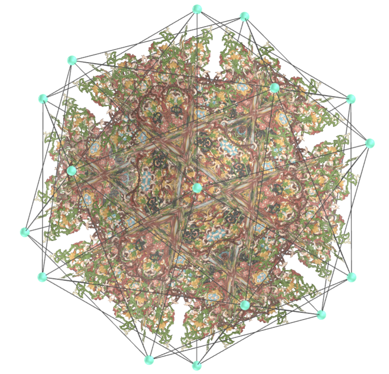</a>
  <b>descrição</b>: Tesselação de Igor Golieniev
  <b>tipo de tesselação</b>: pentagonal
  <b>poliedros</b>: Dodecadodecaedro Snub, Hexecontaedro Medial Pentagonal, Dodecadodecaedro, Grande Icosidodecaedro Ditrigonal, Grande Icosidodecaedro, Icosidodecadodecaedro, Dodecadodecaedro Snub Invertido, Grande Hexecontaedro Pentagonal, Grande Hexecontaedro Pentagonal Invertido 
  

<h4>25. Tesselação de Gordon Dylan Johnson</h4>
<a href="../vr/Tessellation13a.htm" target="_blank" title="modelo 3D" class="fotoA">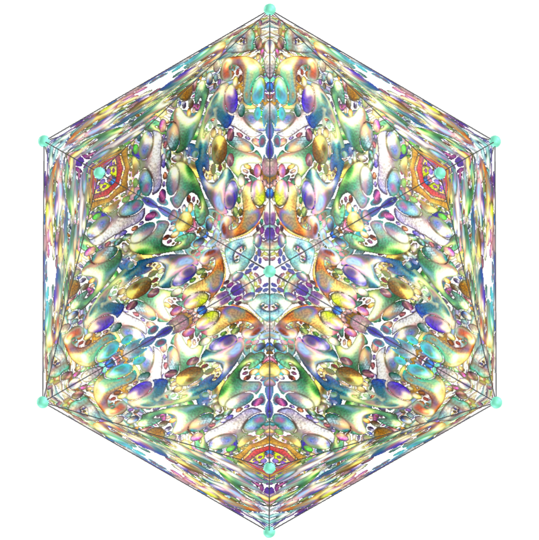</a>
  <b>descrição</b>: Tesselação de Gordon Dylan Johnson
  <b>tipo de tesselação</b>: triangular e quadrilateral
  <b>poliedros</b>: octaedro hexaédrico de Möbius, dodecaedro 10-akis de Möbius, sólido de Escher, tetraedro hexakis, icosaedro hexakis de Möbius, octaedro, deltaedro de Möbius, hexaedro octakis de Möbius, hexaedro Tetrakis, dipirâmide pentagonal, grande icosaedro
  

<h4>26. Tesselação de Gordon Dylan Johnson</h4>

  <b>descrição</b>: Tesselação de Gordon Dylan Johnson
  <b>tipo de tesselação</b>: triangular e quadrilateral
  <b>poliedros</b>: hexecontaedro deltoidal, triacontaedro rômbico, cubo, dodecaedro rômbico, hexecontaedro rômbico, icositetraedro deltoidal, grande hexecontaedro dodecacrônico, grande triacontaedro rômbico, hexecontaedro deltoidal medial, hexecontaedro icosacrônico medial, triacontaedro rômbico medial
  
 

<h4>27. Tesselação de Gordon Dylan Johnson</h4>
<a href="../vr/Tessellation13c.htm" target="_blank" title="modelo 3D" class="fotoA">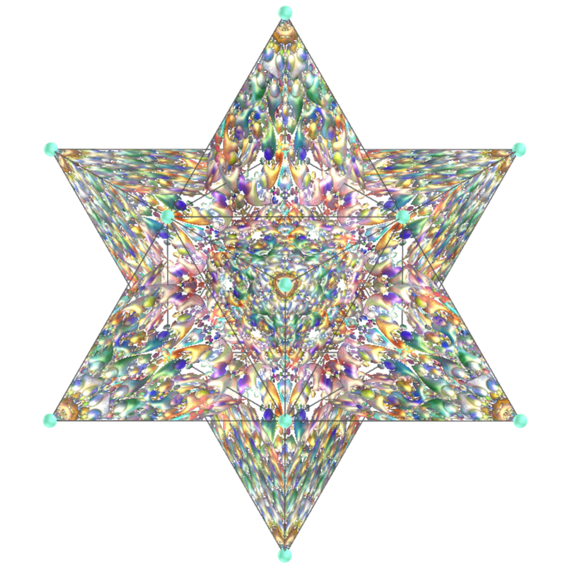</a>
  <b>descrição</b>: tesselação de Gordon Dylan Johnson
  <b>tipo de tesselação</b>: triangular e quadrilateral
  <b>poliedros</b>: Rombidodecadodecaedro, Pequeno Hexecontaedro Dodecacrônico, Grande Hexecontaedro Icosacrônico, Octaedro Estrelado, Dodecadodecaedro Truncado, Grande Rombihexaedro, Pequeno Hexecontaedro Icosacrônico, Grande Rombidodecaedro, Grande Icosidodecaedro Truncado
  

<h4>28. Tesselação de Goshashka</h4>
<a href="../vr/Tessellation14a.htm" target="_blank" title="modelo 3D" class="fotoA">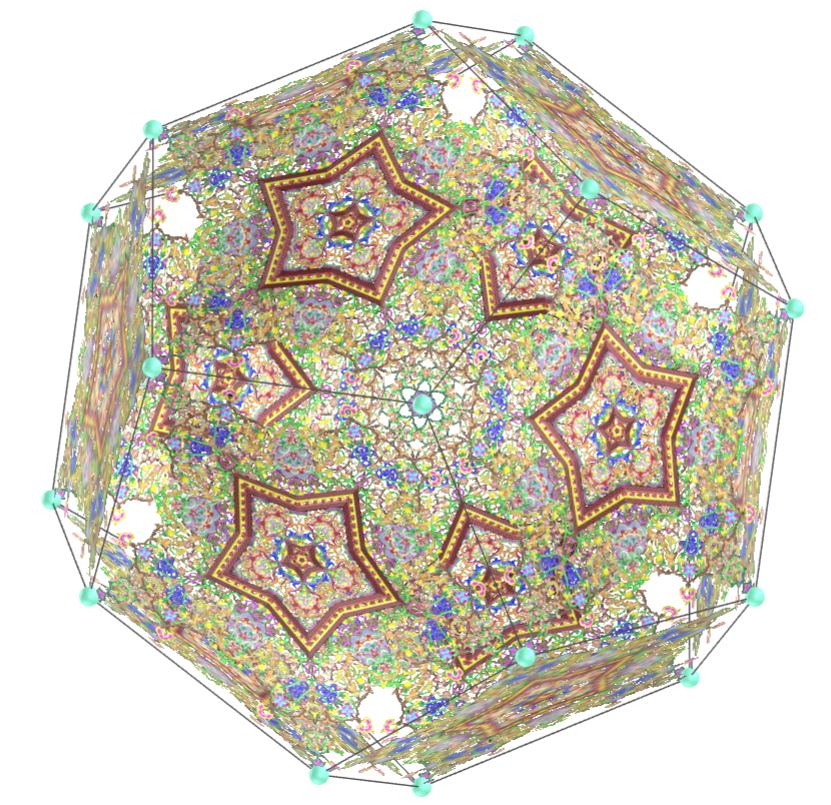</a>
  <b>descrição</b>: Tesselação de Goshashka
  <b>tipo de tesselação</b>: pentagonal
  <b>poliedros</b>: Icositetraedro Pentagonal, Tetartoide, Hexecontaedro Pentagonal, Dodecaedro, Grande Dodecaedro, Pequeno Dodecaedro Estrelado, Grande Dodecaedro Estrelado, Pequeno Icosidodecaedro Ditrigonal, Dodecadodecaedro Ditrigonal, Icosidodecadodecaedro Snub, Grande Dodecicosidodecaedro Ditrigonal 
  

<h4>29. Tesselação de Goshashka</h4>
<a href="../vr/Tessellation14b.htm" target="_blank" title="modelo 3D" class="fotoA">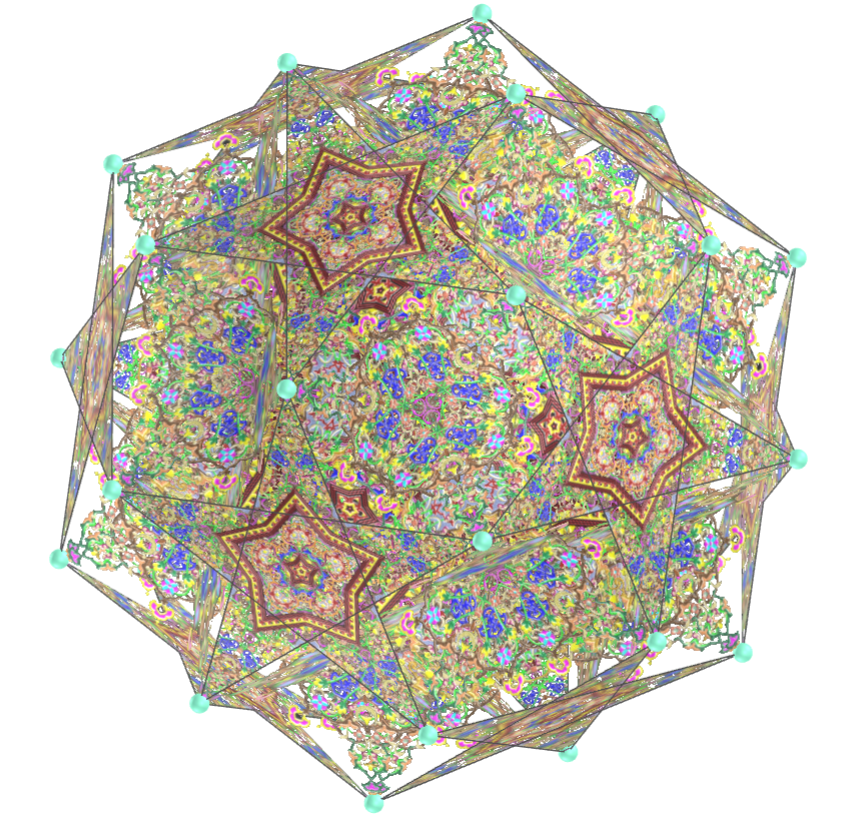</a>
  <b>descrição</b>: Tesselação de Goshashka
  <b>tipo de tesselação</b>: pentagonal
  <b>poliedros</b>: Dodecadodecaedro Snub, Hexecontaedro Medial Pentagonal, Dodecadodecaedro, Grande Icosidodecaedro Ditrigonal, Grande Icosidodecaedro, Icosidodecadodecaedro, Dodecadodecaedro Snub Invertido, Grande Hexecontaedro Pentagonal, Grande Hexecontaedro Pentagonal Invertido
  

<h4>30. Tesselação de quadrado</h4>
<a href="../vr/Tessellation15a.htm" target="_blank" title="modelo 3D" class="fotoA">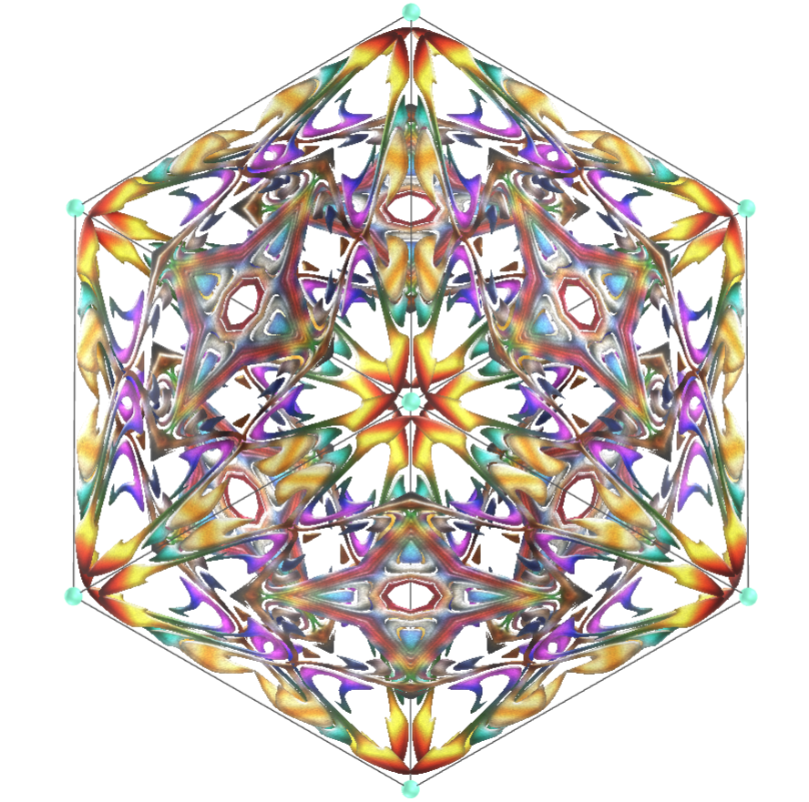</a>
  <b>descrição</b>: Tesselação de quadrado
  <b>tipo de tesselação</b>: triangular e quadrilateral
  <b>poliedros</b>: octaedro hexaédrico de Möbius, sólido de Escher, tetraedro hexakis, deltaedro de Möbius, hexaedro octakis de Möbius, hexecontaedro deltoidal, icositetraedro deltoidal, cubo, dipirâmide pentagonal
  

<a href="#p1" class="topo">voltar ao topo</a>

<h4>31. Tesselação de quadrado</h4>
<a href="../vr/Tessellation15b.htm" target="_blank" title="modelo 3D" class="fotoA">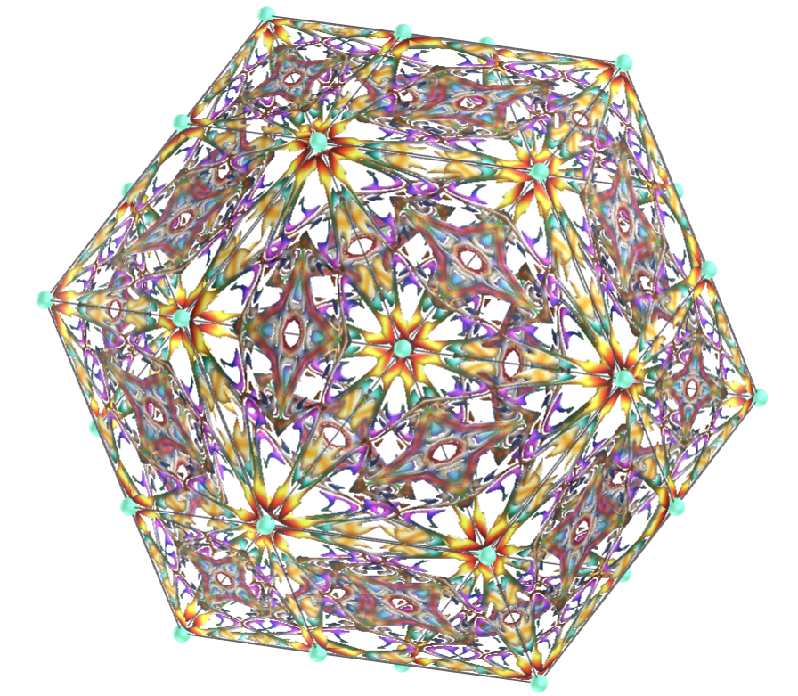</a>
  <b>descrição</b>: Tesselação de quadrado
  <b>tipo de tesselação</b>: triangular e quadrilateral
  <b>poliedros</b>: dodecaedro rômbico, dodecaedro 10-akis de Möbius, hexecontaedro rômbico, icosaedro hexakis de Möbius, octaedro, hexaedro tetrakis, triacontaedro rômbico, octaedro estrelado
  

<h4>32. Tesselação decagonal</h4>
<a href="../vr/Tessellation16a.htm" target="_blank" title="modelo 3D" class="fotoA">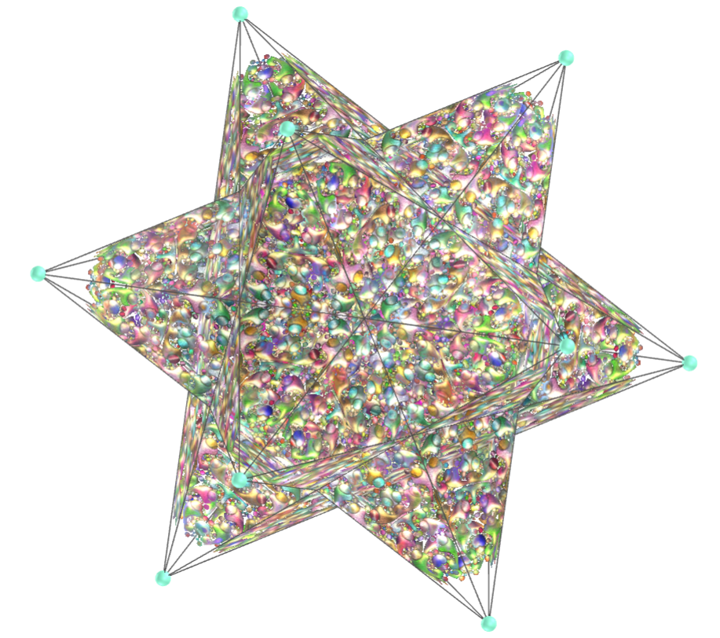</a>
  <b>descrição</b>: Tesselação decagonal
  <b>tipo de tesselação</b>: pentagonal
  <b>poliedros</b>: Icositetraedro Pentagonal, Tetartoide, Hexecontaedro Pentagonal, Dodecaedro, Grande Dodecaedro, Pequeno Dodecaedro Estrelado, Grande Dodecaedro Estrelado, Pequeno Icosidodecaedro Ditrigonal, Dodecadodecaedro Ditrigonal, Icosidodecadodecaedro Snub, Grande Dodecicosidodecaedro Ditrigonal 
  

<h4>33. Tesselação decagonal</h4>
<a href="../vr/Tessellation16b.htm" target="_blank" title="modelo 3D" class="fotoA">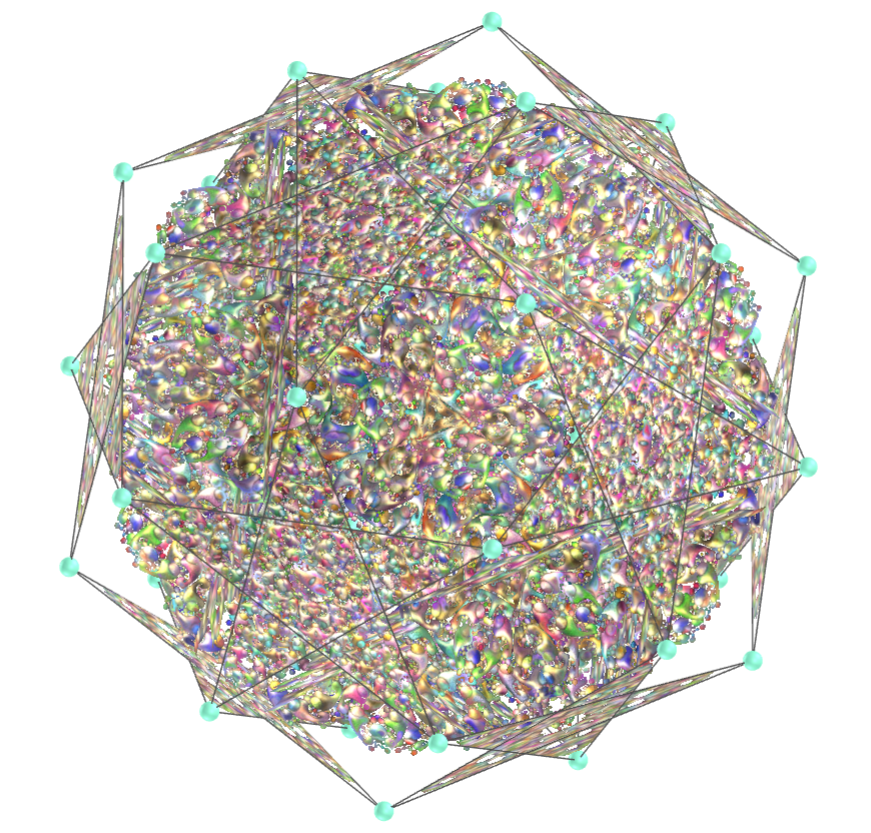</a>
  <b>descrição</b>: Tesselação decagonal
  <b>tipo de tesselação</b>: pentagonal
  <b>poliedros</b>: Dodecadodecaedro Snub, Hexecontaedro Medial Pentagonal, Dodecadodecaedro, Grande Icosidodecaedro Ditrigonal, Grande Icosidodecaedro, Icosidodecadodecaedro, Dodecadodecaedro Snub Invertido, Grande Hexecontaedro Pentagonal, Grande Hexecontaedro Pentagonal Invertido
  

<h4>34. Tesselação pentagonal</h4>
<a href="../vr/Tessellation17a.htm" target="_blank" title="modelo 3D" class="fotoA">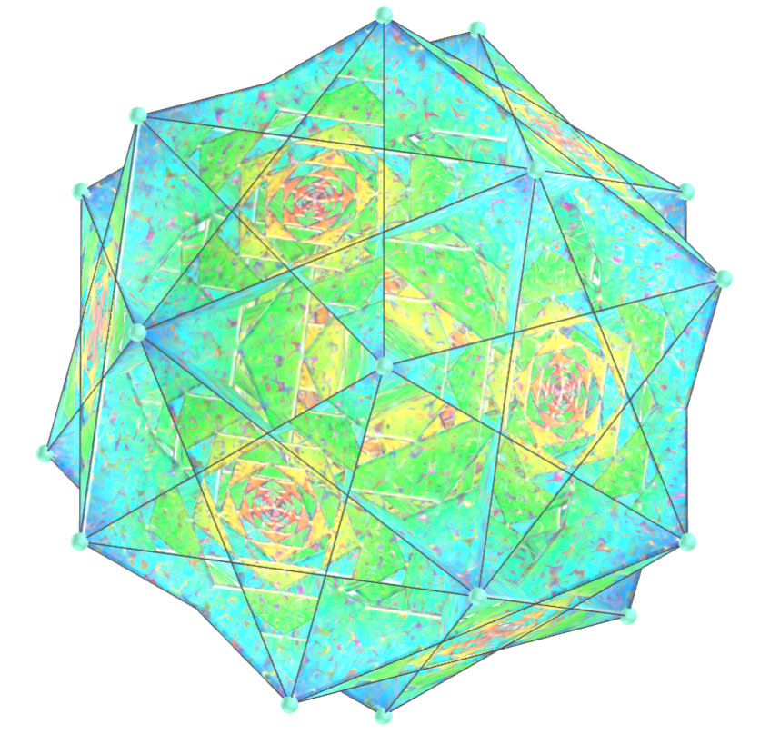</a>
  <b>descrição</b>: Tesselação pentagonal
  <b>tipo de tesselação</b>: pentagonal
  <b>poliedros</b>: Icositetraedro Pentagonal, Tetartoide, Hexecontaedro Pentagonal, Dodecaedro, Grande Dodecaedro, Pequeno Dodecaedro Estrelado, Grande Dodecaedro Estrelado, Pequeno Icosidodecaedro Ditrigonal, Dodecadodecaedro Ditrigonal, Icosidodecadodecaedro Snub, Grande Dodecicosidodecaedro Ditrigonal 
  

<h4>35. Tesselação pentagonal</h4>
<a href="../vr/Tessellation17b.htm" target="_blank" title="modelo 3D" class="fotoA">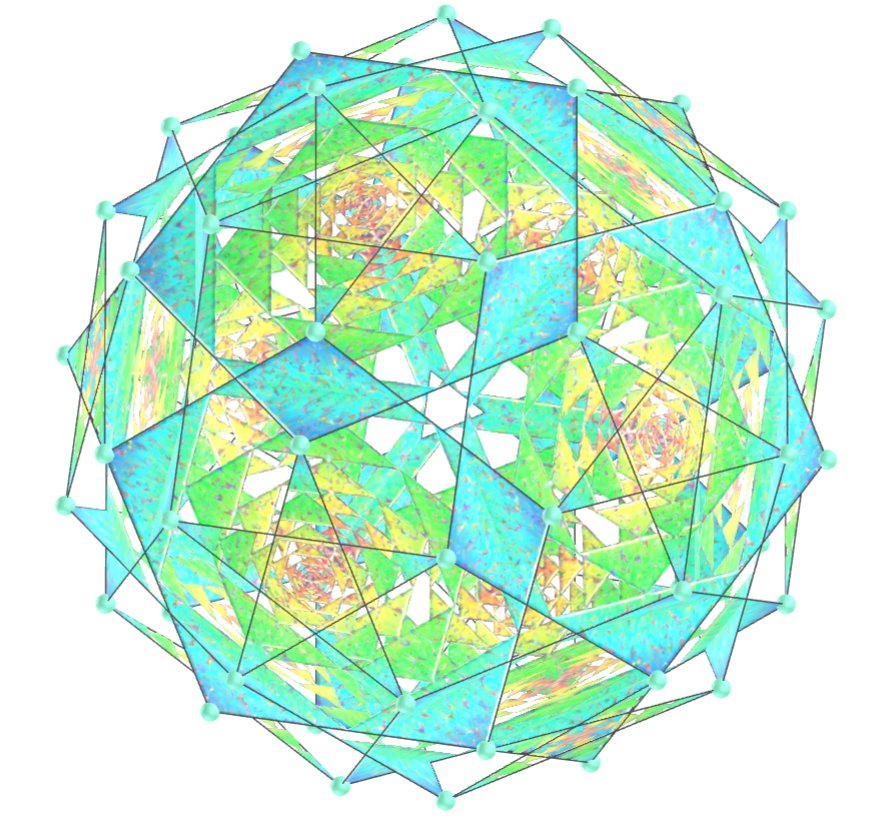</a>
  <b>descrição</b>: Tesselação pentagonal
  <b>tipo de tesselação</b>: pentagonal
  <b>poliedros</b>: Dodecadodecaedro Snub, Hexecontaedro Medial Pentagonal, Dodecadodecaedro, Grande Icosidodecaedro Ditrigonal, Grande Icosidodecaedro, Icosidodecadodecaedro, Dodecadodecaedro Snub Invertido, Grande Hexecontaedro Pentagonal, Grande Hexecontaedro Pentagonal Invertido
  

<a href="#p1" class="topo">voltar ao topo</a>

  Tessellation - part 4: polyhedra tessellation and visualization with Virtual Reality de <a xmlns:cc="http://creativecommons.org/ns#" href="https://paulohscwb.github.io/tessellation/part4/pt-br/" property="cc:attributionName" rel="cc:attributionURL">Paulo Henrique Siqueira</a> está licenciado com uma Licença <a rel="license" href="http://creativecommons.org/licenses/by-nc-nd/4.0/">Creative Commons Atribuição-NãoComercial-SemDerivações 4.0 Internacional</a>.

<h4>Como citar este trabalho:</h4> 

Siqueira, P.H., "Tessellation - part 4: polyhedra tessellation and visualization with Virtual Reality". Disponível em: <https://paulohscwb.github.io/tessellation/part4/pt-br/>, Setembro de 2025.

<!---->
  <b>Referências:</b>
 Champagne, F. "Tessellations by Francine Champagne" <a href="https://tessellations.ca/" target="_blank"> https://tessellations.ca/</a>
 Weisstein, Eric W. "Tessellation." From MathWorld--A Wolfram Web Resource. <a href="https://mathworld.wolfram.com/Tessellation.html" target="_blank"> https://mathworld.wolfram.com/Tessellation.html</a>
 Mohr, R. "Tiled Art" <a href="https://tiled.art/en/home" target="_blank">https://tiled.art/en/home</a> 
 McCooey, D. I. "Visual Polyhedra". <a href="http://dmccooey.com/polyhedra/" target="_blank">http://dmccooey.com/polyhedra/</a>
