<link rel="stylesheet" href="../scripts/style.css">
<meta charset="utf-8">
<link rel="icon" type="image/png" href="vr/salas/imagens/icone.png">
<h2>Visualization of Polyhedra tessellation with Virtual Reality (VR) in A-frame</h2>
 <b>author:</b> Paulo Henrique Siqueira - Universidade Federal do Paraná
  <b>contact:</b> <a href="#">paulohscwb@gmail.com</a>
  <a href="https://paulohscwb.github.io/tessellation/part6/pt-br/">versão em português</a>
 <form style="margin: 0 auto; float:right; text-align:right; width:100%; margin-bottom:15px;">
	<select id="url" onchange="urlHandler(this.value)" style="color:royalblue;">
		<option disabled selected value>More solids:</option>
		<option value="../Escher/">Escher's Works</option>
		<option value="../part2/">Tessellation 2</option>
		<option value="../part3/">Tessellation 3</option>
		<option value="../part4/">Tessellation 4</option>
		<option value="../spiderweb/">Spider web</option>
		<option value="../flower1/">Flower of life 1</option>
		<option value="../part5/">Tessellation 5</option>
		<option disabled value="../part6/">Tessellation 6</option>
		<option value="../strips/">Tessellation in strips</option>
		<!--<option value="../part7/">Tessellation 7</option>
		<option value="../part8/">Tessellation 8</option>
		<option value="../part9/">Tessellation 9</option>
		<option value="../part10/">Tessellation 10</option>
		<option value="../part11/">Tessellation 11</option>-->
	</select>
</form>

  <h2 align="center">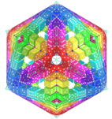 Tessellation - part 6</h2>
The figures or works that are chosen as tesserae cover or pave the plane or a surface. The result is called tessellation, tiling, paving or mosaic. 
Tessellations have been used since ancient times in floors, walls, carpets and other objects.
 This work shows the tessellations made on all or some faces of polyhedrons, taking advantage of triangular, square, pentagonal or hexagonal symmetries of the faces of these solids.
 On this page, we have some tessellation works inserted into the faces of common polyhedrons, such as the Platonic tetrahedron, cube or icosahedron, as well as rarer polyhedrons, such as the Johnson solids.

<a href="#m3d">3D Models</a>&nbsp;&nbsp;|&nbsp;&nbsp;<a href="../">Home</a>

 

 

<h3 id="m3d" align="center">3D models</h3>
<!--<iframe width="560" height="315" style="max-width:100%" src="https://www.youtube.com/embed/videoseries?list=PLy0I_lGW8HxWA5EBDIfbbTwIAXplNyOWx" title="YouTube video player" frameborder="0" allow="accelerometer; autoplay; clipboard-write; encrypted-media; gyroscope; picture-in-picture; web-share" allowfullscreen></iframe>-->
<h4>1. Pentagonal tessellation</h4>
<a href="vr/Tessellation14a.htm" target="_blank" title="3D model" class="fotoA">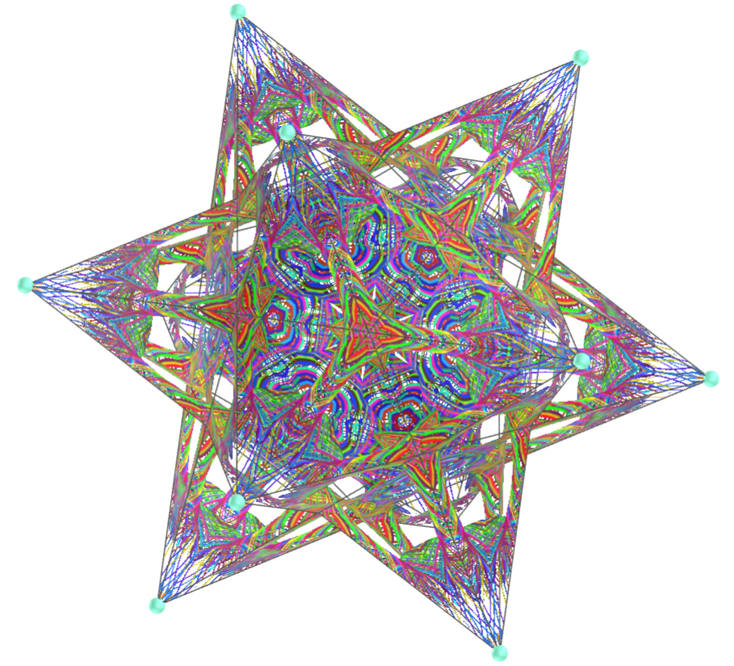</a>
  <b>description</b>: pentagonal tessellation
  <b>tessellation type</b>: pentagonal
  <b>polyhedra</b>: pentagonal icositetrahedron, tetartoid, pentagonal hexecontahedron, dodecahedron, great dodecahedron, small stellated dodecahedron, great stellated dodecahedron, small ditrigonal icosidodecahedron, ditrigonal dodecadodecahedron, snub icosidodecadodecahedron, great ditrigonal dodecicosidodecahedron
  

<h4>2. Pentagonal tessellation</h4>
<a href="vr/Tessellation14b.htm" target="_blank" title="3D model" class="fotoA">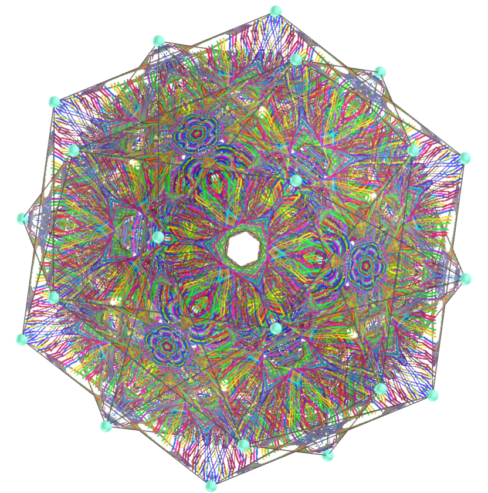</a>
  <b>description</b>: pentagonal tessellation
  <b>tessellation type</b>: pentagonal
  <b>polyhedra</b>: snub dodecadodecahedron, medial pentagonal hexecontahedron, dodecadodecahedron, great ditrigonal icosidodecahedron, great icosidodecahedron, icosidodecadodecahedron, inverted snub dodecadodecahedron, great pentagonal hexecontahedron, great inverted pentagonal hexecontahedron
  

<h4>3. Mandala pentagonal tessellation</h4>
<a href="vr/Tessellation15a.htm" target="_blank" title="3D model" class="fotoA">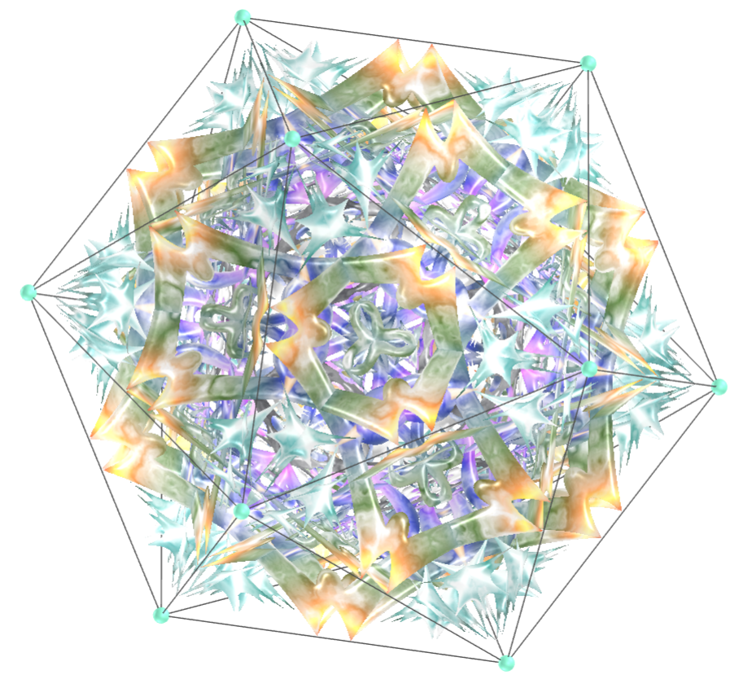</a>
  <b>description</b>: mandala pentagonal tessellation
  <b>tessellation type</b>: pentagonal
  <b>polyhedra</b>: pentagonal icositetrahedron, tetartoid, pentagonal hexecontahedron, dodecahedron, great dodecahedron, small stellated dodecahedron, great stellated dodecahedron, small ditrigonal icosidodecahedron, ditrigonal dodecadodecahedron, snub icosidodecadodecahedron, great ditrigonal dodecicosidodecahedron
  

<h4>4. Mandala pentagonal tessellation</h4>
<a href="vr/Tessellation15b.htm" target="_blank" title="3D model" class="fotoA">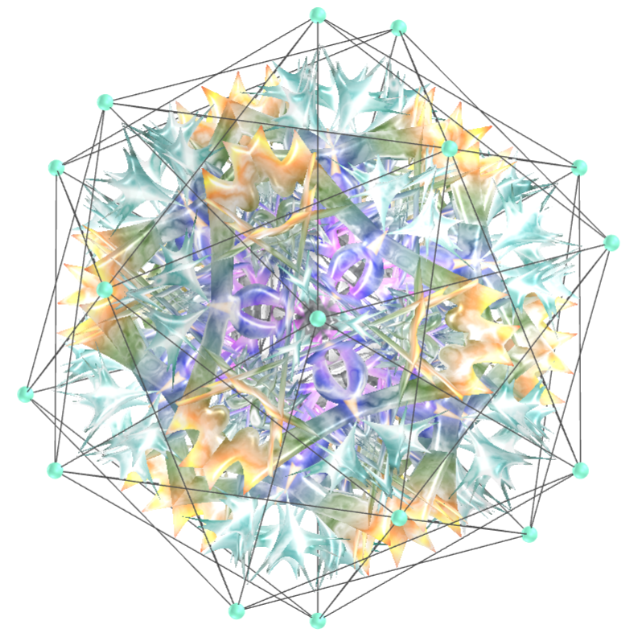</a>
  <b>description</b>: mandala pentagonal tessellation
  <b>tessellation type</b>: pentagonal
  <b>polyhedra</b>: snub dodecadodecahedron, medial pentagonal hexecontahedron, dodecadodecahedron, great ditrigonal icosidodecahedron, great icosidodecahedron, icosidodecadodecahedron, inverted snub dodecadodecahedron, great pentagonal hexecontahedron, great inverted pentagonal hexecontahedron
  

<h4>5. Penrose triangle tessellation</h4>
<a href="vr/Tessellation16a.htm" target="_blank" title="3D model" class="fotoA">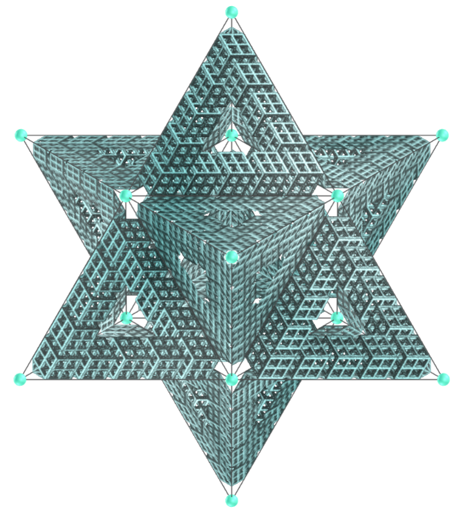</a>
  <b>description</b>: Penrose triangle tessellation
  <b>tessellation type</b>: quadrangular and triangular
  <b>polyhedra</b>: Möbius hexakis octahedron, Escher solid, hexakis tetrahedron, Möbius deltahedron, Möbius octakis hexahedron, great icosahedron, inverted snub dodecadodecahedron, stella octangula, tetrahedron, pentakis dodecahedron, pentagrammic dipyramid
  

<h4>6. Penrose triangle tessellation</h4>
<a href="vr/Tessellation16b.htm" target="_blank" title="3D model" class="fotoA">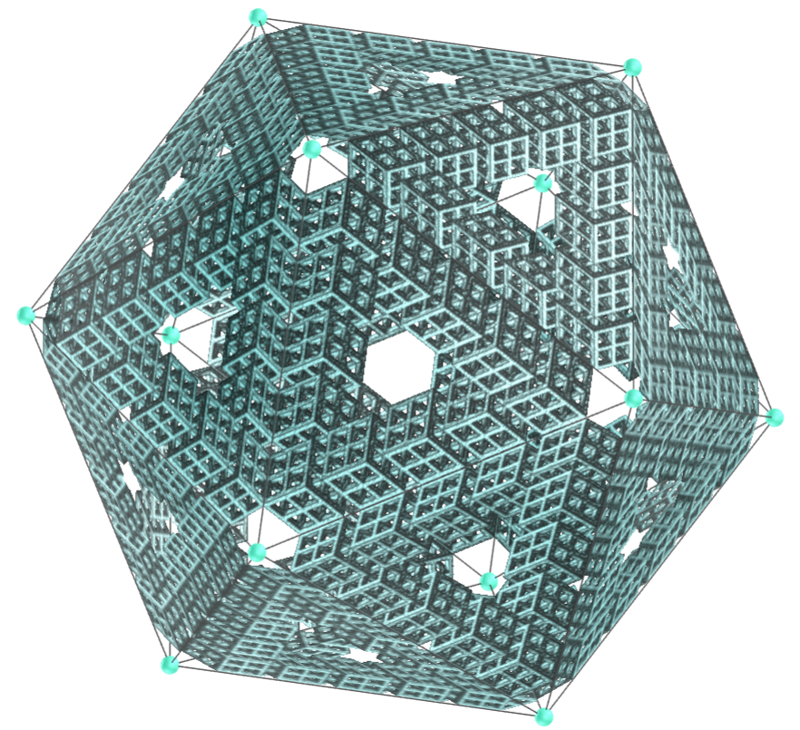</a>
  <b>description</b>: Penrose triangle tessellation
  <b>tessellation type</b>: quadrangular and triangular
  <b>polyhedra</b>: Möbius 10-akis dodecahedron, Möbius hexakis icosahedron, octahedron, tetrakis hexahedron, pentagonal dipyramid, icosahedron, small ditrigonal icosidodecahedron, snub dodecadodecahedron, snub icosidodecadodecahedron
  

<h4>7. Penrose triangle tessellation</h4>
<a href="vr/Tessellation16c.htm" target="_blank" title="3D model" class="fotoA">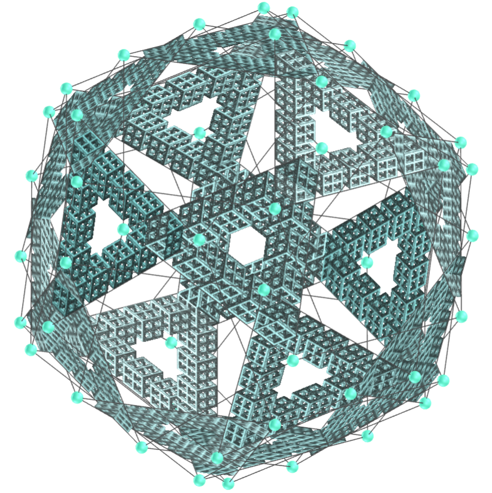</a>
  <b>description</b>: Penrose triangle tessellation
  <b>tessellation type</b>: quadrangular and triangular
  <b>polyhedra</b>: great ditrigonal dodecicosidodecahedron, great dodecicosidodecahedron, great icosidodecahedron, great stellated truncated dodecahedron, small snub icosicosidodecahedron, stellated truncated hexahedron
  

<h4>8. Celtic knot tessellation</h4>
<a href="vr/Tessellation17a.htm" target="_blank" title="3D model" class="fotoA">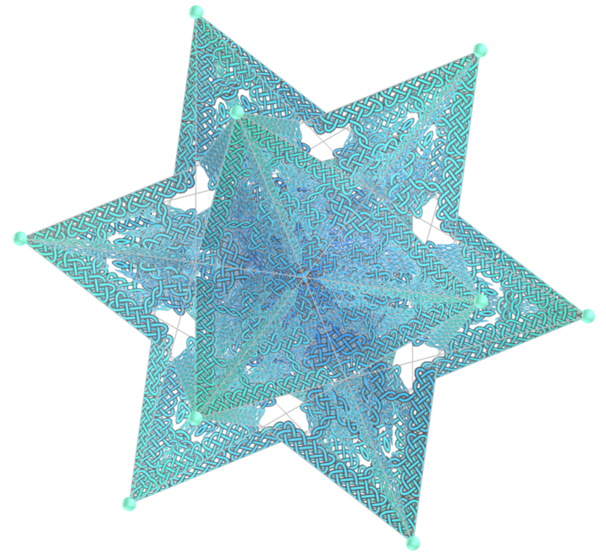</a>
  <b>description</b>: Celtic knot tessellation
  <b>tessellation type</b>: quadrangular and triangular
  <b>polyhedra</b>: Möbius hexakis octahedron, Escher solid, hexakis tetrahedron, Möbius deltahedron, Möbius octakis hexahedron, great icosahedron, inverted snub dodecadodecahedron, stella octangula, tetrahedron, great ditrigonal dodecicosidodecahedron, pentakis dodecahedron, pentagrammic dipyramid
  

<h4>9. Celtic knot tessellation</h4>
<a href="vr/Tessellation17b.htm" target="_blank" title="3D model" class="fotoA">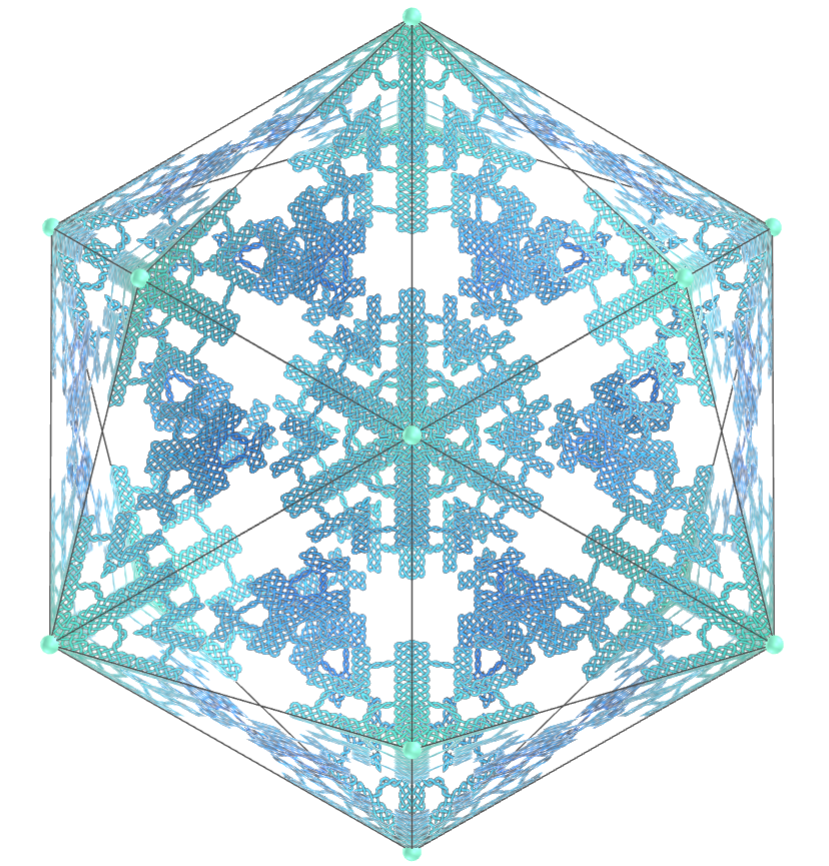</a>
  <b>description</b>: Celtic knot tessellation
  <b>tessellation type</b>: quadrangular and triangular
  <b>polyhedra</b>: Möbius 10-akis dodecahedron, Möbius hexakis icosahedron, octahedron, tetrakis hexahedron, pentagonal dipyramid, icosahedron, small ditrigonal icosidodecahedron, snub dodecadodecahedron, snub icosidodecadodecahedron
  

<h4>10. Celtic knot tessellation</h4>
<a href="vr/Tessellation17c.htm" target="_blank" title="3D model" class="fotoA">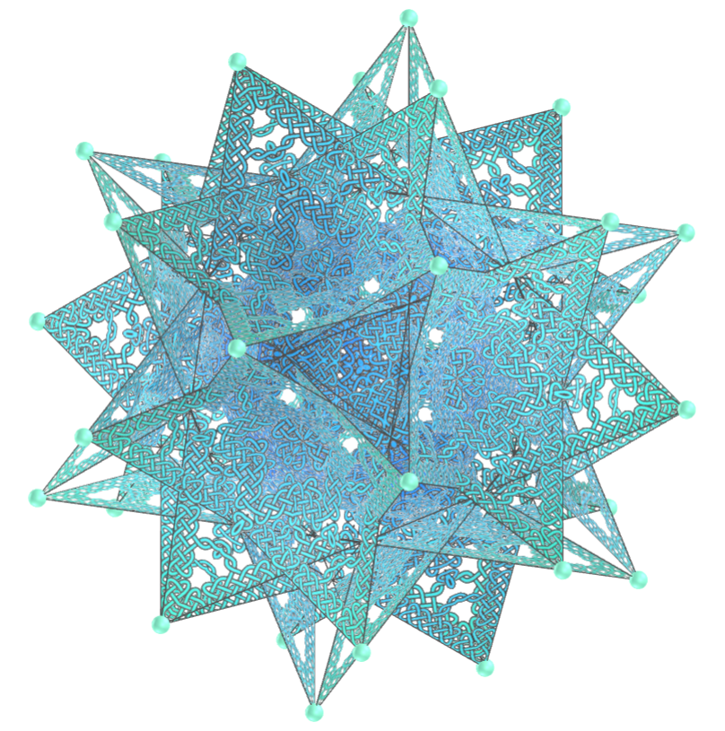</a>
  <b>description</b>: Celtic knot tessellation
  <b>tessellation type</b>: quadrangular and triangular
  <b>polyhedra</b>: great ditrigonal dodecicosidodecahedron, great dodecicosidodecahedron, great icosidodecahedron, great stellated truncated dodecahedron, small snub icosicosidodecahedron, stellated truncated hexahedron
  

<a href="#p1" class="topo">back to top</a>

<h4>11. Triangular tessellation</h4>
<a href="vr/Tessellation18a.htm" target="_blank" title="3D model" class="fotoA">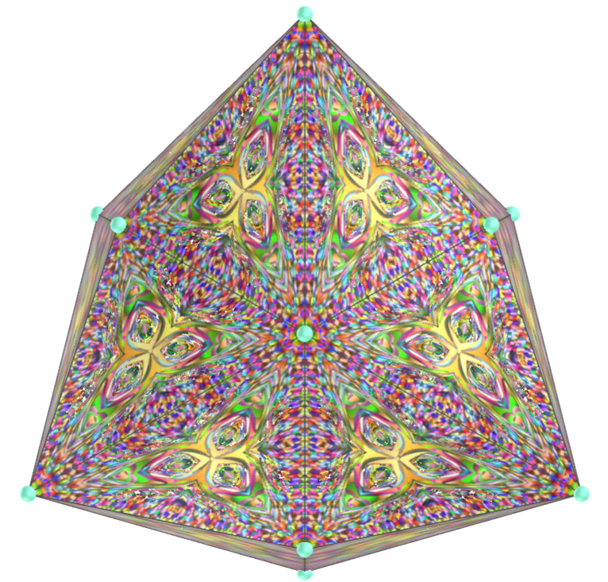</a>
  <b>description</b>: triangular tessellation
  <b>tessellation type</b>: quadrangular and triangular
  <b>polyhedra</b>: Möbius hexakis octahedron, Escher solid, hexakis tetrahedron, Möbius deltahedron, Möbius octakis hexahedron, great icosahedron, inverted snub dodecadodecahedron, stella octangula, tetrahedron, pentakis dodecahedron, pentagrammic dipyramid
  

<h4>12. Triangular tessellation</h4>
<a href="vr/Tessellation18b.htm" target="_blank" title="3D model" class="fotoA">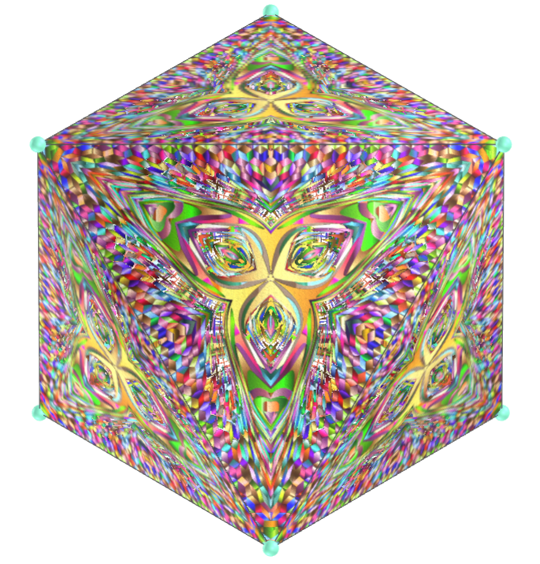</a>
  <b>description</b>: triangular tessellation
  <b>tessellation type</b>: quadrangular and triangular
  <b>polyhedra</b>: Möbius 10-akis dodecahedron, Möbius hexakis icosahedron, octahedron, tetrakis hexahedron, pentagonal dipyramid, icosahedron, small ditrigonal icosidodecahedron, snub dodecadodecahedron, snub icosidodecadodecahedron
  

<h4>13. Triangular tessellation</h4>
<a href="vr/Tessellation18c.htm" target="_blank" title="3D model" class="fotoA">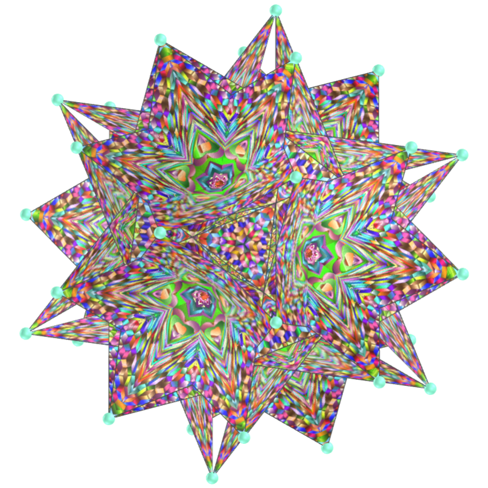</a>
  <b>description</b>: triangular tessellation
  <b>tessellation type</b>: quadrangular and triangular
  <b>polyhedra</b>: great ditrigonal dodecicosidodecahedron, great dodecicosidodecahedron, great icosidodecahedron, great stellated truncated dodecahedron, small snub icosicosidodecahedron, stellated truncated hexahedron
  

<h4>14. Penrose triangle tessellation</h4>
<a href="vr/Tessellation19a.htm" target="_blank" title="3D model" class="fotoA">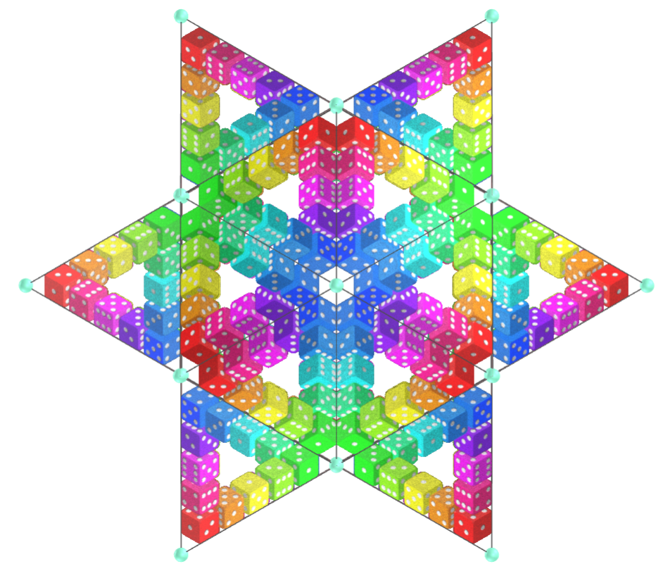</a>
  <b>description</b>: Penrose triangle tessellation
  <b>tessellation type</b>: quadrangular and triangular
  <b>polyhedra</b>: Möbius hexakis octahedron, Escher solid, hexakis tetrahedron, Möbius deltahedron, Möbius octakis hexahedron, great icosahedron, inverted snub dodecadodecahedron, stella octangula, tetrahedron, great ditrigonal dodecicosidodecahedron, pentakis dodecahedron
  

<h4>15. Penrose triangle tessellation</h4>
<a href="vr/Tessellation19b.htm" target="_blank" title="3D model" class="fotoA">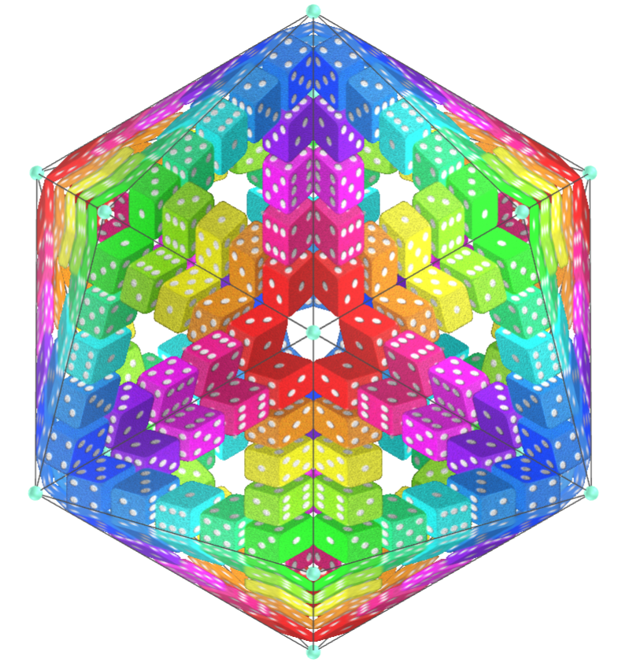</a>
  <b>description</b>: Penrose triangle tessellation
  <b>tessellation type</b>: quadrangular and triangular
  <b>polyhedra</b>: Möbius 10-akis dodecahedron, Möbius hexakis icosahedron, octahedron, tetrakis hexahedron, pentagonal dipyramid, icosahedron, small ditrigonal icosidodecahedron, snub dodecadodecahedron, snub icosidodecadodecahedron
  

<h4>16. Triangular tessellation</h4>
<a href="vr/Tessellation20a.htm" target="_blank" title="3D model" class="fotoA">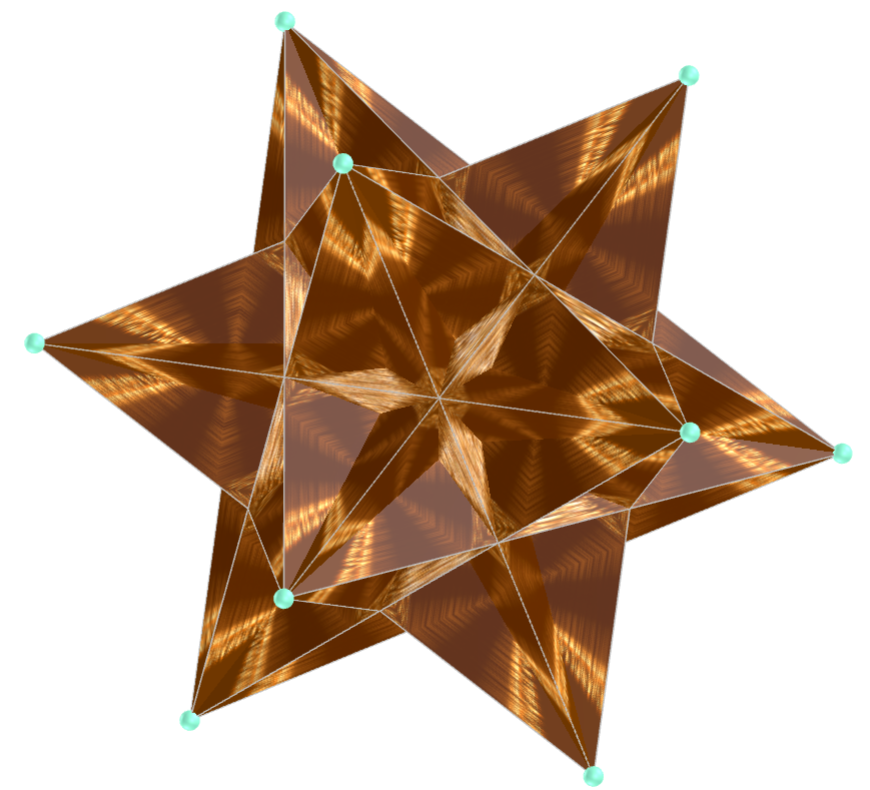</a>
  <b>description</b>: triangular tessellation
  <b>tessellation type</b>: quadrangular and triangular
  <b>polyhedra</b>: Möbius hexakis octahedron, Escher solid, hexakis tetrahedron, Möbius deltahedron, Möbius octakis hexahedron, great icosahedron, inverted snub dodecadodecahedron, stella octangula, tetrahedron, pentakis dodecahedron, triakis octahedron, triakis icosahedron
  

<h4>17. Triangular tessellation</h4>
<a href="vr/Tessellation20b.htm" target="_blank" title="3D model" class="fotoA">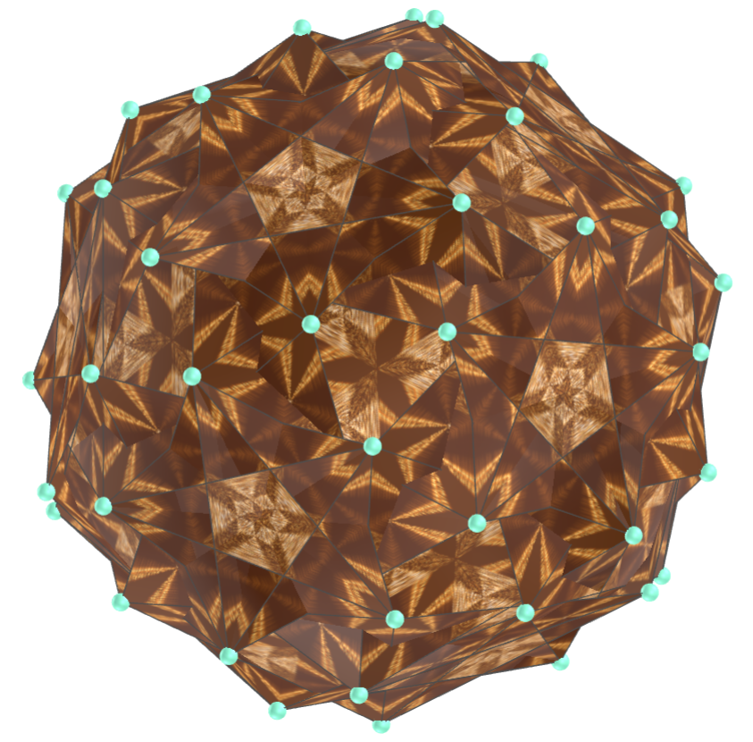</a>
  <b>description</b>: triangular tessellation
  <b>tessellation type</b>: quadrangular and triangular
  <b>polyhedra</b>: Möbius 10-akis dodecahedron, Möbius hexakis icosahedron, octahedron, tetrakis hexahedron, pentagonal dipyramid, icosahedron, small ditrigonal icosidodecahedron, snub dodecadodecahedron, snub icosidodecadodecahedron, pentagrammic dipyramid
  

<h4>18. Triangular tessellation</h4>
<a href="vr/Tessellation20c.htm" target="_blank" title="3D model" class="fotoA">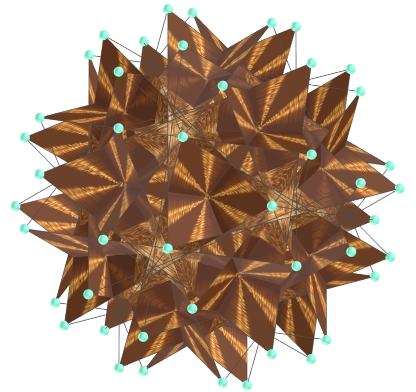</a>
  <b>description</b>: triangular tessellation
  <b>tessellation type</b>: quadrangular and triangular
  <b>polyhedra</b>: great ditrigonal dodecicosidodecahedron, great dodecicosidodecahedron, great icosidodecahedron, great stellated truncated dodecahedron, small snub icosicosidodecahedron, stellated truncated hexahedron, triakis tetrahedron
  

<h4>19. Pentagrammic tessellation</h4>
<a href="vr/Tessellation21a.htm" target="_blank" title="3D model" class="fotoA">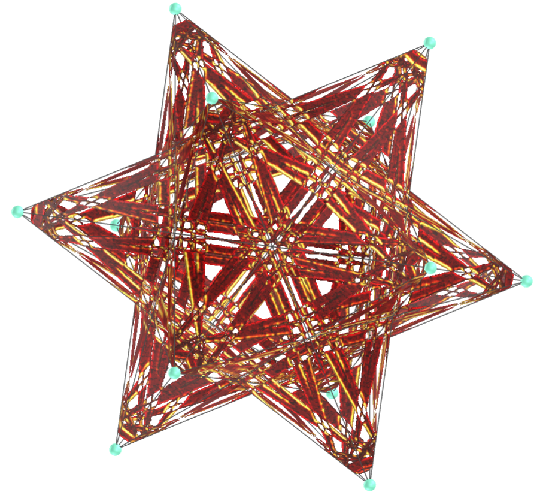</a>
  <b>description</b>: pentagrammic tessellation
  <b>tessellation type</b>: pentagonal
  <b>polyhedra</b>: pentagonal icositetrahedron, tetartoid, pentagonal hexecontahedron, dodecahedron, great dodecahedron, small stellated dodecahedron, great stellated dodecahedron, small ditrigonal icosidodecahedron, ditrigonal dodecadodecahedron, snub icosidodecadodecahedron, great ditrigonal dodecicosidodecahedron
  

<h4>20. Pentagrammic tessellation</h4>
<a href="vr/Tessellation21b.htm" target="_blank" title="3D model" class="fotoA">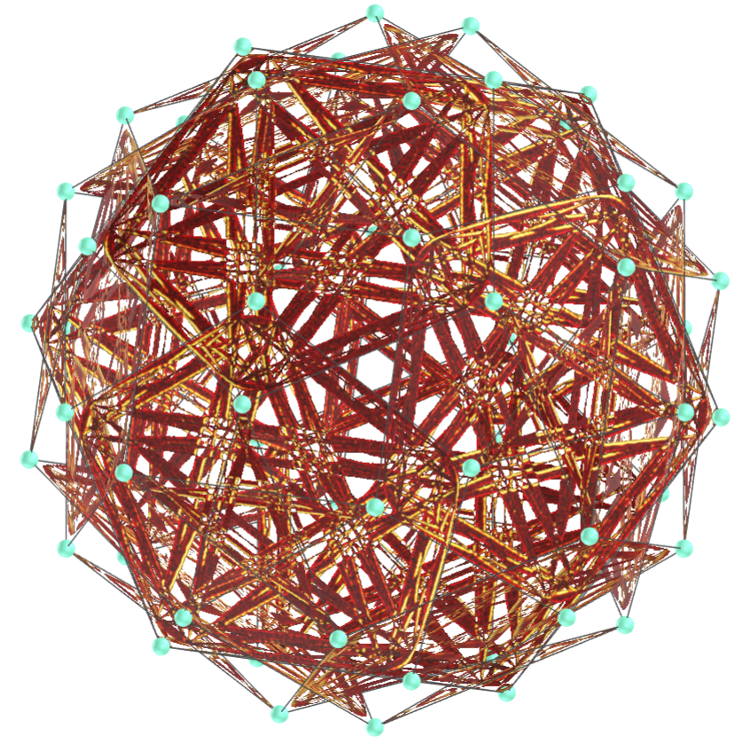</a>
  <b>description</b>: pentagrammic tessellation
  <b>tessellation type</b>: pentagonal
  <b>polyhedra</b>: snub dodecadodecahedron, medial pentagonal hexecontahedron, dodecadodecahedron, great ditrigonal icosidodecahedron, great icosidodecahedron, icosidodecadodecahedron, inverted snub dodecadodecahedron, great pentagonal hexecontahedron, great inverted pentagonal hexecontahedron
  

<a href="#p1" class="topo">back to top</a>

<h4>21. Celtic knot tessellation</h4>
<a href="vr/Tessellation22a.htm" target="_blank" title="3D model" class="fotoA">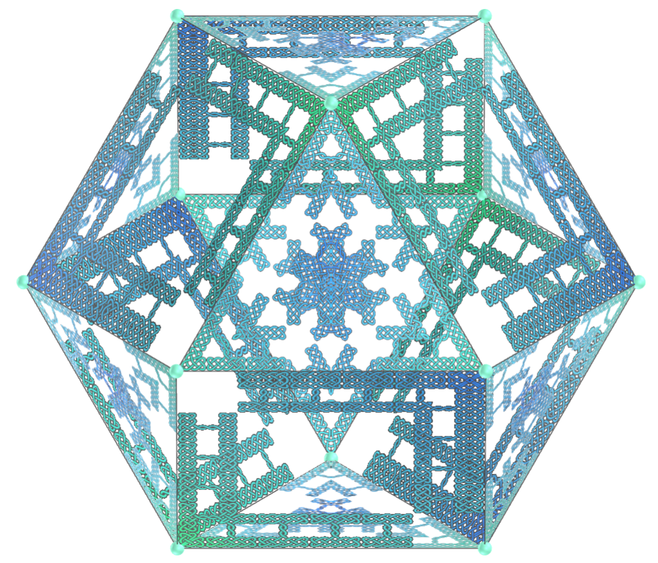</a>
  <b>description</b>: Celtic knot tessellation
  <b>tessellation type</b>: quadrangular and triangular
  <b>polyhedra</b>: Escher solid, Möbius deltahedron, deltoidal hexecontahedron, deltoidal icositetrahedron, cube, great ditrigonal dodecacronic hexecontahedron, cuboctahedron, snub cube, square orthobicupola, great rhombihexahedron, great rhombidodecahedron, pentagrammic dipyramid
  

<h4>22. Celtic knot tessellation</h4>
<a href="vr/Tessellation22b.htm" target="_blank" title="3D model" class="fotoA">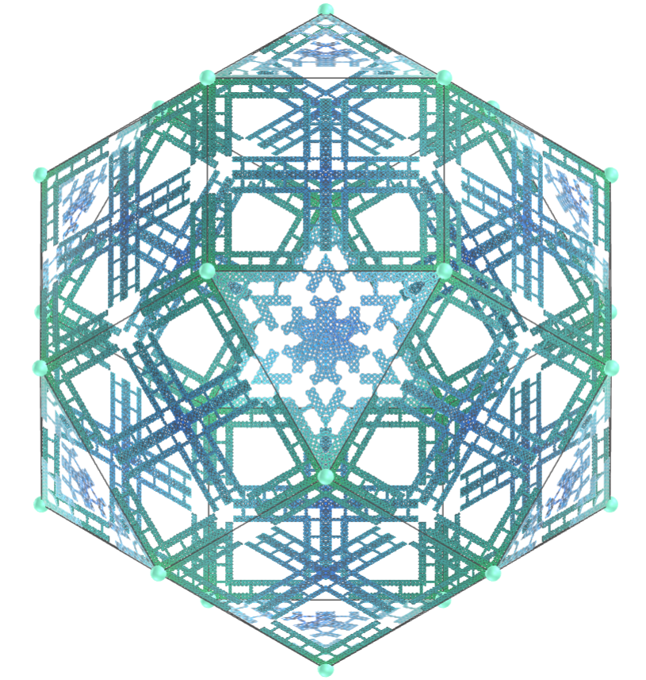</a>
  <b>description</b>: Celtic knot tessellation
  <b>tessellation type</b>: quadrangular and triangular
  <b>polyhedra</b>: rhombic dodecahedron, rhombic hexecontahedron, octahedron, tetrakis hexahedron, rhombic triacontahedron, pentagonal dipyramid, medial deltoidal hexecontahedron, rhombicuboctahedron, tetrahemihexahedron, truncated dodecadodecahedron, great truncated icosidodecahedron
  

<h4>23. Celtic knot tessellation</h4>
<a href="vr/Tessellation22c.htm" target="_blank" title="3D model" class="fotoA">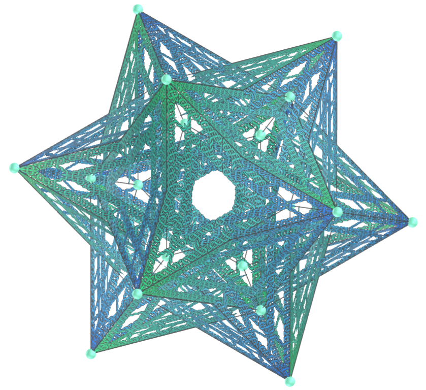</a>
  <b>description</b>: Celtic knot tessellation
  <b>tessellation type</b>: quadrangular and triangular
  <b>polyhedra</b>: great dirhombicosidodecahedron, medial rhombic triacontahedron, small dodecacronic hexecontahedron, great hexacronic icositetrahedron, medial icosacronic hexecontahedron, rhombidodecadodecahedron, small icosacronic hexecontahedron, great rhombic triacontahedron, uniform great rhombicuboctahedron, triakis tetrahedron, triakis octahedron, triakis icosahedron
  

<h4>24. Celtic knot tessellation</h4>
<a href="vr/Tessellation23a.htm" target="_blank" title="3D model" class="fotoA">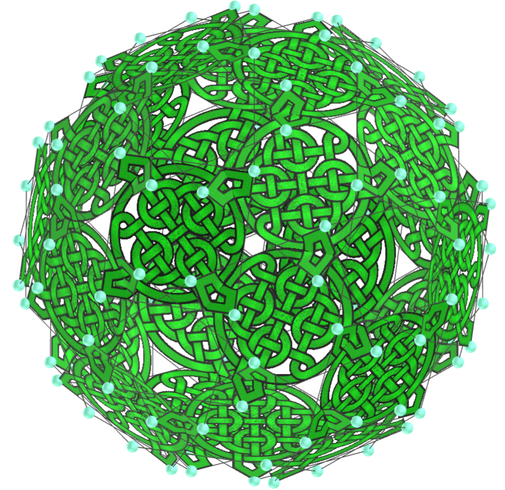</a>
  <b>description</b>: Celtic knot tessellation
  <b>tessellation type</b>: quadrangular and triangular
  <b>polyhedra</b>: Möbius hexakis octahedron, Escher solid, hexakis tetrahedron, Möbius deltahedron, Möbius octakis hexahedron, deltoidal hexecontahedron, deltoidal icositetrahedron, cube, truncated dodecadodecahedron
  

<h4>25. Celtic knot tessellation</h4>
<a href="vr/Tessellation23b.htm" target="_blank" title="3D model" class="fotoA">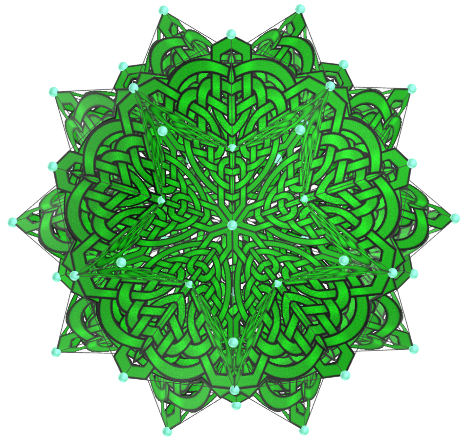</a>
  <b>description</b>: Celtic knot tessellation
  <b>tessellation type</b>: quadrangular and triangular
  <b>polyhedra</b>: rhombic dodecahedron, Möbius 10-akis dodecahedron, rhombidodecadodecahedron, Möbius hexakis icosahedron, octahedron, tetrakis hexahedron, rhombic triacontahedron, great rhombihexahedron, great rhombidodecahedron
  

<h4>26. Octagrammic tessellation</h4>
<a href="vr/Tessellation24a.htm" target="_blank" title="3D model" class="fotoA">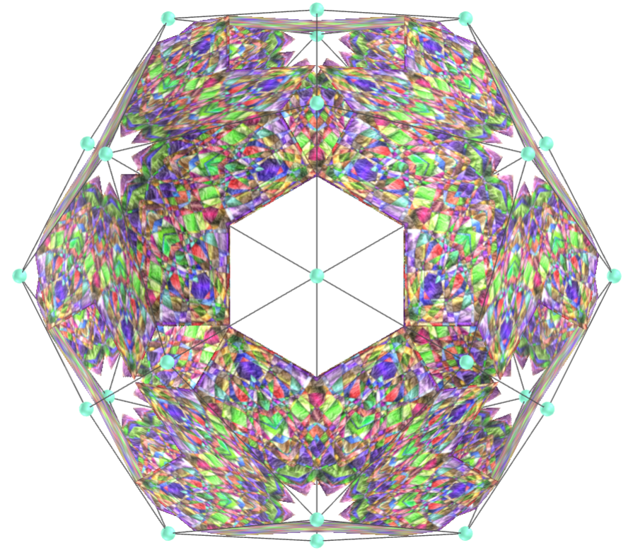</a>
  <b>description</b>: octagrammic tessellation
  <b>tessellation type</b>: quadrangular and triangular
  <b>polyhedra</b>: Möbius hexakis octahedron, Escher solid, hexakis tetrahedron, Möbius deltahedron, Möbius octakis hexahedron, deltoidal hexecontahedron, deltoidal icositetrahedron, cube, great ditrigonal dodecacronic hexecontahedron, truncated dodecadodecahedron, great truncated icosidodecahedron
  
 

<h4>27. Octagrammic tessellation</h4>
<a href="vr/Tessellation24b.htm" target="_blank" title="3D model" class="fotoA">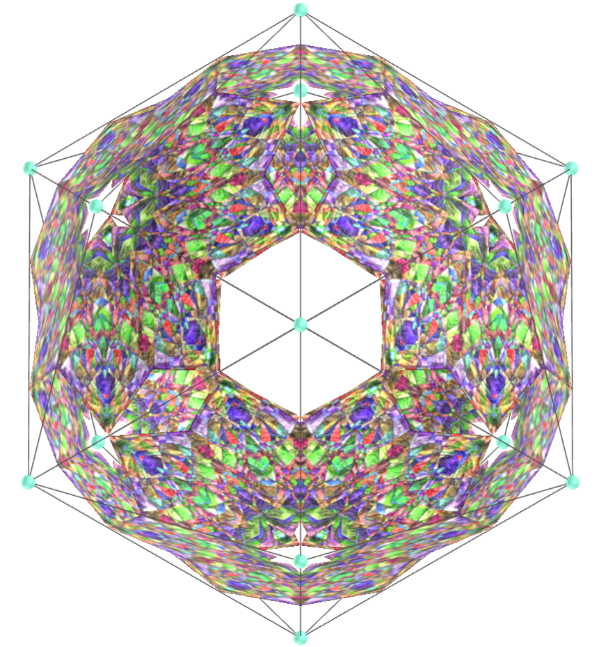</a>
  <b>description</b>: octagrammic tessellation
  <b>tessellation type</b>: quadrangular and triangular
  <b>polyhedra</b>: rhombic dodecahedron, Möbius 10-akis dodecahedron, rhombic hexecontahedron, Möbius hexakis icosahedron, tetrakis hexahedron, rhombic triacontahedron, pentagonal dipyramid, medial deltoidal hexecontahedron
  

<h4>28. Octagrammic tessellation</h4>
<a href="vr/Tessellation24c.htm" target="_blank" title="3D model" class="fotoA">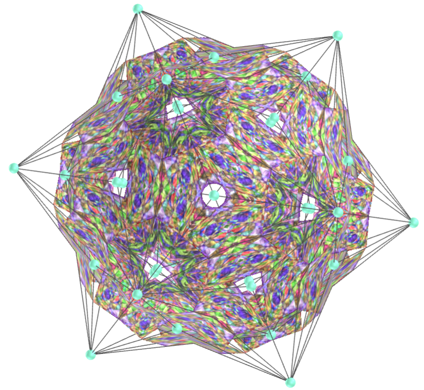</a>
  <b>description</b>: octagrammic tessellation
  <b>tessellation type</b>: quadrangular and triangular
  <b>polyhedra</b>: medial rhombic triacontahedron, small dodecacronic hexecontahedron, great hexacronic icositetrahedron, medial icosacronic hexecontahedron, rhombidodecadodecahedron, small icosacronic hexecontahedron, great rhombic triacontahedron, great rhombihexahedron, great rhombidodecahedron
  

<h4>29. Pentagrammic mandala tessellation</h4>
<a href="vr/Tessellation25a.htm" target="_blank" title="3D model" class="fotoA">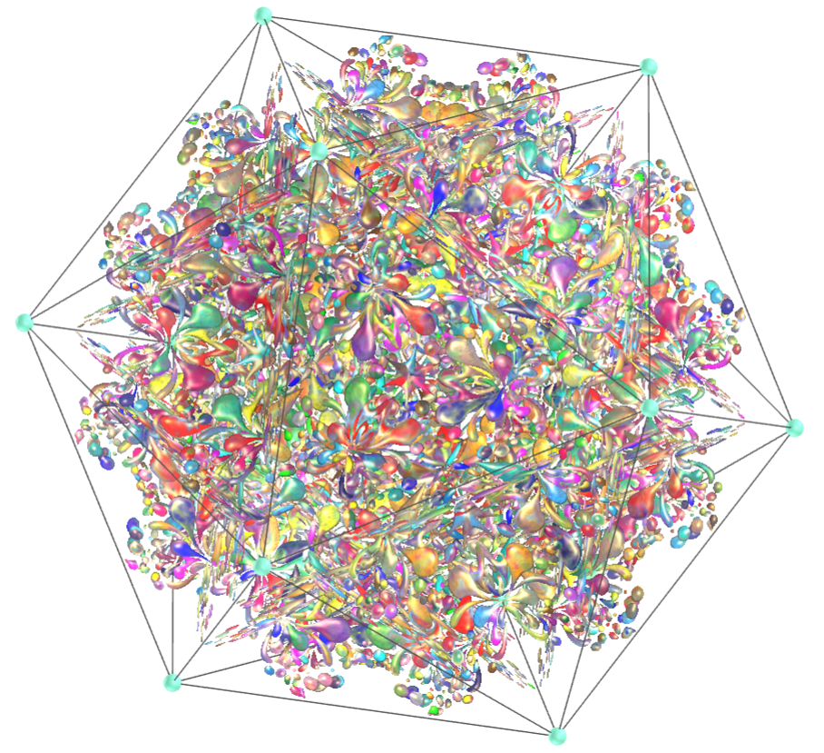</a>
  <b>description</b>: pentagrammic mandala tessellation
  <b>tessellation type</b>: pentagonal
  <b>polyhedra</b>: pentagonal icositetrahedron, tetartoid, pentagonal hexecontahedron, dodecahedron, great dodecahedron, small stellated dodecahedron, great stellated dodecahedron, small ditrigonal icosidodecahedron, ditrigonal dodecadodecahedron, snub icosidodecadodecahedron, great ditrigonal dodecicosidodecahedron
  

<h4>30. Pentagrammic mandala tessellation</h4>
<a href="vr/Tessellation25b.htm" target="_blank" title="3D model" class="fotoA">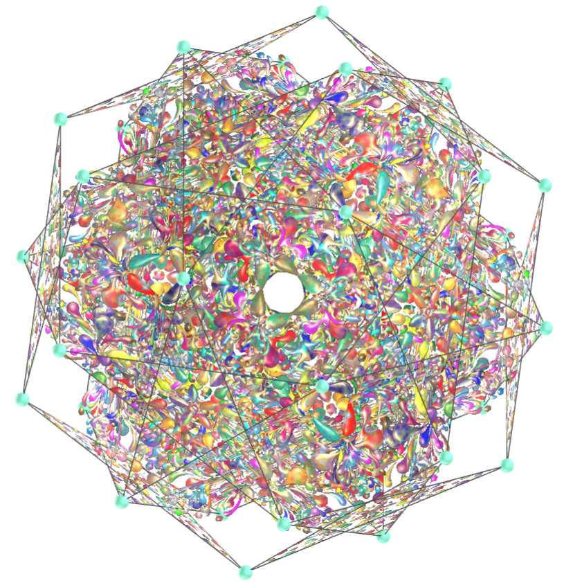</a>
  <b>description</b>: pentagrammic mandala tessellation
  <b>tessellation type</b>: pentagonal
  <b>polyhedra</b>: snub dodecadodecahedron, medial pentagonal hexecontahedron, dodecadodecahedron, great ditrigonal icosidodecahedron, great icosidodecahedron, icosidodecadodecahedron, inverted snub dodecadodecahedron, great pentagonal hexecontahedron, great inverted pentagonal hexecontahedron
  

<a href="#p1" class="topo">back to top</a>

<h4>31. Celtic knot tessellation</h4>
<a href="vr/Tessellation26a.htm" target="_blank" title="3D model" class="fotoA">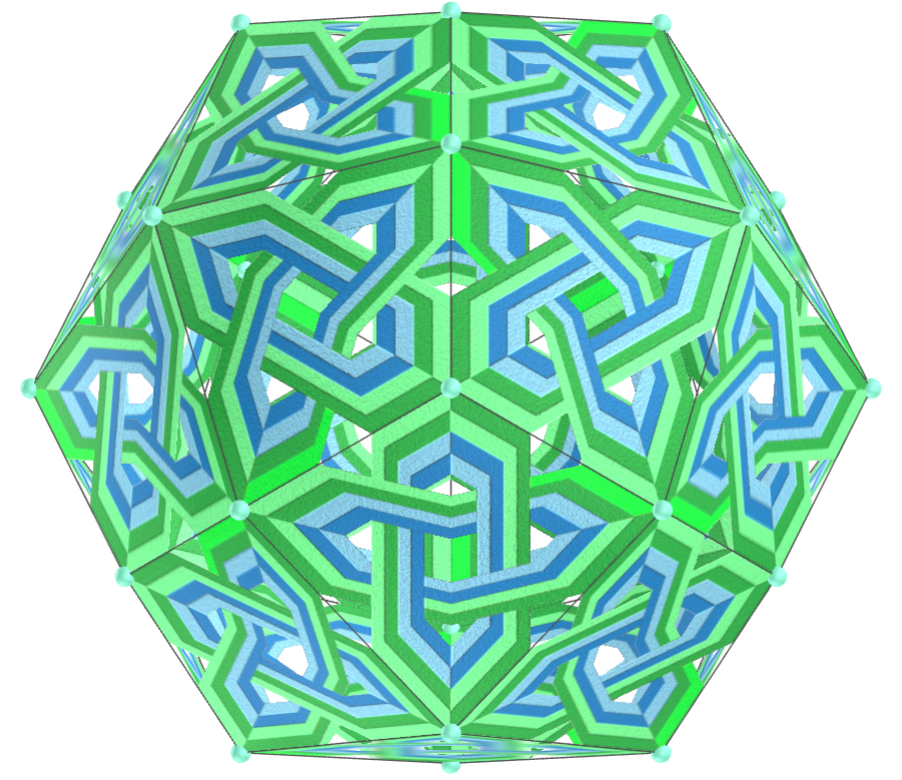</a>
  <b>description</b>: Celtic knot tessellation
  <b>tessellation type</b>: quadrangular and triangular
  <b>polyhedra</b>: Möbius hexakis octahedron, Escher solid, great dirhombicosidodecahedron, Möbius deltahedron, Möbius octakis hexahedron, deltoidal hexecontahedron, deltoidal icositetrahedron, cube, great ditrigonal dodecacronic hexecontahedron, pentagrammic dipyramid
  

<h4>32. Celtic knot tessellation</h4>
<a href="vr/Tessellation26b.htm" target="_blank" title="3D model" class="fotoA">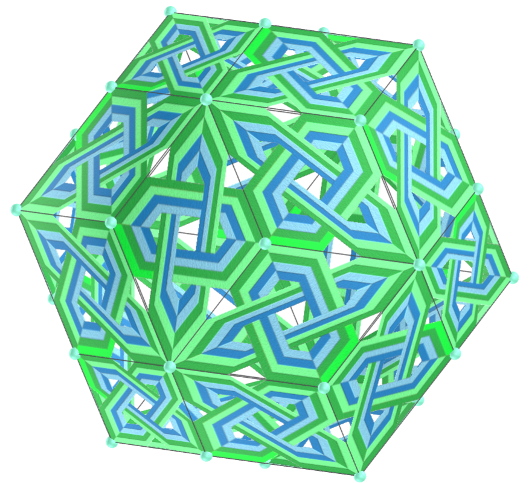</a>
  <b>description</b>: Celtic knot tessellation
  <b>tessellation type</b>: quadrangular and triangular
  <b>polyhedra</b>: rhombic dodecahedron, Möbius 10-akis dodecahedron, rhombic hexecontahedron, Möbius hexakis icosahedron, octahedron, tetrakis hexahedron, rhombic triacontahedron, pentagonal dipyramid, medial deltoidal hexecontahedron, great rhombihexahedron, great rhombidodecahedron
  

<h4>33. Celtic knot tessellation</h4>
<a href="vr/Tessellation26c.htm" target="_blank" title="3D model" class="fotoA">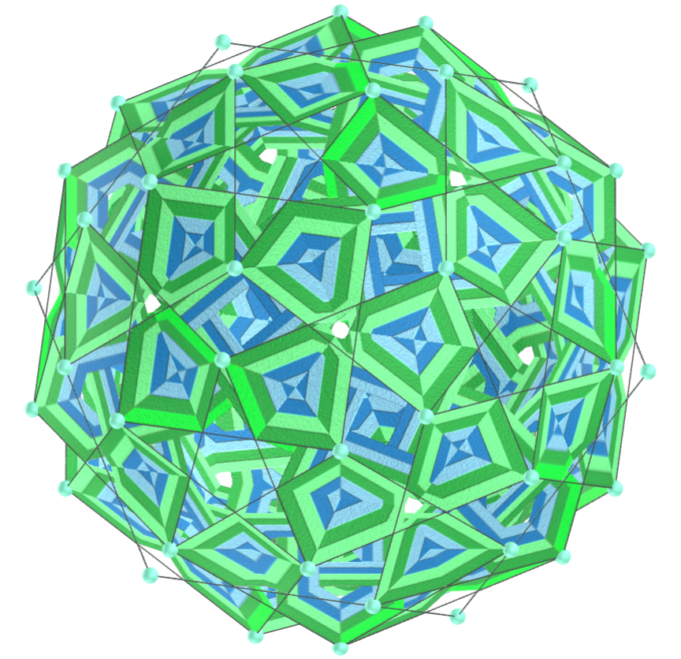</a>
  <b>description</b>: Celtic knot tessellation
  <b>tessellation type</b>: quadrangular and triangular
  <b>polyhedra</b>: medial rhombic triacontahedron, small dodecacronic hexecontahedron, great hexacronic icositetrahedron, medial icosacronic hexecontahedron, rhombidodecadodecahedron, small icosacronic hexecontahedron, great rhombic triacontahedron, stella octangula, truncated dodecadodecahedron, great truncated icosidodecahedron
  
 

<h4>34. Pentagrammic tessellation</h4>
<a href="vr/Tessellation28a.htm" target="_blank" title="3D model" class="fotoA">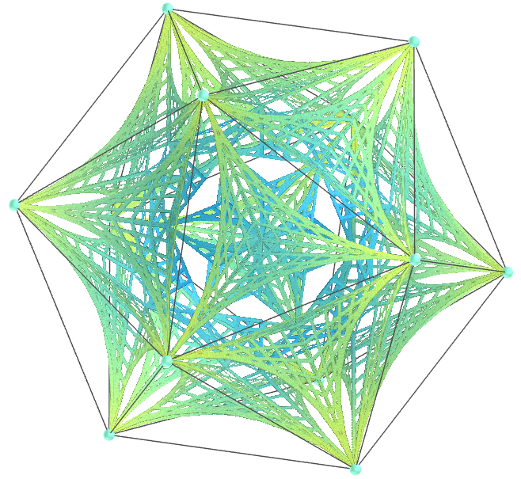</a>
  <b>description</b>: pentagrammic tessellation
  <b>tessellation type</b>: pentagonal
  <b>polyhedra</b>: pentagonal icositetrahedron, tetartoid, pentagonal hexecontahedron, dodecahedron, great dodecahedron, small stellated dodecahedron, great stellated dodecahedron, small ditrigonal icosidodecahedron, ditrigonal dodecadodecahedron, snub icosidodecadodecahedron, great ditrigonal dodecicosidodecahedron
  

<h4>35. Pentagrammic tessellation</h4>
<a href="vr/Tessellation28b.htm" target="_blank" title="3D model" class="fotoA">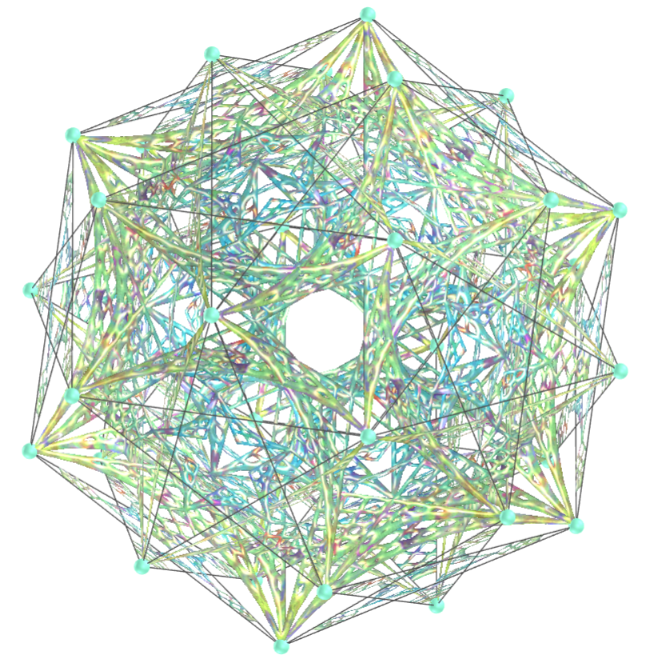</a>
  <b>description</b>: pentagrammic tessellation
  <b>tessellation type</b>: pentagonal
  <b>polyhedra</b>: snub dodecadodecahedron, medial pentagonal hexecontahedron, dodecadodecahedron, great ditrigonal icosidodecahedron, great icosidodecahedron, icosidodecadodecahedron, inverted snub dodecadodecahedron, great pentagonal hexecontahedron, great inverted pentagonal hexecontahedron
  

<h4>36. Hexagrammic tessellation</h4>
<a href="vr/Tessellation29a.htm" target="_blank" title="3D model" class="fotoA">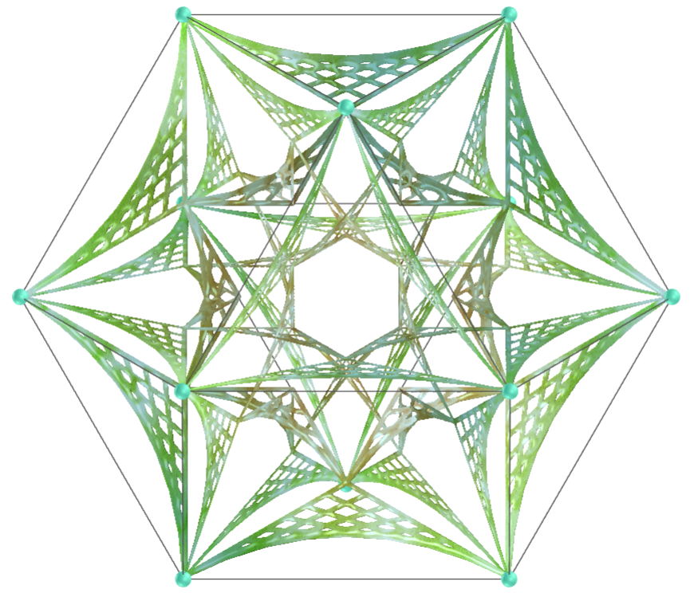</a>
  <b>description</b>: hexagrammic tessellation
  <b>tessellation type</b>: hexagonal
  <b>polyhedra</b>: cubitruncated cuboctahedron, great dodecahemicosahedron, great dodecicosahedron, great truncated cuboctahedron, great truncated icosidodecahedron, icositruncated dodecadodecahedron, octahemioctahedron
  

<h4>37. Hexagrammic tessellation</h4>
<a href="vr/Tessellation29b.htm" target="_blank" title="3D model" class="fotoA">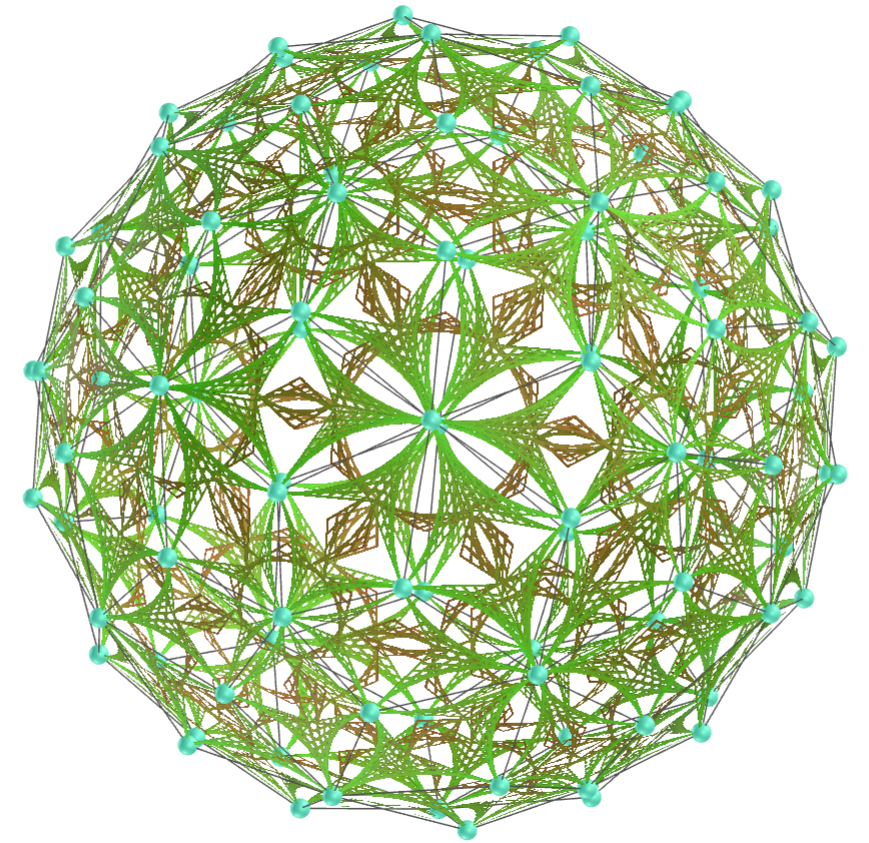</a>
  <b>description</b>: hexagrammic tessellation
  <b>tessellation type</b>: hexagonal
  <b>polyhedra</b>: rhombicosahedron, small dodecicosahedron, small hexagonal hexecontahedron, small triambic icosahedron, great truncated icosahedron, truncated icosahedron, truncated tetrahedron, truncated octahedron
  

<a href="#p1" class="topo">back to top</a>

  Tessellation - part 6: polyhedra tessellation and visualization with Virtual Reality by <a xmlns:cc="http://creativecommons.org/ns#" href="https://paulohscwb.github.io/tessellation/part6/" property="cc:attributionName" rel="cc:attributionURL">Paulo Henrique Siqueira</a> is licensed with a license <a rel="license" href="http://creativecommons.org/licenses/by-nc-nd/4.0/">Creative Commons Attribution-NonCommercial-NoDerivatives 4.0 International</a>.

<h4>How to cite this work:</h4> 

Siqueira, P.H., "Tessellation - part 6: polyhedra tessellation and visualization with Virtual Reality". Available in: <https://paulohscwb.github.io/tessellation/part6/>, April 2026.

<!---->
  <b>References:</b>
 Champagne, F. "Tessellations by Francine Champagne" <a href="https://tessellations.ca/" target="_blank"> https://tessellations.ca/</a>
 Weisstein, Eric W. "Tessellation." From MathWorld--A Wolfram Web Resource. <a href="https://mathworld.wolfram.com/Tessellation.html" target="_blank"> https://mathworld.wolfram.com/Tessellation.html</a>
 Mohr, R. "Tiled Art" <a href="https://tiled.art/en/home" target="_blank">https://tiled.art/en/home</a> 
 McCooey, D. I. "Visual Polyhedra". <a href="http://dmccooey.com/polyhedra/" target="_blank">http://dmccooey.com/polyhedra/</a>
