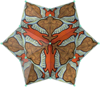
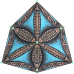

<link rel="stylesheet" href="../scripts/style.css">
<meta charset="utf-8">
<link rel="icon" type="image/png" href="../escher/vr/salas/imagens/icone.png">
<h2>Visualização de Tesselações em Poliedros com Realidade Virtual (RV) em A-frame</h2>
<b>autor:</b> Paulo Henrique Siqueira - Universidade Federal do Paraná
 <b>contato:</b> <a href="#"> paulohscwb@gmail.com </a>
 <a href="https://paulohscwb.github.io/tessellation/">english version</a>

  A Tesselação, também chamada de mosaico ou recobrimento do plano, é uma forma de cobrir um plano ou superfície com um padrão de figuras. 
 As figuras não podem ser sobrepostas e não podem existir espaços vazios entre elas. 
 Este trabalho mostra as tesselações aplicadas nas faces de poliedros, com as visualizações que podem ser acessadas com os recursos de Realidade Virtual.

<h3 style="margin-top:3px"><a target="_blank" href="../escher/pt-br/"> Obras de Escher</a></h3>
<h3 style="margin-top:3px"><a target="_blank" href="../part2/pt-br/"> Tesselações 2</a></h3>
<h3 style="margin-top:3px"><a target="_blank" href="../part3/pt-br/"> Tesselações 3</a></h3>
<h3 style="margin-top:3px"><a target="_blank" href="../part4/pt-br/"> Tesselações 4</a></h3>
<!--<h3 style="margin-top:3px"><a target="_blank" href="../part5/pt-br/"> Tesselações 5</a></h3>
<h3 style="margin-top:3px"><a target="_blank" href="../part6/pt-br/"> Tesselações 6</a></h3>
<h3 style="margin-top:3px"><a target="_blank" href="../part7/pt-br/"> Tesselações 7</a></h3>
<h3 style="margin-top:3px"><a target="_blank" href="../part8/pt-br/"> Tesselações 8</a></h3>
<h3 style="margin-top:3px"><a target="_blank" href="../part9/pt-br/"> Tesselações 9</a></h3>
<h3 style="margin-top:3px"><a target="_blank" href="../part10/pt-br/"> Tesselações 10</a></h3>
<h3 style="margin-top:3px"><a target="_blank" href="../part11/pt-br/"> Tesselações 11</a></h3>-->

<h3 align="center">Realidade Virtual</h3>

<h3 align="center">Modelos 3D</h3>

 Os scripts de órbita desenvolvidos por <b>Kevin Ngo</b> foram usados nas páginas de Realidade Virtual dos modelos 3D: <a href="https://github.com/supermedium/superframe/tree/master/components/orbit-controls/" target="_blank"> Orbit controls for A-Frame</a>.
 Os scripts de teleporte desenvolvidos por <b>Fernando Serrano</b> foram usados nas páginas de Realidade Virtual dos modelos 3D: <a  href="https://aframe.io/blog/teleport-component/" target="_blank"> Developing an A-Frame Teleport Component</a>
 

  Polyhedra tessellation: visualization with Virtual Reality de <a xmlns:cc="http://creativecommons.org/ns#" href="https://paulohscwb.github.io/tessellation/" property="cc:attributionName" rel="cc:attributionURL">Paulo Henrique Siqueira</a> está licenciado com uma Licença <a rel="license" href="http://creativecommons.org/licenses/by-nc-nd/4.0/">Creative Commons Atribuição-NãoComercial-SemDerivações 4.0 Internacional</a>.

<h4>Como citar este trabalho:</h4> 

Siqueira, P.H., "Polyhedra tessellation: visualization with Virtual Reality". Disponível em: <https://paulohscwb.github.io/tessellation/>, Fevereiro de 2025.

<!---->
 <b>Referências:</b>
 Weisstein, Eric W. "Tessellation." From MathWorld--A Wolfram Web Resource. <a href="https://mathworld.wolfram.com/Tessellation.html" target="_blank"> https://mathworld.wolfram.com/Tessellation.html</a>
 Mohr, R. "Tiled Art" <a href="https://tiled.art/en/home" target="_blank">https://tiled.art/en/home</a> 
 McCooey, D. I. "Visual Polyhedra". <a href="http://dmccooey.com/polyhedra/" target="_blank">http://dmccooey.com/polyhedra/</a>
