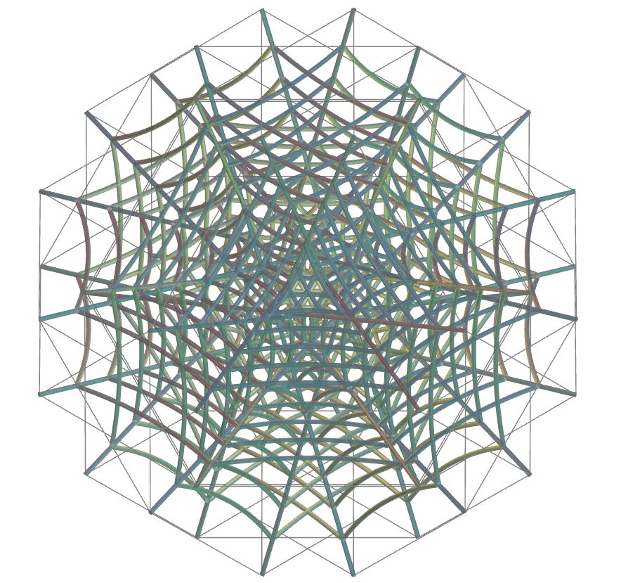
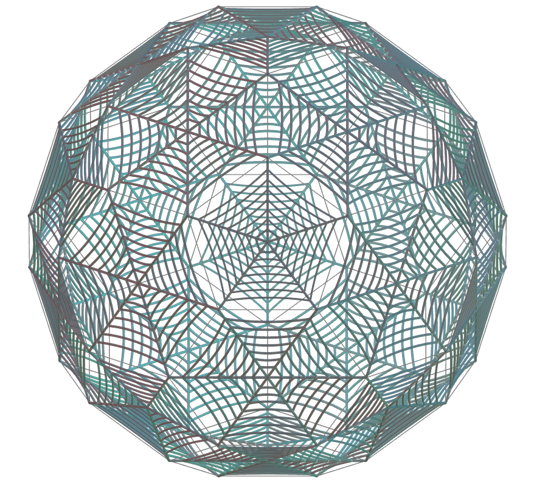

<link rel="stylesheet" href="../scripts/style.css">
<meta charset="utf-8">
<link rel="icon" type="image/png" href="vr/salas/imagens/icone.png">
<h2>Visualization of Polyhedra tessellation with Virtual Reality (VR) in A-frame</h2>
 <b>author:</b> Paulo Henrique Siqueira - Universidade Federal do Paraná
  <b>contact:</b> <a href="#">paulohscwb@gmail.com</a>
  <a href="https://paulohscwb.github.io/tessellation/spiderweb/pt-br/">versão em português</a>
 <form style="margin: 0 auto; float:right; text-align:right; width:100%; margin-bottom:15px;">
	<select id="url" onchange="urlHandler(this.value)" style="color:royalblue;">
		<option disabled selected value>More solids:</option>
		<option value="../escher/">Escher's Works</option>
		<option value="../part2/">Tessellation 2</option>
		<option value="../part3/">Tessellation 3</option>
		<option value="../part4/">Tessellation 4</option>
		<option disabled value="../spiderweb/">Spider web</option>
		<!--<option value="../part5/">Tessellation 5</option>
		<option value="../part6/">Tessellation 6</option>
		<option value="../part7/">Tessellation 7</option>
		<option value="../part8/">Tessellation 8</option>
		<option value="../part9/">Tessellation 9</option>
		<option value="../part10/">Tessellation 10</option>
		<option value="../part11/">Tessellation 11</option>-->
	</select>
</form>

  <h2 align="center"> Tessellation - Spider web</h2>
The figures or works that are chosen as tesserae cover or pave the plane or a surface. The result is called tessellation, tiling, paving or mosaic. 
Tessellations have been used since ancient times in floors, walls, carpets and other objects.
 This work shows the tessellations made on all or some faces of polyhedrons, taking advantage of triangular, square, pentagonal or hexagonal symmetries of the faces of these solids.
 On this page, we have tessellations made with constructions that imitate spider webs, inserted into the faces of common polyhedra, such as Plato's dodecahedron, and rarer ones, such as the non-convex small icosicosidodecahedron.

<a href="#m3d">3D Models</a>&nbsp;&nbsp;|&nbsp;&nbsp;<a href="../">Home</a>

 

 

<h3 id="m3d" align="center">3D models</h3>
<iframe width="560" height="315" style="max-width:100%" src="https://www.youtube.com/embed/videoseries?list=PLy0I_lGW8HxXsXXqMXQVTUWeoWBEyCuhM" title="YouTube video player" frameborder="0" allow="accelerometer; autoplay; clipboard-write; encrypted-media; gyroscope; picture-in-picture; web-share" allowfullscreen></iframe>
<h4>1. Cubitruncated Cuboctahedron</h4>

  <b>tessellation type</b>: hexagonal
  

<h4>2. Cubitruncated Cuboctahedron v2</h4>

  <b>tessellation type</b>: octagonal
  

<h4>3. Dodecadodecahedron</h4>

  <b>tessellation type</b>: pentagonal
  

<h4>4. Dodecahedron</h4>

  <b>tessellation type</b>: pentagonal
  

<h4>5. Great Dodecahedron</h4>

  <b>tessellation type</b>: pentagonal
  

<h4>6. Great Truncated Cuboctahedron</h4>

  <b>tessellation type</b>: hexagonal
  

<h4>7. Icosidodecadodecahedron</h4>

  <b>tessellation type</b>: hexagonal
  

<h4>8. Octahemioctahedron</h4>

  <b>tessellation type</b>: hexagonal
  

<h4>9. Icosidodecahedron</h4>

  <b>tessellation type</b>: pentagonal
  

<h4>10. Pentagonal Dypiramid</h4>

  <b>tessellation type</b>: triangular
  

<a href="#p1" class="topo">back to top</a>

<h4>11. Rhombidodecadodecahedron</h4>

  <b>tessellation type</b>: pentagonal
  

<h4>12. Small Dodecicosidodecahedron</h4>

  <b>tessellation type</b>: decagonal and pentagonal
  

<h4>13. Small Icosicosidodecahedron</h4>

  <b>tessellation type</b>: hexagonal
  

<h4>14. Truncated Cube</h4>

  <b>tessellation type</b>: octagonal
  

<h4>15. Truncated Cuboctahedron</h4>

  <b>tessellation type</b>: octogonal and hexagonal
  

<h4>16. Truncated Dodecadodecahedron</h4>

  <b>tessellation type</b>: decagonal
  

<h4>17. Truncated Dodecahedron</h4>

  <b>tessellation type</b>: decagonal
  

<h4>18. Truncated Great Dodecahedron</h4>

  <b>tessellation type</b>: decagonal
  

<h4>19. Truncated Icosahedron</h4>

  <b>tessellation type</b>: hexagonal and pentagonal
  

<h4>20. Truncated Icosidodecahedron</h4>

  <b>tessellation type</b>: hexagonal and decagonal
  

<a href="#p1" class="topo">back to top</a>

<h4>21. Truncated Octahedron</h4>

  <b>tessellation type</b>: hexagonal
  

<h4>22. Truncated Tetrahedron</h4>

  <b>tessellation type</b>: hexagonal
  

<h4>23. Ditrigonal Dodecadodecahedron</h4>

  <b>tessellation type</b>: pentagonal
  

<h4>24. Great Ditrigonal Dodecicosidodecahedron</h4>

  <b>tessellation type</b>: pentagonal
  

<h4>25. Great Dodecicosahedron</h4>

  <b>tessellation type</b>: hexagonal
  

<h4>26. Great Truncated Icosidodecahedron</h4>

  <b>tessellation type</b>: hexagonal
  

<h4>27. Small Ditrigonal Dodecicosidodecahedron</h4>

  <b>tessellation type</b>: decagonal
  

<h4>28. Small Dodecicosahedron</h4>

  <b>tessellation type</b>: hexagonal
  

<h4>29. Small Stellated Truncated Dodecahedron</h4>

  <b>tessellation type</b>: pentagonal
  

<h4>30. Great Icosahedron Truncated</h4>

  <b>tessellation type</b>: hexagonal
  

<a href="#p1" class="topo">back to top</a>

  Spider web: polyhedra tessellation and visualization with Virtual Reality by <a xmlns:cc="http://creativecommons.org/ns#" href="https://paulohscwb.github.io/tessellation/spiderweb/" property="cc:attributionName" rel="cc:attributionURL">Paulo Henrique Siqueira</a> is licensed with a license <a rel="license" href="http://creativecommons.org/licenses/by-nc-nd/4.0/">Creative Commons Attribution-NonCommercial-NoDerivatives 4.0 International</a>.

<h4>How to cite this work:</h4> 

Siqueira, P.H., "Spider web: polyhedra tessellation and visualization with Virtual Reality". Available in: <https://paulohscwb.github.io/tessellation/spiderweb/>, October 2025.

<!---->
  <b>References:</b>
 Champagne, F. "Tessellations by Francine Champagne" <a href="https://tessellations.ca/" target="_blank"> https://tessellations.ca/</a>
 Weisstein, Eric W. "Tessellation." From MathWorld--A Wolfram Web Resource. <a href="https://mathworld.wolfram.com/Tessellation.html" target="_blank"> https://mathworld.wolfram.com/Tessellation.html</a>
 Mohr, R. "Tiled Art" <a href="https://tiled.art/en/home" target="_blank">https://tiled.art/en/home</a> 
 McCooey, D. I. "Visual Polyhedra". <a href="http://dmccooey.com/polyhedra/" target="_blank">http://dmccooey.com/polyhedra/</a>
