<link rel="stylesheet" href="../../scripts/style.css">
<meta charset="utf-8">
<link rel="icon" type="image/png" href="../vr/salas/imagens/icone.png">
<h2>Visualização de Tesselações em Poliedros com Realidade Virtual (RV) em A-frame</h2>
<b>autor:</b> Paulo Henrique Siqueira - Universidade Federal do Paraná
 <b>contato:</b> <a href="#"> paulohscwb@gmail.com </a>
 <a href="https://paulohscwb.github.io/tessellation/spiderweb/">english version</a>
<form style="margin: 0 auto; float:right; text-align:right; width:100%; margin-bottom:15px;">
	<select id="url" onchange="urlHandler(this.value)" style="color:royalblue;">
		<option disabled selected>Mais sólidos:</option>
		<option value="../../escher/pt-br/">Obras de Escher</option>
		<option value="../../part2/pt-br/">Tesselações 2</option>
		<option value="../../part3/pt-br/">Tesselações 3</option>
		<option value="../../part4/pt-br/">Tesselações 4</option>
		<option disabled value="../../spiderweb/pt-br/">Teia de aranha</option>
		<!--<option value="../../part5/pt-br/">Tesselações 5</option>
		<option value="../../part6/pt-br/">Tesselações 6</option>
		<option value="../../part7/pt-br/">Tesselações 7</option>
		<option value="../../part8/pt-br/">Tesselações 8</option>
		<option value="../../part9/pt-br/">Tesselações 9</option>
		<option value="../../part10/pt-br/">Tesselações 10</option>
		<option value="../../part11/pt-br/">Tesselações 11</option>-->
	</select>
</form>

  <h2 align="center">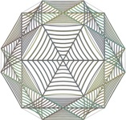 Tesselações - teia de aranha</h2>
  As figuras ou obras que são escolhidas como tesselas cobrem ou pavimentam o plano ou uma superfície. O resultado é chamado de tesselação, ladrilho, pavimentação ou mosaico. As tesselações são usadas desde a antiguidade em pisos, paredes tapetes e outros objetos. 
 Este trabalho mostra as tesselações feitas em todas ou algumas faces de poliedros, aproveitando simetrias triangulares, quadradas, pentagonais ou hexagonais das faces destes sólidos. 
 Nesta página, temos tesselações feitas com construções que imitam teias de aranha, inseridas nas faces de poliedros comuns, como o dodecaedro de Platão, e outros mais raros, como o não convexo pequeno icosicosidodecaedro.
 
<a href="#m3d">Modelos 3D</a>&nbsp;&nbsp;|&nbsp;&nbsp;<a href="../../pt-br/">Página Inicial</a>

  

 

<h3 id="m3d" align="center">Modelos 3D</h3>
<iframe width="560" height="315" style="max-width:100%" src="https://www.youtube.com/embed/videoseries?list=PLy0I_lGW8HxXsXXqMXQVTUWeoWBEyCuhM" title="YouTube video player" frameborder="0" allow="accelerometer; autoplay; clipboard-write; encrypted-media; gyroscope; picture-in-picture; web-share" allowfullscreen></iframe>
<h4>1. Cuboctaedro Cubitruncado</h4>

  <b>tipo de tesselação</b>: hexagonal
  

<h4>2. Cuboctaedro Cubitruncado v2</h4>

  <b>tipo de tesselação</b>: octogonal
  

<h4>3. Dodecadodecaedro</h4>

  <b>tipo de tesselação</b>: pentagonal
  

<h4>4. Dodecaedro</h4>

  <b>tipo de tesselação</b>: pentagonal
  

<h4>5. Grande Dodecaedro</h4>
<a href="../vr/GreatDodecahedron.htm" target="_blank" title="modelo 3D" class="fotoA">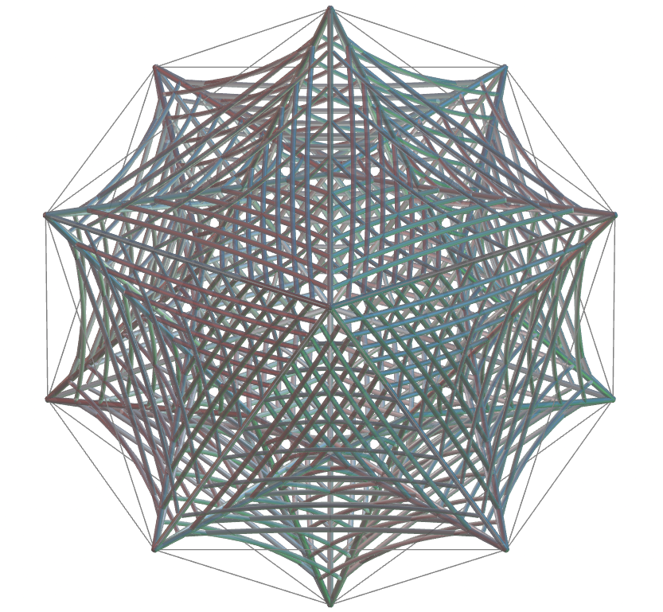</a>
  <b>tipo de tesselação</b>: pentagonal
  

<h4>6. Grande Cuboctaedro Truncado</h4>

  <b>tipo de tesselação</b>: hexagonal
  

<h4>7. Icosidodecadodecaedro</h4>
<a href="../vr/Icosidodecadodecahedron.htm" target="_blank" title="modelo 3D" class="fotoA">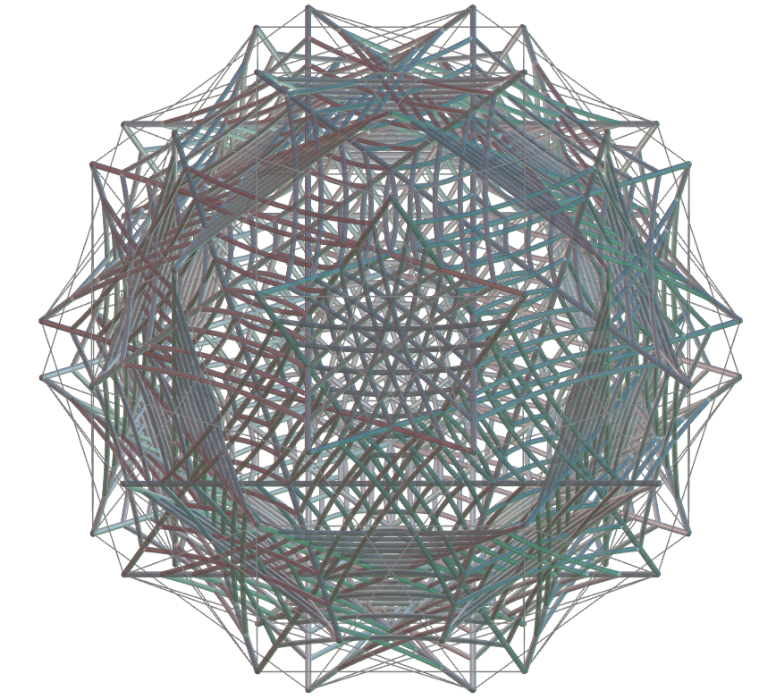</a>
  <b>tipo de tesselação</b>: hexagonal
  

<h4>8. Grande Icosaedro Truncado</h4>

  <b>tipo de tesselação</b>: hexagonal
  

<h4>9. Icosidodecaedro</h4>
<a href="../vr/Icosidodecahedron.htm" target="_blank" title="modelo 3D" class="fotoA">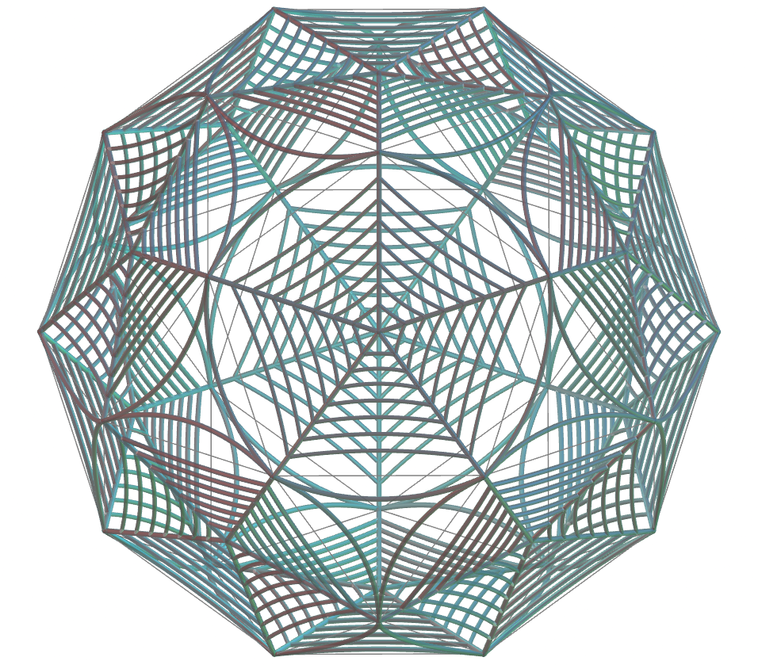</a>
  <b>tipo de tesselação</b>: pentagonal
  
 

<h4>10. Dipirâmide Pentagonal</h4>
<a href="../vr/PentagonalDypiramid.htm" target="_blank" title="modelo 3D" class="fotoA">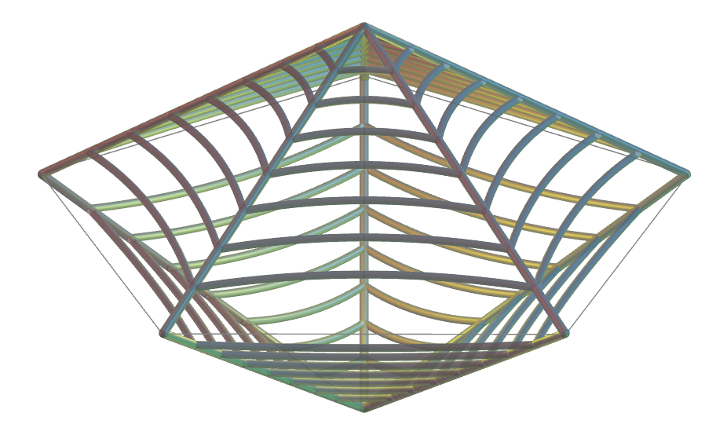</a>
  <b>tipo de tesselação</b>: triangular
  

<a href="#p1" class="topo">voltar ao topo</a>

<h4>11. Rombidodecadodecaedro</h4>

  <b>tipo de tesselação</b>: pentagonal
  

<h4>12. Pequeno Dodecicosidodecaedro</h4>
<a href="../vr/SmallDodecicosidodecahedron.htm" target="_blank" title="modelo 3D" class="fotoA">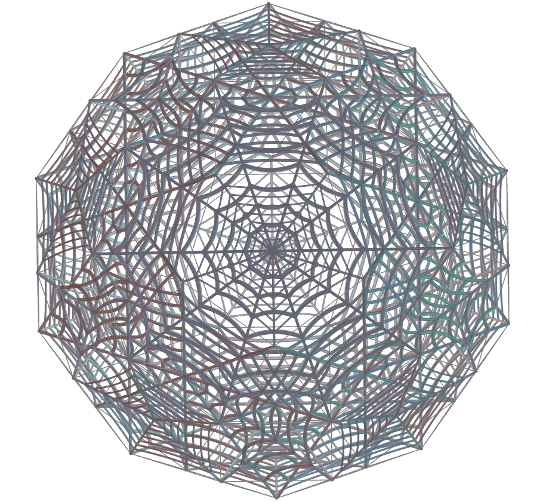</a>
  <b>tipo de tesselação</b>: decagonal e pentagonal
  

<h4>13. Pequeno Icosicosidodecaedro</h4>
<a href="../vr/SmallIcosicosidodecahedron.htm" target="_blank" title="modelo 3D" class="fotoA">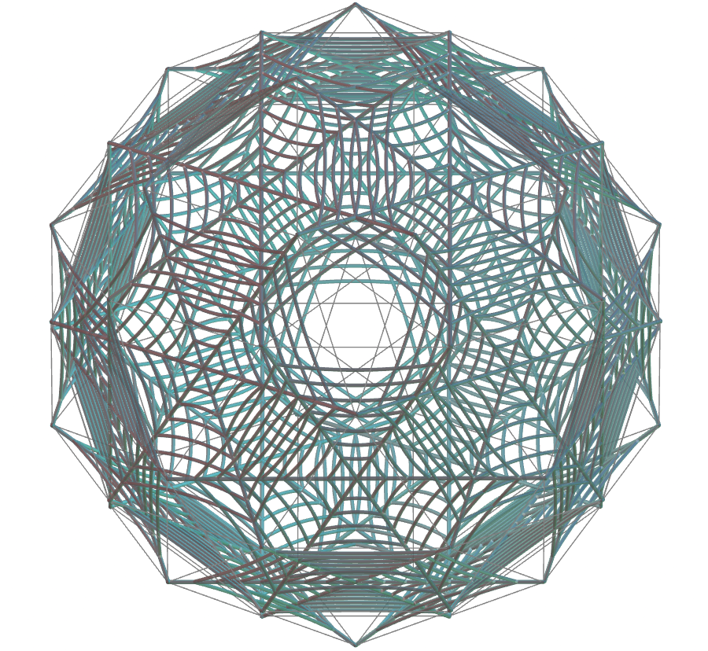</a>
  <b>tipo de tesselação</b>: hexagonal
  

<h4>14. Cubo Truncado</h4>

  <b>tipo de tesselação</b>: octogonal
  

<h4>15. Cuboctaedro Truncado</h4>
<a href="../vr/TruncatedCuboctahedron.htm" target="_blank" title="modelo 3D" class="fotoA">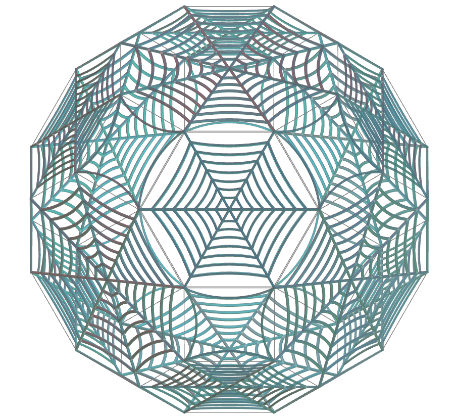</a>
  <b>tipo de tesselação</b>: octogonal e hexagonal
  

<h4>16. Dodecadodecaedro Truncado</h4>
<a href="../vr/TruncatedDodecadodecahedron.htm" target="_blank" title="modelo 3D" class="fotoA">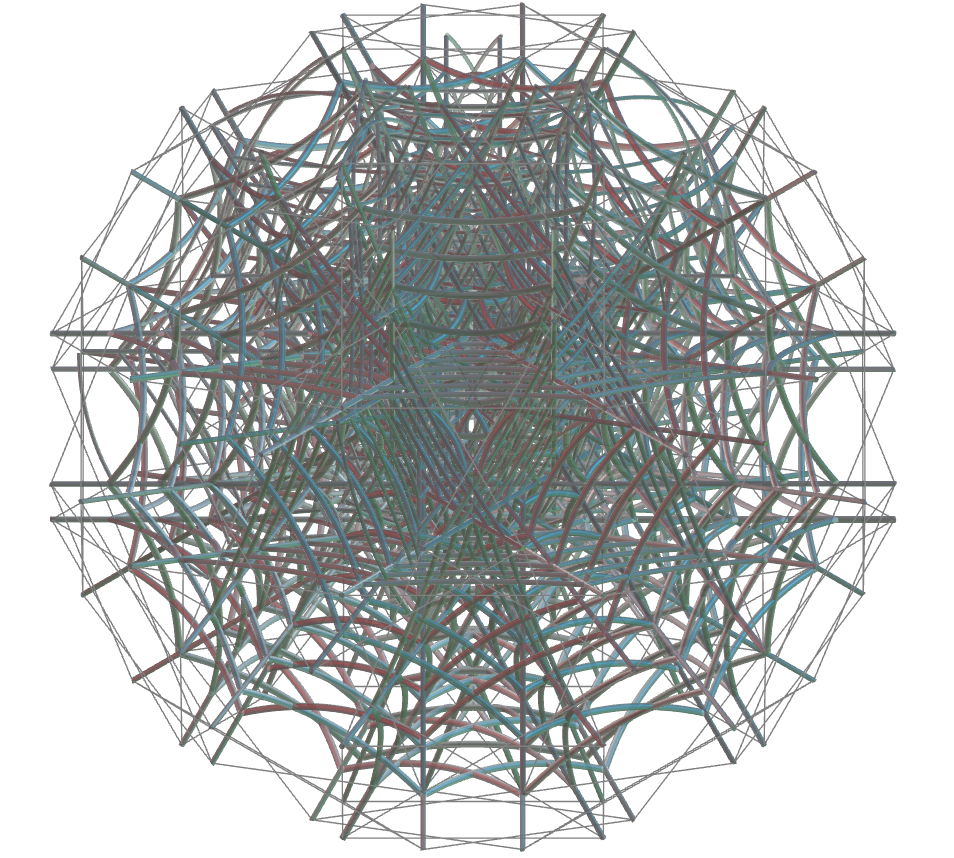</a>
  <b>tipo de tesselação</b>: decagonal
  

<h4>17. Dodecaedro Truncado</h4>
<a href="../vr/TruncatedDodecahedron.htm" target="_blank" title="modelo 3D" class="fotoA">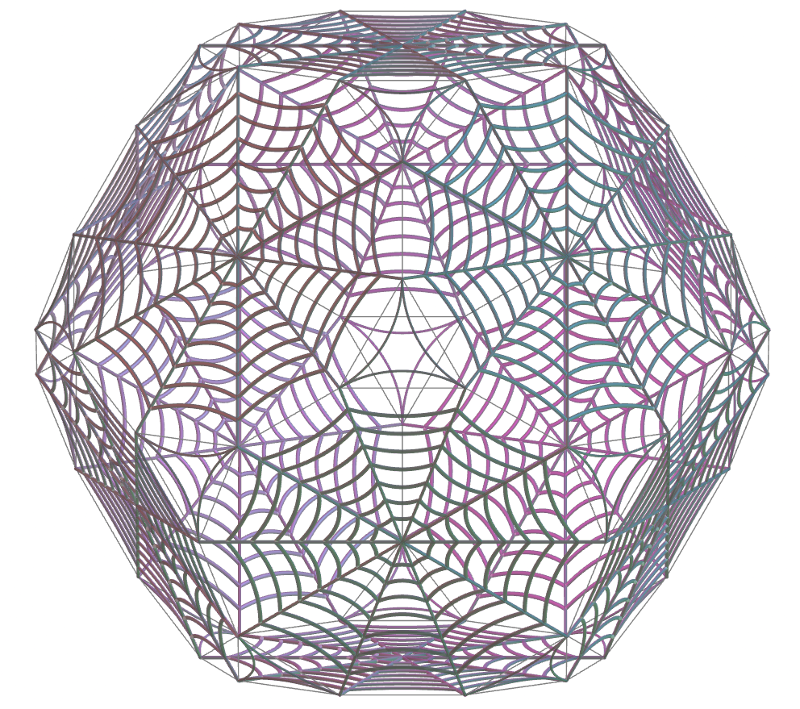</a>
  <b>tipo de tesselação</b>: decagonal
  
 

<h4>18. Grande Dodecaedro Truncado</h4>

  <b>tipo de tesselação</b>: decagonal
    

<h4>19. Icosaedro Truncado</h4>

  <b>tipo de tesselação</b>: hexagonal e pentagonal
  

<h4>20. Icosidodecaedro Truncado</h4>
<a href="../vr/TruncatedIcosidodecahedron.htm" target="_blank" title="modelo 3D" class="fotoA">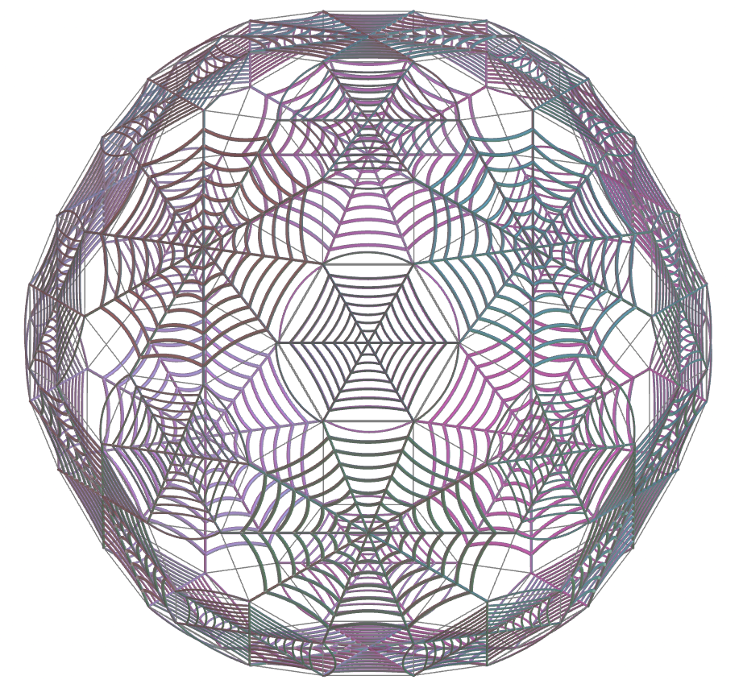</a>
  <b>tipo de tesselação</b>: hexagonal e decagonal
  

<a href="#p1" class="topo">voltar ao topo</a>

<h4>21. Octaedro Truncado</h4>
<a href="../vr/TruncatedOctahedron.htm" target="_blank" title="modelo 3D" class="fotoA">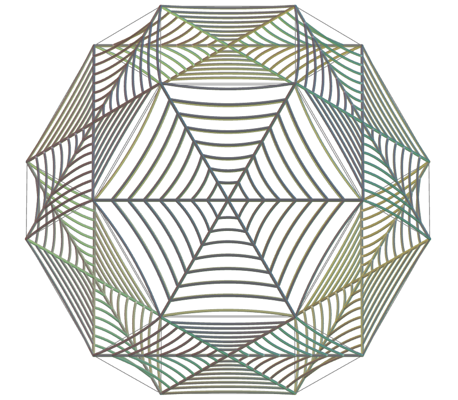</a>
  <b>tipo de tesselação</b>: hexagonal
  

<h4>22. Tetraedro Truncado</h4>

  <b>tipo de tesselação</b>: hexagonal
  

<h4>23. Dodecadodecaedro Ditrigonal</h4>

  <b>tipo de tesselação</b>: pentagonal
  

<h4>24. Grande Dodecicosidodecaedro Ditrigonal</h4>

  <b>tipo de tesselação</b>: pentagonal
  

<h4>25. Grande Dodecicosaedro</h4>
<a href="../vr/GreatDodecicosahedron.htm" target="_blank" title="modelo 3D" class="fotoA">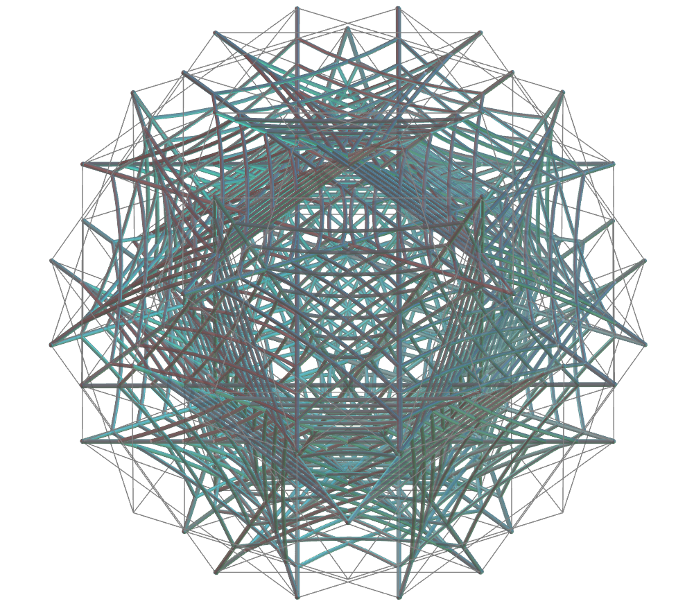</a>
  <b>tipo de tesselação</b>: hexagonal
  

<h4>26. Grande Icosidodecaedro Truncado</h4>

  <b>tipo de tesselação</b>: hexagonal
  

<h4>27. Pequeno Dodecicosidodecaedro Ditrigonal</h4>

  <b>tipo de tesselação</b>: decagonal
  

<h4>28. Pequeno Dodecicosaedro</h4>

  <b>tipo de tesselação</b>: hexagonal
  

<h4>29. Pequeno Dodecaedro Estrelado Truncado</h4>

  <b>tipo de tesselação</b>: pentagonal
  

<a href="#p1" class="topo">voltar ao topo</a>

  Spider web: polyhedra tessellation and visualization with Virtual Reality de <a xmlns:cc="http://creativecommons.org/ns#" href="https://paulohscwb.github.io/tessellation/spiderweb/pt-br/" property="cc:attributionName" rel="cc:attributionURL">Paulo Henrique Siqueira</a> está licenciado com uma Licença <a rel="license" href="http://creativecommons.org/licenses/by-nc-nd/4.0/">Creative Commons Atribuição-NãoComercial-SemDerivações 4.0 Internacional</a>.

<h4>Como citar este trabalho:</h4> 

Siqueira, P.H., "Spider web: polyhedra tessellation and visualization with Virtual Reality". Disponível em: <https://paulohscwb.github.io/tessellation/spiderweb/pt-br/>, Outubro de 2025.

<!---->
  <b>Referências:</b>
 Weisstein, Eric W. "Tessellation." From MathWorld--A Wolfram Web Resource. <a href="https://mathworld.wolfram.com/Tessellation.html" target="_blank"> https://mathworld.wolfram.com/Tessellation.html</a>
 Mohr, R. "Tiled Art" <a href="https://tiled.art/en/home" target="_blank">https://tiled.art/en/home</a> 
 McCooey, D. I. "Visual Polyhedra". <a href="http://dmccooey.com/polyhedra/" target="_blank">http://dmccooey.com/polyhedra/</a>
