<link rel="stylesheet" href="../scripts/style.css">
<meta charset="utf-8">
<link rel="icon" type="image/png" href="vr/salas/imagens/icone.png">
<h2>Visualization of Polyhedra tessellation with Virtual Reality (VR) in A-frame</h2>
 <b>author:</b> Paulo Henrique Siqueira - Universidade Federal do Paraná
  <b>contact:</b> <a href="#">paulohscwb@gmail.com</a>
  <a href="https://paulohscwb.github.io/tessellation/strips/pt-br/">versão em português</a>
 <form style="margin: 0 auto; float:right; text-align:right; width:100%; margin-bottom:15px;">
	<select id="url" onchange="urlHandler(this.value)" style="color:royalblue;">
		<option disabled selected value>More solids:</option>
		<option value="../Escher/">Escher's Works</option>
		<option value="../part2/">Tessellation 2</option>
		<option value="../part3/">Tessellation 3</option>
		<option value="../part4/">Tessellation 4</option>
		<option value="../spiderweb/">Spider web</option>
		<option value="../flower1/">Flower of life 1</option>
		<option value="../part5/">Tessellation 5</option>
		<option value="../part6/">Tessellation 6</option>
		<option disabled value="../strips/">Tessellation in strips</option>
		<!--<option value="../part7/">Tessellation 7</option>
		<option value="../part8/">Tessellation 8</option>
		<option value="../part9/">Tessellation 9</option>
		<option value="../part10/">Tessellation 10</option>
		<option value="../part11/">Tessellation 11</option>-->
	</select>
</form>

  <h2 align="center">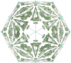 Tessellation in strips</h2>
The figures or works that are chosen as tesserae cover or pave the plane or a surface. The result is called tessellation, tiling, paving or mosaic. Tessellations have been used since ancient times in floors, walls, carpets and other objects.
 This work shows the tessellations made on the faces of polyhedra, taking advantage of the rectangular symmetries of the faces of these solids.
 On this page, we have some examples of tessellations in the form of strips, inserted into the rectangular faces of stellation to infinity polyhedra.

<a href="#m3d">3D Models</a>&nbsp;&nbsp;|&nbsp;&nbsp;<a href="../">Home</a>

 

 

<h3 id="m3d" align="center">3D models</h3>
<iframe width="560" height="315" style="max-width:100%" src="https://www.youtube.com/embed/videoseries?list=PLy0I_lGW8HxXTLTFRb8j0qJKEyB5SMvDQ" title="YouTube video player" frameborder="0" allow="accelerometer; autoplay; clipboard-write; encrypted-media; gyroscope; picture-in-picture; web-share" allowfullscreen></iframe>
<h4>1. Rio de Janeiro sidewalk</h4>
<a href="vr/Tessellation1.htm" target="_blank" title="3D model" class="fotoA">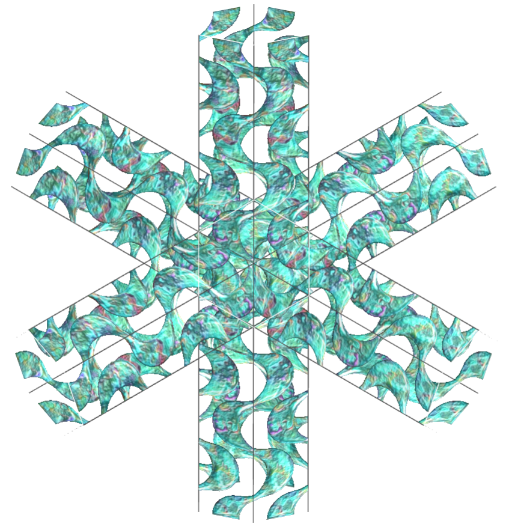</a>
  <b>description</b>: Rio de Janeiro sidewalk pattern
  <b>tessellation type</b>: rectangular
  <b>polyhedra</b>: great dodecahemicosacron, great dodecahemidodecacron, hexahemioctacron, small icosihemidodecacron, tetrahemihexacron, star great dodecahemicosacron, star hexahemioctacron, star tetrahemihexacron
  

<h4>2. Curitiba sidewalk</h4>
<a href="vr/Tessellation2.htm" target="_blank" title="3D model" class="fotoA">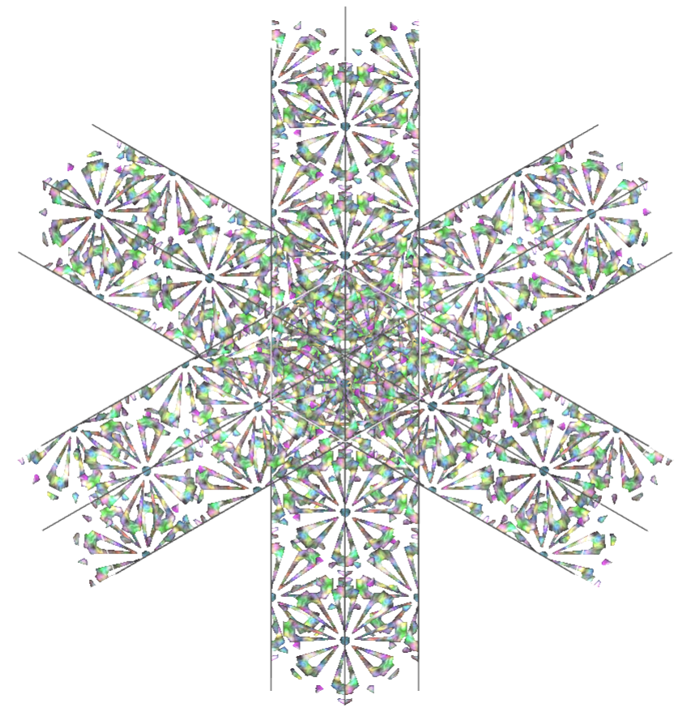</a>
  <b>description</b>: Curitiba sidewalk pattern
  <b>tessellation type</b>: rectangular
  <b>polyhedra</b>: great dodecahemicosacron, great dodecahemidodecacron, hexahemioctacron, small icosihemidodecacron, tetrahemihexacron, star great dodecahemicosacron, star hexahemioctacron, star tetrahemihexacron
  

<h4>3. Rio de Janeiro sidewalk</h4>
<a href="vr/Tessellation3.htm" target="_blank" title="3D model" class="fotoA">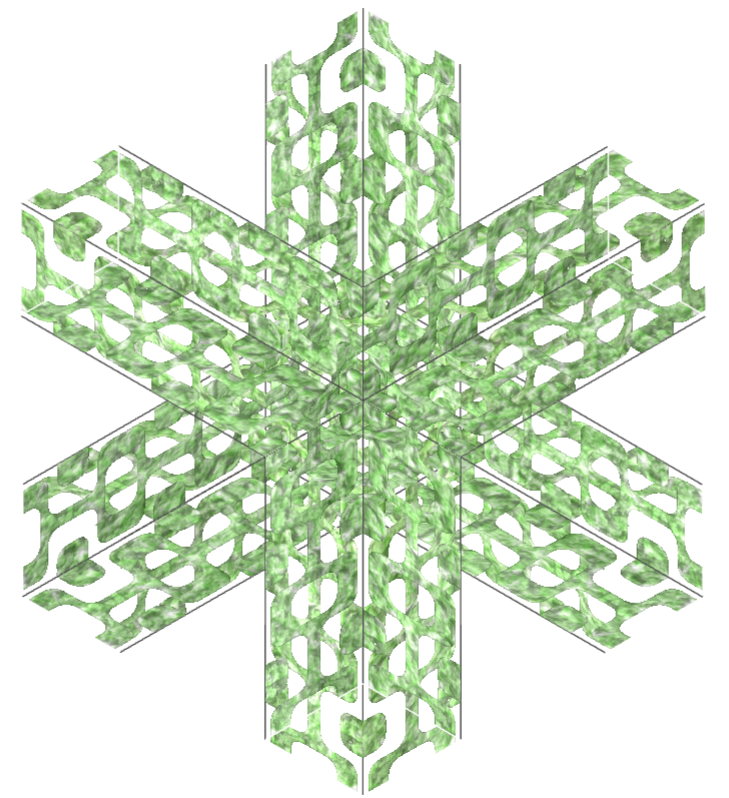</a>
  <b>description</b>: Rio de Janeiro sidewalk pattern
  <b>tessellation type</b>: rectangular
  <b>polyhedra</b>: great dodecahemicosacron, great dodecahemidodecacron, hexahemioctacron, small icosihemidodecacron, tetrahemihexacron, star great dodecahemicosacron, star hexahemioctacron, star tetrahemihexacron
  

<h4>4. Flower of life</h4>
<a href="vr/Tessellation4.htm" target="_blank" title="3D model" class="fotoA">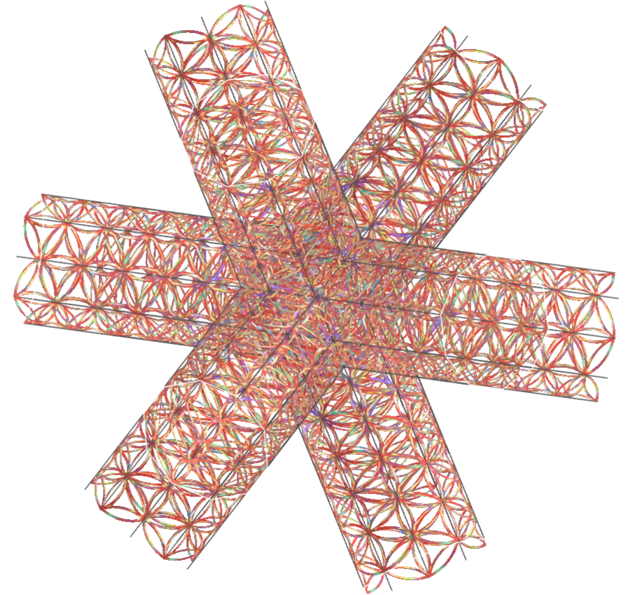</a>
  <b>description</b>: flower of life pattern
  <b>tessellation type</b>: rectangular
  <b>polyhedra</b>: great dodecahemicosacron, great dodecahemidodecacron, hexahemioctacron, small icosihemidodecacron, tetrahemihexacron, star great dodecahemicosacron, star hexahemioctacron, star tetrahemihexacron
  

<h4>5. Curitiba sidewalk</h4>
<a href="vr/Tessellation5.htm" target="_blank" title="3D model" class="fotoA">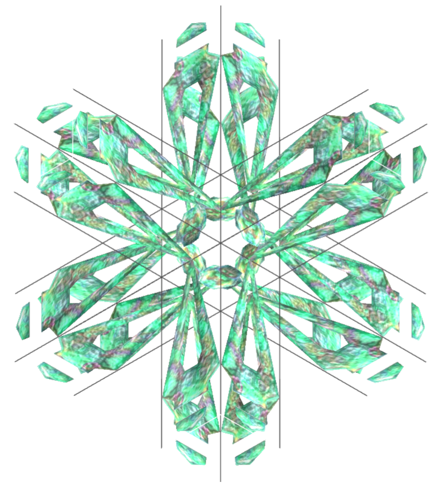</a>
  <b>description</b>: Curitiba sidewalk pattern
  <b>tessellation type</b>: rectangular
  <b>polyhedra</b>: great dodecahemicosacron, great dodecahemidodecacron, hexahemioctacron, small icosihemidodecacron, tetrahemihexacron, star great dodecahemicosacron, star hexahemioctacron, star tetrahemihexacron
  

<h4>6. Araucarias</h4>
<a href="vr/Tessellation6.htm" target="_blank" title="3D model" class="fotoA">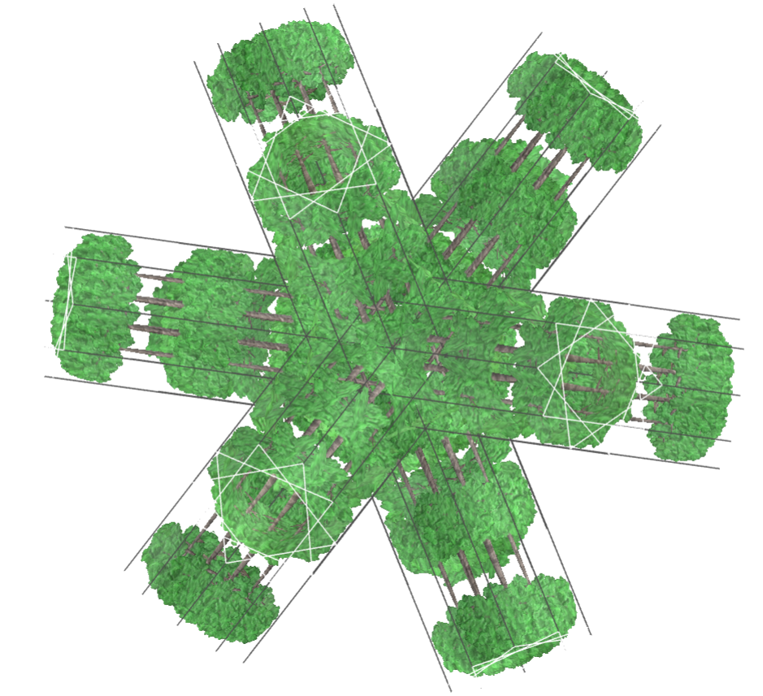</a>
  <b>description</b>: Araucarias pattern
  <b>tessellation type</b>: rectangular
  <b>polyhedra</b>: great dodecahemicosacron, great dodecahemidodecacron, hexahemioctacron, small icosihemidodecacron, tetrahemihexacron, star great dodecahemicosacron, star hexahemioctacron, star tetrahemihexacron
  

<h4>7. Menger cross of Jerusalem</h4>
<a href="vr/Tessellation7.htm" target="_blank" title="3D model" class="fotoA">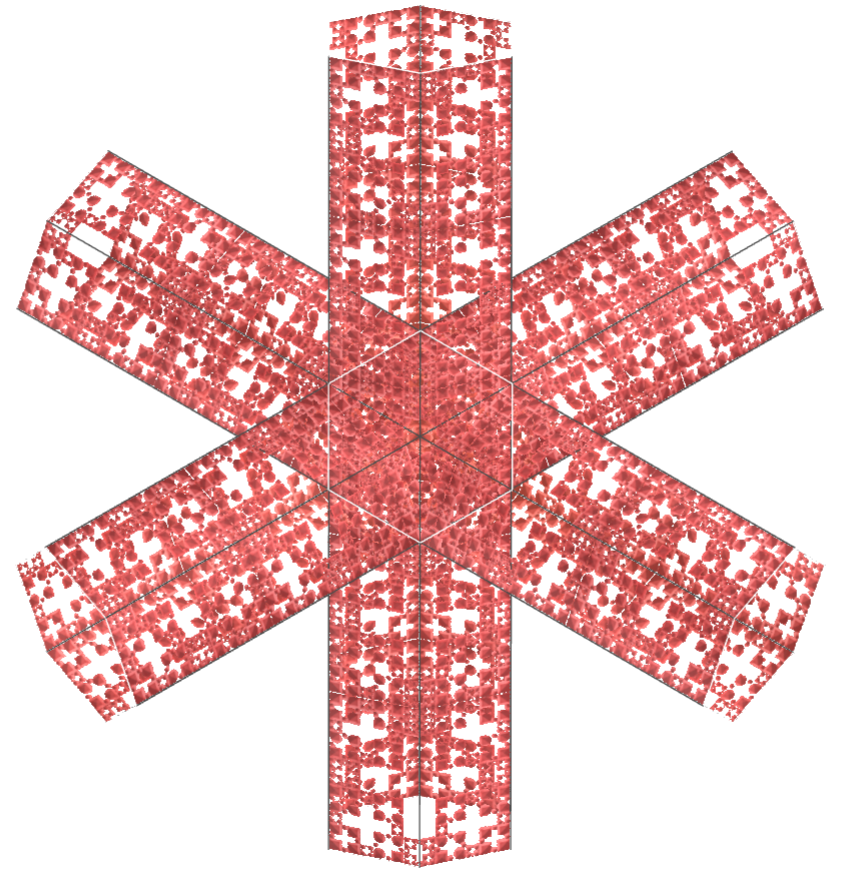</a>
  <b>description</b>: Menger cross of Jerusalem pattern
  <b>tessellation type</b>: rectangular
  <b>polyhedra</b>: great dodecahemicosacron, great dodecahemidodecacron, hexahemioctacron, small icosihemidodecacron, tetrahemihexacron, star great dodecahemicosacron, star hexahemioctacron, star tetrahemihexacron
  

<h4>8. Fractal tree</h4>
<a href="vr/Tessellation8.htm" target="_blank" title="3D model" class="fotoA">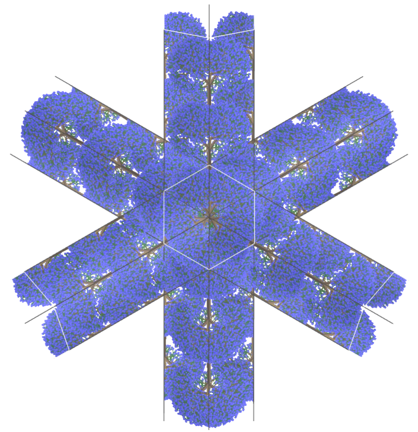</a>
  <b>description</b>: Fractal tree pattern
  <b>tessellation type</b>: rectangular
  <b>polyhedra</b>: great dodecahemicosacron, great dodecahemidodecacron, hexahemioctacron, small icosihemidodecacron, tetrahemihexacron, star great dodecahemicosacron, star hexahemioctacron, star tetrahemihexacron
  

<h4>9. Menger sponge</h4>
<a href="vr/Tessellation9.htm" target="_blank" title="3D model" class="fotoA">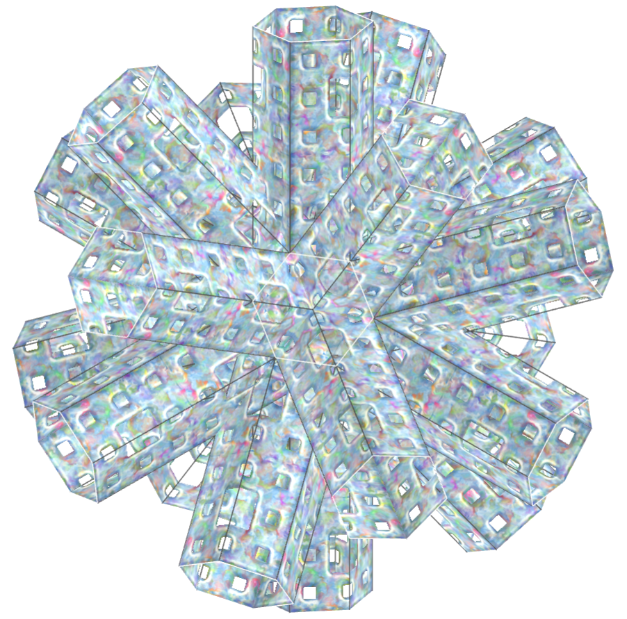</a>
  <b>description</b>: Menger sponge pattern
  <b>tessellation type</b>: rectangular
  <b>polyhedra</b>: great dodecahemicosacron, great dodecahemidodecacron, hexahemioctacron, small icosihemidodecacron, tetrahemihexacron, star great dodecahemicosacron, star hexahemioctacron, star tetrahemihexacron
  

<h4>10. Menger sponge</h4>
<a href="vr/Tessellation10.htm" target="_blank" title="3D model" class="fotoA">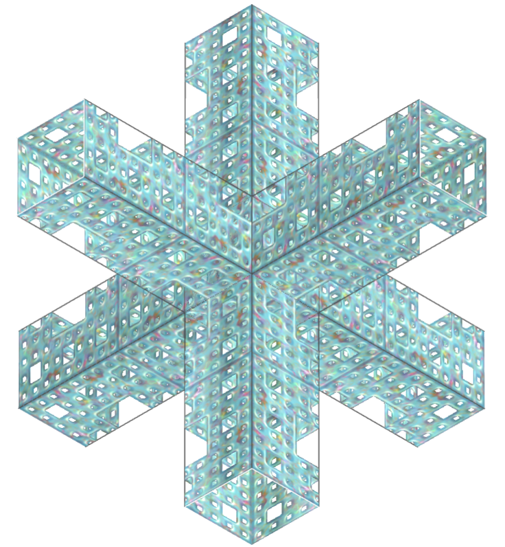</a>
  <b>description</b>: Menger sponge pattern
  <b>tessellation type</b>: rectangular
  <b>polyhedra</b>: great dodecahemicosacron, great dodecahemidodecacron, hexahemioctacron, small icosihemidodecacron, tetrahemihexacron, star great dodecahemicosacron, star hexahemioctacron, star tetrahemihexacron
  

<a href="#p1" class="topo">back to top</a>

<h4>11. Menger cross of Jerusalem</h4>
<a href="vr/Tessellation11.htm" target="_blank" title="3D model" class="fotoA">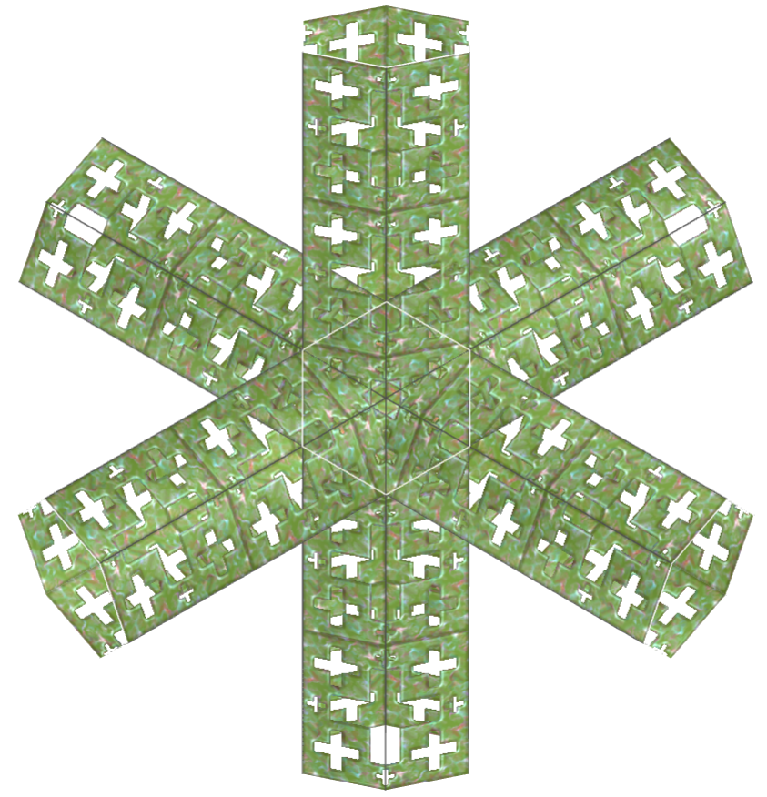</a>
  <b>description</b>: Menger cross of Jerusalem pattern
  <b>tessellation type</b>: rectangular
  <b>polyhedra</b>: great dodecahemicosacron, great dodecahemidodecacron, hexahemioctacron, small icosihemidodecacron, tetrahemihexacron, star great dodecahemicosacron, star hexahemioctacron, star tetrahemihexacron
  

<h4>12. Menger cross of Jerusalem</h4>
<a href="vr/Tessellation12.htm" target="_blank" title="3D model" class="fotoA">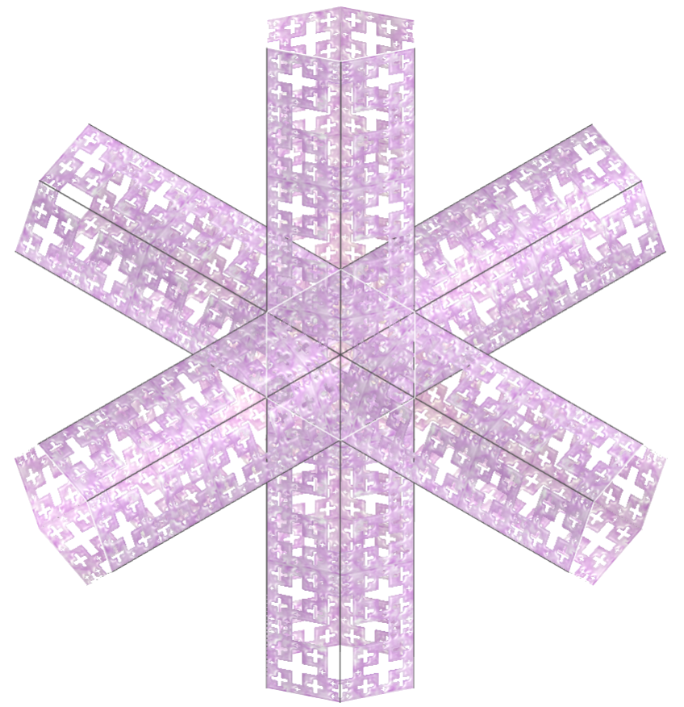</a>
  <b>description</b>: Menger cross of Jerusalem pattern
  <b>tessellation type</b>: rectangular
  <b>polyhedra</b>: great dodecahemicosacron, great dodecahemidodecacron, hexahemioctacron, small icosihemidodecacron, tetrahemihexacron, star great dodecahemicosacron, star hexahemioctacron, star tetrahemihexacron
  

<h4>13. Tree of life</h4>
<a href="vr/Tessellation16.htm" target="_blank" title="3D model" class="fotoA">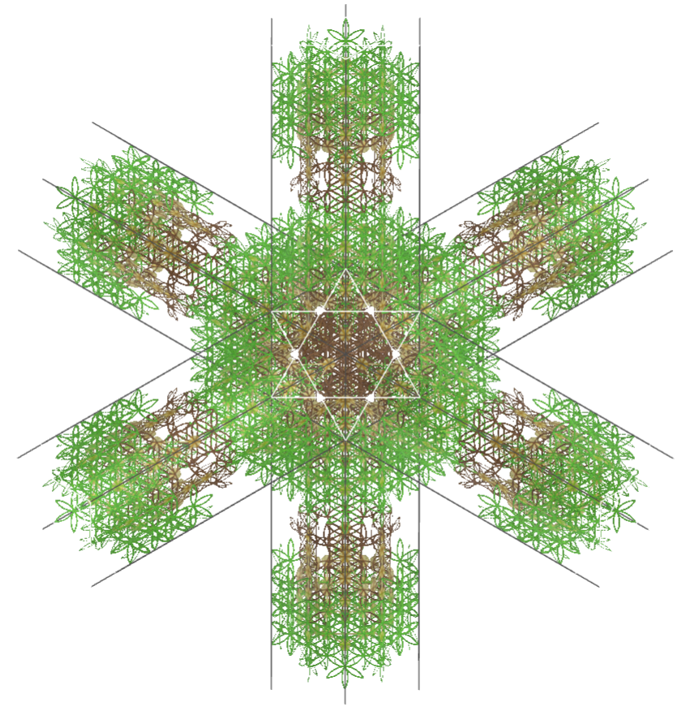</a>
  <b>description</b>: tree of life pattern
  <b>tessellation type</b>: rectangular
  <b>polyhedra</b>: great dodecahemicosacron, great dodecahemidodecacron, hexahemioctacron, small icosihemidodecacron, tetrahemihexacron, star great dodecahemicosacron, star hexahemioctacron, star tetrahemihexacron
  

<h4>14. Intertwined curve</h4>
<a href="vr/Tessellation13.htm" target="_blank" title="3D model" class="fotoA">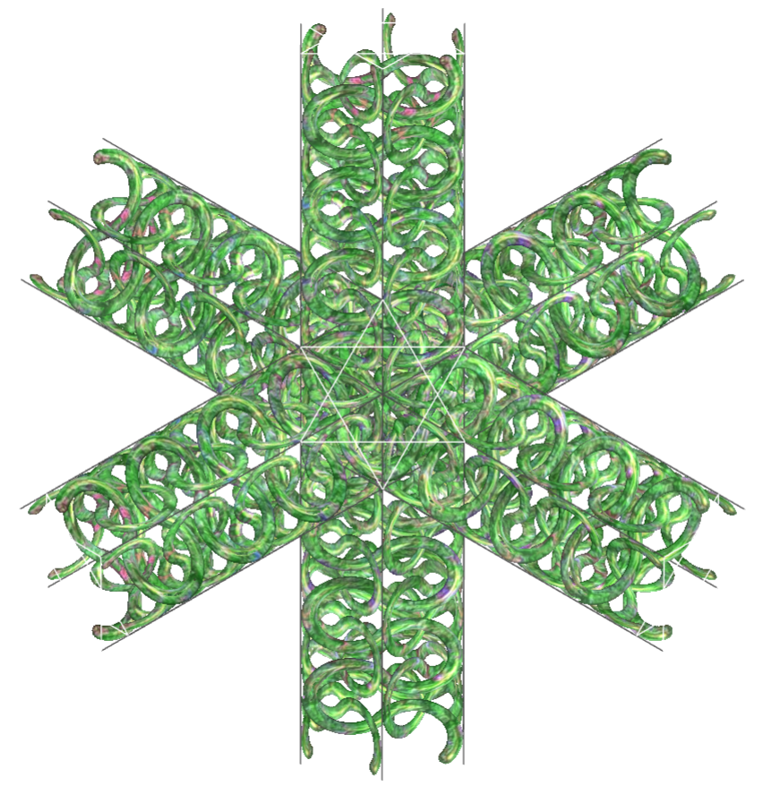</a>
  <b>description</b>: intertwined curve pattern
  <b>tessellation type</b>: rectangular
  <b>polyhedra</b>: great dodecahemicosacron, great dodecahemidodecacron, hexahemioctacron, small icosihemidodecacron, tetrahemihexacron, star great dodecahemicosacron, star hexahemioctacron, star tetrahemihexacron
  

<h4>15. Intertwined curve</h4>
<a href="vr/Tessellation14.htm" target="_blank" title="3D model" class="fotoA">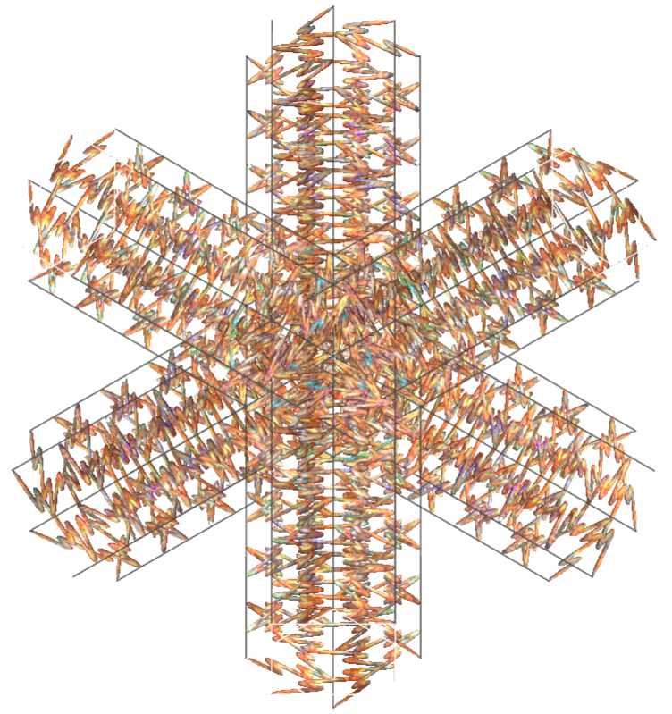</a>
  <b>description</b>: intertwined curve pattern
  <b>tessellation type</b>: rectangular
  <b>polyhedra</b>: great dodecahemicosacron, great dodecahemidodecacron, hexahemioctacron, small icosihemidodecacron, tetrahemihexacron, star great dodecahemicosacron, star hexahemioctacron, star tetrahemihexacron
  

<h4>16. Lemniscata</h4>
<a href="vr/Tessellation15.htm" target="_blank" title="3D model" class="fotoA">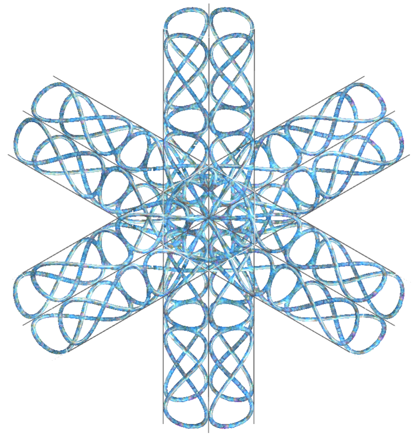</a>
  <b>description</b>: lemniscata pattern
  <b>tessellation type</b>: rectangular
  <b>polyhedra</b>: great dodecahemicosacron, great dodecahemidodecacron, hexahemioctacron, small icosihemidodecacron, tetrahemihexacron, star great dodecahemicosacron, star hexahemioctacron, star tetrahemihexacron
  

<h4>17. Intertwined curve of three leaves</h4>
<a href="vr/Tessellation17.htm" target="_blank" title="3D model" class="fotoA">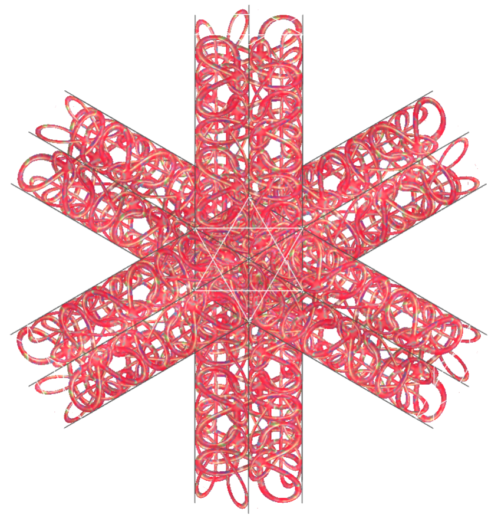</a>
  <b>description</b>: intertwined curve of three leaves pattern
  <b>tessellation type</b>: rectangular
  <b>polyhedra</b>: great dodecahemicosacron, great dodecahemidodecacron, hexahemioctacron, small icosihemidodecacron, tetrahemihexacron, star great dodecahemicosacron, star hexahemioctacron, star tetrahemihexacron
  

<h4>18. Four-leaf clover</h4>
<a href="vr/Tessellation18.htm" target="_blank" title="3D model" class="fotoA">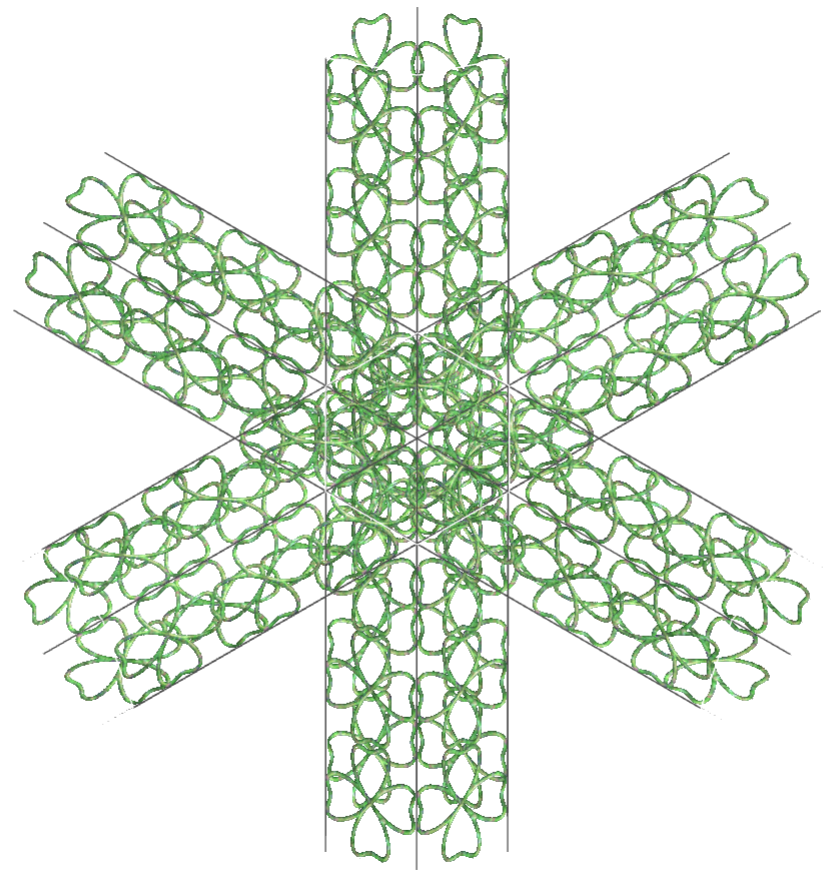</a>
  <b>description</b>: four-leaf clover pattern
  <b>tessellation type</b>: rectangular
  <b>polyhedra</b>: great dodecahemicosacron, great dodecahemidodecacron, hexahemioctacron, small icosihemidodecacron, tetrahemihexacron, star great dodecahemicosacron, star hexahemioctacron, star tetrahemihexacron
  

<h4>19. Rosacea</h4>
<a href="vr/Tessellation19.htm" target="_blank" title="3D model" class="fotoA">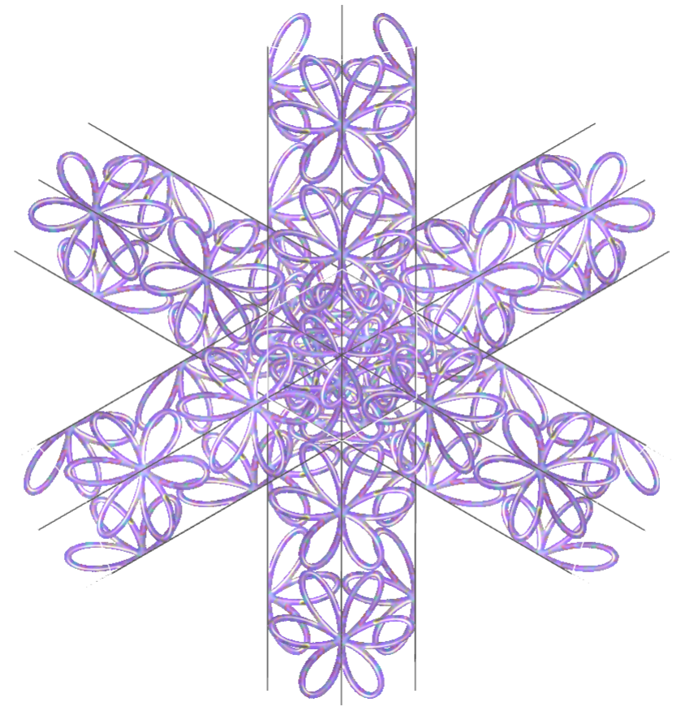</a>
  <b>description</b>: rosacea pattern
  <b>tessellation type</b>: rectangular
  <b>polyhedra</b>: great dodecahemicosacron, great dodecahemidodecacron, hexahemioctacron, small icosihemidodecacron, tetrahemihexacron, star great dodecahemicosacron, star hexahemioctacron, star tetrahemihexacron
  

<h4>20. Butterfly</h4>
<a href="vr/Tessellation20.htm" target="_blank" title="3D model" class="fotoA">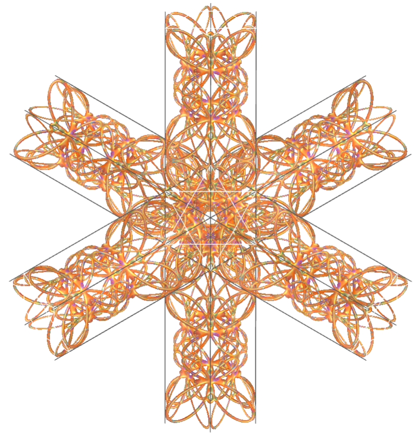</a>
  <b>description</b>: butterfly pattern
  <b>tessellation type</b>: rectangular
  <b>polyhedra</b>: great dodecahemicosacron, great dodecahemidodecacron, hexahemioctacron, small icosihemidodecacron, tetrahemihexacron, star great dodecahemicosacron, star hexahemioctacron, star tetrahemihexacron
  

<a href="#p1" class="topo">back to top</a>

<h4>21. Butterfly v2</h4>
<a href="vr/Tessellation21.htm" target="_blank" title="3D model" class="fotoA">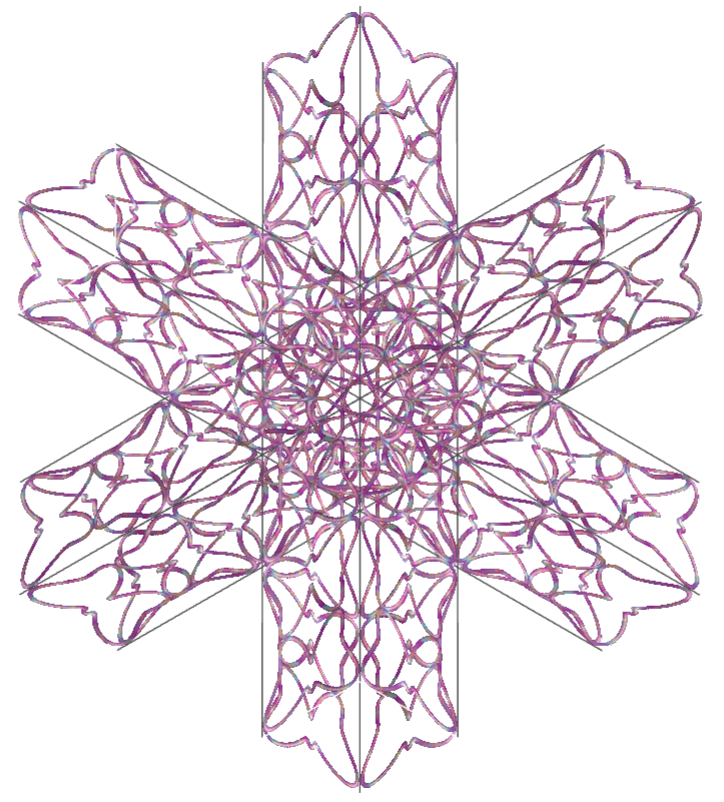</a>
  <b>description</b>: butterfly pattern
  <b>tessellation type</b>: rectangular
  <b>polyhedra</b>: great dodecahemicosacron, great dodecahemidodecacron, hexahemioctacron, small icosihemidodecacron, tetrahemihexacron, star great dodecahemicosacron, star hexahemioctacron, star tetrahemihexacron
  

<h4>22. Elephant</h4>
<a href="vr/Tessellation22.htm" target="_blank" title="3D model" class="fotoA">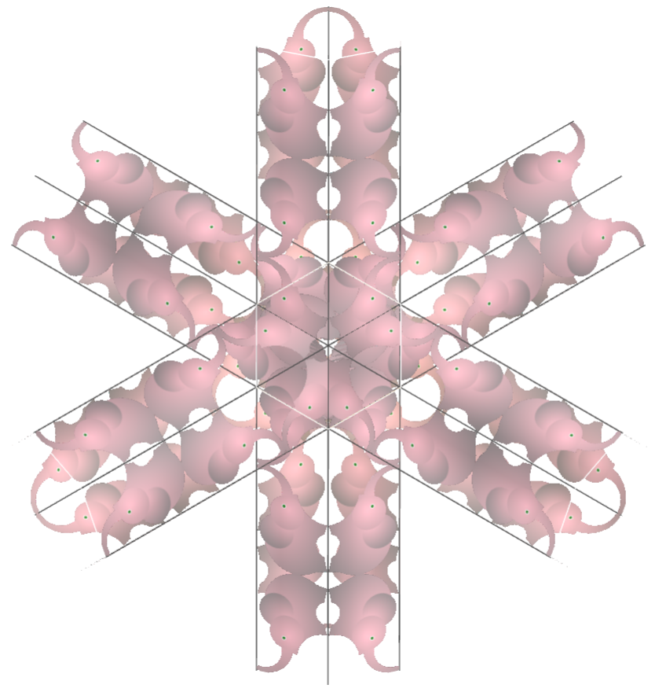</a>
  <b>description</b>: Dorota Pankowska's elephant pattern
  <b>tessellation type</b>: rectangular
  <b>polyhedra</b>: great dodecahemicosacron, great dodecahemidodecacron, hexahemioctacron, small icosihemidodecacron, tetrahemihexacron, star great dodecahemicosacron, star hexahemioctacron, star tetrahemihexacron
  

<h4>23. Whale</h4>
<a href="vr/Tessellation23.htm" target="_blank" title="3D model" class="fotoA">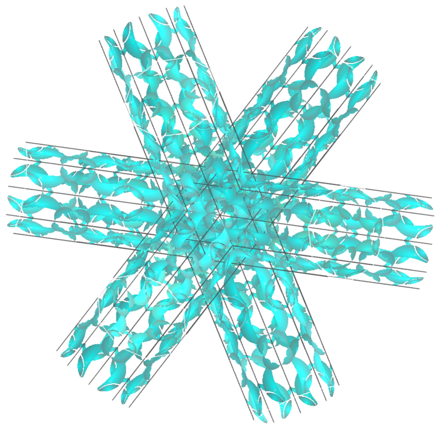</a>
  <b>description</b>: Dorota Pankowska's whale pattern
  <b>tessellation type</b>: rectangular
  <b>polyhedra</b>: great dodecahemicosacron, great dodecahemidodecacron, hexahemioctacron, small icosihemidodecacron, tetrahemihexacron, star great dodecahemicosacron, star hexahemioctacron, star tetrahemihexacron
  

<h4>24. Frog</h4>
<a href="vr/Tessellation24.htm" target="_blank" title="3D model" class="fotoA">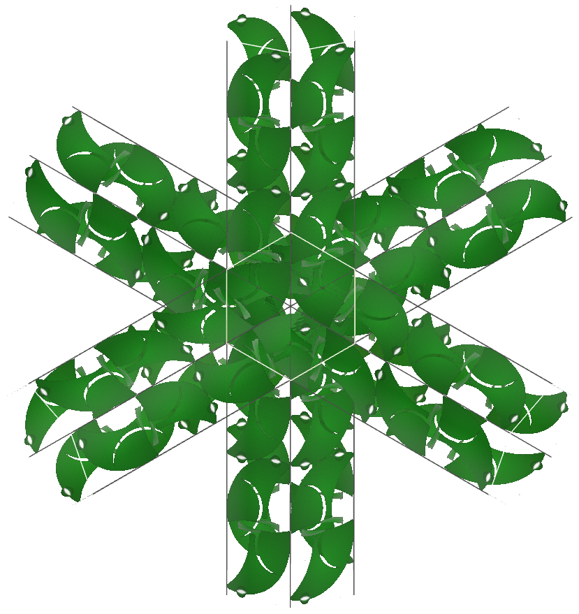</a>
  <b>description</b>: Dorota Pankowska's frog pattern
  <b>tessellation type</b>: rectangular
  <b>polyhedra</b>: great dodecahemicosacron, great dodecahemidodecacron, hexahemioctacron, small icosihemidodecacron, tetrahemihexacron, star great dodecahemicosacron, star hexahemioctacron, star tetrahemihexacron
  

<h4>25. Monkey</h4>
<a href="vr/Tessellation25.htm" target="_blank" title="3D model" class="fotoA">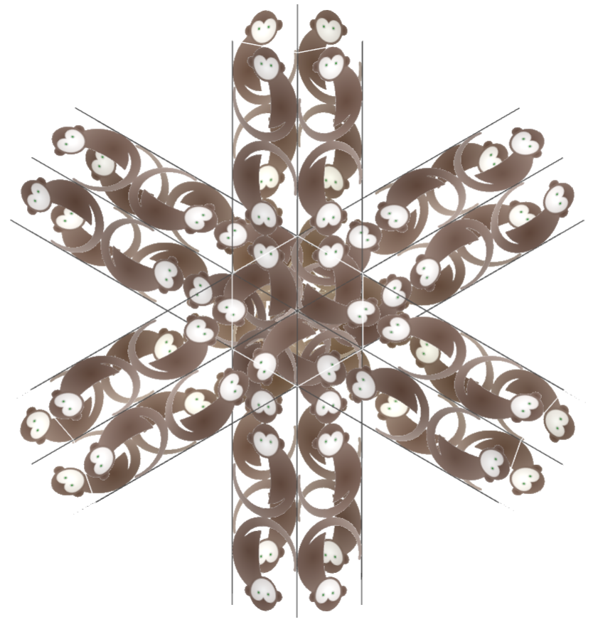</a>
  <b>description</b>: Dorota Pankowska's monkey pattern
  <b>tessellation type</b>: rectangular
  <b>polyhedra</b>: great dodecahemicosacron, great dodecahemidodecacron, hexahemioctacron, small icosihemidodecacron, tetrahemihexacron, star great dodecahemicosacron, star hexahemioctacron, star tetrahemihexacron
  

<h4>26. Owl</h4>
<a href="vr/Tessellation26.htm" target="_blank" title="3D model" class="fotoA">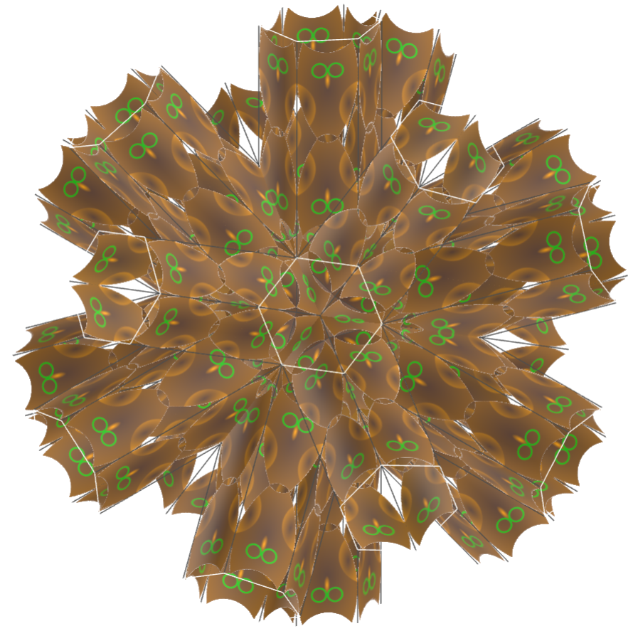</a>
  <b>description</b>: Dorota Pankowska's owl pattern
  <b>tessellation type</b>: rectangular
  <b>polyhedra</b>: great dodecahemicosacron, great dodecahemidodecacron, hexahemioctacron, small icosihemidodecacron, tetrahemihexacron, star great dodecahemicosacron, star hexahemioctacron, star tetrahemihexacron
  

<h4>27. Toucan</h4>
<a href="vr/Tessellation27.htm" target="_blank" title="3D model" class="fotoA">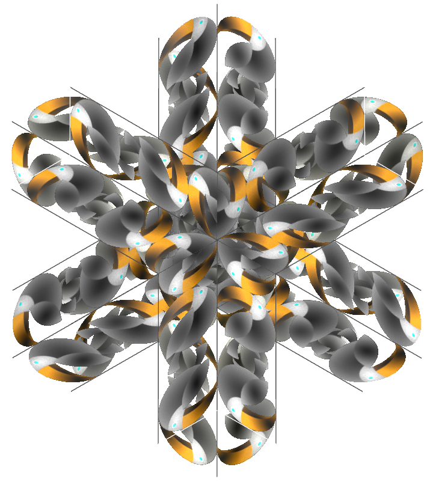</a>
  <b>description</b>: Dorota Pankowska's toucan pattern
  <b>tessellation type</b>: rectangular
  <b>polyhedra</b>: great dodecahemicosacron, great dodecahemidodecacron, hexahemioctacron, small icosihemidodecacron, tetrahemihexacron, star great dodecahemicosacron, star hexahemioctacron, star tetrahemihexacron
  

<h4>28. Giraffe</h4>
<a href="vr/Tessellation28.htm" target="_blank" title="3D model" class="fotoA">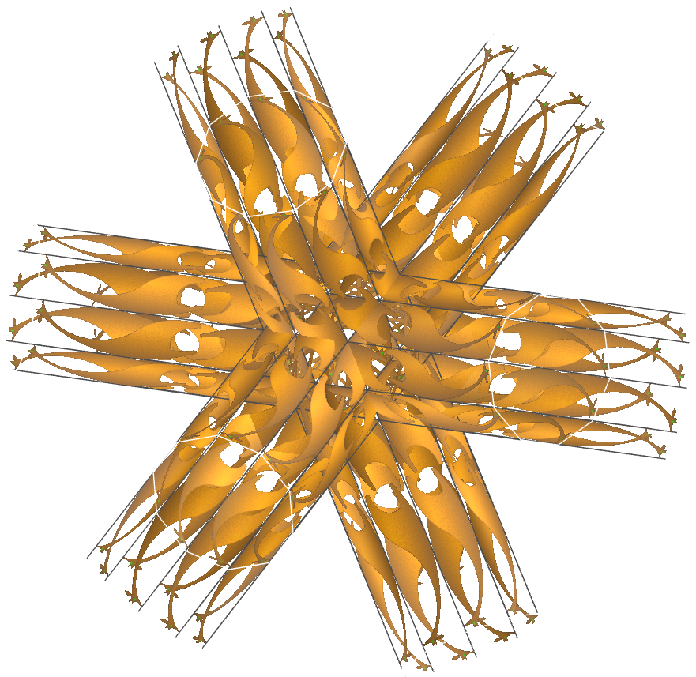</a>
  <b>description</b>: Dorota Pankowska's giraffe pattern
  <b>tessellation type</b>: rectangular
  <b>polyhedra</b>: great dodecahemicosacron, great dodecahemidodecacron, hexahemioctacron, small icosihemidodecacron, tetrahemihexacron, star great dodecahemicosacron, star hexahemioctacron, star tetrahemihexacron
  

<h4>29. Mouse</h4>
<a href="vr/Tessellation29.htm" target="_blank" title="3D model" class="fotoA">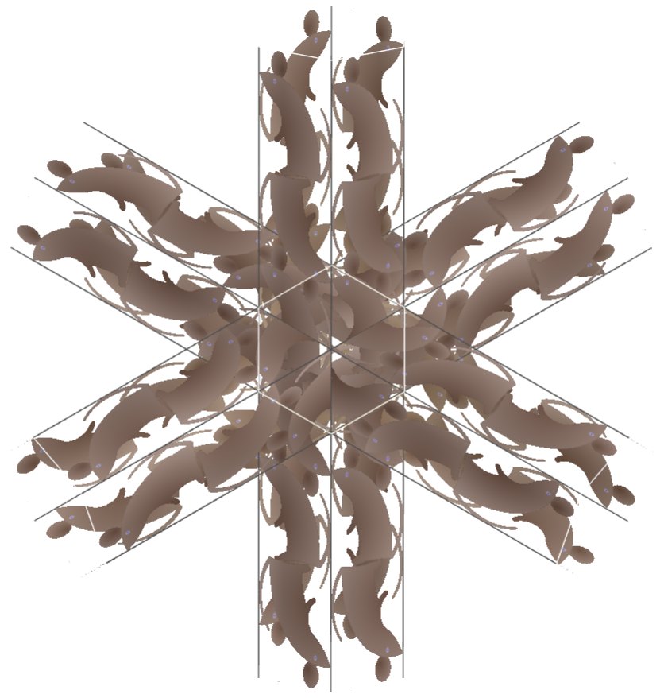</a>
  <b>description</b>: Dorota Pankowska's mouse pattern
  <b>tessellation type</b>: rectangular
  <b>polyhedra</b>: great dodecahemicosacron, great dodecahemidodecacron, hexahemioctacron, small icosihemidodecacron, tetrahemihexacron, star great dodecahemicosacron, star hexahemioctacron, star tetrahemihexacron
  

<h4>30. Dog</h4>
<a href="vr/Tessellation30.htm" target="_blank" title="3D model" class="fotoA">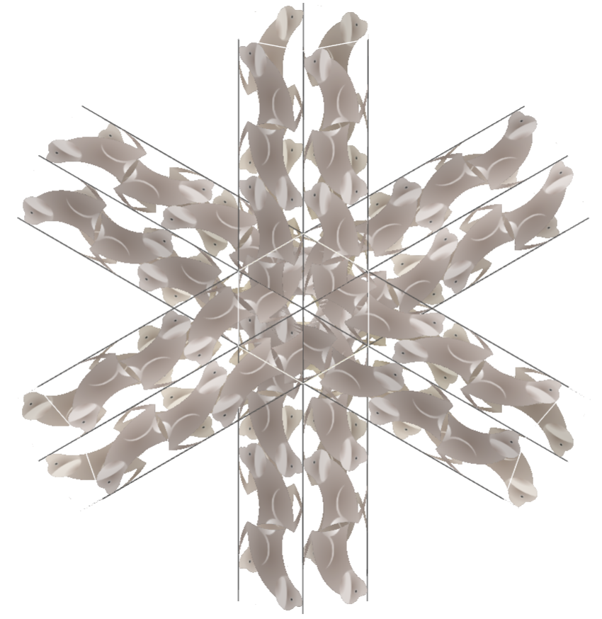</a>
  <b>description</b>: Dorota Pankowska's dog pattern
  <b>tessellation type</b>: rectangular
  <b>polyhedra</b>: great dodecahemicosacron, great dodecahemidodecacron, hexahemioctacron, small icosihemidodecacron, tetrahemihexacron, star great dodecahemicosacron, star hexahemioctacron, star tetrahemihexacron
  

<a href="#p1" class="topo">back to top</a>

<h4>31. Cat</h4>
<a href="vr/Tessellation31.htm" target="_blank" title="3D model" class="fotoA">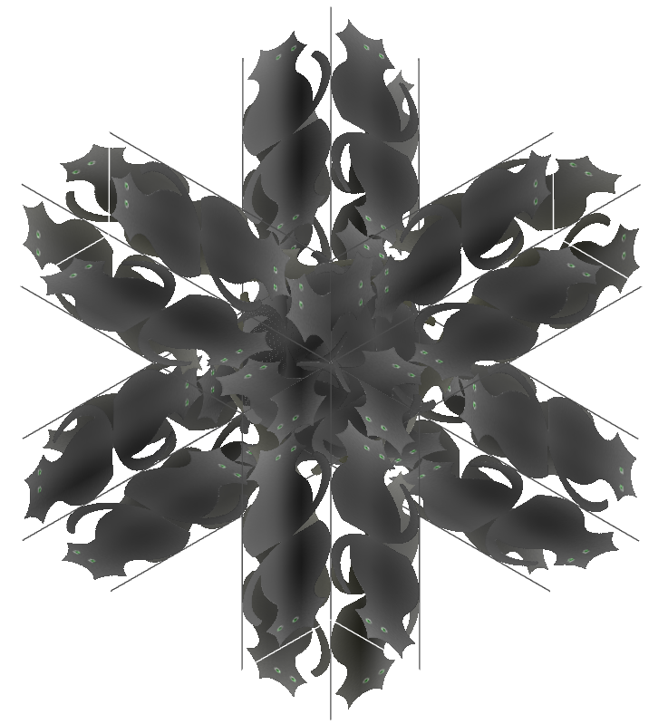</a>
  <b>description</b>: Dorota Pankowska's cat pattern
  <b>tessellation type</b>: rectangular
  <b>polyhedra</b>: great dodecahemicosacron, great dodecahemidodecacron, hexahemioctacron, small icosihemidodecacron, tetrahemihexacron, star great dodecahemicosacron, star hexahemioctacron, star tetrahemihexacron
  

<h4>32. Fox</h4>
<a href="vr/Tessellation32.htm" target="_blank" title="3D model" class="fotoA">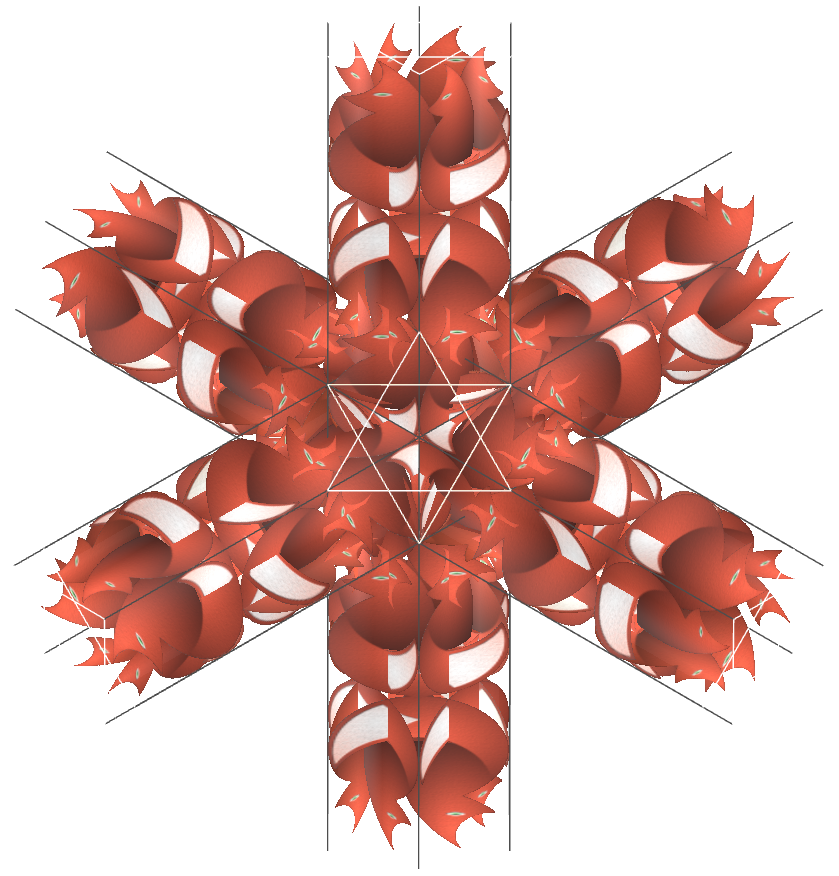</a>
  <b>description</b>: Dorota Pankowska's fox pattern
  <b>tessellation type</b>: rectangular
  <b>polyhedra</b>: great dodecahemicosacron, great dodecahemidodecacron, hexahemioctacron, small icosihemidodecacron, tetrahemihexacron, star great dodecahemicosacron, star hexahemioctacron, star tetrahemihexacron
  

<h4>33. Walrus</h4>
<a href="vr/Tessellation33.htm" target="_blank" title="3D model" class="fotoA">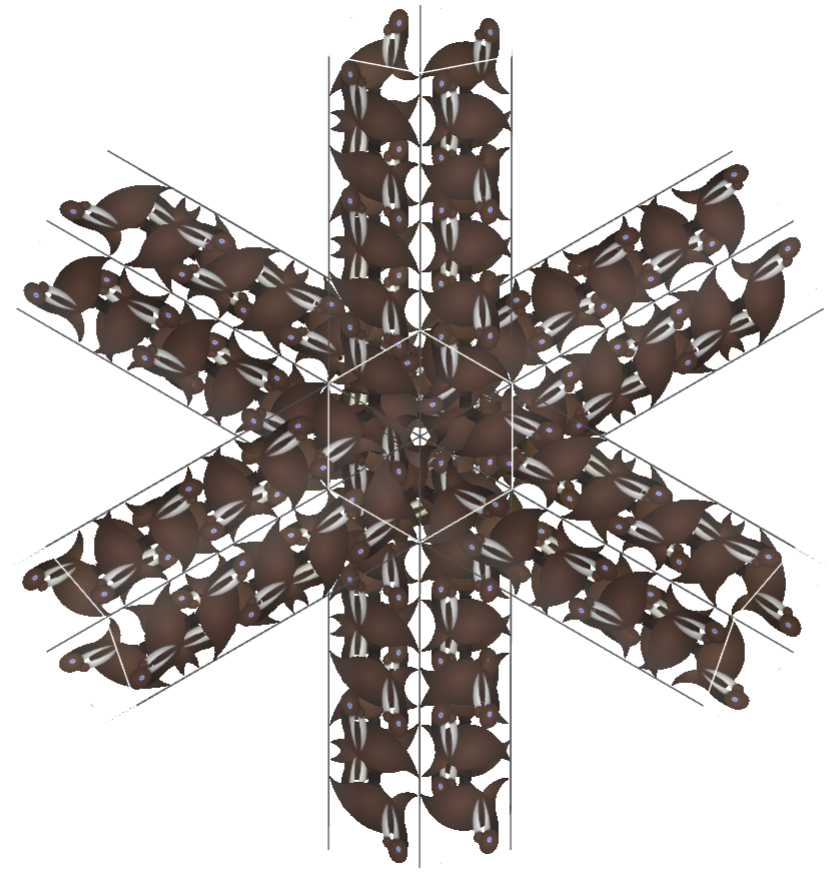</a>
  <b>description</b>: Dorota Pankowska's walrus pattern
  <b>tessellation type</b>: rectangular
  <b>polyhedra</b>: great dodecahemicosacron, great dodecahemidodecacron, hexahemioctacron, small icosihemidodecacron, tetrahemihexacron, star great dodecahemicosacron, star hexahemioctacron, star tetrahemihexacron
  

<h4>34. Rabbit</h4>
<a href="vr/Tessellation34.htm" target="_blank" title="3D model" class="fotoA">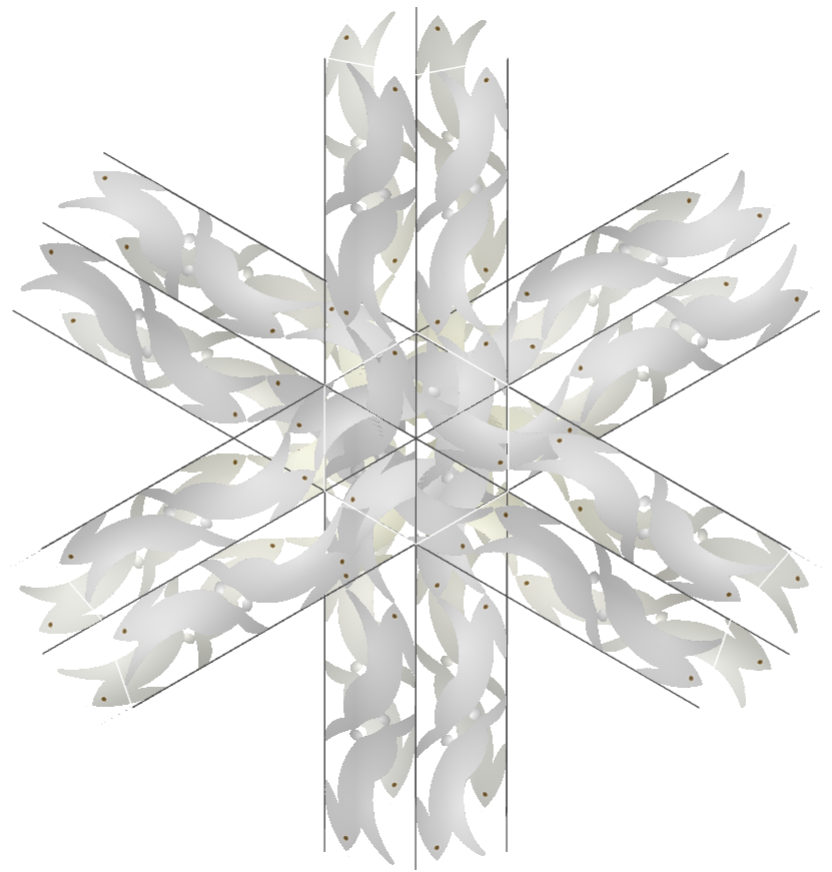</a>
  <b>description</b>: Dorota Pankowska's rabbit pattern
  <b>tessellation type</b>: rectangular
  <b>polyhedra</b>: great dodecahemicosacron, great dodecahemidodecacron, hexahemioctacron, small icosihemidodecacron, tetrahemihexacron, star great dodecahemicosacron, star hexahemioctacron, star tetrahemihexacron
  

<a href="#p1" class="topo">back to top</a>

  Tessellation in strips: polyhedra tessellation and visualization with Virtual Reality by <a xmlns:cc="http://creativecommons.org/ns#" href="https://paulohscwb.github.io/tessellation/strips/" property="cc:attributionName" rel="cc:attributionURL">Paulo Henrique Siqueira</a> is licensed with a license <a rel="license" href="http://creativecommons.org/licenses/by-nc-nd/4.0/">Creative Commons Attribution-NonCommercial-NoDerivatives 4.0 International</a>.

<h4>How to cite this work:</h4> 

Siqueira, P.H., "Tessellation in strips: polyhedra tessellation and visualization with Virtual Reality". Available in: <https://paulohscwb.github.io/tessellation/strips/>, May 2026.

<!---->
  <b>References:</b>
 Champagne, F. "Tessellations by Francine Champagne" <a href="https://tessellations.ca/" target="_blank"> https://tessellations.ca/</a>
 Weisstein, Eric W. "Tessellation." From MathWorld--A Wolfram Web Resource. <a href="https://mathworld.wolfram.com/Tessellation.html" target="_blank"> https://mathworld.wolfram.com/Tessellation.html</a>
 Mohr, R. "Tiled Art" <a href="https://tiled.art/en/home" target="_blank">https://tiled.art/en/home</a> 
 McCooey, D. I. "Visual Polyhedra". <a href="http://dmccooey.com/polyhedra/" target="_blank">http://dmccooey.com/polyhedra/</a>
 Pankowska, D. "13 animals made from 13 circles". <a href="https://dorotapankowska.com/13-animals-13-circles.html" target="_blank">https://dorotapankowska.com/13-animals-13-circles.html</a>

